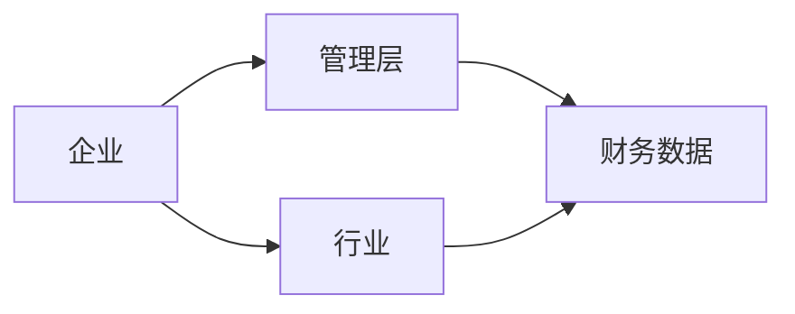
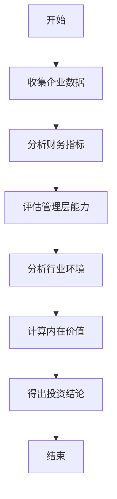

                 


# 彼得·林奇的实地调研方法论

> 关键词：彼得·林奇，实地调研，投资分析，价值评估，财务指标

> 摘要：本文深入探讨了彼得·林奇的实地调研方法论，分析了其核心概念、算法原理、系统架构及实际应用，通过具体案例展示了如何通过实地调研评估企业投资价值。

---

## 第1章：实地调研的背景与意义

### 1.1 投资分析的起源与发展
- **投资分析的起源**：从古代的贸易到现代金融市场的形成，投资分析经历了从简单到复杂的发展过程。
- **彼得·林奇与实地调研的结合**：林奇将基本面分析与实地调研相结合，成为其投资成功的关键。
- **实地调研的重要性**：在现代投资分析中，实地调研是评估企业价值的重要手段。

### 1.2 彼得·林奇的投资理念
- **价值投资的核心思想**：寻找被市场低估的企业，长期持有。
- **实地调研的作用**：通过实地调研获取第一手信息，评估企业的基本面和管理层能力。
- **成功案例分析**：如沃尔玛、喜诗糖果等企业的成功投资案例。

### 1.3 实地调研的核心要素
- **企业基本面分析**：包括收入、利润、成本等。
- **管理层评估**：管理层的能力和决策对企业价值的影响。
- **行业竞争环境**：分析企业在行业中的竞争优势和劣势。
- **财务数据分析**：通过财务报表评估企业的财务健康状况。

### 1.4 实地调研的意义与价值
- **与投资决策的关系**：实地调研提供关键信息，影响投资决策。
- **风险控制的作用**：通过实地调研识别潜在风险。
- **对投资者心理的影响**：增强投资者对投资标的信心，减少决策失误。

---

## 第2章：实地调研的核心概念与联系

### 2.1 核心概念原理
- **企业基本面分析的数学模型**：如PE（市盈率）、PB（市净率）等。
- **管理层评估的指标体系**：包括管理层稳定性、决策能力等。
- **行业竞争环境的分析框架**：如波特五力模型。

### 2.2 核心概念属性特征对比
- **表2-1：企业基本面与财务数据对比**
  | 指标 | 定义 | 重要性 |
  |------|------|--------|
  | 收入 | 营业收入 | 核心收入来源 |
  | 利润 | 净利润 | 反映盈利能力 |
  | 市盈率 | PE | 估值指标 |
- **表2-2：管理层能力与企业绩效对比**
  | 指标 | 定义 | 关系 |
  |------|------|------|
  | 管理层稳定性 | 管理团队变动情况 | 影响企业稳定性 |
  | 决策能力 | 管理层决策效果 | 影响企业绩效 |

### 2.3 实体关系图（ER图）


### 2.4 本章小结
通过核心概念的分析，实地调研的关键在于多维度评估企业，整合各方面的信息，得出准确的投资结论。

---

## 第3章：实地调研的算法原理

### 3.1 算法原理概述
- **价值评估模型**：基于财务指标评估企业内在价值。
- **竞争优势分析模型**：识别企业的核心竞争力。
- **风险评估模型**：评估企业的经营风险和财务风险。

### 3.2 算法流程图


### 3.3 数学模型与公式
- **市盈率（PE）公式**：$$ PE = \frac{股票价格}{每股收益} $$
- **市净率（PB）公式**：$$ PB = \frac{股票价格}{每股净资产} $$
- **净资产收益率（ROE）公式**：$$ ROE = \frac{净利润}{净资产} $$$

### 3.4 实例分析
- **案例1**：某公司PE为15，行业平均PE为12，说明该公司可能被高估。
- **案例2**：管理层变动后，公司股价下跌，说明管理层稳定性影响股价。

### 3.5 本章小结
通过数学模型和实例分析，实地调研能够帮助投资者更准确地评估企业的内在价值和风险。

---

## 第4章：实地调研的系统分析与架构设计

### 4.1 问题场景介绍
- **问题背景**：投资者如何选择调研企业，构建有效的调研系统。
- **系统目标**：提供一个高效、准确的调研工具。

### 4.2 系统功能设计
- **领域模型**：
  ```mermaid
  classDiagram
      class 企业 {
          收入
          利润
          股东权益
      }
      class 管理层 {
          管理团队
          决策能力
      }
      class 财务数据 {
          财务报表
          财务指标
      }
      企业 --> 管理层
      企业 --> 财务数据
  ```

### 4.3 系统架构设计
- **架构图**：
  ```mermaid
  context diagram
      系统边界
      包含：企业数据层、管理层评估层、财务分析层
  ```

### 4.4 系统接口设计
- **数据接口**：从数据库获取企业数据。
- **用户接口**：图形化界面展示分析结果。

### 4.5 系统交互设计
- **序列图**：
  ```mermaid
  sequenceDiagram
      用户 -> 系统: 请求企业分析
      系统 -> 数据库: 获取企业数据
      数据库 --> 系统: 返回数据
      系统 -> 分析模块: 进行分析
      分析模块 --> 系统: 返回结果
      系统 -> 用户: 显示结果
  ```

### 4.6 本章小结
通过系统设计，投资者可以更高效地进行实地调研，提高分析的准确性和效率。

---

## 第5章：实地调研的项目实战

### 5.1 环境安装
- **数据收集工具**：使用Excel或数据库进行数据收集。
- **分析工具**：使用Python进行数据分析。

### 5.2 核心实现源代码
```python
import pandas as pd

# 假设df为财务数据 DataFrame
def calculate_pe(df):
    pe = df['股价'] / df['每股收益']
    return pe.mean()

# 应用到具体数据
data = {'股价': [100, 120, 90], '每股收益': [10, 15, 5]}
df = pd.DataFrame(data)
print("平均市盈率：", calculate_pe(df))
```

### 5.3 案例分析
- **案例分析：某公司**
  - **财务数据**：收入增长稳定，净利润率上升。
  - **管理层评估**：管理层稳定，决策能力强。
  - **行业环境**：行业竞争激烈，但公司在技术创新方面具有优势。

### 5.4 项目小结
通过实际案例分析，验证了实地调研方法的有效性，帮助投资者做出更明智的投资决策。

---

## 第6章：最佳实践与注意事项

### 6.1 最佳实践
- **数据来源的可靠性**：确保数据的准确性和全面性。
- **多维度分析**：结合财务、管理、行业等多个维度进行分析。
- **持续学习**：不断更新知识，适应市场变化。

### 6.2 注意事项
- **避免过度简化**：不能只看表面数据，需深入分析。
- **关注管理层动机**：管理层的短期行为可能影响长期价值。
- **风险管理**：合理分散投资，降低风险。

### 6.3 拓展阅读
推荐阅读彼得·林奇的书籍《彼得·林奇的成功投资》和《选股大道》。

---

## 结语
彼得·林奇的实地调研方法论为投资者提供了一套系统、科学的投资分析方法。通过深入的企业分析、管理层评估和财务数据研究，投资者能够更准确地评估企业的投资价值，做出明智的投资决策。

