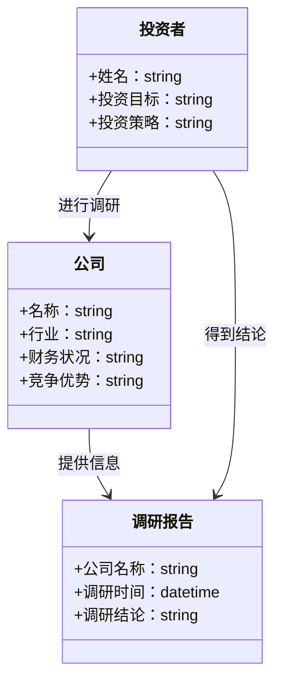
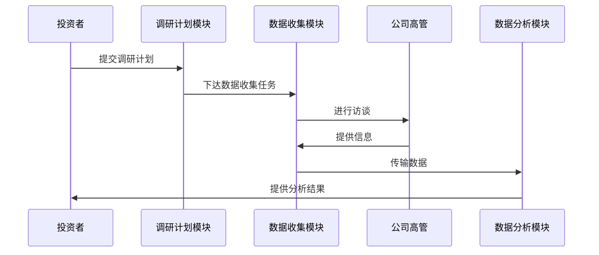

                 


# 彼得·林奇的实地调研方法：走进公司

## 关键词：
彼得·林奇，实地调研，投资分析，公司分析，财务报表，竞争优势

## 摘要：
本文深入探讨了投资大师彼得·林奇的实地调研方法，详细分析了如何将这些方法应用于对公司进行深入分析的过程中。文章从林奇的投资哲学出发，逐步拆解实地调研的核心步骤，包括调研前的准备、高管访谈技巧、财务报表分析等，并通过具体案例展示了这些方法的实际应用。最后，文章总结了实地调研的关键要点，并提供了最佳实践建议，帮助读者在投资决策中更好地运用这些方法。

---

## 第一部分：引言

## 第1章：彼得·林奇的投资理念与实地调研的重要性

### 1.1 彼得·林奇的投资哲学

#### 1.1.1 投资的核心理念
彼得·林奇是全球著名投资大师，他的投资哲学以“长期投资”和“深入研究”为核心。他认为，成功的投资不仅依赖于市场趋势的预测，更依赖于对公司的深入了解。林奇强调，投资者应该像企业家一样思考，关注公司的基本面和长期发展潜力。

#### 1.1.2 林奇的投资风格与成功秘诀
林奇的投资风格以“成长股投资”闻名，他善于寻找那些具有持续增长潜力的公司。他的成功秘诀在于对公司的深入研究和实地调研。他认为，只有通过实地调研，才能真正了解一家公司的运营状况、管理层能力和行业地位。

#### 1.1.3 实地调研在投资中的价值
实地调研是林奇投资方法的核心。通过实地调研，投资者可以验证财务报表的真实性，了解公司的实际运营状况，评估管理层的能力，并发现财务报表中可能隐藏的问题。实地调研能够帮助投资者做出更明智的投资决策。

### 1.2 什么是实地调研

#### 1.2.1 实地调研的定义与目的
实地调研是指投资者亲自到公司所在地，与公司高管、员工和客户进行面对面交流，观察公司的实际运营状况，并收集第一手信息的过程。实地调研的目的是为了验证财务数据的真实性，评估公司的竞争优势和潜在风险。

#### 1.2.2 实地调研与其他投资方法的区别
与通过电话会议或阅读公开报告进行的远程调研不同，实地调研更加注重现场观察和直接交流。实地调研能够提供更真实、更全面的信息，帮助投资者做出更准确的判断。

#### 1.2.3 实地调研的适用场景与局限性
实地调研适用于对特定公司的深入分析，尤其适合那些投资者对其业务模式或财务状况存在疑问的情况。然而，实地调研也有其局限性，例如时间和成本较高，且需要投资者具备一定的专业能力。

---

## 第二部分：理论基础

## 第2章：彼得·林奇的选股策略

### 2.1 林奇的选股标准

#### 2.1.1 公司基本面分析
林奇在选股时非常注重公司的基本面，包括收入增长、利润率、资产负债表状况等。他认为，一家公司的财务健康状况是其长期增长的基石。

#### 2.1.2 行业地位与竞争优势
林奇倾向于选择那些在行业内具有竞争优势的公司。他关注公司的市场份额、产品创新能力和成本控制能力。

#### 2.1.3 财务健康状况评估
林奇认为，财务健康状况是衡量公司投资价值的重要指标。他特别关注公司的盈利能力、现金流和债务水平。

### 2.2 林奇的成长股投资法

#### 2.2.1 成长股的定义与特点
成长股是指那些收入和利润持续快速增长的公司股票。林奇认为，成长股的投资回报潜力远高于其他类型的股票。

#### 2.2.2 成长股的筛选标准
林奇在筛选成长股时，注重公司的收入增长率、利润率和市场份额。他倾向于选择那些具有持续增长潜力的公司。

#### 2.2.3 成长股投资的风险与回报
成长股投资的风险较高，因为它们的估值往往较高，且容易受到市场波动的影响。然而，成功的成长股投资也有可能带来丰厚的回报。

---

## 第三部分：实地调研的具体方法

## 第3章：实地调研的核心方法

### 3.1 调研前的准备工作

#### 3.1.1 确定调研目标与计划
在进行实地调研之前，投资者需要明确调研的目标和计划。这包括确定调研的具体内容、时间安排和预算。

#### 3.1.2 收集公司背景资料
投资者需要收集公司的公开报告、行业分析和竞争对手信息，以便更好地了解公司的背景和行业地位。

#### 3.1.3 制定调研提纲与问题清单
在调研前，投资者需要制定详细的调研提纲和问题清单，以便在调研过程中能够高效地收集信息。

### 3.2 与公司高管的访谈技巧

#### 3.2.1 访谈前的准备与目标设定
在与公司高管进行访谈之前，投资者需要准备好相关问题，并明确访谈的目标，例如了解公司的战略规划或财务状况。

#### 3.2.2 如何有效提问与倾听
投资者需要学会如何有效提问和倾听。提问时要注重开放性问题，以深入了解公司的运营状况。倾听时要保持专注，避免打断对方的发言。

#### 3.2.3 访谈中的注意事项与技巧
在访谈中，投资者需要注意礼貌和尊重，同时要保持客观和中立的态度。可以通过提问和观察来验证信息的真实性。

### 3.3 财务报表分析与实地验证

#### 3.3.1 主要财务指标的解读
投资者需要了解公司的主要财务指标，包括收入、利润、资产负债表和现金流等。这些指标能够帮助投资者评估公司的财务健康状况。

#### 3.3.2 实地调研中的财务数据验证
在实地调研中，投资者可以通过与公司高管和财务人员的交流，验证财务报表中的数据是否真实可靠。例如，可以询问具体的收入来源和成本结构。

#### 3.3.3 财务健康状况的综合评估
通过实地调研，投资者可以综合评估公司的财务健康状况，包括盈利能力、现金流和债务水平等。这有助于投资者做出更准确的投资决策。

---

## 第四部分：案例分析

## 第4章：彼得·林奇的实地调研案例分析

### 4.1 案例一：XYZ公司的调研过程

#### 4.1.1 调研背景与目标
XYZ公司是一家快速增长的科技公司。林奇希望通过实地调研了解其业务模式和财务状况。

#### 4.1.2 调研过程与发现
在调研过程中，林奇与公司高管进行了深入交流，并实地考察了公司的生产线和办公环境。他发现XYZ公司的收入增长迅速，但成本控制能力较弱。

#### 4.1.3 调研结论与投资建议
林奇认为，XYZ公司具有较大的增长潜力，但需要进一步优化成本结构。他建议投资者关注公司的成本控制能力，并在财务状况改善后考虑投资。

### 4.2 案例二：ABC公司的调研过程

#### 4.2.1 调研背景与目标
ABC公司是一家传统制造企业。林奇希望通过实地调研了解其竞争优势和行业地位。

#### 4.2.2 调研过程与发现
在调研过程中，林奇发现ABC公司的市场份额较高，但在技术创新和市场开拓方面存在不足。

#### 4.2.3 调研结论与投资建议
林奇认为，ABC公司具有较强的竞争优势，但在技术创新方面需要加大投入。他建议投资者关注公司的技术创新能力，并在公司战略调整后考虑投资。

---

## 第五部分：系统分析与架构设计

## 第5章：系统分析与架构设计方案

### 5.1 问题场景介绍
通过实地调研，投资者需要构建一个完整的调研体系，以系统化地分析公司的情况。

### 5.2 项目介绍
本项目旨在通过系统化的调研方法，帮助投资者更好地理解和分析公司的情况。

### 5.3 系统功能设计（领域模型mermaid类图）



### 5.4 系统架构设计mermaid架构图

```mermaid
archi
    1. 调研计划模块
    2. 数据收集模块
    3. 数据分析模块
    4. 结论生成模块
```

### 5.5 系统接口设计
系统接口设计包括调研计划的输入、数据收集的接口和数据分析的接口。

### 5.6 系统交互mermaid序列图



---

## 第六部分：项目实战

## 第6章：项目实战：XYZ公司的实地调研

### 6.1 环境安装
投资者需要安装必要的工具，例如数据分析软件和调研提纲模板。

### 6.2 系统核心实现源代码

```python
# 示例代码：数据收集与分析

import pandas as pd

# 读取财务数据
financial_data = pd.read_csv('financial.csv')

# 计算主要财务指标
financial_data['净利润率'] = financial_data['净利润'] / financial_data['收入'] * 100
financial_data['毛利率'] = financial_data['毛利'] / financial_data['收入'] * 100

# 输出分析结果
print("公司财务状况分析：")
print(financial_data[['公司名称', '净利润率', '毛利率']].head())
```

### 6.3 代码应用解读与分析
上述代码展示了如何通过Python进行财务数据的收集与分析。投资者可以使用类似的方法来分析公司的财务状况。

### 6.4 实际案例分析
通过分析XYZ公司的财务数据，投资者可以更好地理解公司的财务状况和潜在风险。

### 6.5 项目小结
本项目通过实地调研和数据分析，帮助投资者更好地理解公司的运营状况和财务状况。

---

## 第七部分：总结

## 第7章：总结与最佳实践

### 7.1 本章总结
本文详细探讨了彼得·林奇的实地调研方法，并通过具体案例展示了这些方法的实际应用。实地调研是投资者做出明智投资决策的重要工具。

### 7.2 最佳实践 tips
- **提前准备**：在进行实地调研之前，充分准备调研提纲和问题清单。
- **深入交流**：与公司高管和员工进行深入交流，了解公司的实际运营状况。
- **验证数据**：通过实地调研验证财务报表中的数据，确保信息的准确性。
- **持续学习**：不断学习和更新投资知识，提升自己的调研能力。

### 7.3 小结
实地调研是投资者深入了解公司的重要方法。通过本文的介绍，投资者可以更好地掌握实地调研的核心方法，并在实际投资中加以应用。

### 7.4 注意事项
- **时间管理**：合理安排调研时间，确保调研的高效性。
- **成本控制**：在进行实地调研时，注意控制时间和成本，避免过度投入。
- **风险管理**：在进行实地调研时，注意识别和评估潜在风险，确保投资决策的准确性。

### 7.5 拓展阅读
- 《彼得·林奇的投资哲学》
- 《如何进行有效的公司调研》
- 《财务报表分析与投资决策》

---

## 结语

通过本文的介绍，读者可以深入了解彼得·林奇的实地调研方法，并将其应用于实际投资中。希望本文能够为投资者提供有价值的参考和启发。

