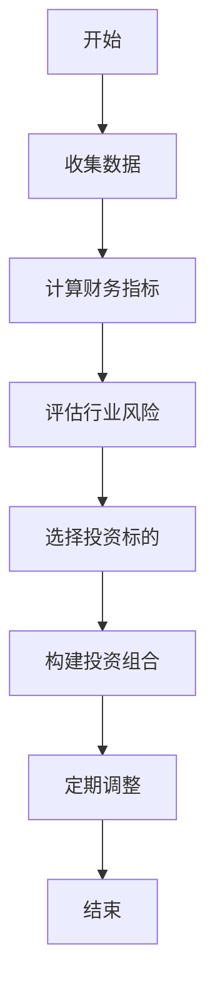
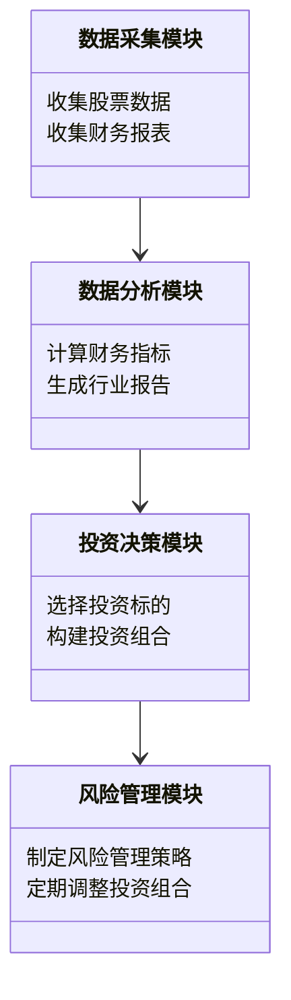

                 

# 彼得·林奇的新兴市场投资策略

> 关键词：投资策略，彼得·林奇，新兴市场，风险管理，价值投资，投资分析

> 摘要：本文深入分析了彼得·林奇在新兴市场中的投资策略，从理论基础到实际应用，结合数学模型和系统架构，全面解析了林奇的投资理念、选股标准、风险管理方法以及在新兴市场中的具体实践。通过案例分析和算法流程图，展示了林奇策略的核心思想和实际操作步骤，为投资者提供了系统化的投资指导。

---

# 第1章: 新兴市场的概念与重要性

## 1.1 新兴市场的定义与特点

### 1.1.1 新兴市场的定义
新兴市场是指那些经济增长迅速、市场潜力巨大但尚未完全成熟的国家或地区的金融市场。这些市场通常具有以下特点：经济快速发展、基础设施逐步完善、市场规模逐渐扩大、市场参与者相对较少。

### 1.1.2 新兴市场的核心特点
- **高增长率**：新兴市场的GDP增速通常高于发达市场。
- **市场波动性**：新兴市场的股票、汇率等金融资产波动较大。
- **政策影响**：新兴市场往往受到政府政策的影响较大。
- **行业多样性**：新兴市场中通常存在多个高成长行业。

### 1.1.3 新兴市场与发达市场的对比
| 特性 | 新兴市场 | 发达市场 |
|------|----------|----------|
| 经济增长率 | 高 | 低或中等 |
| 市场波动性 | 高 | 低 |
| 政策影响 | 高 | 中等 |
| 市场成熟度 | 不成熟 | 成熟 |

## 1.2 新兴市场在全球经济中的地位

### 1.2.1 新兴市场对全球经济的影响
新兴市场是全球经济增长的主要驱动力，尤其是在制造业、科技和服务业方面。

### 1.2.2 新兴市场的投资机遇
- **高成长行业**：新兴市场中通常存在多个高成长行业，如科技、消费、金融等。
- **估值优势**：部分新兴市场股票的估值低于发达市场。
- **多元化投资**：新兴市场可以帮助投资者分散风险。

### 1.2.3 新兴市场的风险与挑战
- **政治风险**：新兴市场国家的政策变化可能对市场产生重大影响。
- **经济波动**：新兴市场的经济波动较大，容易受到外部冲击。
- **市场流动性**：部分新兴市场流动性较低，可能影响投资操作。

## 1.3 彼得·林奇的投资理念

### 1.3.1 林奇的投资风格概述
彼得·林奇以价值投资和长期投资著称，注重基本面分析和长期收益。

### 1.3.2 林奇对新兴市场的独特见解
林奇认为，新兴市场中存在大量的投资机会，尤其是那些具有高成长潜力的行业和公司。

### 1.3.3 林奇投资策略的核心思想
- **长期投资**：林奇主张长期持有优质股票，避免频繁交易。
- **价值投资**：寻找被市场低估的公司。
- **分散投资**：通过多样化投资降低风险。

## 1.4 本章小结
本章介绍了新兴市场的定义、特点及其在全球经济中的地位，同时分析了彼得·林奇的投资理念和核心思想，为后续章节的分析奠定了基础。

---

# 第2章: 彼得·林奇的投资策略分析

## 2.1 林奇的投资哲学

### 2.1.1 长期投资 vs 短期投资
林奇主张长期投资，认为短期交易难以获得稳定的收益。

### 2.1.2 价值投资 vs 资本利得
林奇的价值投资策略注重公司基本面，而非短期价格波动。

### 2.1.3 林奇的投资决策框架
林奇的投资决策框架包括以下几个步骤：
1. **行业分析**：选择高成长行业。
2. **公司基本面分析**：评估公司的财务状况和竞争优势。
3. **估值分析**：确定公司的合理估值。
4. **风险管理**：评估投资风险并制定应对策略。

## 2.2 林奇的选股标准

### 2.2.1 基本面分析
林奇注重公司的财务健康状况，包括收入、利润、负债等指标。

### 2.2.2 财务指标评估
林奇常用的财务指标包括：
- **市盈率（P/E）**：用于评估股票的估值。
- **市净率（P/B）**：用于评估股票相对于账面价值的溢价。
- **ROE（净资产收益率）**：用于评估公司的盈利能力。

### 2.2.3 行业分析与竞争地位
林奇认为，选择具有竞争优势的公司至关重要，尤其是在高成长行业。

## 2.3 林奇的风险管理策略

### 2.3.1 风险控制的重要性
林奇认为，风险管理是投资成功的关键。

### 2.3.2 林奇的风险管理方法
- **分散投资**：通过投资多个行业和公司降低风险。
- **止损策略**：设定止损点以避免重大亏损。
- **定期评估**：定期检查投资组合并进行调整。

### 2.3.3 应对市场波动的策略
林奇建议投资者在市场波动时保持冷静，避免盲目跟风。

## 2.4 本章小结
本章详细分析了彼得·林奇的投资哲学、选股标准和风险管理策略，揭示了其投资策略的核心思想。

---

# 第3章: 林奇策略在新兴市场的应用

## 3.1 新兴市场的行业分析

### 3.1.1 高成长行业的识别
新兴市场中通常存在多个高成长行业，如科技、消费、金融等。

### 3.1.2 行业周期与投资机会
林奇认为，投资新兴市场的高成长行业需要关注行业周期和市场趋势。

### 3.1.3 新兴市场中的龙头企业
林奇倾向于投资新兴市场中的龙头企业，因其具有更强的市场竞争力。

## 3.2 林奇策略在新兴市场的具体实践

### 3.2.1 投资案例分析
以某新兴市场国家为例，分析林奇的投资策略在具体市场中的应用。

### 3.2.2 投资组合的构建与调整
林奇建议投资者根据市场变化和公司基本面调整投资组合。

### 3.2.3 行业轮动与市场趋势判断
林奇认为，行业轮动是新兴市场投资中的重要策略。

## 3.3 新兴市场中的风险管理

### 3.3.1 新兴市场的独特风险
新兴市场中存在的政治风险、经济波动风险等。

### 3.3.2 林奇的风险控制措施
林奇在新兴市场中采取了分散投资、止损策略等风险管理措施。

### 3.3.3 应对新兴市场波动的策略
林奇建议投资者在新兴市场波动时保持冷静，避免盲目操作。

## 3.4 本章小结
本章分析了林奇策略在新兴市场的具体应用，揭示了其在高成长行业和龙头企业中的投资机会，同时强调了风险管理的重要性。

---

# 第4章: 林奇策略的数学模型与算法分析

## 4.1 林奇投资策略的数学模型

### 4.1.1 投资组合优化的数学公式
$$ \text{目标函数：最大化收益，最小化风险} $$
$$ \text{约束条件：投资组合的总金额固定} $$

### 4.1.2 风险与收益的平衡模型
$$ \text{风险} = \text{标准差} \times \text{投资金额} $$
$$ \text{收益} = \text{预期收益率} \times \text{投资金额} $$

### 4.1.3 投资组合的绩效评估公式
$$ \text{夏普比率} = \frac{\text{收益} - \text{无风险收益率}}{\text{标准差}} $$

## 4.2 林奇策略的算法流程

## 4.3 算法的实现与优化

### 4.3.1 算法实现的步骤
1. 收集新兴市场的相关数据。
2. 计算各公司的财务指标。
3. 评估各行业的风险。
4. 选择具有高成长潜力的公司。
5. 构建投资组合并定期调整。

### 4.3.2 算法优化的建议
- **数据源优化**：使用多来源数据以提高准确性。
- **模型优化**：引入机器学习算法进行预测和优化。
- **风险管理优化**：引入更多的风险控制指标。

### 4.3.3 算法的局限性与改进方向
林奇策略的数学模型和算法在新兴市场中可能会受到数据不足和市场波动的影响，需要结合实际情况进行调整。

## 4.4 本章小结
本章通过数学模型和算法流程图，详细分析了林奇策略的实现过程，并提出了优化建议。

---

# 第5章: 林奇策略的系统架构与设计

## 5.1 投资决策系统的功能模块

### 5.1.1 数据采集模块
- 数据来源：新兴市场的股票数据、财务报表、行业报告等。

### 5.1.2 数据分析模块
- 分析工具：财务指标分析、行业趋势分析等。

### 5.1.3 投资决策模块
- 决策依据：基于数据分析结果的投资建议。

### 5.1.4 风险管理模块
- 风险控制：止损策略、投资组合调整等。

## 5.2 系统架构设计

## 5.3 系统接口设计

### 5.3.1 数据接口规范
- 数据格式：JSON、CSV等。
- 接口标准：REST API。

### 5.3.2 用户接口设计
- 用户界面：简洁直观的仪表盘。
- 功能模块：数据查看、分析报告、投资建议等。

## 5.4 本章小结
本章通过系统架构图和功能模块图，详细分析了林奇策略的实现系统，为投资者提供了系统化的投资指导。

---

# 结语

彼得·林奇的新兴市场投资策略不仅是一种投资方法，更是一种系统化的投资哲学。通过本文的分析，我们可以看到，林奇策略的成功在于其对基本面的深入分析、对风险的严格控制以及对长期投资的坚持。希望本文能够为投资者在新兴市场中的投资提供有益的指导和启示。

---

