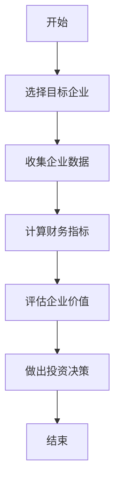
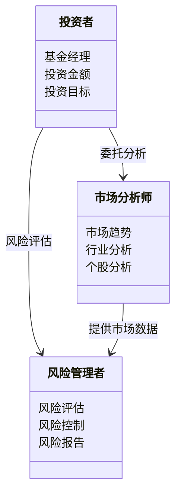
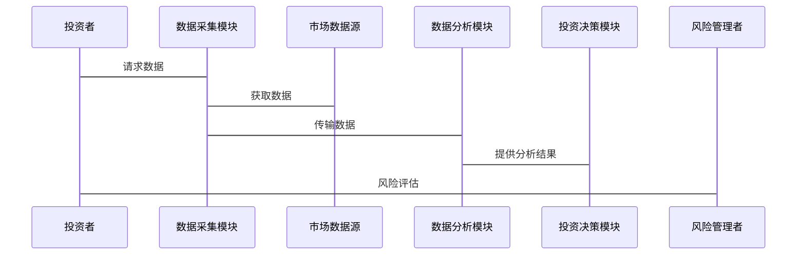

                 


# 彼得·林奇的本地投资优势：投资你所了解的

## 关键词：本地投资优势，彼得·林奇，投资策略，价值评估模型，风险管理

## 摘要：  
彼得·林奇是全球著名的投资专家，他强调投资于自己熟悉的领域，即本地投资优势。本文将从背景、优势、算法、系统设计、项目实战等方面详细解析本地投资的优势，通过实际案例和数学模型帮助读者理解如何在本地市场中获得投资优势。

---

# 第一部分: 引言

## 第1章: 本地投资优势的背景与重要性

### 1.1 本地投资优势的定义与核心概念

#### 1.1.1 本地投资的定义  
本地投资是指投资者专注于投资于自己熟悉的地方或领域，利用对本地市场的深入了解来获得投资优势。这种策略的核心在于“know your territory”，即通过深入了解本地市场、行业和企业，降低信息不对称，提高投资决策的准确性。

#### 1.1.2 本地投资的核心要素  
- **本地市场**：包括本地经济、行业趋势、政策环境等。  
- **本地企业**：包括本地企业的财务状况、管理团队、竞争优势等。  
- **本地资源**：包括本地的行业数据、市场调研、专家意见等。  

#### 1.1.3 本地投资与传统投资的区别  
| **方面** | **本地投资** | **传统投资** |  
|----------|---------------|---------------|  
| 投资范围 | 专注于本地市场 | 全球或跨市场 |  
| 信息优势 | 高 | 低 |  
| 风险管理 | 更可控 | 更难控制 |  

### 1.2 彼得·林奇的本地投资理念

#### 1.2.1 彼得·林奇的背景介绍  
彼得·林奇是全球著名的职业棒球运动员，他在投资领域也有独特的见解。他强调，投资者应该专注于自己熟悉的投资领域，避免盲目跟风或投资于不熟悉的市场。

#### 1.2.2 本地投资的优势  
- **信息优势**：通过深入了解本地市场，投资者可以发现更多的投资机会。  
- **竞争优势**：本地市场的竞争相对较小，投资者更容易获得超额收益。  
- **风险管理**：本地市场的波动性较小，风险管理更加可控。  

#### 1.2.3 本地投资的适用场景  
- 初级投资者：适合那些对投资领域还不熟悉的新手投资者。  
- 本地企业：适合那些专注于本地市场的企业或个人。  
- 风险厌恶型投资者：适合那些对风险较为敏感的投资者。  

## 第2章: 本地投资的优势与挑战

### 2.1 本地投资的优势

#### 2.1.1 信息优势  
通过本地市场的深入了解，投资者可以发现更多的投资机会，例如本地企业的财务状况、管理团队、竞争优势等。

#### 2.1.2 竞争优势  
本地市场的竞争相对较小，投资者更容易获得超额收益。

#### 2.1.3 风险管理优势  
本地市场的波动性较小，风险管理更加可控。

### 2.2 本地投资的挑战

#### 2.2.1 信息不对称  
本地市场的信息可能不完全透明，投资者需要花费更多时间和精力去收集和分析信息。

#### 2.2.2 市场波动  
本地市场可能会受到政策变化、经济波动等不可控因素的影响，导致投资风险增加。

#### 2.2.3 本地市场的特殊性  
不同地区的本地市场具有不同的特点，投资者需要针对不同地区的市场特点进行调整。

## 第3章: 本地投资的核心概念与联系

### 3.1 核心概念原理

#### 3.1.1 本地市场的分析框架  
- **经济环境**：包括本地经济的增长率、失业率、消费水平等。  
- **行业趋势**：包括本地主要行业的增长趋势、竞争格局等。  
- **政策环境**：包括本地政府的政策、法规等。  

#### 3.1.2 本地投资的决策模型  
通过本地市场的深入了解，投资者可以制定更加科学的投资决策模型。

#### 3.1.3 本地投资的核心要素对比表格  
| **要素** | **本地投资** | **非本地投资** |  
|----------|---------------|-----------------|  
| 信息优势 | 高 | 低 |  
| 竞争优势 | 显著 | 较小 |  
| 风险管理 | 更可控 | 更难控制 |  

### 3.2 ER实体关系图  
```mermaid
erDiagram
    actor 投资者 {
        <属性> 基金经理
        <属性> 投资金额
        <属性> 投资目标
    }
    actor 市场分析师 {
        <属性> 市场趋势
        <属性> 行业分析
        <属性> 个股分析
    }
    actor 风险管理者 {
        <属性> 风险评估
        <属性> 风险控制
        <属性> 风险报告
    }
    投资者 --> 市场分析师 : 委托分析
    投资者 --> 风险管理者 : 风险评估
    市场分析师 --> 风险管理者 : 提供市场数据
```

## 第4章: 本地投资的算法原理与数学模型

### 4.1 本地投资的算法原理

#### 4.1.1 价值评估模型  
价值评估模型是用来评估企业内在价值的重要工具，通过对企业财务数据的分析，确定其内在价值是否被市场低估。

#### 4.1.2 算法流程图  


#### 4.1.3 数学模型与公式  
价值评估模型的数学公式如下：  
$$\text{内在价值} = \frac{\text{净利润} \times (1 + g)}{r - g}$$  
其中，\( g \) 是净利润增长率，\( r \) 是折现率。

### 4.2 本地投资的数学模型

#### 4.2.1 本地市场指数模型  
本地市场指数模型是用来衡量本地市场整体表现的重要指标。  
$$\text{本地市场指数} = \sum_{i=1}^{n} (p_i \times v_i)$$  
其中，\( p_i \) 是第 \( i \) 只股票的价格，\( v_i \) 是其成交量。

#### 4.2.2 本地企业风险模型  
本地企业风险模型是用来评估本地企业风险的重要工具。  
$$\text{风险系数} = \frac{\text{波动率}}{\text{平均收益}}$$

---

# 第二部分: 本地投资的系统分析与架构设计

## 第5章: 系统功能设计

### 5.1 本地投资分析系统

#### 5.1.1 系统功能模块  
- 数据采集模块：负责收集本地市场数据。  
- 数据分析模块：负责分析本地市场数据。  
- 投资决策模块：负责制定投资决策。  

#### 5.1.2 系统功能设计  


## 第6章: 系统架构设计

### 6.1 系统架构图

#### 6.1.1 系统架构图  
```mermaid
container 本地投资分析系统 {
    数据采集模块
    数据分析模块
    投资决策模块
}
```

### 6.2 系统接口设计

#### 6.2.1 接口设计  
- 数据采集模块：负责与本地市场数据源对接。  
- 数据分析模块：负责与投资者的交互。  
- 投资决策模块：负责与风险管理者对接。  

### 6.3 系统交互设计

#### 6.3.1 交互流程图  


---

# 第三部分: 本地投资的项目实战

## 第7章: 本地投资环境安装与配置

### 7.1 环境安装

#### 7.1.1 安装Python  
```bash
pip install python3
```

#### 7.1.2 安装数据分析库  
```bash
pip install pandas numpy
```

### 7.2 系统核心实现源代码

#### 7.2.1 价值评估模型代码  
```python
import pandas as pd
import numpy as np

def calculate_intrinsic_value(net_profit, growth_rate, discount_rate):
    return net_profit * (1 + growth_rate) / (discount_rate - growth_rate)

data = pd.read_csv('local_market_data.csv')
data['内在价值'] = data.apply(lambda x: calculate_intrinsic_value(x['净利润'], x['增长率'], x['折现率']), axis=1)
print(data)
```

## 第8章: 本地投资的案例分析与实战

### 8.1 实际案例分析

#### 8.1.1 案例背景  
假设我们关注本地一家制造企业，收集其过去5年的财务数据。

#### 8.1.2 数据分析  
通过价值评估模型计算其内在价值。

### 8.2 投资决策

#### 8.2.1 决策依据  
- 内在价值与市场价格的对比。  
- 企业的财务状况和行业趋势。  

### 8.3 项目小结

#### 8.3.1 项目总结  
通过本地投资分析系统，我们能够更科学地进行投资决策，提高投资收益。

---

# 第四部分: 总结与最佳实践

## 第9章: 总结与注意事项

### 9.1 小结  
本地投资的优势在于信息优势、竞争优势和风险管理优势，但同时也需要关注本地市场的特殊性和市场波动。

### 9.2 注意事项  
- 投资者需要持续关注本地市场的变化。  
- 风险管理是本地投资的重要环节。  
- 投资者需要具备一定的财务知识和市场分析能力。  

## 第10章: 拓展阅读与学习资源

### 10.1 拓展阅读  
- 彼得·林奇的相关书籍。  
- 本地市场的研究论文。  

### 10.2 学习资源  
- 数据分析工具的学习。  
- 投资策略的学习。  

---

# 结语  
本地投资是一种有效的投资策略，通过深入了解本地市场，投资者可以更好地把握投资机会，提高投资收益。希望本文能够为读者提供有价值的参考和指导。

