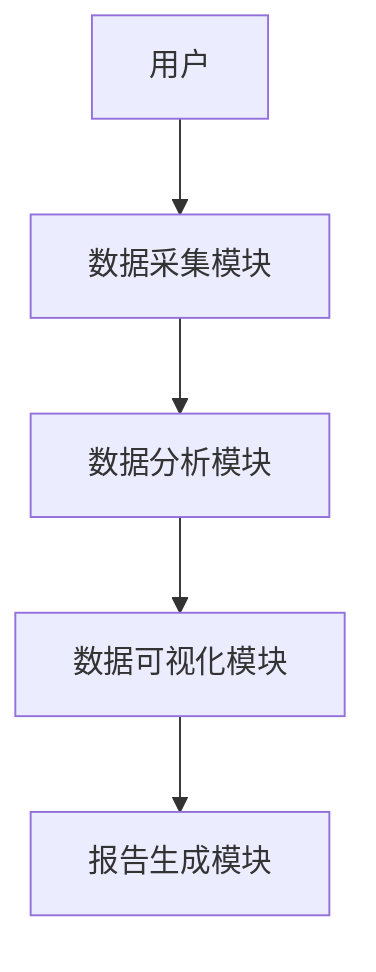

                 

<think>
好的，我需要帮助用户撰写一篇关于《彼得·林奇的行业分析方法论》的技术博客文章。用户已经提供了目录大纲，现在我需要根据这个大纲逐步完成每个部分的内容。为了确保内容的完整性和专业性，我需要按照用户的要求，使用逻辑清晰、结构紧凑、简单易懂的专业技术语言，并包含必要的图表和代码示例。

### 第1章: 行业分析的背景与重要性

#### 1.1 行业分析的核心概念

##### 1.1.1 行业分析的定义与背景

行业分析是研究特定行业内部结构、竞争状况、发展趋势和市场潜力的过程。通过行业分析，投资者和企业管理者能够更好地理解市场环境，制定有效的战略决策。彼得·林奇作为投资大师，他的行业分析方法论在投资领域具有重要影响，为投资者提供了系统性的分析框架。

##### 1.1.2 行业分析的重要性

行业分析是投资决策的基础。通过行业分析，投资者可以识别行业的增长潜力、竞争优势和潜在风险。林奇的方法论强调了对行业基本面的深入研究，帮助投资者避免盲目跟风，做出理性的投资决策。

##### 1.1.3 彼得·林奇的行业分析方法论

彼得·林奇的行业分析方法论以基本面分析为核心，强调对行业整体趋势的把握和对具体企业的深入研究。他的方法论包括行业数据分析、竞争优势评估和风险因素分析等步骤，为投资者提供了全面的行业分析框架。

#### 1.2 行业分析的背景与重要性

行业分析不仅帮助投资者评估行业的投资价值，还能帮助企业制定市场进入策略和风险管理计划。在当前全球经济一体化和市场竞争加剧的背景下，准确的行业分析对于企业和投资者都至关重要。彼得·林奇的方法论为我们提供了一套系统的行业分析工具和方法。

---

### 第2章: 彼得·林奇的行业分析框架

#### 2.1 行业分析的框架与步骤

##### 2.1.1 行业分析的基本框架

林奇的行业分析框架包括以下几个关键步骤：

1. **行业概况分析**：了解行业的基本特征，包括市场规模、市场结构、行业生命周期等。
2. **行业趋势分析**：研究行业的发展趋势，包括增长趋势、技术变革、政策影响等。
3. **行业竞争分析**：分析行业内主要竞争对手的市场地位、竞争优势和竞争策略。
4. **行业风险分析**：评估行业面临的各种风险因素，包括市场风险、政策风险、技术风险等。

##### 2.1.2 林奇的行业分析方法论

林奇的行业分析方法论强调对行业基本面的深入研究，包括对行业财务数据的分析、对行业发展趋势的预测以及对行业竞争优势的评估。他主张投资者应关注行业的长期发展趋势，而非短期市场波动。

##### 2.1.3 行业分析的实施步骤

以下是林奇行业分析方法论的具体实施步骤：

1. **确定分析目标**：明确行业分析的目的和范围。
2. **收集行业数据**：通过各种渠道收集行业相关的数据和信息。
3. **分析行业趋势**：研究行业的历史数据和未来发展趋势。
4. **评估行业风险**：识别行业中的潜在风险因素。
5. **制定投资策略**：基于分析结果制定相应的投资策略。

---

### 第3章: 行业分析的核心指标与数据来源

#### 3.1 行业分析的核心指标

##### 3.1.1 市场规模与增长率

市场规模是指行业内所有企业的总销售额，增长率则是衡量行业增长速度的重要指标。通过分析市场规模和增长率，可以评估行业的增长潜力和投资价值。

##### 3.1.2 市场结构与竞争格局

市场结构指的是行业内企业的分布情况，包括垄断型、寡头型、竞争型和分散型市场。竞争格局则涉及行业内主要企业的市场份额、竞争优势和竞争策略。

##### 3.1.3 行业周期与发展趋势

行业周期指的是行业在不同阶段（如导入期、成长期、成熟期和衰退期）的变化过程。了解行业周期有助于投资者判断行业的未来发展趋势。

#### 3.2 数据来源与收集方法

##### 3.2.1 数据来源渠道

行业分析的数据来源包括行业报告、政府统计、企业财报、新闻媒体和学术研究等。

##### 3.2.2 数据收集方法

数据收集方法包括问卷调查、访谈、文献研究和网络爬取等。

##### 3.2.3 数据清洗与处理

在数据收集后，需要对数据进行清洗和处理，包括数据的去重、缺失值处理和异常值剔除等。

---

### 第4章: 行业分析的案例研究

#### 4.1 案例分析：科技行业的分析

##### 4.1.1 科技行业的发展现状

科技行业目前处于高速发展阶段，人工智能、大数据、区块链等新技术的应用推动了行业的快速成长。

##### 4.1.2 林奇的分析方法在科技行业的应用

林奇的行业分析方法论在科技行业的应用包括对行业市场规模的分析、市场结构的评估以及行业趋势的预测。

##### 4.1.3 案例总结与启示

通过科技行业的案例分析，我们可以看到林奇的行业分析方法论的有效性和实用性。行业分析不仅帮助投资者制定投资策略，还能帮助企业制定市场进入和竞争策略。

---

### 第5章: 行业分析的工具与技术

#### 5.1 行业分析的常用工具

##### 5.1.1 数据分析工具

常用的行业分析工具包括Excel、SPSS、Tableau和Power BI等。

##### 5.1.2 信息可视化工具

信息可视化工具包括ECharts、D3.js和Highcharts等。

##### 5.1.3 竞争分析工具

竞争分析工具包括SWOT分析、波特五力模型和竞争对手分析工具等。

#### 5.2 行业分析的技术方法

##### 5.2.1 宏观分析方法

宏观分析方法包括PEST分析（政治、经济、社会和技术因素）和SWOT分析等。

##### 5.2.2 微观分析方法

微观分析方法包括波特五力模型、价值链分析和竞争对手分析等。

##### 5.2.3 综合分析方法

综合分析方法结合了宏观和微观分析方法，从多个角度对行业进行综合评估。

---

### 第6章: 行业分析的系统架构与实现

#### 6.1 行业分析系统的架构设计

##### 6.1.1 系统功能模块划分

行业分析系统可以划分为数据采集模块、数据分析模块、数据可视化模块和报告生成模块。

##### 6.1.2 系统数据流设计

系统数据流设计包括数据输入、数据处理、数据存储和数据输出等步骤。

##### 6.1.3 系统架构图（Mermaid）

#### 6.2 行业分析的算法实现

##### 6.2.1 数据预处理算法

数据预处理算法包括数据清洗、数据转换和数据集成等步骤。

##### 6.2.2 趋势预测算法

趋势预测算法可以使用时间序列分析、回归分析和机器学习算法等。

##### 6.2.3 竞争分析算法

竞争分析算法包括市场份额分析、竞争对手分析和市场定位分析等。

---

### 第7章: 项目实战：基于彼得·林奇方法论的行业分析

#### 7.1 项目背景与目标

##### 7.1.1 项目背景

本项目旨在通过林奇的行业分析方法论，对某一行业进行深入分析，为投资者提供参考。

##### 7.1.2 项目目标

项目目标包括数据收集、数据分析、趋势预测和报告撰写等。

##### 7.1.3 项目范围

项目范围包括选定行业、数据收集、分析实施和结果汇报等。

#### 7.2 项目实施步骤

##### 7.2.1 数据收集与处理

通过多种渠道收集行业数据，并进行数据清洗和预处理。

##### 7.2.2 行业分析与报告撰写

基于林奇的方法论，对行业进行深入分析，并撰写分析报告。

##### 7.2.3 结果验证与优化

通过验证分析结果的准确性和可靠性，不断优化分析方法和模型。

---

### 第8章: 最佳实践与注意事项

#### 8.1 行业分析的最佳实践

##### 8.1.1 数据收集的注意事项

数据收集时应确保数据的准确性和完整性。

##### 8.1.2 分析方法的选择

根据行业特点选择合适的分析方法和工具。

##### 8.1.3 报告撰写的技巧

报告应结构清晰、内容详实、逻辑严密。

#### 8.2 行业分析的注意事项

##### 8.2.1 数据的准确性和完整性

确保数据的准确性和完整性是行业分析的基础。

##### 8.2.2 分析结果的局限性

行业分析结果具有一定的局限性，需结合实际情况进行判断。

##### 8.2.3 行业变化的动态性

行业环境是动态变化的，需持续关注行业最新动态和趋势。

---

### 第9章: 小结与拓展阅读

#### 9.1 本章小结

##### 9.1.1 核心知识点回顾

通过本章学习，我们掌握了彼得·林奇的行业分析方法论，了解了行业分析的核心概念和实施步骤。

##### 9.1.2 方法论总结

林奇的行业分析方法论强调对行业基本面的深入研究，为投资者提供了系统的分析框架。

#### 9.2 拓展阅读与参考资料

##### 9.2.1 推荐书籍

1. 《彼得·林奇的成功投资》
2. 《行业分析与投资策略》
3. 《数据分析与行业研究》

##### 9.2.2 在线资源

1. 彼得·林奇的演讲和访谈
2. 行业分析工具和平台
3. 数据分析与可视化的在线课程

---

通过以上内容的逐步分析和撰写，我们可以系统地理解和应用彼得·林奇的行业分析方法论，为投资决策提供有力支持。希望这篇博客文章能够帮助读者更好地掌握行业分析的核心内容和实际应用。

