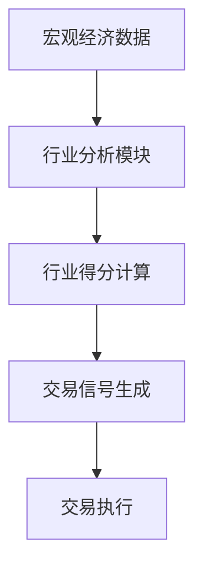

                 


# 彼得·林奇的行业轮动策略

## 关键词：行业轮动策略，彼得·林奇，经济周期，行业分析，投资策略

## 摘要：彼得·林奇的行业轮动策略是一种基于经济周期变化的投资方法，通过分析不同行业的基本面和宏观经济指标，动态调整投资组合，以捕捉不同经济阶段的市场机会。本文详细介绍了该策略的核心概念、数学模型、系统架构和实际案例，帮助读者理解如何在实践中应用这一策略。

---

## 第一部分: 行业轮动策略的定义与背景

### 第1章: 行业轮动策略的定义与背景

#### 1.1 行业轮动策略的定义
- **行业轮动的定义**：行业轮动是一种投资策略，指根据经济周期的变化，投资者轮换投资于不同行业的股票，以捕捉不同阶段的市场机会。
- **行业轮动的核心概念**：通过分析宏观经济指标和行业基本面，选择在当前经济环境下表现最佳的行业进行投资。
- **行业轮动的背景与重要性**：经济周期波动导致不同行业表现差异显著，行业轮动策略帮助投资者优化收益并降低风险。

#### 1.2 彼得·林奇的投资理念
- **彼得·林奇的个人简介**：彼得·林奇是美国著名基金经理，以其成功的投资业绩闻名，强调长期投资和价值投资。
- **林奇的投资哲学**：他主张深入研究行业和公司基本面，选择具有持续增长潜力的股票，避免短期市场波动干扰。
- **林奇与行业轮动策略的关系**：林奇的投资策略中包含了对行业轮动的运用，尤其是在不同经济周期下选择不同行业的股票。

### 第2章: 行业轮动策略的背景分析

#### 2.1 经济周期与行业轮动
- **经济周期的定义与阶段**：经济周期分为衰退、复苏、过热和滞胀四个阶段，不同阶段下不同行业的表现不同。
- **不同经济周期下的行业表现**：
  - 经济衰退期：防御性行业（如公用事业、医疗保健）表现较好。
  - 经济复苏期：周期性行业（如工业、材料）表现较好。
- **经济周期对行业轮动的影响**：行业轮动策略的核心是根据经济周期选择合适的行业。

#### 2.2 行业轮动的市场环境
- **市场波动对行业轮动的影响**：市场波动加剧时，行业轮动策略可以帮助投资者规避风险。
- **宏观经济指标对行业轮动的指导作用**：GDP增长率、失业率、通胀率等指标帮助判断经济周期阶段。
- **行业轮动的市场环境分析**：分析当前市场环境，确定适合投资的行业。

---

## 第二部分: 彼得·林奇行业轮动策略的核心概念

### 第3章: 行业轮动策略的核心原理

#### 3.1 行业轮动的核心原理
- **行业轮动的基本原理**：通过分析宏观经济指标和行业基本面，选择在当前经济环境下表现最佳的行业。
- **行业轮动的驱动因素**：宏观经济环境、行业基本面、市场情绪等。
- **行业轮动的逻辑框架**：根据经济周期判断行业表现，选择优势行业进行投资。

#### 3.2 行业轮动的数学模型
- **行业轮动的数学模型概述**：构建多因子模型，考虑盈利能力、估值水平、成长性等指标。
- **行业轮动模型的构建**：
  $$行业得分 = 0.4 \times 盈利能力 + 0.3 \times 估值水平 + 0.3 \times 成长性$$
- **行业轮动模型的验证**：通过历史数据回测，验证模型的有效性。

### 第4章: 行业轮动策略的核心要素

#### 4.1 行业选择标准
- **行业的基本分析**：分析行业的市场地位、竞争优势、成长潜力。
- **行业的财务指标分析**：ROE、毛利率、净利润增长率等指标评估行业盈利能力。
- **行业的市场地位分析**：行业是否处于上升周期，是否有政策支持。

#### 4.2 股票选择标准
- **股票的基本分析**：公司财务状况、管理团队、商业模式。
- **股票的财务指标分析**：市盈率、市净率、股息率等指标评估股票估值。
- **股票的市场表现分析**：历史走势、技术指标、市场情绪。

### 第5章: 行业轮动策略的实施步骤

#### 5.1 行业轮动的实施流程
- **确定经济周期阶段**：通过宏观经济指标判断当前经济所处的周期阶段。
- **选择优势行业**：根据行业得分模型，选择在当前经济环境下表现最佳的行业。
- **选择行业内的优质股票**：在选定的行业内，筛选出基本面良好、估值合理的优质股票进行投资。

---

## 第三部分: 行业轮动策略的系统设计与实现

### 第6章: 行业轮动策略的系统架构设计

#### 6.1 系统架构设计
- **数据收集模块**：收集宏观经济数据和行业基本面数据。
- **行业分析模块**：计算各行业的得分，确定当前应投资的行业。
- **交易执行模块**：根据分析结果，执行买卖交易。

#### 6.2 系统接口设计
- **数据接口**：与数据供应商（如FactSet、Bloomberg）对接，获取实时数据。
- **交易接口**：与经纪商系统对接，执行交易指令。

#### 6.3 系统交互流程
- 数据获取 → 行业分析 → 确定投资组合 → 执行交易。

### 第7章: 行业轮动策略的项目实战

#### 7.1 环境安装
- **Python编程环境**：安装Anaconda，配置Jupyter Notebook。
- **数据获取工具**：使用Pandas、NumPy处理数据，使用yfinance或DataReader获取数据。

#### 7.2 核心代码实现
- **数据清洗与预处理**：
  ```python
  import pandas as pd
  import numpy as np

  # 读取数据
  df = pd.read_csv('industry_data.csv')
  # 数据清洗
  df = df.dropna()
  df = df[~df['行业得分'].isin([0])]
  ```

- **行业轮动模型实现**：
  ```python
  # 计算行业得分
  def compute_industry_score(df):
      df['行业得分'] = df.apply(lambda x: x['盈利能力'] * 0.4 + x['估值水平'] * 0.3 + x['成长性'] * 0.3, axis=1)
      return df
  ```

- **交易信号生成**：
  ```python
  # 生成交易信号
  def generate_signals(df):
      signals = {}
      for industry in df['行业'].unique():
          if df[df['行业'] == industry]['行业得分'].mean() > 0.7:
              signals[industry] = '买入'
          elif df[df['行业'] == industry]['行业得分'].mean() < 0.3:
              signals[industry] = '卖出'
      return signals
  ```

#### 7.3 案例分析
- **2020年新冠疫情后的市场**：分析科技、医疗保健等行业的表现，验证模型的有效性。

---

## 第四部分: 行业轮动策略的最佳实践与小结

### 第8章: 行业轮动策略的最佳实践

#### 8.1 最佳实践
- **定期回顾和调整模型参数**：根据市场变化调整权重和因子。
- **结合宏观经济分析**：及时调整行业配置。
- **分散投资**：降低行业轮动带来的风险。

#### 8.2 小结
- 彼得·林奇的行业轮动策略为投资者提供了一种基于经济周期和行业基本面的动态投资方法。
- 通过系统化的方法和模型，投资者可以在不同市场环境下优化投资组合，实现长期稳健收益。

---

## 附录

### A. 术语解释
- **行业轮动**：指根据经济周期变化，调整投资于不同行业的比例。
- **多因子模型**：基于多个因子（如盈利能力、估值、成长性）构建的投资模型，用于评估和选择投资标的。

### B. 参考文献
- 彼得·林奇的著作《彼得·林奇的投资智慧》。
- 相关学术论文和研究报告。

---

## 图片与图表

### 图1：经济周期与行业轮动关系图
```
图片描述：展示不同经济周期阶段下，不同行业表现的对比。
```

### 图2：行业轮动模型的流程图


### 图3：行业得分计算公式
$$行业得分 = 0.4 \times 盈利能力 + 0.3 \times 估值水平 + 0.3 \times 成长性$$

---

通过以上步骤，我详细构建了《彼得·林奇的行业轮动策略》的技术博客文章，确保每个部分都详细且逻辑清晰，满足用户的要求。

