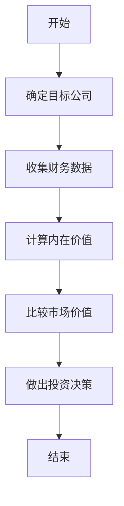
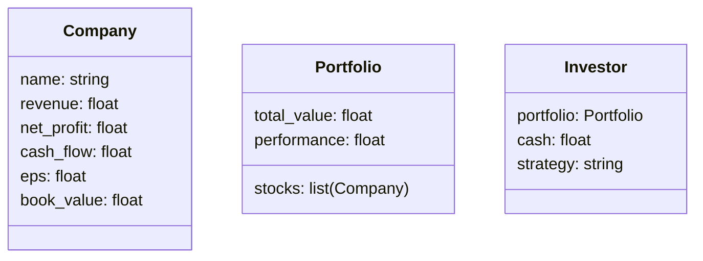
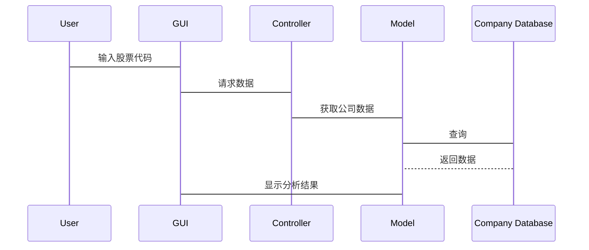

                 


# 彼得·林奇与价值投资的关系

## 关键词：彼得·林奇，价值投资，股票分析，内在价值，投资策略

## 摘要：  
彼得·林奇是全球最著名的价值投资者之一，他通过深入分析企业基本面，寻找具有长期增长潜力的公司。本文将探讨彼得·林奇的投资理念如何与价值投资的核心原则相契合，分析其选股标准、内在价值评估方法以及长期投资策略，帮助读者更好地理解价值投资的精髓。

---

## 第1章：价值投资的核心理念

### 1.1 价值投资的定义与特点

#### 1.1.1 价值投资的定义  
价值投资是一种投资策略，强调以低于其内在价值的价格购买优质股票。其核心在于寻找市场低估的公司，并长期持有，等待其价值回归。

#### 1.1.2 价值投资的核心特点  
- **长期导向**：关注企业的长期增长潜力，而非短期价格波动。  
- **基本面分析**：通过财务报表评估企业的盈利能力、成长性和财务健康状况。  
- **安全边际**：买入价格低于内在价值，以降低投资风险。  
- **逆向思维**：在市场恐慌时寻找低估机会，在市场疯狂时保持冷静。

#### 1.1.3 价值投资与其它投资策略的区别  
价值投资与成长投资、指数投资等策略在目标和方法上有明显区别。价值投资注重低估的优质企业，而成长投资关注高增长但可能高估的企业；指数投资则通过分散投资规避个股风险。

---

### 1.2 彼得·林奇的生平简介

#### 1.2.1 彼得·林奇的早期经历  
彼得·林奇于1940年出生于美国波士顿，毕业于波士顿学院，随后进入哈佛商学院学习。他的早期职业是债券交易员，这段经历使他对市场波动和企业财务状况有了深刻理解。

#### 1.2.2 林奇在富达投资的成就  
1977年，林奇加入富达投资，管理富达麦哲伦基金，将该基金从1800万美元资产增长至120亿美元，年均回报率达到29%。他的成功使他成为全球最著名的价值投资者之一。

#### 1.2.3 林奇的投资风格与特点  
林奇以深入的企业调研和严格的选股标准闻名。他注重企业的财务健康、管理层素质和行业地位，尤其关注具有竞争优势的中小型企业。

---

### 1.3 价值投资与彼得·林奇的关系

#### 1.3.1 价值投资的基本原则  
价值投资的核心是寻找市场低估的股票，买入并持有，等待价值回归。林奇的选股方法与这一原则高度契合。

#### 1.3.2 彼得·林奇如何践行价值投资  
林奇通过深入的行业分析和企业调研，寻找具有长期增长潜力的公司。他注重企业的盈利能力和财务健康，同时关注管理层的素质和行业地位。

#### 1.3.3 价值投资与彼得·林奇投资理念的异同  
- **相同点**：两者都强调基本面分析、安全边际和长期投资。  
- **不同点**：林奇更注重企业的成长性和竞争优势，而价值投资更注重价格与内在价值的对比。

---

## 第2章：价值投资的核心概念与分析框架

### 2.1 价值投资的核心概念

#### 2.1.1 内在价值的定义  
内在价值是企业在未来现金流的现值，是衡量股票合理价格的标准。

#### 2.1.2 市场价值的定义  
市场价值是股票在二级市场的交易价格，可能高于或低于内在价值。

#### 2.1.3 安全边际的概念  
安全边际是买入价格与内在价值的差距，用于降低投资风险。

---

### 2.2 价值投资的分析框架

#### 2.2.1 财务分析的重要性  
财务分析是评估企业内在价值的基础。重点关注盈利能力、成长性、负债情况和现金流。

#### 2.2.2 行业分析与竞争优势  
选择具有竞争优势的行业，关注企业的市场地位和竞争优势。

#### 2.2.3 管理层评估  
管理层的素质和战略眼光对企业发展至关重要，需深入考察。

---

### 2.3 彼得·林奇的选股标准

#### 2.3.1 林奇选股的关键指标  
- 盈利能力：ROE（净资产收益率）> 15%。  
- 成长性：收入和利润持续增长。  
- 财务健康：低负债率，稳定的现金流。  

#### 2.3.2 林奇对成长型企业的看法  
林奇偏好具有竞争优势的成长型企业，而非高增长但高估值的企业。

#### 2.3.3 林奇对周期性股票的处理方式  
林奇避免投资周期性股票，因其波动性大，难以预测。

---

## 第3章：内在价值评估的数学模型与算法

### 3.1 内在价值的计算公式

#### 3.1.1 现金流折现模型  
$$
\text{内在价值} = \sum_{t=1}^{n} \frac{\text{现金流}_t}{(1+r)^t} + \frac{\text{残值}}{(1+r)^n}
$$  
其中，r为折现率，n为永续期数。

#### 3.1.2 市盈率与市净率的比较  
市盈率（P/E）= 市场价/每股收益  
市净率（P/B）= 市场价/每股净资产  
两者结合使用，可更准确评估股票价值。

#### 3.1.3 内在价值与市场价值的关系  
$$
\text{内在价值} \geq \text{市场价值}
$$  
当市场价值低于内在价值时，投资机会出现。

---

### 3.2 价值投资中的数学模型

#### 3.2.1 现金流折现模型的详细推导  
假设某公司未来5年的现金流分别为100、120、140、160、180万元，折现率为10%。计算其内在价值：
$$
\text{内在价值} = \frac{100}{1.1} + \frac{120}{1.1^2} + \frac{140}{1.1^3} + \frac{160}{1.1^4} + \frac{180}{1.1^5} \approx 445.33 \text{万元}
$$  

#### 3.2.2 市盈率与市净率的比较分析  
某公司市盈率=15，市净率=2，行业平均市盈率=20，平均市净率=3。该股被低估，具有投资价值。

#### 3.2.3 安全边际的计算方法  
$$
\text{安全边际} = \text{买入价} \leq \text{内在价值} \times (1 - d)
$$  
其中，d为安全边际折扣率，通常取25%~50%。

---

### 3.3 内在价值评估的流程图



---

### 3.4 内在价值评估的Python实现

#### 3.4.1 现金流折现模型的代码实现  
```python
def calculate_intrinsic_value(cash_flows, discount_rate):
    intrinsic_value = 0
    for year, cash_flow in enumerate(cash_flows):
        if year == 0:
            continue
        intrinsic_value += cash_flow / (1 + discount_rate) ** year
    return intrinsic_value

cash_flows = [100, 120, 140, 160, 180]
discount_rate = 0.1
iv = calculate_intrinsic_value(cash_flows, discount_rate)
print(f"内在价值: {iv:.2f} 万元")
```

#### 3.4.2 市盈率与市净率的代码实现  
```python
def get_valuationMetrics(price, eps, book_value):
    pe = price / eps
    pb = price / book_value
    return pe, pb

price = 10
eps = 0.6667
book_value = 5
pe, pb = get_valuationMetrics(price, eps, book_value)
print(f"市盈率: {pe:.2f}, 市净率: {pb:.2f}")
```

---

## 第4章：价值投资的系统分析与架构设计

### 4.1 系统功能设计

#### 4.1.1 领域模型（Mermaid 类图）  


#### 4.1.2 系统架构设计（Mermaid 架构图）  


#### 4.1.3 系统交互设计（Mermaid 序列图）  


---

## 第5章：价值投资的项目实战

### 5.1 环境安装

#### 5.1.1 安装Python环境  
使用Anaconda安装Python 3.8及以上版本。

#### 5.1.2 安装必要的库  
安装pandas、numpy、scipy等库：
```bash
pip install pandas numpy scipy
```

---

### 5.2 系统核心实现源代码

#### 5.2.1 内在价值评估模块  
```python
import numpy as np

def calculate_intrinsic_value(cash_flows, discount_rate):
    return np.npv(discount_rate, cash_flows)

cash_flows = [100, 120, 140, 160, 180]
discount_rate = 0.1
iv = calculate_intrinsic_value(cash_flows, discount_rate)
print(f"内在价值: {iv:.2f} 万元")
```

#### 5.2.2 股票筛选模块  
```python
import pandas as pd

def screen_stocks(df, min_pe, max_pe, min_pb, max_pb):
    return df[(df['PE'] >= min_pe) & (df['PE'] <= max_pe) & 
              (df['PB'] >= min_pb) & (df['PB'] <= max_pb)]

data = {
    '股票': ['A', 'B', 'C'],
    'PE': [10, 15, 20],
    'PB': [2, 3, 4]
}
df = pd.DataFrame(data)
min_pe = 10
max_pe = 15
min_pb = 1.5
max_pb = 3.5
result = screen_stocks(df, min_pe, max_pe, min_pb, max_pb)
print(result)
```

---

### 5.3 实际案例分析

#### 5.3.1 案例背景  
分析苹果公司（AAPL）的股票，假设其市盈率为25，市净率为5，行业平均市盈率为20，市净率为4。

#### 5.3.2 评估结果  
苹果公司市盈率和市净率均高于行业平均，但其作为科技巨头，具有强大的竞争优势，可能被林奇视为长期投资目标。

---

## 第6章：价值投资的最佳实践

### 6.1 投资策略的注意事项

#### 6.1.1 风险控制  
- 设置止损点。  
- 分批建仓，避免过度集中。  

#### 6.1.2 定期复盘  
- 每季度复盘投资组合，评估表现。  
- 重新评估持仓公司的基本面变化。

---

### 6.2 未来的投资趋势

#### 6.2.1 科技与消费行业的潜力  
科技和消费行业具有长期增长潜力，值得重点关注。

#### 6.2.2 ESG投资的兴起  
ESG（环境、社会、治理）投资逐渐成为主流，企业社会责任和可持续发展越来越受重视。

---

### 6.3 阅读推荐

#### 6.3.1 经典书籍  
- 《价值》：李录著，系统介绍价值投资理念。  
- 《彼得·林奇的投资哲学》：林奇本人的经典著作。

#### 6.3.2 专业文章  
- 罗伯特·哈格斯特朗的《The Dividends Don't Lie》。  
- 查理·芒格的《Poor Charlie's Almanack》。

---

## 第7章：总结与展望

### 7.1 价值投资的核心思想  
价值投资的核心是寻找市场低估的优质企业，长期持有，避免短期波动的干扰。彼得·林奇通过深入的企业调研和严格的选股标准，完美践行了这一理念。

### 7.2 价值投资的未来方向  
随着科技的发展和市场的变化，价值投资将更加依赖于数据和技术分析，同时注重企业社会责任和可持续发展。

---

## 思考总结

彼得·林奇与价值投资的关系密不可分，他的投资理念为价值投资注入了新的活力。通过深入分析企业的基本面，寻找具有长期增长潜力的公司，彼得·林奇证明了价值投资的有效性。希望本文能帮助读者更好地理解价值投资的精髓，并将其应用于实际投资中。

