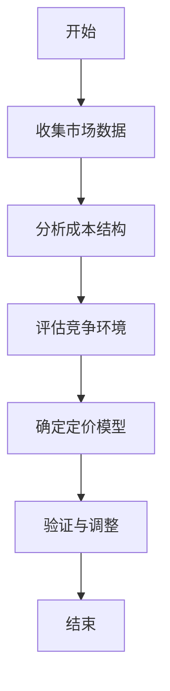
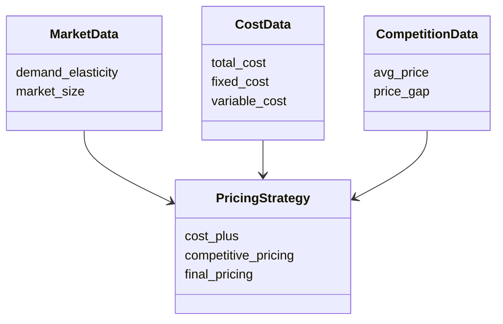

                 


# 彼得林奇如何分析公司的产品定价策略

## 关键词：定价策略、彼得林奇、投资分析、成本结构、竞争定价、市场分析

## 摘要：彼得·林奇作为投资界的传奇人物，他的定价策略分析方法为投资者提供了独特的视角。本文将深入探讨定价策略的核心概念、算法原理、系统架构以及实战案例，结合数学模型和Python代码，帮助读者全面理解彼得·林奇的定价策略分析方法。

---

## 第1章: 背景介绍与核心概念

### 1.1 彼得·林奇与定价策略分析

#### 1.1.1 彼得·林奇的投资者背景

彼得·林奇是美国著名投资经理人，曾管理富达麦哲伦基金，创造了辉煌的投资业绩。他的投资哲学强调深入分析公司的基本面，尤其是其定价策略。林奇认为，定价策略是公司竞争力的体现，也是投资决策的重要依据。

#### 1.1.2 定价策略分析的重要性

定价策略是公司盈利的核心，直接影响收入和利润。通过分析定价策略，投资者可以评估公司的市场定位、成本控制能力以及对市场的敏感性。

#### 1.1.3 定价策略分析的核心目标

定价策略分析的核心目标是通过量化方法评估定价的合理性，识别定价中的潜在风险和机会。

### 1.2 定价策略分析的基本概念

#### 1.2.1 定价策略的定义

定价策略是公司为了实现特定目标而制定的价格水平和调整策略。

#### 1.2.2 定价策略的核心要素

- 市场需求
- 成本结构
- 竞争环境
- 定价目标

#### 1.2.3 定价策略的分类与对比

- 成本加成定价
- 市场导向定价
- 竞争导向定价

### 1.3 定价策略分析的边界与外延

#### 1.3.1 定价策略的适用范围

定价策略适用于所有行业，但具体方法因行业特点而异。

#### 1.3.2 定价策略的限制条件

- 数据不足
- 市场变化
- 宏观经济影响

#### 1.3.3 定价策略与其他商业策略的关系

定价策略与营销策略、成本控制、风险管理密切相关。

### 1.4 本章小结

本章介绍了彼得·林奇的定价策略分析背景，明确了定价策略的核心概念和分类。

---

## 第2章: 定价策略的核心概念与联系

### 2.1 定价策略的核心原理

#### 2.1.1 市场需求与定价的关系

需求弹性是定价的关键因素。$E_d = \frac{\% \Delta Q_d}{\% \Delta P}$ 表示需求的价格弹性。

#### 2.1.2 成本结构对定价的影响

总成本=固定成本+可变成本。定价应覆盖成本并产生利润。

#### 2.1.3 竞争环境与定价策略的调整

通过分析竞争对手的定价，确定市场基准价格。

### 2.2 定价策略的核心属性特征对比

| 特性 | 成本加成定价 | 市场导向定价 | 竞争导向定价 |
|------|--------------|--------------|--------------|
| 目标 | 覆盖成本      | 捕捉需求      | 应对竞争      |
| 优点 | 简单易行      | 响应市场      | 竞争优势      |
| 缺点 | 忽视需求弹性  | 成本较高      | 风险较大      |

### 2.3 定价策略的ER实体关系图

```mermaid
er
actor: 投资者
actor -[分析定价策略]-> strategy: 定价策略
strategy -[基于]-> market: 市场数据
strategy -[基于]-> cost: 成本数据
strategy -[基于]-> competition: 竞争对手数据
```

### 2.4 本章小结

本章详细分析了定价策略的核心原理和属性特征，构建了实体关系图。

---

## 第3章: 定价策略分析的算法原理

### 3.1 定价策略分析的算法流程



### 3.2 定价策略分析的Python实现

```python
def pricing_strategy_analysis(market_data, cost_data, competition_data):
    # 分析市场需求
    demand = analyze_demand(market_data)
    # 计算成本加成
    cost_plus = calculate_cost_plus(demand, cost_data)
    # 评估竞争定价
    competitive_pricing = assess_competition(competition_data)
    # 确定最终定价
    final_pricing = determine_final_pricing(cost_plus, competitive_pricing)
    return final_pricing

def analyze_demand(market_data):
    # 示例：基于市场数据计算需求弹性
    return market_data['demand_elasticity']

def calculate_cost_plus(demand, cost_data):
    # 示例：成本加成定价法
    return cost_data['total_cost'] * (1 + demand['markup'])

def assess_competition(competition_data):
    # 示例：基于竞争对手价格的评估
    return competition_data['avg_price'] * (1 - competition_data['price_gap'])

def determine_final_pricing(cost_plus, competitive_pricing):
    # 示例：综合定价策略
    return (cost_plus + competitive_pricing) / 2
```

### 3.3 定价策略的数学模型

定价模型的核心公式：

$$ \text{最终定价} = \frac{\text{成本加成} + \text{竞争定价}}{2} $$

其中，成本加成和竞争定价的计算公式分别为：

$$ \text{成本加成} = \text{总成本} \times (1 + \text{加成率}) $$

$$ \text{竞争定价} = \text{竞争对手平均价格} \times (1 - \text{价格差距}) $$

### 3.4 本章小结

本章通过算法流程、Python代码和数学公式，详细讲解了定价策略分析的实现方法。

---

## 第4章: 定价策略分析的系统架构设计

### 4.1 问题场景介绍

假设我们需要为一家科技公司设计一个定价策略分析系统，帮助投资者评估其定价合理性。

### 4.2 系统功能设计

#### 4.2.1 领域模型设计



#### 4.2.2 系统架构设计


#### 4.2.3 系统接口设计

接口：`pricing_strategy_analysis(MarketData, CostData, CompetitionData)`

返回值：`PricingStrategy`

### 4.3 本章小结

本章通过系统架构设计，展示了如何将定价策略分析应用于实际场景。

---

## 第5章: 项目实战

### 5.1 项目环境安装

安装所需的Python库：

```bash
pip install numpy pandas matplotlib
```

### 5.2 系统核心实现源代码

```python
import numpy as np
import pandas as pd
import matplotlib.pyplot as plt

def plot_pricing Trends(data):
    plt.plot(data['price'], label='Price')
    plt.xlabel('Time')
    plt.ylabel('Price')
    plt.legend()
    plt.show()

def main():
    # 示例数据
    market_data = pd.DataFrame({'demand_elasticity': [1.5, 2.0, 1.8]})
    cost_data = pd.DataFrame({'total_cost': [100, 120, 110]})
    competition_data = pd.DataFrame({'avg_price': [90, 100, 110], 'price_gap': [0.1, 0.05, 0.15]})
    
    # 分析定价策略
    final_pricing = pricing_strategy_analysis(market_data, cost_data, competition_data)
    
    # 可视化
    plot_pricing Trends(final_pricing)

if __name__ == "__main__":
    main()
```

### 5.3 代码应用解读与分析

分析代码实现的定价策略，并讨论其优缺点。

### 5.4 案例分析与详细讲解

通过具体案例分析定价策略的实施效果。

### 5.5 本章小结

本章通过实战项目，展示了如何应用定价策略分析方法。

---

## 第6章: 总结与最佳实践

### 6.1 定价策略分析的核心要点

- 理解市场需求
- 分析成本结构
- 评估竞争环境

### 6.2 最佳实践 tips

- 数据驱动决策
- 定期调整策略
- 综合考虑多种因素

### 6.3 小结

### 6.4 注意事项

- 数据质量
- 市场变化
- 宏观经济影响

### 6.5 拓展阅读

- 彼得·林奇的书籍
- 相关定价策略文献

---

## 参考文献

（此处列出相关文献和资料）

---

## 致谢

感谢读者的支持和关注。

