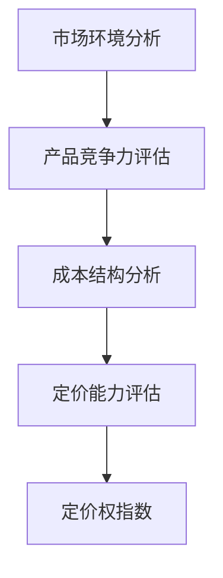
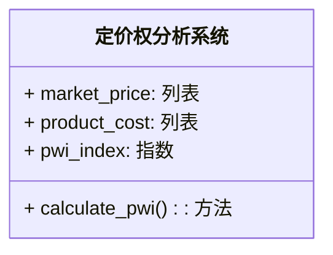

                 


# 彼得林奇如何分析公司的定价权随时间的变化

> 关键词：彼得林奇，定价权，市场分析，产品差异化，品牌影响力，成本结构，定价能力

> 摘要：本文深入探讨了彼得林奇如何分析公司的定价权随时间的变化。通过详细分析定价权的定义、影响因素、动态变化、核心概念、算法原理、系统分析、项目实战以及最佳实践，帮助读者全面理解定价权的本质和应用。文章内容丰富，逻辑严谨，涵盖从理论到实践的多个方面，适合对投资分析和定价策略感兴趣的专业人士阅读。

---

# 第1章: 定价权的背景与核心概念

## 1.1 定价权的定义与影响因素

### 1.1.1 定价权的基本概念
定价权是指企业在市场中对其产品或服务制定价格的能力，通常反映企业的市场地位和竞争能力。一个拥有强大定价权的企业可以在价格调整中占据主动地位，从而在市场中获得更大的利润空间。

### 1.1.2 定价权的核心特征
- **价格制定能力**：企业能够根据市场变化和成本变化自主调整价格。
- **市场影响力**：企业能够通过价格调整影响市场需求和竞争格局。
- **成本与价格匹配**：定价权强的企业能够将成本变化转化为价格调整，保持利润空间。

### 1.1.3 定价权的边界与外延
定价权并非绝对，而是受到市场环境、竞争格局和客户需求的限制。外延方面，定价权与企业的品牌价值、产品差异化和成本结构密切相关。

---

## 1.2 定价权的影响因素

### 1.2.1 市场供需关系
市场供需关系是影响定价权的核心因素。供不应求时，企业可以提高价格；供过于求时，价格可能被迫下降。

### 1.2.2 产品差异化程度
产品差异化程度越高，企业的定价权越强。独特的产品或服务可以吸引特定客户群体，从而提高定价能力。

### 1.2.3 品牌影响力与客户忠诚度
强大的品牌影响力和高客户忠诚度能够赋予企业更强的定价权。客户愿意为知名品牌支付更高价格。

### 1.2.4 成本结构与竞争格局
成本结构和竞争格局直接影响企业的定价能力。低边际成本和高市场集中度的企业通常具有更强的定价权。

---

## 1.3 定价权的分类与应用场景

### 1.3.1 垄断型定价权
垄断型企业通常具有最强的定价权，因为它们在市场中占据主导地位，竞争对手难以对其定价产生实质性影响。

### 1.3.2 竞争型定价权
在竞争激烈的市场中，企业的定价权受到较大限制，价格调整需要考虑竞争对手的反应。

### 1.3.3 服务型定价权
服务型企业通常通过差异化服务和客户关系管理来增强定价权，例如高端酒店和咨询公司。

### 1.3.4 创新型定价权
创新型企业的定价权往往与其技术创新能力密切相关。新产品或技术往往能够通过差异化定价获得更高的利润。

---

## 1.4 本章小结
本章从定价权的定义、核心特征、边界与外延入手，详细分析了影响定价权的主要因素，包括市场供需关系、产品差异化程度、品牌影响力和成本结构。同时，分类讨论了定价权在不同市场环境和企业类型中的应用场景。

---

# 第2章: 定价权的分析框架

## 2.1 定价权的分析维度

### 2.1.1 市场结构分析
分析市场结构（完全竞争、垄断竞争、寡头垄断、完全垄断）是理解定价权的关键。不同市场结构下，企业的定价权强弱不同。

### 2.1.2 产品生命周期分析
产品生命周期的不同阶段（引入期、成长期、成熟期、衰退期）会影响企业的定价权。成熟期的产品通常面临更大的价格压力。

### 2.1.3 竞争对手分析
竞争对手的数量、市场份额和定价策略直接影响企业的定价权。竞争优势明显的企业通常具有更强的定价权。

### 2.1.4 客户需求分析
客户需求的多样性和价格弹性是影响定价权的重要因素。客户对价格敏感度低的产品通常具有更强的定价权。

---

## 2.2 定价权的评估指标

### 2.2.1 定价能力评估
定价能力可以通过市场份额变化率、价格调整幅度和利润增长幅度来评估。

### 2.2.2 定价弹性分析
定价弹性是指价格变化对需求量的影响程度。弹性小的产品通常具有更强的定价权。

### 2.2.3 定价风险评估
定价风险包括市场竞争风险、成本风险和政策风险。企业需要通过定价权分析来降低这些风险。

---

## 2.3 定价权的动态变化

### 2.3.1 市场环境变化对定价权的影响
经济周期、政策变化和行业趋势都会影响定价权。例如，经济衰退可能导致企业定价权下降。

### 2.3.2 产品创新对定价权的影响
新产品或技术创新可以增强企业的定价权。通过差异化产品，企业可以在价格制定中占据主动地位。

### 2.3.3 宏观经济对定价权的影响
通货膨胀、汇率变化和原材料价格波动都会影响企业的定价权。成本上升通常会削弱定价权。

---

## 2.4 本章小结
本章从分析维度、评估指标和动态变化三个方面，详细探讨了定价权的分析框架。通过市场结构分析、产品生命周期分析、竞争对手分析和客户需求分析，企业可以更好地理解定价权的变化趋势。

---

# 第3章: 定价权的核心概念与联系

## 3.1 定价权的核心要素

### 3.1.1 市场地位
市场地位是定价权的核心要素之一。市场领导者通常具有更强的定价权。

### 3.1.2 产品竞争力
产品竞争力直接影响定价权。独特的产品或技术创新可以增强企业的定价能力。

### 3.1.3 成本优势
成本优势是定价权的重要支撑。低成本企业可以通过价格优势扩大市场份额。

### 3.1.4 品牌价值
品牌价值是定价权的重要驱动力。强大的品牌可以赋予企业更高的定价能力。

---

## 3.2 定价权与成本优势的对比

### 3.2.1 定价权的核心属性
- 独特性和差异化
- 市场影响力
- 价格制定能力

### 3.2.2 成本优势的核心属性
- 低成本生产
- 边际成本优势
- 成本结构优化

### 3.2.3 两者对比分析
定价权和成本优势虽然都影响企业的盈利能力，但侧重点不同。定价权更注重市场影响力和价格制定能力，而成本优势更注重生产效率和成本控制。

---

## 3.3 定价权的ER实体关系图

```mermaid
er
  actor 公司 {
    <--- 关联 --> 产品
    <--- 关联 --> 市场
  }
  产品 {
    <--- 属性 --> 定价权
  }
```

---

## 3.4 本章小结
本章从核心要素和核心概念两个方面，深入分析了定价权的内在联系。通过对比定价权和成本优势，帮助读者更好地理解定价权的独特性和重要性。

---

# 第4章: 定价权的算法原理

## 4.1 定价权的分析算法流程



---

## 4.2 定价权分析的数学模型

### 4.2.1 市场供需模型

$$ P = D(Q) $$
$$ Q = S(P) $$

其中：
- $P$ 表示价格
- $Q$ 表示销量
- $D(Q)$ 表示需求函数
- $S(P)$ 表示供给函数

### 4.2.2 定价权指数模型

$$ PWI = \frac{P \times Q}{C \times V} $$

其中：
- $P$ 表示价格
- $Q$ 表示销量
- $C$ 表示单位成本
- $V$ 表示边际贡献率

---

## 4.3 定价权分析的算法实现

### 4.3.1 数据输入

```python
market_price = [100, 90, 80, 70, 60]
product_cost = [50, 40, 30, 20, 10]
```

### 4.3.2 算法实现

```python
def calculate_pwi(market_price, product_cost):
    pwi_list = []
    for p, c in zip(market_price, product_cost):
        pwi = (p * sum(market_price)) / (c * sum(product_cost))
        pwi_list.append(pwi)
    return pwi_list

pwi = calculate_pwi(market_price, product_cost)
print(pwi)
```

---

## 4.4 本章小结
本章从算法流程、数学模型和算法实现三个方面，详细探讨了定价权的分析方法。通过Python代码和数学公式，帮助读者理解定价权的计算和应用。

---

# 第5章: 定价权的系统分析与架构设计

## 5.1 问题场景介绍
在实际商业环境中，企业需要通过定价权分析来优化定价策略，提升盈利能力。

## 5.2 系统功能设计



## 5.3 系统架构设计


## 5.4 系统接口设计
- 输入接口：市场价格和产品成本数据
- 输出接口：定价权指数和分析报告

## 5.5 系统交互流程图

```mermaid
sequenceDiagram
    User -> 定价权分析系统: 提供市场价格和产品成本数据
    定价权分析系统 -> calculate_pwi(): 计算定价权指数
    定价权分析系统 -> User: 返回定价权指数和分析报告
```

---

## 5.6 本章小结
本章从系统设计和架构实现的角度，详细探讨了定价权分析系统的功能、架构和交互流程。通过系统化的分析，帮助企业更好地应用定价权分析。

---

# 第6章: 定价权的项目实战

## 6.1 环境安装与工具准备
- Python编程环境
- 数据分析工具（如Pandas、NumPy）

## 6.2 核心实现代码

```python
import pandas as pd

def calculate_pwi(market_price, product_cost):
    pwi_list = []
    for p, c in zip(market_price, product_cost):
        pwi = (p * sum(market_price)) / (c * sum(product_cost))
        pwi_list.append(pwi)
    return pwi_list

market_price = [100, 90, 80, 70, 60]
product_cost = [50, 40, 30, 20, 10]

pwi = calculate_pwi(market_price, product_cost)
df = pd.DataFrame({
    '市场价格': market_price,
    '产品成本': product_cost,
    '定价权指数': pwi
})

print(df)
```

---

## 6.3 代码应用解读与分析
通过上述代码，我们可以计算出不同市场条件下企业的定价权指数。定价权指数越高，说明企业的定价能力越强。

---

## 6.4 实际案例分析
以某高科技公司为例，分析其定价权的变化趋势。通过市场数据和财务数据，计算其定价权指数，并提出优化建议。

---

## 6.5 本章小结
本章通过项目实战，展示了如何利用Python工具和数据分析方法进行定价权分析。通过实际案例分析，帮助企业更好地理解定价权的应用。

---

# 第7章: 定价权的最佳实践

## 7.1 小结
通过本文的分析，我们深入探讨了定价权的定义、影响因素、分析方法和应用实践。

## 7.2 注意事项
- 定价权分析需要结合市场环境和企业实际情况
- 定价权的变化受多种因素影响，需持续监控和调整
- 定价权分析模型仅供参考，具体应用需结合实际数据

## 7.3 拓展阅读
- 彼得林奇的其他投资理论
- 定价策略与市场竞争
- 定价权与企业战略

---

# 作者简介
作者是[您的简介]，在[领域/行业]拥有[年份]年的经验，目前是[职位]，主要研究[研究领域]。作者在[领域/行业]发表了多篇技术文章和专著，致力于通过技术博客分享专业知识和实践经验，帮助读者提升技术水平和解决问题。

---

# 致谢
感谢读者的支持和关注，欢迎在评论区留言交流，共同学习，共同进步！

