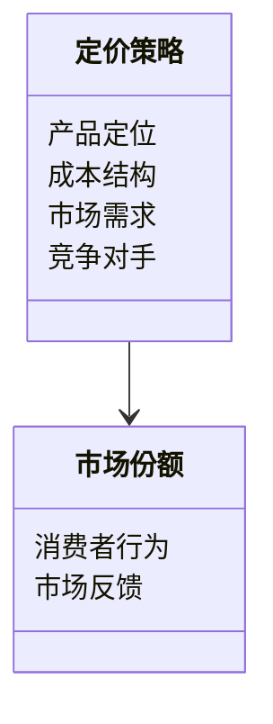
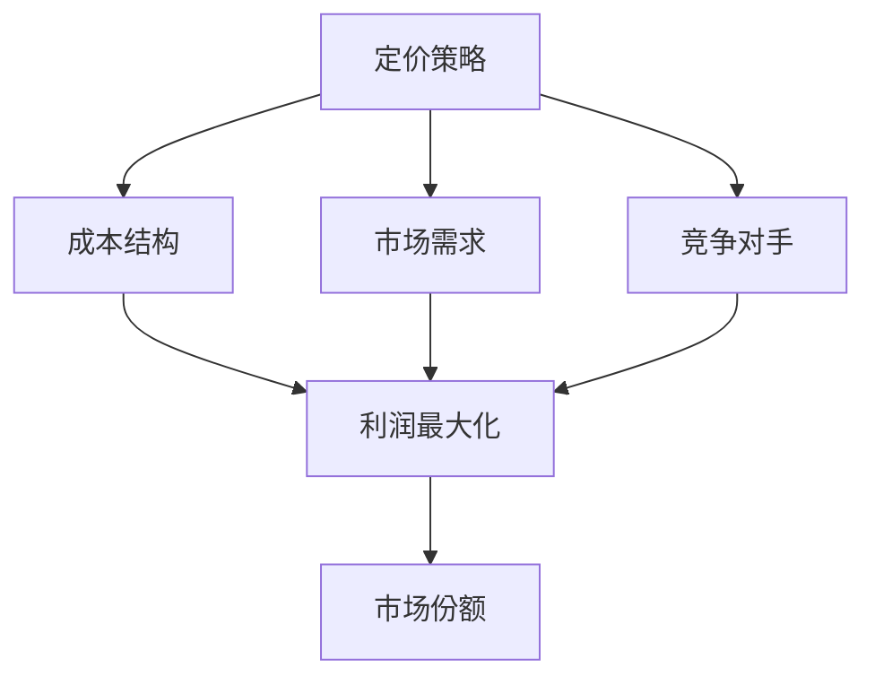

                 

# 彼得林奇如何分析公司的定价策略对市场份额的影响

## 关键词：
- 定价策略
- 彼得林奇
- 市场份额
- 投资分析
- 竞争策略

## 摘要：
本文通过分析彼得林奇的投资哲学，探讨定价策略如何影响公司的市场份额。从定价策略的基本概念、数学模型到实际案例分析，详细解析彼得林奇的分析框架和实战应用，为投资者和企业管理者提供深度见解。

---

# 第一部分: 定价策略与市场份额基础

## 第1章: 定价策略的基本概念

### 1.1 定价策略的定义与分类
#### 1.1.1 定价策略的定义
定价策略是企业在市场中确定产品或服务价格的过程，旨在实现利润最大化、市场份额增长或其他商业目标。

#### 1.1.2 定价策略的主要分类
1. 成本导向定价：基于成本加成定价，确保覆盖成本并获得合理利润。
2. 需求导向定价：根据市场需求和消费者价格敏感性制定价格。
3. 竞争导向定价：以竞争对手的定价为基础，调整自身价格策略。

#### 1.1.3 不同市场环境下的定价策略
- **完全竞争市场**：价格接近市场均衡价格。
- **垄断市场**：价格由企业主导，追求最大化利润。
- **寡头市场**：价格受少数竞争者影响，可能通过价格战或合作定价。

### 1.2 彼得林奇投资策略概述
#### 1.2.1 彼得林奇的投资者哲学
彼得林奇强调长期投资和基本面分析，注重企业的定价策略、市场份额和成本结构。

#### 1.2.2 彼得林奇对定价策略的关注点
1. 价格与成本的关系。
2. 价格对市场需求的影响。
3. 价格策略对竞争对手的反应。

#### 1.2.3 定价策略在投资分析中的重要性
定价策略直接关系到企业的盈利能力、市场份额和竞争优势。

## 第2章: 市场份额的影响因素

### 2.1 市场份额的定义与计算
#### 2.1.1 市场份额的定义
市场份额是企业在特定市场中销售产品或服务的总量占整个市场的比例。

#### 2.1.2 市场份额的计算方法
$$ 市场份额 = \frac{\text{企业销售量}}{\text{市场总销售量}} \times 100\% $$

#### 2.1.3 市场份额的影响因素
- 产品价格
- 品牌影响力
- 产品质量
- 市场推广

### 2.2 定价策略对市场份额的影响
#### 2.2.1 价格敏感性与市场份额的关系
价格敏感性高的产品，消费者对价格变动更敏感，影响市场份额较大。

#### 2.2.2 定价策略对竞争对手的影响
合理定价可以削弱竞争对手的市场份额，提升自身竞争力。

#### 2.2.3 定价策略对消费者行为的影响
低价策略可能吸引价格敏感的消费者，而高价策略则吸引高端消费者。

## 第3章: 彼得林奇的定价策略分析框架

### 3.1 定价策略分析的核心要素
#### 3.1.1 产品定位
明确产品的目标市场和消费者需求。

#### 3.1.2 成本结构
分析企业的固定成本和变动成本，确保定价覆盖成本。

#### 3.1.3 市场需求
研究市场对产品的需求弹性，制定相应的价格策略。

#### 3.1.4 竞争格局
分析竞争对手的定价策略，制定差异化的定价策略。

### 3.2 彼得林奇定价策略的分析步骤
#### 3.2.1 确定目标市场
明确企业的目标客户群体和市场定位。

#### 3.2.2 分析竞争对手的定价策略
研究竞争对手的价格策略，找到市场空隙。

#### 3.2.3 评估自身产品的定价潜力
基于成本和需求分析，评估产品的定价空间。

#### 3.2.4 制定定价策略并实施
根据分析结果，制定并实施定价策略，持续监测和调整。

---

# 第二部分: 定价策略的数学模型与分析方法

## 第4章: 定价策略的数学模型

### 4.1 需求函数与价格弹性
#### 4.1.1 需求函数的定义
需求函数描述价格与需求量之间的关系，通常表示为：
$$ Q = f(P) $$

#### 4.1.2 价格弹性的计算公式
$$ 需求弹性 = \frac{\% \Delta Q}{\% \Delta P} $$

### 4.2 利润最大化模型
#### 4.2.1 利润最大化的基本公式
利润 = 收入 - 成本，即：
$$ 利润 = P \times Q - C $$

### 4.3 边际成本与边际收益分析
#### 4.3.1 边际成本的计算
边际成本是每增加一单位产品生产的额外成本。

#### 4.3.2 边际收益的计算
边际收益是每增加一单位产品销售带来的额外收入。

#### 4.3.3 利润最大化点的确定
当边际成本等于边际收益时，企业达到利润最大化。

---

## 第5章: 定价策略的系统分析与架构设计

### 5.1 系统分析方法
#### 5.1.1 问题场景介绍
通过分析企业定价策略对市场份额的影响，构建系统模型。

#### 5.1.2 领域模型Mermaid类图

### 5.2 系统架构设计
#### 5.2.1 系统架构Mermaid

---

# 第三部分: 定价策略的实际应用与案例分析

## 第6章: 定价策略的实际应用

### 6.1 项目实战
#### 6.1.1 环境安装
选择一个行业，分析企业的定价策略。

#### 6.1.2 核心实现
根据彼得林奇的分析框架，制定定价策略并实施。

#### 6.1.3 代码实现
编写分析工具，计算价格弹性、利润最大化点等。

#### 6.1.4 应用解读
通过数据分析，评估定价策略对市场份额的影响。

## 第7章: 案例分析

### 7.1 案例背景
分析一家企业的定价策略，评估其对市场份额的影响。

### 7.2 案例分析
通过数学模型和系统架构，详细分析定价策略的具体实施和效果。

### 7.3 案例总结
总结定价策略对市场份额的影响，提出改进建议。

---

# 第四部分: 总结与展望

## 第8章: 总结

### 8.1 核心观点回顾
- 定价策略是影响市场份额的关键因素。
- 彼得林奇的分析框架提供了有效的定价策略评估方法。

### 8.2 实战经验总结
- 数据分析是定价策略优化的重要工具。
- 持续监测和调整定价策略是确保市场份额稳定的关键。

## 第9章: 未来展望

### 9.1 数字化定价的趋势
随着大数据和人工智能的发展，定价策略将更加动态化和个性化。

### 9.2 技术进步对定价策略的影响
新技术将为企业提供更精准的定价模型和实时调整能力。

### 9.3 投资者视角的未来挑战
投资者需要更深入地理解定价策略的复杂性，以做出更明智的投资决策。

---

# 结语

本文通过分析彼得林奇的定价策略，结合数学模型和实际案例，为投资者和企业管理者提供了深入的定价策略分析框架。未来，随着技术的进步，定价策略将更加智能化，为企业创造更大的价值。

---

通过以上详细的内容规划，您可以开始撰写具体的章节内容，确保每个部分都涵盖背景介绍、核心概念、算法原理、数学模型、系统分析、项目实战以及最佳实践等内容。

