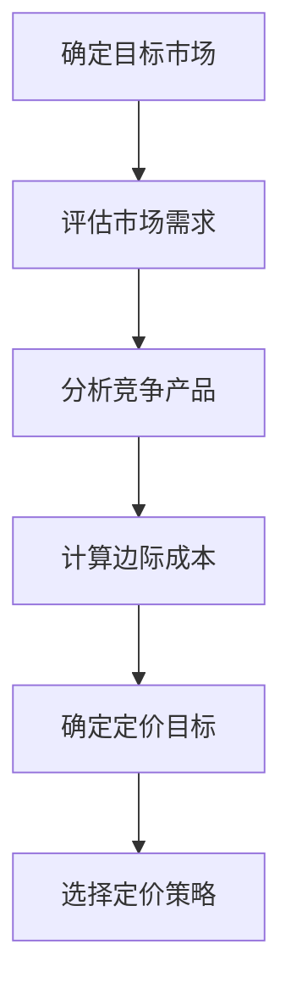

                 

# 彼得林奇如何分析公司的定价策略演变

> 关键词：彼得林奇，定价策略，定价模型，投资分析，市场策略，成本加成定价

> 摘要：本文将深入分析彼得林奇如何从投资者的角度审视公司的定价策略演变过程。通过探讨定价策略的核心概念、分析框架、数学模型以及实际案例，揭示定价策略如何影响企业利润和投资决策。本文将结合彼得林奇的投资理念，详细阐述定价策略的驱动因素、实施步骤以及优化方法，为读者提供一个全面的视角来理解定价策略的演变过程。

---

## 第1章: 彼得林奇与定价策略概述

### 1.1 彼得林奇的背景与投资理念
#### 1.1.1 彼得林奇的生平简介
彼得·林奇（Peter Lynch）是美国著名的投资专家，曾管理富达麦哲伦基金，创造了年均29%的投资回报率。他的投资理念强调深入研究公司基本面，尤其是定价策略和盈利能力。

#### 1.1.2 彼得林奇的投资哲学
彼得林奇认为，成功的投资依赖于对公司的深入了解，包括产品定价、成本结构、市场需求和竞争环境。他强调通过分析定价策略来评估公司的竞争优势和盈利能力。

#### 1.1.3 彼得林奇分析定价策略的核心思想
彼得林奇认为，定价策略是公司盈利能力的关键因素。他通过分析定价策略的合理性、灵活性和可持续性，判断公司是否具有长期竞争优势。

### 1.2 定价策略的核心概念
#### 1.2.1 定价策略的定义
定价策略是公司根据市场环境、成本结构和竞争状况，制定产品或服务的价格以实现最大利润的策略。

#### 1.2.2 定价策略的分类
- 成本加成定价
- 市场导向定价
- 价值定价
- 战略定价

#### 1.2.3 定价策略的影响因素
- 成本结构
- 市场需求
- 竞争环境
- 产品生命周期

#### 1.2.4 定价策略与企业利润的关系
定价策略直接影响企业的销售收入和利润率。合理的定价策略能够提高市场份额和盈利能力，而不当的定价策略可能导致亏损或竞争力下降。

### 1.3 定价策略的演变过程
#### 1.3.1 传统定价策略的局限性
传统定价策略往往忽视市场需求的变化和竞争环境的动态，导致企业在市场波动中难以适应。

#### 1.3.2 现代定价策略的创新
现代定价策略更加注重动态调整和数据驱动，例如基于需求弹性的定价、差异化定价和动态调整定价。

#### 1.3.3 定价策略演变的驱动力
- 技术进步：数据分析和人工智能的应用使定价策略更加精准。
- 市场变化：消费者行为的变化和市场竞争的加剧推动定价策略的创新。
- 经济环境：通货膨胀、经济衰退等外部因素要求定价策略更具灵活性。

---

## 第2章: 定价策略的核心原理

### 2.1 定价模型与工具
#### 2.1.1 成本加成定价法
成本加成定价法是基于产品成本加上一定比例的加成来确定价格。公式如下：
$$ \text{价格} = \text{成本} \times (1 + \text{加成率}) $$

#### 2.1.2 市场需求定价法
市场需求定价法是根据市场需求弹性确定价格。公式如下：
$$ \text{价格} = \text{边际成本} \times \text{需求弹性} $$

#### 2.1.3 价值定价法
价值定价法是基于产品或服务的 perceived value 来确定价格。公式如下：
$$ \text{价格} = \text{成本} + \text{附加价值} $$

#### 2.1.4 战略定价法
战略定价法是基于企业长期战略目标，例如市场占有率或品牌形象。

### 2.2 定价策略的数学模型
#### 2.2.1 成本加成定价模型
$$ \text{价格} = \text{成本} \times (1 + \text{加成率}) $$

#### 2.2.2 需求弹性定价模型
$$ \text{价格} = \text{边际成本} \times \text{需求弹性} $$

#### 2.2.3 价值定价模型
$$ \text{价格} = \text{成本} + \text{附加价值} $$

### 2.3 定价策略的决策流程

---

## 第3章: 彼得林奇定价策略分析框架

### 3.1 定价策略的驱动因素
#### 3.1.1 成本结构
- 固定成本：如厂房、设备等。
- 变动成本：如原材料、人工等。
- 成本加成定价法：$$ \text{价格} = \text{成本} \times (1 + \text{加成率}) $$

#### 3.1.2 市场需求
- 需求弹性：$$ \text{需求弹性} = \frac{\% \Delta \text{需求}}{\% \Delta \text{价格}} $$
- 市场容量：指市场的潜在需求和市场规模。

#### 3.1.3 竞争环境
- 竞争对手的定价策略。
- 市场占有率：$$ \text{市场占有率} = \frac{\text{公司销量}}{\text{市场总量}} $$

#### 3.1.4 产品生命周期
- 产品生命周期的各个阶段对定价策略的影响。

### 3.2 定价策略的实施步骤
#### 3.2.1 确定目标市场
- 确定目标市场的规模、需求和竞争状况。
- 使用 **需求弹性** 模型分析目标市场的价格敏感性。

#### 3.2.2 分析竞争对手
- 收集竞争对手的价格、市场份额和成本结构。
- 使用 **成本加成定价法** 评估竞争对手的定价策略。

#### 3.2.3 评估市场需求
- 使用 **需求弹性** 模型预测价格变化对需求的影响。
- 分析市场需求的季节性波动。

#### 3.2.4 制定价格策略
- 确定价格水平：$$ \text{价格} = \text{成本} \times (1 + \text{加成率}) $$
- 考虑附加价值：$$ \text{价格} = \text{成本} + \text{附加价值} $$

#### 3.2.5 实施与监控
- 定期监控定价策略的执行效果。
- 根据市场反馈调整定价策略。

---

## 第4章: 彼得林奇定价策略分析方法

### 4.1 定价策略的评估与优化
#### 4.1.1 定价策略的有效性评估
- 利润率：$$ \text{利润率} = \frac{\text{利润}}{\text{收入}} $$
- 市场占有率：$$ \text{市场占有率} = \frac{\text{公司销量}}{\text{市场总量}} $$

#### 4.1.2 定价策略的优化方法
- 动态调整定价：根据市场需求和竞争环境的变化调整价格。
- 差异化定价：针对不同市场或客户群体制定不同的价格策略。

### 4.2 定价策略的数学模型
#### 4.2.1 成本加成定价模型
$$ \text{价格} = \text{成本} \times (1 + \text{加成率}) $$

#### 4.2.2 价值定价模型
$$ \text{价格} = \text{成本} + \text{附加价值} $$

#### 4.2.3 需求弹性定价模型
$$ \text{价格} = \text{边际成本} \times \text{需求弹性} $$

### 4.3 定价策略的实施步骤
#### 4.3.1 确定目标市场
- 使用 **需求弹性** 模型分析目标市场的价格敏感性。

#### 4.3.2 分析竞争对手
- 收集竞争对手的定价策略和市场份额。

#### 4.3.3 评估市场需求
- 分析市场需求的季节性波动。

#### 4.3.4 制定价格策略
- 确定价格水平：$$ \text{价格} = \text{成本} \times (1 + \text{加成率}) $$

#### 4.3.5 实施与监控
- 定期监控定价策略的执行效果。

---

## 第5章: 彼得林奇定价策略分析的案例

### 5.1 微软的定价策略演变
#### 5.1.1 微软的定价策略背景
- 微软的主要产品包括操作系统、办公软件和云计算服务。

#### 5.1.2 微软的定价策略分析
- 使用 **成本加成定价法** 制定软件产品的价格。
- 动态调整云计算服务的定价策略以应对市场竞争。

#### 5.1.3 微软的定价策略演变
- 从固定定价到动态定价的转变。
- 云计算服务的差异化定价策略。

### 5.2 苹果的定价策略分析
#### 5.2.1 苹果的定价策略背景
- 苹果的主要产品包括iPhone、iPad、Mac和Apple Watch。

#### 5.2.2 苹果的定价策略分析
- 使用 **价值定价法** 突出产品的高端定位。
- 动态调整产品线的价格以覆盖不同市场。

#### 5.2.3 苹果的定价策略演变
- 从单一价格策略到差异化定价策略的转变。
- 基于产品生命周期的定价策略调整。

### 5.3 亚马逊的定价策略分析
#### 5.3.1 亚马逊的定价策略背景
- 亚马逊的主要业务包括电子商务、云计算和数字内容。

#### 5.3.2 亚马逊的定价策略分析
- 使用 **成本加成定价法** 制定电子商务产品的价格。
- 动态调整云计算服务的定价策略以应对市场竞争。

#### 5.3.3 亚马逊的定价策略演变
- 从固定定价到动态定价的转变。
- 基于市场需求弹性的定价策略调整。

---

## 第6章: 彼得林奇定价策略分析的实战应用

### 6.1 定价策略的实施步骤
#### 6.1.1 确定目标市场
- 使用 **需求弹性** 模型分析目标市场的价格敏感性。

#### 6.1.2 分析竞争对手
- 收集竞争对手的定价策略和市场份额。

#### 6.1.3 评估市场需求
- 分析市场需求的季节性波动。

#### 6.1.4 制定价格策略
- 确定价格水平：$$ \text{价格} = \text{成本} \times (1 + \text{加成率}) $$

#### 6.1.5 实施与监控
- 定期监控定价策略的执行效果。

### 6.2 定价策略的优化方法
#### 6.2.1 动态调整定价
- 根据市场需求和竞争环境的变化调整价格。

#### 6.2.2 差异化定价
- 针对不同市场或客户群体制定不同的价格策略。

#### 6.2.3 数据驱动定价
- 使用数据分析工具预测价格变化对需求的影响。

### 6.3 定价策略的数学模型
#### 6.3.1 成本加成定价模型
$$ \text{价格} = \text{成本} \times (1 + \text{加成率}) $$

#### 6.3.2 价值定价模型
$$ \text{价格} = \text{成本} + \text{附加价值} $$

#### 6.3.3 需求弹性定价模型
$$ \text{价格} = \text{边际成本} \times \text{需求弹性} $$

---

## 第7章: 定价策略分析的未来趋势

### 7.1 定价策略的未来挑战
#### 7.1.1 技术进步对定价策略的影响
- 人工智能和大数据技术的应用使定价策略更加精准和动态。

#### 7.1.2 市场环境的不确定性
- 经济波动、政策变化和全球化的挑战。

#### 7.1.3 竞争环境的加剧
- 行业内的价格战和差异化竞争。

### 7.2 定价策略的未来机会
#### 7.2.1 数据驱动定价
- 使用大数据分析和人工智能技术优化定价策略。

#### 7.2.2 智能定价
- 基于实时数据和动态需求调整价格。

#### 7.2.3 可持续定价
- 考虑环境和社会因素的定价策略。

### 7.3 定价策略的总结与展望
彼得林奇的定价策略分析方法为投资者提供了重要的视角。未来，随着技术进步和市场环境的变化，定价策略将更加复杂和动态化，投资者需要不断学习和适应新的定价策略。

---

## 总结

彼得林奇的定价策略分析方法为投资者提供了重要的视角。通过深入分析定价策略的核心概念、数学模型和实际案例，我们可以更好地理解定价策略如何影响企业利润和投资决策。未来，随着技术进步和市场环境的变化，定价策略将更加复杂和动态化，投资者需要不断学习和适应新的定价策略。

---

通过以上思考步骤，我们逐步构建了一个完整的定价策略分析框架，并结合彼得林奇的分析方法和实际案例，为读者提供了一个全面的视角来理解定价策略的演变过程。

