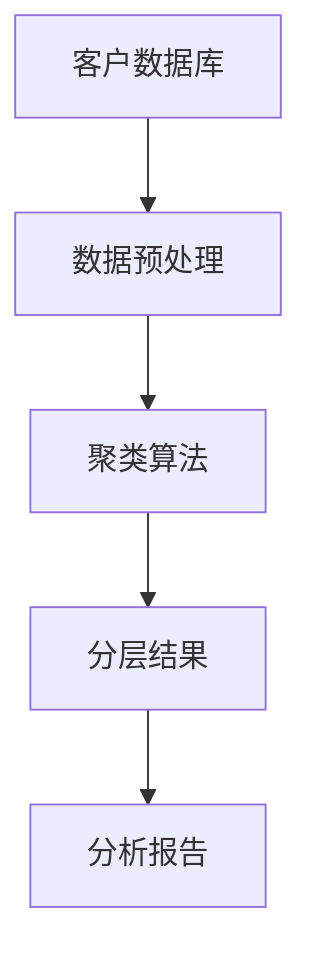

                 


# 彼得林奇如何分析公司的客户分层策略

## 关键词：客户分层、彼得林奇、投资策略、聚类分析、系统架构

## 摘要：本文深入分析了彼得林奇的投资理念，特别是他在分析公司客户分层策略中的独特方法。通过介绍客户分层的基本概念、数学模型、系统架构设计和实战案例，详细阐述了如何将客户分层策略应用于实际投资分析中。文章还提供了具体的Python代码示例和数学公式，帮助读者更好地理解和实施客户分层策略。

---

## 第一部分：客户分层策略的背景与概念

### 第1章：客户分层策略的定义与重要性

#### 1.1 客户分层策略的定义

客户分层策略是指将客户按照某些共同特征（如行为、需求、价值等）进行分类，以便企业更好地了解客户需求，优化资源配置，提升客户满意度和忠诚度。这种策略能够帮助企业针对不同客户群体制定个性化的服务和营销策略，从而提高市场竞争力。

#### 1.2 客户分层策略的重要性

1. **提高客户满意度**：通过分层，企业能够识别高价值客户，优先满足其需求，提升客户满意度。
2. **优化资源配置**：将资源集中投入到高价值客户群体，提高投资回报率。
3. **提升企业竞争力**：通过精准定位客户群体，制定更有针对性的市场策略，增强竞争优势。

---

## 第二部分：彼得林奇的客户分层分析方法

### 第2章：彼得林奇的客户分层理念

#### 2.1 彼得林奇的基本投资理念

彼得·林奇是全球著名投资专家，他强调长期投资、价值投资和基本面分析。他认为，成功的投资需要深入分析企业的基本面，包括财务状况、市场地位、管理团队等因素。

#### 2.2 彼得林奇的客户分层分析方法

彼得林奇在分析公司时，会将客户分为不同的层级，例如按收入、消费习惯、地理位置等特征进行分类。这种分类方法帮助他更好地评估公司的市场定位和潜力。

#### 2.3 客户分层的核心要素

- **客户特征**：收入水平、消费习惯、地理位置等。
- **客户价值**：客户生命周期价值、利润率等。
- **客户行为**：购买频率、渠道偏好等。

---

## 第三部分：客户分层策略的数学模型与算法

### 第3章：客户分层的数学模型

#### 3.1 客户分层的数学模型

客户分层通常采用聚类分析，尤其是K-means聚类算法。以下是其数学模型：

- **目标**：将客户数据分成K个簇，使簇内数据点的相似性最大化。
- **算法步骤**：
  1. 随机选择K个初始质心。
  2. 计算每个数据点到质心的距离，分配到最近的簇。
  3. 重新计算各簇的质心。
  4. 重复步骤2和3，直到质心不再变化或达到最大迭代次数。

#### 3.2 客户分层的算法实现

以下是K-means聚类算法的Python实现示例：

```python
from sklearn.cluster import KMeans
from sklearn.preprocessing import StandardScaler

# 示例数据
data = [[5, 2], [3, 7], [8, 1], [1, 5], [2, 4]]

# 数据标准化
scaler = StandardScaler()
data_scaled = scaler.fit_transform(data)

# K-means聚类
kmeans = KMeans(n_clusters=2, random_state=0)
clusters = kmeans.fit_predict(data_scaled)

print(clusters)
```

---

## 第四部分：客户分层策略的系统分析与架构设计

### 第4章：客户分层系统的架构设计

#### 4.1 系统功能设计

- **数据采集模块**：收集客户信息，如购买记录、 demographics等。
- **数据预处理模块**：清洗和标准化数据。
- **分层算法模块**：应用聚类算法进行客户分层。
- **结果分析模块**：生成分层报告，评估分层效果。

#### 4.2 系统架构设计

以下是系统的架构图：



---

## 第五部分：客户分层策略的项目实战

### 第5章：客户分层策略的实战案例

#### 5.1 项目背景与目标

某零售企业希望通过客户分层策略，优化营销策略，提升销售额。目标是将客户分为高价值、中价值和低价值三类，并针对不同客户制定不同的营销策略。

#### 5.2 项目实施过程

1. **数据采集**：收集客户购买记录、 demographics等数据。
2. **数据预处理**：清洗数据，标准化特征。
3. **算法实现**：使用K-means聚类算法进行客户分层。
4. **结果分析**：生成分层报告，评估分层效果。

---

## 第六部分：客户分层策略的最佳实践与总结

### 第6章：客户分层策略的总结

#### 6.1 最佳实践

- **数据质量**：确保数据的完整性和准确性。
- **算法选择**：根据具体需求选择合适的聚类算法。
- **业务理解**：深入理解业务场景，确保分层结果符合实际需求。

#### 6.2 小结

客户分层策略是企业优化资源配置、提升竞争力的重要手段。通过彼得林奇的投资理念和数学模型的结合，企业可以更精准地分析客户，制定有效的营销策略。

#### 6.3 注意事项

- 定期更新客户分层，以反映市场变化。
- 结合其他分析方法（如回归分析）进行验证。

#### 6.4 拓展阅读

- 《投资学基础》
- 《数据挖掘导论》

---

通过以上步骤，您可以系统地了解并实施客户分层策略。希望本文对您有所帮助！

