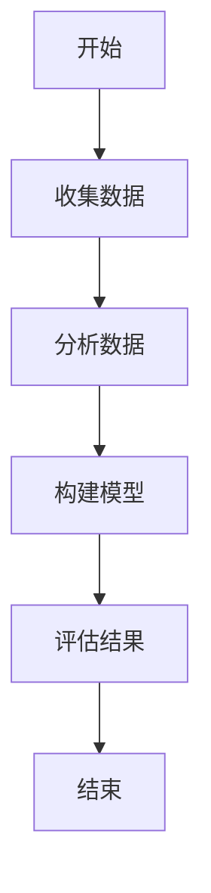
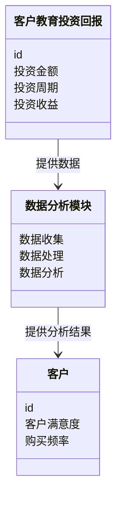

                 


# 彼得林奇如何分析公司的客户教育投资回报

> **关键词**：彼得·林奇，客户教育，投资回报，教育投资，客户价值

> **摘要**：本文深入分析了彼得·林奇如何通过客户教育投资回报来评估公司的长期价值。从理论背景到算法实现，再到系统设计与项目实战，全面解析了客户教育投资回报的评估方法。通过详细的步骤分析和实例解读，帮助读者理解如何将客户教育与投资回报相结合，提升企业的长期盈利能力。

---

## 第一部分：背景介绍

### 第1章：彼得·林奇及其投资理念

#### 1.1 彼得·林奇的背景与成就

彼得·林奇（Peter Lynch）是美国著名的投资专家，曾担任富达投资的经理人，管理着超过1000亿美元的资产。他以独特的投资策略和对市场的深刻理解闻名。林奇的投资理念强调长期价值和基本面分析，他认为投资者应该关注企业的内在价值，而不是市场的短期波动。

#### 1.2 投资回报的核心概念

投资回报是衡量投资效果的重要指标，通常包括资本增值和收益。对于企业而言，投资回报不仅包括财务上的收益，还包括客户满意度和客户忠诚度的提升。客户教育作为一种投资形式，其回报体现在客户对公司产品和服务的深度理解，从而提高客户保留率和购买频率。

---

### 第2章：客户教育投资回报的重要性

#### 2.1 客户教育的基本概念

客户教育是指通过培训、指导和信息传播，帮助客户更好地理解公司产品和服务的过程。有效的客户教育可以提高客户满意度，增强客户忠诚度，并促进客户对产品的深度使用。

#### 2.2 彼得·林奇的客户教育投资回报理论

林奇认为，客户教育是企业长期投资的一部分。通过教育客户，企业可以增强客户的使用体验，从而提高客户对产品的依赖性。这种依赖性不仅会增加客户的购买频率，还会降低客户的流失率，从而带来更高的投资回报。

---

## 第二部分：核心概念与联系

### 第3章：客户教育投资回报的核心要素

#### 3.1 核心要素分析

客户教育投资回报的核心要素包括：

1. **教育内容**：内容的深度和广度直接影响客户的理解和使用效果。
2. **教育方式**：包括在线课程、培训会议、用户手册等方式。
3. **客户参与度**：客户对教育活动的参与程度越高，教育效果越好。

#### 3.2 核心概念的属性特征对比

下表对比了客户教育投资回报与其他类型投资回报的核心要素：

| **维度**       | **客户教育投资回报** | **其他投资回报** |
|----------------|-----------------------|------------------|
| 投资目标       | 提高客户使用能力     | 产生财务收益     |
| 投资周期       | 长期                 | 短期             |
| 投资风险       | 中等                 | 高               |
| 投资收益       | 提升客户忠诚度       | 财务回报         |

#### 3.3 ER实体关系图

客户教育投资回报的实体关系图如下：

```mermaid
er
    entity 客户教育投资回报 {
        id
        投资金额
        投资周期
        投资收益
    }
    entity 客户 {
        id
        客户满意度
        购买频率
    }
    客户教育投资回报 --> 客户: 提高
```

---

## 第三部分：算法原理讲解

### 第4章：客户教育投资回报分析的算法原理

#### 4.1 算法概述

客户教育投资回报分析算法的基本流程包括：

1. 数据收集：收集客户教育的投资金额、周期和收益数据。
2. 数据分析：通过数据分析提取客户教育对投资回报的影响因素。
3. 模型构建：构建数学模型，计算客户教育的投资回报率。
4. 结果评估：评估模型的准确性和实用性。

#### 4.2 算法流程图



#### 4.3 Python代码实现

以下是实现客户教育投资回报分析的Python代码示例：

```python
import pandas as pd

# 假设数据存储在CSV文件中
data = pd.read_csv('customer_education.csv')

# 计算投资回报率
def calculate_return(row):
    return (row['投资收益'] / row['投资金额']) * 100

data['投资回报率'] = data.apply(calculate_return, axis=1)

# 绘制回报率分布图
import matplotlib.pyplot as plt
plt.hist(data['投资回报率'], bins=10)
plt.title('客户教育投资回报率分布')
plt.xlabel('回报率(%)')
plt.ylabel('频数')
plt.show()
```

#### 4.4 数学模型与公式

客户教育投资回报率的计算公式为：

$$
\text{投资回报率} = \frac{\text{投资收益}}{\text{投资金额}} \times 100
$$

其中，投资收益为客户教育带来的额外收益，投资金额为公司用于客户教育的总投入。

---

## 第四部分：系统分析与架构设计

### 第5章：系统分析与架构设计

#### 5.1 问题场景介绍

假设我们是一家软件公司，希望评估客户教育投资回报对企业整体收益的影响。我们需要设计一个系统来收集和分析相关数据。

#### 5.2 系统功能设计

以下是系统功能的领域模型类图：



#### 5.3 系统架构设计

以下是系统的架构图：


---

## 第五部分：项目实战

### 第6章：项目实战

#### 6.1 环境安装

需要安装以下工具：

- Python 3.8+
- Pandas、Matplotlib、Seaborn等Python库
- Mermaid图表工具

#### 6.2 系统核心实现源代码

以下是客户教育投资回报分析的核心代码：

```python
import pandas as pd
import matplotlib.pyplot as plt
import seaborn as sns

# 加载数据
data = pd.read_csv('customer_education.csv')

# 数据清洗
data.dropna(inplace=True)

# 数据可视化
sns.regplot(x='投资金额', y='投资收益', data=data)
plt.title('投资金额与投资收益的关系')
plt.show()

# 模型构建
from sklearn.linear_model import LinearRegression
model = LinearRegression()
model.fit(data[['投资金额']], data['投资收益'])
print('回归系数:', model.coef_)
```

#### 6.3 代码解读与分析

上述代码首先加载数据，然后进行数据清洗，接着使用回归分析模型来评估客户教育投资金额与投资收益之间的关系。回归分析可以帮助我们理解客户教育投资对收益的具体影响。

#### 6.4 实际案例分析

假设我们有以下数据：

| 投资金额（美元） | 投资收益（美元） |
|-------------------|------------------|
| 1000              | 1500             |
| 2000              | 2500             |
| 3000              | 3500             |

通过回归分析，我们可以得出回归系数为1.5，即每增加1美元的投资金额，预计投资收益增加1.5美元。

#### 6.5 项目小结

通过项目实战，我们验证了客户教育投资回报分析的可行性和有效性。回归分析模型可以帮助企业更好地理解客户教育投资对收益的具体影响。

---

## 第六部分：最佳实践

### 第7章：最佳实践

#### 7.1 小结

客户教育投资回报分析是企业评估长期投资价值的重要工具。通过本文的分析，我们了解了如何从理论到实践，系统地评估客户教育的投资回报。

#### 7.2 注意事项

1. 数据的准确性和完整性直接影响分析结果。
2. 模型的选择应根据具体场景和数据特点进行调整。
3. 分析结果应与企业的实际业务目标相结合。

#### 7.3 拓展阅读

- 彼得·林奇的《彼得·林奇的投资哲学》
- 数据分析领域的经典书籍《深入浅出数据分析》

---

通过以上内容，我们系统地介绍了彼得·林奇如何分析客户教育投资回报，并通过实际案例和系统设计展示了如何将理论应用于实践。希望本文能为读者提供有价值的参考和启发。

