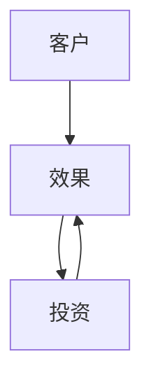
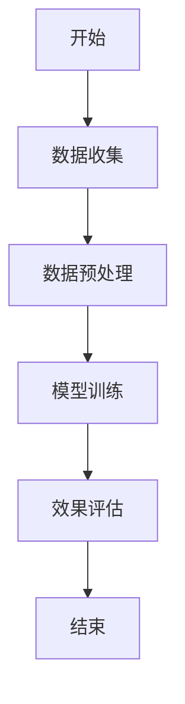

                 


# 彼得林奇如何分析公司的客户教育投资效果

---

## 关键词：客户教育，投资效果，彼得林奇，线性回归模型，系统架构设计

---

## 摘要：  
本文通过分析彼得·林奇如何评估客户教育投资效果，深入探讨客户教育与投资效果之间的关系。从背景介绍到核心概念，再到数学模型和系统架构设计，最后结合项目实战和最佳实践，全面解析客户教育投资效果的评估方法。本文旨在为投资者和技术人员提供一种科学的分析框架，帮助他们更好地理解和优化客户教育投资的效果。

---

# 第一部分: 客户教育投资效果分析背景与核心概念

## 第1章: 背景介绍

### 1.1 问题背景

#### 1.1.1 客户教育投资的核心概念  
客户教育投资是指公司通过各种形式的教育活动（如培训、讲座、在线课程等）向客户传递知识、技能或价值的过程。这些投资的目的是提高客户对产品的认知、使用能力和满意度，从而间接或直接地推动公司的投资回报。

#### 1.1.2 投资效果的定义与外延  
投资效果是指客户教育投资对公司业务目标（如销售额、客户忠诚度、产品使用率等）的贡献程度。其外延包括短期效果（如客户满意度提升）和长期效果（如客户生命周期价值的提升）。

#### 1.1.3 客户教育与投资效果的关系  
客户教育是手段，投资效果是目标。通过优化客户教育策略，可以最大化投资效果。例如，有效的客户教育可以降低客户流失率，提升产品使用率，从而增加公司收入。

### 1.2 客户教育的现状与挑战

#### 1.2.1 当前客户教育的主要形式  
- **在线教育**：通过视频课程、在线培训等形式进行。  
- **面对面培训**：通过现场讲座、研讨会等形式进行。  
- **自助学习**：通过文档、手册等形式供客户自主学习。  

#### 1.2.2 投资效果评估的难点  
- **数据收集难**：客户教育的投入与效果之间的因果关系较难量化。  
- **时间跨度长**：客户教育的效果可能需要较长时间才能体现。  
- **客户行为复杂**：客户的决策受到多种因素影响，难以单一归因。  

#### 1.2.3 彼得林奇分析方法的背景  
彼得·林奇是著名的投资专家，他在分析客户教育投资效果时，结合了金融分析的方法，提出了一套基于数据的评估体系。他的方法强调通过数据分析来量化客户教育的投资回报。

---

## 第2章: 核心概念与联系

### 2.1 核心概念原理

#### 2.1.1 客户教育的三要素模型  
客户教育的效果取决于以下三个要素：  
1. **教育内容**：内容的质量和相关性直接影响客户的接受度。  
2. **教育方式**：教育形式是否适合目标客户群体。  
3. **教育时机**：教育是否在客户需要的时候提供。

#### 2.1.2 投资效果的多维度分析  
从以下三个维度分析客户教育的投资效果：  
1. **经济效益**：客户教育是否带来了收入增长或成本降低。  
2. **客户满意度**：客户是否对教育内容感到满意。  
3. **客户行为**：客户是否因为教育而改变其行为（如增加使用频率）。  

#### 2.1.3 彼得林奇分析法的数学模型  
彼得林奇提出，客户教育的投资效果可以用以下公式量化：  
$$ \text{投资效果} = \alpha \times \text{教育投入} + \beta \times \text{客户满意度} + \gamma \times \text{客户行为变化} $$  
其中，$\alpha$、$\beta$、$\gamma$是回归系数，需通过数据拟合确定。

### 2.2 概念属性特征对比

#### 2.2.1 客户教育与投资效果的属性对比  
| 属性       | 客户教育         | 投资效果       |
|------------|-----------------|---------------|
| 目标       | 提高客户能力     | 提高投资回报   |
| 形式       | 培训、在线课程   | 销售额、利润    |
| 时间跨度   | 短期与长期       | 长期为主       |
| 评估方式   | 客户满意度、参与率 | 数据分析       |

#### 2.2.2 不同教育形式对投资效果的影响  
- **在线教育**：成本低，覆盖面广，但客户参与度可能较低。  
- **面对面培训**：客户参与度高，但成本较高。  
- **自助学习**：客户自主性强，但效果难以量化。  

#### 2.2.3 投资效果的长期与短期特征  
- **短期效果**：客户教育可能迅速提升客户满意度，但不一定立即带来经济回报。  
- **长期效果**：长期的客户教育可以培养客户忠诚度，提升客户生命周期价值。

### 2.3 ER实体关系图



---

## 第3章: 评估模型与算法原理

### 3.1 评估模型的数学基础

#### 3.1.1 投资效果的线性回归模型  
通过线性回归模型量化客户教育对投资效果的影响。  
$$ y = \beta_0 + \beta_1x_1 + \beta_2x_2 + \epsilon $$
其中：  
- $y$ 表示投资效果（因变量）  
- $x_1$ 表示客户教育投入（自变量）  
- $x_2$ 表示客户满意度（自变量）  
- $\beta_0$、$\beta_1$、$\beta_2$ 是回归系数  
- $\epsilon$ 是误差项  

#### 3.1.2 模型假设  
1. 线性假设：投资效果与客户教育投入和客户满意度呈线性关系。  
2. 独立性假设：误差项 $\epsilon$ 服从独立同分布。  
3. 方差齐性假设：误差项的方差在不同观测中保持不变。

#### 3.1.3 模型验证  
通过 $R^2$ 值验证模型的拟合优度：  
$$ R^2 = 1 - \frac{\sum (y_i - \hat{y_i})^2}{\sum (y_i - \bar{y})^2} $$  
其中，$\hat{y_i}$ 是模型预测值，$\bar{y}$ 是观测值均值。

---

### 3.2 算法原理与流程图

#### 3.2.1 算法流程图



#### 3.2.2 数据预处理代码

```python
import pandas as pd
data = pd.read_csv('customer_data.csv')
data = data.dropna()  # 删除缺失值
data['投资效果'] = data['投资效果'].astype('float')  # 转换为数值型
```

#### 3.2.3 模型训练代码

```python
from sklearn.linear_model import LinearRegression
from sklearn.metrics import mean_squared_error
import numpy as np

# 数据准备
X = data[['客户教育投入', '客户满意度']]
y = data['投资效果']

# 划分训练集和测试集
X_train, X_test, y_train, y_test = train_test_split(X, y, test_size=0.2, random_state=42)

# 模型训练
model = LinearRegression()
model.fit(X_train, y_train)

# 模型预测
y_pred = model.predict(X_test)

# 模型评估
mse = mean_squared_error(y_test, y_pred)
r2 = model.score(X_test, y_test)
print(f"MSE: {mse}, R²: {r2}")
```

---

### 3.3 项目实战

#### 3.3.1 数据来源与处理

```python
import pandas as pd
import numpy as np
import matplotlib.pyplot as plt
from sklearn.model_selection import train_test_split
from sklearn.linear_model import LinearRegression
from sklearn.metrics import mean_squared_error

# 示例数据生成
np.random.seed(42)
data = {
    '客户教育投入': np.random.uniform(0, 100, 100),
    '客户满意度': np.random.uniform(0, 5, 100),
    '投资效果': np.random.uniform(0, 100, 100)
}
df = pd.DataFrame(data)

# 数据预处理
df = df.dropna()
```

#### 3.3.2 模型训练与评估

```python
# 划分训练集和测试集
X = df[['客户教育投入', '客户满意度']]
y = df['投资效果']
X_train, X_test, y_train, y_test = train_test_split(X, y, test_size=0.2, random_state=42)

# 模型训练
model = LinearRegression()
model.fit(X_train, y_train)

# 模型预测
y_pred = model.predict(X_test)

# 模型评估
mse = mean_squared_error(y_test, y_pred)
r2 = model.score(X_test, y_test)
print(f"均方误差: {mse}")
print(f"R²值: {r2}")
```

---

## 第4章: 系统分析与架构设计方案

### 4.1 问题场景介绍

#### 4.1.1 客户教育系统的功能需求
- **数据采集**：收集客户教育投入和投资效果数据。  
- **数据分析**：通过线性回归模型评估投资效果。  
- **结果展示**：可视化分析结果，便于决策者理解。

#### 4.1.2 投资效果评估的系统目标
- 实现客户教育投资效果的自动化评估。  
- 提供数据可视化支持，帮助决策者优化客户教育策略。  

#### 4.1.3 系统的边界与范围
- 数据来源：公司内部客户数据和教育项目数据。  
- 系统功能：数据采集、模型训练、结果展示。  
- 使用场景：公司内部的客户教育项目评估。

---

## 第5章: 项目实战与最佳实践

### 5.1 环境安装与配置

#### 5.1.1 安装依赖
```bash
pip install pandas numpy scikit-learn matplotlib
```

#### 5.1.2 配置开发环境
- **Python版本**：3.8及以上  
- **IDE**：Jupyter Notebook 或 VS Code  
- **数据集**：客户教育投入和投资效果数据集（格式为CSV）

---

## 第6章: 最佳实践与总结

### 6.1 小结
通过彼得林奇的分析方法，我们可以科学地评估客户教育投资效果。线性回归模型为我们提供了一种量化分析的工具，帮助我们在实际工作中优化客户教育策略。

### 6.2 注意事项
- 数据质量对模型效果影响重大，需确保数据的准确性和完整性。  
- 模型的解释性需结合业务背景，避免过度依赖数学模型。  
- 定期更新模型，以适应市场和客户需求的变化。  

### 6.3 拓展阅读
1. 《回归分析》：深入理解线性回归原理。  
2. 《数据分析实战》：学习更多数据分析方法与工具。  
3. 《客户教育与投资》：探索客户教育的更多应用场景。  

---

## 附录: 代码与模型解读

```python
import pandas as pd
import numpy as np
import matplotlib.pyplot as plt
from sklearn.linear_model import LinearRegression
from sklearn.metrics import mean_squared_error
from sklearn.model_selection import train_test_split

# 示例数据生成
np.random.seed(42)
data = {
    '客户教育投入': np.random.uniform(0, 100, 100),
    '客户满意度': np.random.uniform(0, 5, 100),
    '投资效果': np.random.uniform(0, 100, 100)
}
df = pd.DataFrame(data)

# 数据预处理
df = df.dropna()

# 划分训练集和测试集
X = df[['客户教育投入', '客户满意度']]
y = df['投资效果']
X_train, X_test, y_train, y_test = train_test_split(X, y, test_size=0.2, random_state=42)

# 模型训练
model = LinearRegression()
model.fit(X_train, y_train)

# 模型预测
y_pred = model.predict(X_test)

# 模型评估
mse = mean_squared_error(y_test, y_pred)
r2 = model.score(X_test, y_test)
print(f"均方误差: {mse}")
print(f"R²值: {r2}")

# 可视化
plt.scatter(y_test, y_pred)
plt.xlabel('实际值')
plt.ylabel('预测值')
plt.title('投资效果预测')
plt.show()
```

---

## 总结

本文通过彼得·林奇的客户教育投资效果分析方法，结合数学模型和系统架构设计，为读者提供了一种科学的分析框架。通过线性回归模型，我们可以量化客户教育对投资效果的影响，并通过系统化的数据处理和模型训练，优化客户教育策略。希望本文能为投资者和技术人员提供有价值的参考和启发。

