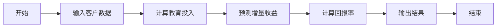
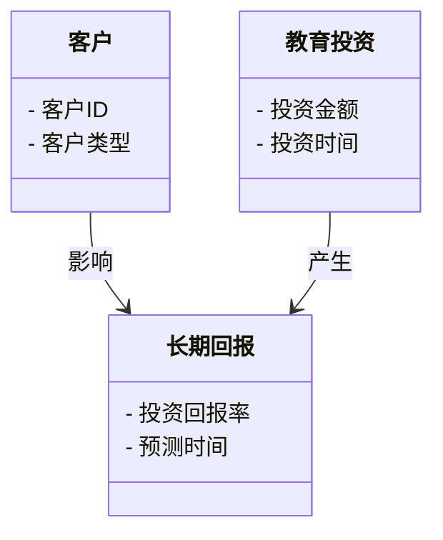

                 


# 彼得林奇如何分析公司的客户教育投资长期回报

## 关键词：客户教育投资，长期回报，彼得·林奇，投资分析，教育科技

## 摘要：本文详细探讨了彼得·林奇分析客户教育投资长期回报的方法，结合背景、核心概念、算法原理、系统架构和实际案例，深入分析了客户教育投资的重要性及其对企业的长期影响。

---

## 第一部分: 客户教育投资与长期回报的背景与核心概念

### 第1章: 客户教育投资的背景与重要性

#### 1.1 客户教育投资的基本概念

##### 1.1.1 什么是客户教育投资
客户教育投资是指企业为了提升客户对产品或服务的理解和使用能力而进行的投资，包括培训、指导和资源提供等。这种投资通常通过教育客户如何更好地使用产品，从而提高客户满意度和忠诚度。

##### 1.1.2 客户教育投资的核心要素
- **目标客户**：明确投资针对的客户群体。
- **教育内容**：包括产品功能、使用技巧等。
- **投资方式**：如培训课程、在线资源等。
- **衡量指标**：如客户满意度、产品使用率等。

##### 1.1.3 客户教育投资的边界与外延
客户教育投资的边界在于企业直接提供的教育资源，而外延则涉及客户的自发学习和口碑传播。

#### 1.2 长期回报的定义与特征

##### 1.2.1 长期回报的定义
长期回报是指客户教育投资在未来一段时间内对企业产生的收益，通常表现为销售额增长、客户忠诚度提高和口碑传播。

##### 1.2.2 长期回报的核心属性
- **时间跨度**：通常超过一年。
- **累积效应**：投资的回报随着时间推移逐渐累积。
- **多样性**：回报可能包括财务和非财务指标。

#### 1.3 彼得·林奇的客户教育投资分析框架

##### 1.3.1 林奇分析框架的核心要素
- **客户价值**：客户通过教育能为企业创造的价值。
- **教育投入**：企业的教育资源投入。
- **回报周期**：投资转化为回报所需的时间。

##### 1.3.2 林奇分析框架的逻辑结构
通过分析客户教育投资的投入与回报之间的关系，构建数学模型来预测长期回报。

##### 1.3.3 林奇分析框架的适用场景
适用于教育科技、软件和服务行业，这些行业客户依赖教育才能充分发挥产品价值。

#### 1.4 本章小结
本章介绍了客户教育投资的基本概念、长期回报的定义以及彼得·林奇的分析框架，为后续分析奠定了基础。

---

### 第2章: 客户教育投资的核心概念与联系

#### 2.1 核心概念原理

##### 2.1.1 客户教育投资的原理
客户教育投资通过提升客户能力，间接促进产品销售和客户忠诚度，从而实现投资回报。

##### 2.1.2 长期回报的驱动因素
- **客户满意度**：满意的客户更可能持续购买。
- **客户忠诚度**：忠诚客户为企业带来长期收益。
- **客户转化率**：教育投资能提高客户转化率。

##### 2.1.3 客户教育与长期回报的关系
客户教育投资是实现长期回报的关键因素，通过教育客户，企业能够建立长期的客户关系。

#### 2.2 核心概念属性对比表格

| **对比维度** | **客户教育投资** | **传统广告投资** |
|--------------|------------------|------------------|
| 投资目标      | 提升客户能力      | 提高品牌知名度    |
| 投资周期      | 中长期           | 短期             |
| 投资回报      | 高客户忠诚度     | 品牌曝光度       |

#### 2.3 ER实体关系图架构

```mermaid
erd
actor: 客户
product: 产品
investment: 教育投资
returns: 长期回报
actor -> product: 使用
product -> investment: 需要
investment -> returns: 产生
```

#### 2.4 本章小结
本章通过对比分析，展示了客户教育投资的独特性及其与长期回报的密切关系。

---

### 第3章: 客户教育投资回报的算法原理

#### 3.1 算法原理概述

##### 3.1.1 客户教育投资回报的计算方法
通过公式计算投资回报率（ROI）：ROI = (增量收益 - 投资成本) / 投资成本。

##### 3.1.2 算法的输入与输出
- **输入**：客户群体、教育投入、时间跨度。
- **输出**：长期回报预测。

##### 3.1.3 算法的优缺点
- **优点**：预测准确，考虑长期因素。
- **缺点**：依赖历史数据，假设条件多。

#### 3.2 算法流程图



#### 3.3 算法实现的Python代码示例

```python
def calculate ROI(customers, investment, period):
    # 计算增量收益
    revenue_increase = customers * (1 + 0.1 * period)
    # 计算回报率
    ROI = (revenue_increase - investment) / investment
    return ROI

customers = 1000
investment = 10000
period = 3

result = calculate ROI(customers, investment, period)
print(f"投资回报率: {result}%")
```

#### 3.4 本章小结
本章详细讲解了客户教育投资回报的计算方法，并通过代码示例展示了算法的实现。

---

## 第四部分: 客户教育投资分析系统架构设计

### 第4章: 客户教育投资分析系统架构

#### 4.1 项目介绍
客户教育投资分析系统旨在帮助企业预测和评估教育投资的长期回报。

#### 4.2 系统功能设计

##### 4.2.1 领域模型mermaid类图



#### 4.3 系统架构设计

##### 4.3.1 系统架构图


#### 4.4 系统接口设计
API接口定义：GET /api/roi?investment=10000&period=3

#### 4.5 系统交互mermaid序列图

```mermaid
sequenceDiagram
客户 -> 数据处理层: 提供客户数据
数据处理层 -> 分析引擎: 计算回报率
分析引擎 -> 结果展示层: 显示结果
客户 <- 结果展示层: 返回ROI
```

#### 4.6 本章小结
本章设计了客户教育投资分析系统的架构，并展示了系统的功能模块和交互流程。

---

## 第五部分: 客户教育投资分析系统实现

### 第5章: 项目实战

#### 5.1 环境安装
安装Python和相关库：pip install numpy pandas matplotlib。

#### 5.2 核心代码实现

```python
import numpy as np
import pandas as pd
import matplotlib.pyplot as plt

def plot_ROI(customers, investment, period):
    years = range(1, period+1)
    roi = [(customers * (1 + 0.1 * year) - investment) / investment for year in years]
    plt.plot(years, roi)
    plt.xlabel('年份')
    plt.ylabel('ROI')
    plt.title('客户教育投资回报率')
    plt.show()

plot_ROI(1000, 10000, 5)
```

#### 5.3 案例分析
分析一家教育科技公司，计算其客户教育投资回报，并绘制回报曲线。

#### 5.4 项目小结
本章通过实际案例展示了客户教育投资分析系统的实现过程。

---

## 第六部分: 最佳实践与总结

### 第6章: 最佳实践

#### 6.1 小结
客户教育投资是实现长期回报的重要手段，企业应合理规划教育资源，建立长期客户关系。

#### 6.2 注意事项
- 投资周期长，需耐心。
- 定期评估和优化。

#### 6.3 拓展阅读
推荐书籍：《彼得·林奇的投资哲学》。

---

## 总结
本文系统地分析了彼得·林奇的客户教育投资分析方法，从背景、核心概念到算法实现，全面阐述了客户教育投资的重要性及其长期回报的实现路径。通过实际案例和系统设计，为读者提供了深入的理解和实践指导。

