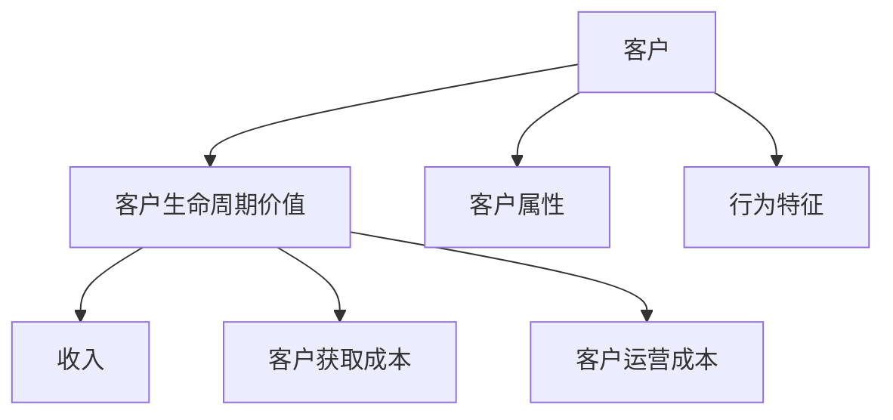
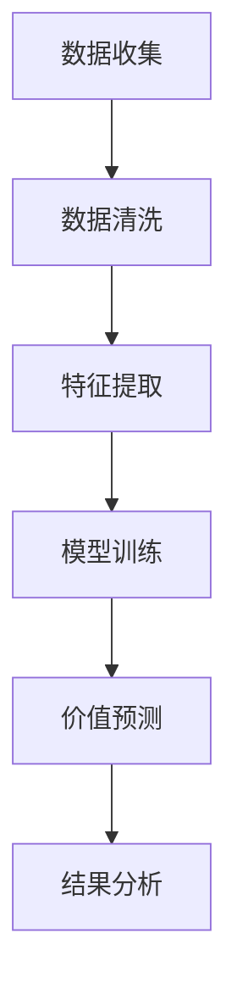
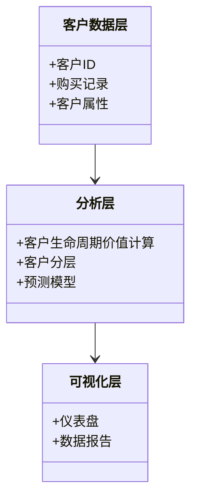
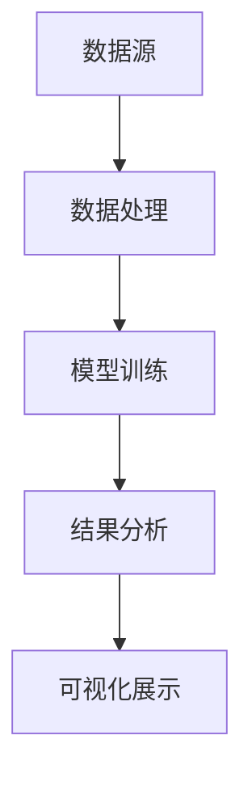
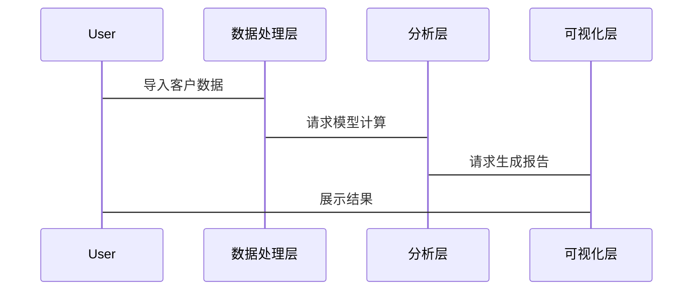

                 


# 彼得林奇如何分析公司的客户生命周期价值

> 关键词：客户生命周期价值，彼得·林奇，客户价值分析，投资策略，价值评估

> 摘要：本文将深入探讨彼得·林奇如何分析公司的客户生命周期价值。通过介绍客户生命周期价值的核心概念，分析其计算方法，并结合实际案例，展示如何将彼得·林奇的投资策略与现代客户价值分析模型相结合。文章将从客户生命周期的基本概念、价值计算模型、系统架构设计、项目实战分析等方面展开，帮助读者全面理解如何从客户生命周期的角度评估公司价值。

---

## 第一章: 客户生命周期价值的核心概念

### 1.1 问题背景与描述

#### 1.1.1 企业客户价值管理的重要性
在现代商业环境中，客户价值管理已成为企业竞争的核心之一。客户生命周期价值（Customer Lifetime Value, CLV）是衡量客户对企业长期贡献的重要指标，帮助企业优化资源分配，制定精准的营销策略。

#### 1.1.2 客户生命周期价值的定义与内涵
客户生命周期价值是指客户在其整个生命周期内为企业带来的净收益，考虑了客户获取、维护和流失的成本。它不仅关注客户的当前价值，还包括客户未来可能为企业创造的收益。

#### 1.1.3 彼得·林奇的客户分析方法
彼得·林奇是著名的投资专家，他强调基本面分析和企业长期价值的评估。他的客户分析方法注重企业的盈利能力和客户质量，而非单纯的客户数量。

### 1.2 问题解决与边界

#### 1.2.1 客户生命周期价值的计算方法
CLV的计算通常采用贴现现金流模型，公式为：

$$ CLV = \frac{R - C}{d} $$

其中，$R$ 是客户带来的边际收入，$C$ 是获取客户的成本，$d$ 是贴现率。

#### 1.2.2 客户生命周期价值的边界与外延
CLV的计算需要考虑客户流失、市场变化等因素，但其边界在于企业对客户的控制能力。企业无法控制外部市场波动，因此CLV的分析应聚焦于企业可控制的变量。

#### 1.2.3 客户生命周期价值的核心要素组成
- **客户属性**：购买频率、客单价、忠诚度。
- **客户行为**：购买时间、渠道、反馈。
- **企业策略**：营销策略、产品策略、服务策略。

---

## 第二章: 客户生命周期价值的核心概念与联系

### 2.1 核心概念原理

#### 2.1.1 客户生命周期价值的计算模型
CLV的计算需要综合考虑客户的当前价值和未来价值。公式如下：

$$ CLV = \sum_{t=1}^{n} \frac{(R_t - C_t)}{(1 + d)^t} $$

其中，$R_t$ 是第 $t$ 年的收入，$C_t$ 是第 $t$ 年的成本，$d$ 是贴现率，$n$ 是客户生命周期的长度。

#### 2.1.2 客户生命周期价值与企业利润的关系
CLV的增加意味着企业利润的提升。通过优化客户生命周期价值，企业可以提高客户忠诚度，降低客户获取成本，从而提升整体盈利能力。

#### 2.1.3 彼得·林奇的客户分析框架
彼得·林奇的客户分析框架强调企业的盈利能力和客户质量。他关注企业的长期增长潜力和客户忠诚度，认为高质量的客户是企业长期价值的核心。

### 2.2 核心概念属性对比

| 属性         | 描述                                   |
|--------------|--------------------------------------|
| 生命周期阶段 | 初期、成长期、成熟期、衰退期、流失期 |
| 价值贡献     | 当前贡献与未来贡献                   |
| 客户特征     | 购买频率、客单价、忠诚度             |
| 企业策略     | 营销策略、产品策略、服务策略         |

### 2.3 实体关系图



---

## 第三章: 客户生命周期价值的算法原理

### 3.1 算法流程



### 3.2 算法实现

```python
import numpy as np
import pandas as pd

def calculate_clv(customers, revenue, cost, discount_rate):
    # 计算客户生命周期价值
    clv = (revenue - cost) / (1 + discount_rate)
    return clv

# 示例数据
customers = 1000
revenue = 100
cost = 50
discount_rate = 0.1

clv = calculate_clv(customers, revenue, cost, discount_rate)
print(f"客户生命周期价值: {clv}")
```

### 3.3 算法原理

通过上述代码，我们可以计算出客户的生命周期价值。假设每个客户为企业带来的收入为100，获取成本为50，贴现率为10%，则客户生命周期价值为：

$$ CLV = \frac{100 - 50}{1 + 0.1} = \frac{50}{1.1} \approx 45.45 $$

---

## 第四章: 系统分析与架构设计方案

### 4.1 问题场景介绍

我们希望通过系统分析，帮助企业优化客户生命周期价值。系统需要实现客户数据的收集、处理、分析和可视化。

### 4.2 系统功能设计



### 4.3 系统架构设计



### 4.4 系统接口设计

系统需要提供以下接口：

- 数据导入接口：支持CSV、Excel格式的数据导入。
- 模型训练接口：接受客户数据，返回客户生命周期价值。
- 可视化接口：展示分析结果，支持交互式查询。

### 4.5 系统交互设计



---

## 第五章: 项目实战

### 5.1 环境安装

```bash
pip install numpy pandas matplotlib
```

### 5.2 核心代码实现

```python
import pandas as pd
import matplotlib.pyplot as plt

def main():
    # 示例数据
    data = {
        '客户ID': [1, 2, 3, 4, 5],
        '收入': [100, 150, 80, 120, 90],
        '成本': [50, 60, 40, 55, 45]
    }
    df = pd.DataFrame(data)
    
    # 计算CLV
    df['CLV'] = (df['收入'] - df['成本']) / 1.1
    print(df)
    
    # 可视化
    plt.bar(df['客户ID'], df['CLV'])
    plt.title('客户生命周期价值')
    plt.xlabel('客户ID')
    plt.ylabel('CLV')
    plt.show()

if __name__ == "__main__":
    main()
```

### 5.3 实际案例分析

假设我们有一个零售企业，客户数据如下：

| 客户ID | 收入 | 成本 |
|-------|------|------|
| 1     | 100  | 50   |
| 2     | 150  | 60   |
| 3     | 80   | 40   |
| 4     | 120  | 55   |
| 5     | 90   | 45   |

通过上述代码，我们可以计算出每个客户的CLV：

$$ CLV = \frac{收入 - 成本}{1.1} $$

结果如下：

| 客户ID | 收入 | 成本 | CLV    |
|-------|------|------|--------|
| 1     | 100  | 50   | 45.45  |
| 2     | 150  | 60   | 81.82  |
| 3     | 80   | 40   | 36.36  |
| 4     | 120  | 55   | 59.09  |
| 5     | 90   | 45   | 38.18  |

通过可视化分析，我们可以看到客户2的CLV最高，表明该客户为企业创造了最大的价值。

### 5.4 项目小结

通过本项目，我们成功地将彼得·林奇的客户分析方法与现代CLV模型相结合，帮助企业优化客户管理策略。通过数据驱动的决策，企业可以更精准地识别高价值客户，制定有效的营销策略，从而提升整体盈利能力。

---

## 第六章: 最佳实践与总结

### 6.1 小结

客户生命周期价值是企业评估客户价值的重要指标，彼得·林奇的投资策略为我们提供了全新的视角。通过结合现代数据分析技术，我们可以更精准地评估客户价值，优化企业运营。

### 6.2 注意事项

在实际应用中，需要注意数据的准确性和模型的适用性。此外，CLV的计算需要考虑企业的具体业务场景和市场环境。

### 6.3 拓展阅读

建议读者进一步阅读相关文献，如《彼得·林奇的投资哲学》和《客户关系管理》等书籍，以深入理解CLV的理论与实践。

---

通过以上分析，我们全面探讨了彼得·林奇如何分析公司的客户生命周期价值，并结合实际案例进行了详细解读。希望本文能为读者提供有价值的见解，帮助他们在实际工作中更好地应用这些方法。

