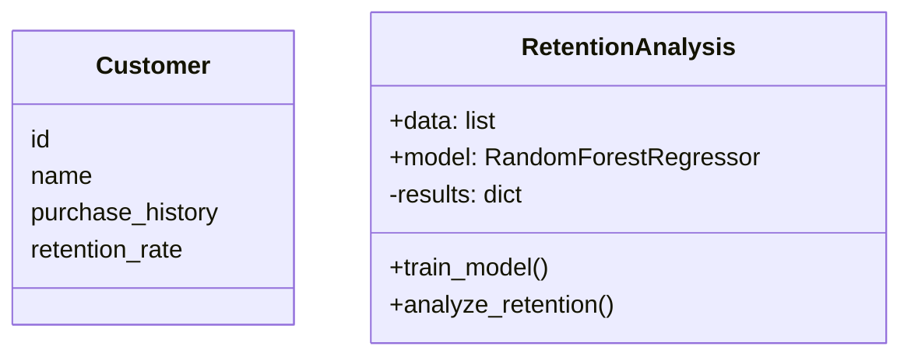
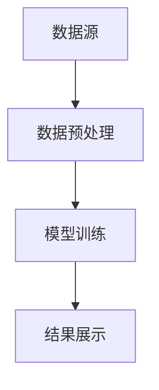
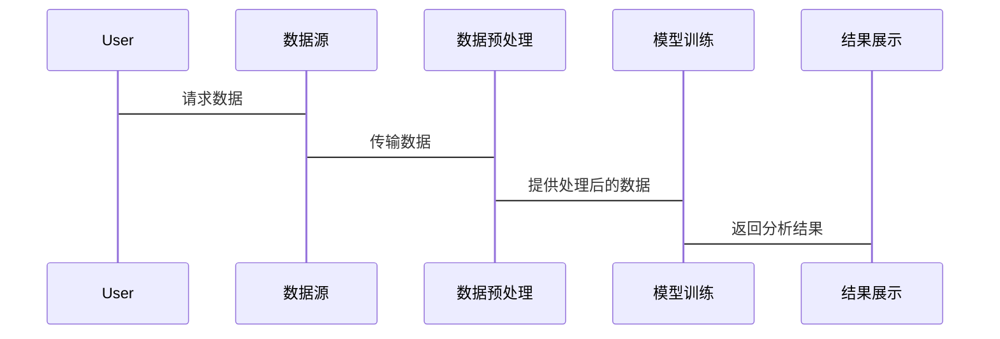

                 


# 彼得林奇如何分析公司的客户留存率

> 关键词：客户留存率，彼得林奇，投资分析，算法模型，系统设计

> 摘要：本文深入分析了彼得林奇如何通过客户留存率评估公司的投资价值，从客户留存率的基本概念到数学模型的实现，再到系统的架构设计，结合实际案例，详细阐述了客户留存率的分析方法及其在投资决策中的应用。

---

## 第1章：客户留存率的背景与核心概念

### 1.1 客户留存率的基本概念

#### 1.1.1 什么是客户留存率
客户留存率是衡量客户对产品或服务忠诚度的重要指标，通常表示一定时间内客户重复使用产品或服务的比例。

#### 1.1.2 客户留存率的重要性
- 客户留存率高意味着客户对产品满意，企业可以减少获取新客户的成本。
- 客户留存率低表明产品或服务存在问题，需要改进。

#### 1.1.3 客户留存率与其他客户指标的关系
- 客户获取率
- 客户流失率
- 客户生命周期价值

### 1.2 彼得林奇的分析方法

#### 1.2.1 彼得林奇的投资理念
彼得林奇以长期投资和基本面分析著称，他认为客户留存率是衡量公司长期盈利能力的重要指标。

#### 1.2.2 彼得林奇如何分析客户留存率
彼得林奇通过分析客户留存率的变化趋势，评估公司的客户忠诚度和市场竞争力。

#### 1.2.3 客户留存率在投资决策中的作用
客户留存率高意味着公司具有持续的盈利能力，是投资决策的重要参考。

---

## 第2章：客户留存率的核心要素

### 2.1 客户留存的关键因素

#### 2.1.1 客户满意度
客户对产品或服务的满意度直接影响客户留存率。

#### 2.1.2 产品价值
产品是否满足客户需求，是否具有竞争力。

#### 2.1.3 客户忠诚度
客户对品牌或产品的忠诚程度。

### 2.2 彼得林奇分析模型

#### 2.2.1 客户留存率的计算公式
客户留存率 = （期末客户数 / 初始客户数）× 100%

#### 2.2.2 客户留存率的驱动因素
- 产品价值
- 客户服务
- 市场竞争

#### 2.2.3 客户留存率与企业生命周期的关系
客户留存率在企业生命周期中呈现出不同的变化趋势。

---

## 第3章：客户留存率的数学模型

### 3.1 客户留存概率模型

#### 3.1.1 马尔可夫链模型
使用马尔可夫链模型预测客户在不同时间段的留存概率。

#### 3.1.2 泊松分布模型
通过泊松分布模型分析客户流失的概率。

#### 3.1.3 贝叶斯定理的应用
使用贝叶斯定理更新客户留存的概率。

### 3.2 客户留存率的预测算法

#### 3.2.1 线性回归模型
通过线性回归模型预测客户留存率的变化趋势。

#### 3.2.2 随机森林模型
使用随机森林模型分析客户留存率的关键影响因素。

#### 3.2.3 时间序列分析
通过时间序列分析预测客户留存率的未来走势。

---

## 第4章：算法实现与代码解析

### 4.1 算法实现步骤

#### 4.1.1 数据预处理
- 数据清洗
- 特征提取

#### 4.1.2 模型训练
- 选择算法
- 调参优化

#### 4.1.3 模型评估
- 评估指标
- 结果分析

### 4.2 Python代码实现

#### 4.2.1 数据读取与清洗
```python
import pandas as pd

# 读取数据
data = pd.read_csv('customer_retention.csv')

# 数据清洗
data.dropna(inplace=True)
```

#### 4.2.2 模型训练代码
```python
from sklearn.ensemble import RandomForestRegressor
from sklearn.metrics import mean_squared_error

# 训练模型
model = RandomForestRegressor(n_estimators=100)
model.fit(X_train, y_train)

# 预测结果
y_pred = model.predict(X_test)

# 计算均方误差
 mse = mean_squared_error(y_test, y_pred)
 print(f'MSE: {mse}')
```

#### 4.2.3 结果可视化
```python
import matplotlib.pyplot as plt

plt.scatter(y_test, y_pred)
plt.xlabel('True Values')
plt.ylabel('Predicted Values')
plt.show()
```

---

## 第5章：系统分析与架构设计

### 5.1 问题场景介绍
分析一家公司客户留存率的系统设计，包括数据采集、模型训练和结果展示。

### 5.2 系统功能设计

#### 5.2.1 领域模型


### 5.3 系统架构设计

#### 5.3.1 系统架构图


### 5.4 系统接口设计
- 数据接口：数据输入和输出接口设计。
- 模型接口：模型训练和预测接口设计。

### 5.5 系统交互设计

#### 5.5.1 交互流程


---

## 第6章：项目实战

### 6.1 环境安装
安装必要的Python库：
- pandas
- scikit-learn
- matplotlib

### 6.2 核心实现代码

#### 6.2.1 数据预处理
```python
import pandas as pd

# 读取数据
data = pd.read_csv('customer_retention.csv')

# 数据清洗
data.dropna(inplace=True)
```

#### 6.2.2 模型训练
```python
from sklearn.ensemble import RandomForestRegressor
from sklearn.metrics import mean_squared_error

# 训练模型
model = RandomForestRegressor(n_estimators=100)
model.fit(X_train, y_train)

# 预测结果
y_pred = model.predict(X_test)

# 计算均方误差
mse = mean_squared_error(y_test, y_pred)
print(f'MSE: {mse}')
```

### 6.3 案例分析
分析一家公司的客户留存率，从数据预处理到模型训练，再到结果展示，详细讲解每一步骤。

---

## 第7章：最佳实践

### 7.1 小结
总结本文的主要内容，强调客户留存率在投资分析中的重要性。

### 7.2 注意事项
- 数据质量的重要性
- 模型选择的注意事项
- 结果解释的合理性

### 7.3 拓展阅读
推荐相关书籍和资源，帮助读者深入学习客户留存率的分析方法。

---

通过本文的分析，读者可以全面了解彼得林奇如何通过客户留存率评估公司的投资价值，并掌握相关的算法实现和系统设计方法。希望本文能为读者在客户留存率的分析和应用中提供有价值的参考。

