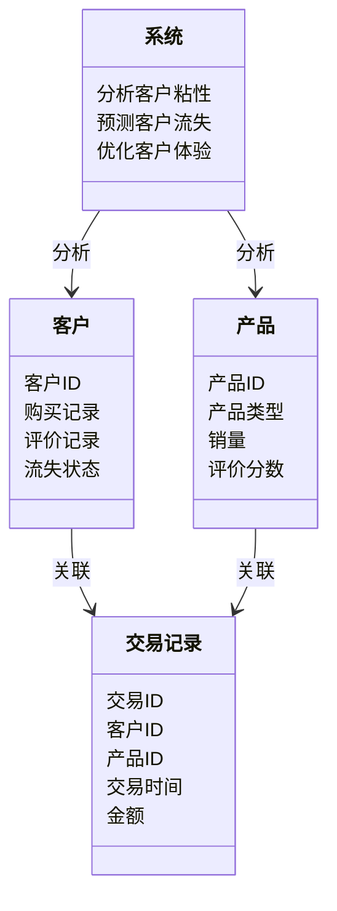
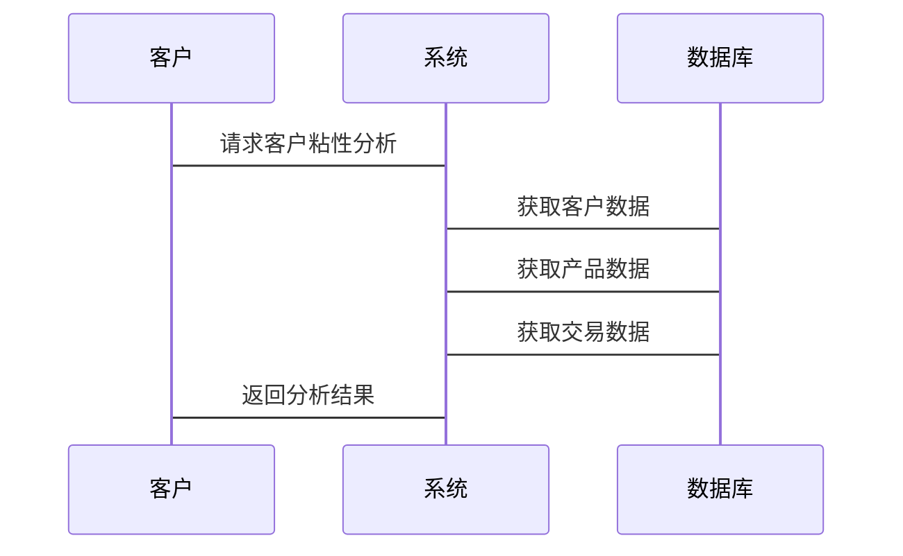

                 


# 彼得林奇如何分析公司的客户粘性

> 关键词：客户粘性，彼得·林奇，投资分析，客户生命周期价值，客户保留率，客户净推荐值

> 摘要：本文详细介绍了彼得·林奇分析公司客户粘性的方法，从客户粘性的定义、关键指标、数学模型到系统分析和实际案例，全面解析了如何通过客户粘性分析来评估公司的长期竞争优势和投资价值。

---

# 1. 客户粘性的定义与重要性

## 1.1 客户粘性的定义

客户粘性（Customer Churn）是指客户与公司之间形成稳定关系并持续使用公司产品或服务的能力。客户粘性高意味着客户对公司的产品或服务具有较高的依赖性和忠诚度，从而更有可能长期使用公司的产品或服务。

---

## 1.2 客户粘性的重要性

客户粘性是衡量公司客户忠诚度和市场竞争力的重要指标。以下是客户粘性的重要性：

- **客户粘性与企业长期发展**：高客户粘性意味着公司能够持续获得稳定的收入来源，降低客户获取成本，并增强企业的市场地位。

- **客户粘性与企业竞争优势**：客户粘性高的公司通常能够通过客户忠诚度和产品差异化获得竞争优势，从而在激烈的市场竞争中占据有利地位。

- **客户粘性与投资分析**：在投资分析中，客户粘性是评估公司长期价值的重要指标。高客户粘性的公司通常具有更强的盈利能力和发展潜力。

---

# 2. 彼得·林奇的客户粘性分析方法

## 2.1 彼得·林奇的投资理念

彼得·林奇是美国著名投资经理人，以其在富达投资管理公司的投资业绩而闻名。他强调通过深入分析公司的基本面和竞争优势来评估公司的投资价值。以下是林奇分析客户粘性的核心思想：

- **客户粘性是公司竞争优势的重要组成部分**：林奇认为，客户粘性高的公司通常能够通过客户忠诚度和产品差异化获得竞争优势，从而在激烈的市场竞争中占据有利地位。

- **客户粘性与公司长期价值密切相关**：林奇认为，客户粘性高的公司通常具有更强的盈利能力和发展潜力，从而能够为投资者带来更高的回报。

---

## 2.2 林奇客户粘性分析的框架

林奇的客户粘性分析框架包括以下几个步骤：

1. **分析客户粘性的核心指标**：包括客户保留率、客户生命周期价值（CLV）和客户净推荐值（NPS）等。

2. **评估客户的忠诚度和满意度**：通过客户调查、访谈和数据分析等方法，了解客户对公司产品或服务的满意度和忠诚度。

3. **分析客户的流失原因**：通过数据分析和客户反馈，找出客户流失的主要原因，并采取相应的改进措施。

4. **优化客户体验和产品价值**：通过优化客户体验和产品价值，提高客户的满意度和忠诚度，从而增强客户粘性。

---

# 3. 客户粘性的关键指标与评估方法

## 3.1 客户粘性的关键指标

### 3.1.1 客户保留率

客户保留率是衡量客户粘性的核心指标之一，表示公司在一定时间内能够保留客户的比例。客户保留率的计算公式如下：

$$ 客户保留率 = \frac{现有客户数}{现有客户数 + 新客户数} $$

### 3.1.2 客户生命周期价值（CLV）

客户生命周期价值是指客户在与公司合作的整个生命周期内为公司带来的总收益。CLV的计算公式如下：

$$ CLV = \frac{R \times (1 - \frac{1}{(1 + d)^n})}{1 - \frac{1}{(1 + d)^n}} $$

其中，$R$ 是客户的年收入，$d$ 是贴现率，$n$ 是客户生命周期长度。

### 3.1.3 客户净推荐值（NPS）

客户净推荐值是衡量客户满意度和忠诚度的指标，通过客户对公司的推荐意愿来评估客户粘性。NPS的计算公式如下：

$$ NPS = 净推荐值 = 推荐客户的比例 - 指责客户的比例 $$

---

## 3.2 客户粘性的评估方法

### 3.2.1 数据分析法

通过分析客户的购买记录、流失记录和投诉记录等数据，评估客户的粘性和满意度。

### 3.2.2 客户访谈法

通过与客户的访谈，了解客户对公司产品或服务的满意度和忠诚度，找出客户流失的主要原因。

### 3.2.3 行为观察法

通过观察客户的购买行为和使用行为，评估客户的粘性和满意度。

---

# 4. 彼得·林奇客户粘性分析的数学模型

## 4.1 客户生命周期价值（CLV）模型

客户生命周期价值（CLV）是衡量客户粘性的核心指标之一。以下是CLV模型的详细解释：

1. **CLV的定义**：客户生命周期价值是指客户在与公司合作的整个生命周期内为公司带来的总收益。

2. **CLV的计算公式**：

$$ CLV = \frac{R \times (1 - \frac{1}{(1 + d)^n})}{1 - \frac{1}{(1 + d)^n}} $$

其中，$R$ 是客户的年收入，$d$ 是贴现率，$n$ 是客户生命周期长度。

3. **CLV的应用**：通过计算客户的CLV，公司可以评估客户的长期价值，并制定相应的客户管理策略。

---

## 4.2 客户流失率预测模型

客户流失率预测模型是通过分析客户的购买记录和行为数据，预测客户流失的概率。以下是客户流失率预测模型的详细解释：

1. **客户流失率的定义**：客户流失率是指客户在一定时间内停止使用公司产品或服务的比例。

2. **客户流失率的预测方法**：

- **逻辑回归模型**：通过客户的行为数据和购买记录，建立逻辑回归模型，预测客户流失的概率。

- **决策树模型**：通过客户的行为数据和购买记录，建立决策树模型，预测客户流失的概率。

3. **客户流失率与客户粘性的关系**：客户流失率与客户粘性呈负相关关系，客户流失率越高，客户粘性越低。

---

# 5. 系统分析与架构设计方案

## 5.1 问题场景介绍

客户粘性分析的背景：

- 随着市场竞争的加剧，客户粘性成为公司长期发展的关键因素。

- 通过分析客户的粘性和流失原因，公司可以制定相应的客户管理策略，提高客户的忠诚度和满意度。

---

## 5.2 系统功能设计

### 5.2.1 领域模型（Mermaid类图）



---

## 5.3 系统架构设计（Mermaid架构图）

```mermaid
--- architecture of Customer Churn Analysis System ---
client
    + HTTP
    + Database
server
    + Business Logic
    + Database
```

---

## 5.4 系统接口设计

系统接口设计包括以下几个部分：

1. **客户数据接口**：从数据库中获取客户的基本信息和购买记录。

2. **产品数据接口**：从数据库中获取产品的基本属性和销售记录。

3. **交易数据接口**：从数据库中获取交易记录和客户流失记录。

4. **分析结果接口**：将客户粘性分析结果返回给系统。

---

## 5.5 系统交互（Mermaid序列图）



---

# 6. 项目实战：基于彼得·林奇方法的客户粘性分析

## 6.1 项目背景

本项目旨在通过分析客户的粘性和流失原因，制定相应的客户管理策略，提高客户的忠诚度和满意度。

---

## 6.2 核心实现源代码

以下是基于Python的客户粘性分析代码：

```python
import pandas as pd
from sklearn.metrics import accuracy_score
from sklearn.tree import DecisionTreeClassifier

# 数据加载
data = pd.read_csv('customer_churn.csv')

# 数据预处理
X = data[['age', 'balance', 'product_count']]
y = data['churn']

# 模型训练
model = DecisionTreeClassifier()
model.fit(X, y)

# 模型预测
y_pred = model.predict(X)

# 模型评估
print('模型准确率:', accuracy_score(y, y_pred))
```

---

## 6.3 实际案例分析

以星巴克为例，分析其客户粘性：

1. **星巴克的客户粘性分析**：
    - 星巴克通过会员制度和积分奖励计划，提高了客户的粘性和忠诚度。
    - 通过数据分析和客户调查，星巴克了解客户的需求和偏好，优化了客户体验和产品价值。

2. **分析结果**：
    - 星巴克的客户保留率较高，客户生命周期价值较高，客户净推荐值较高。

---

## 6.4 项目小结

通过基于彼得·林奇方法的客户粘性分析，我们可以提高客户的忠诚度和满意度，降低客户流失率，从而增强公司的市场竞争力和长期价值。

---

# 7. 总结与最佳实践

## 7.1 小结

- 客户粘性是公司长期发展的关键因素，也是投资分析的重要指标。
- 彼得·林奇通过分析客户的粘性和流失原因，评估公司的长期价值和竞争优势。

## 7.2 注意事项

- 在分析客户粘性时，需要结合公司的实际情况和市场环境。
- 客户粘性分析需要结合定性和定量分析，确保分析结果的准确性和全面性。

## 7.3 拓展阅读

- 《彼得·林奇的选股艺术》
- 《客户关系管理：理论与实践》
- 《数据分析实战：Python与R》

---

通过本文的分析和实践，我们可以更好地理解彼得·林奇的客户粘性分析方法，并将其应用于实际的投资分析和客户管理中。

