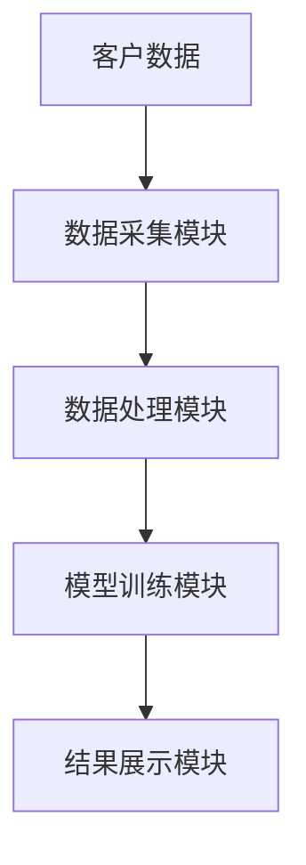

                 


# 彼得林奇如何分析公司的客户细分策略演变

## 关键词：客户细分、策略演变、数据驱动、市场分析、客户生命周期

## 摘要：本文探讨了彼得·林奇分析公司客户细分策略演变的方法，从传统到数据驱动的转变，通过数学模型和算法，结合实际案例，详细解析客户细分策略的应用与优化。

---

## 正文

### 第一部分: 背景介绍

#### 第1章: 客户细分策略演变的背景与重要性

##### 1.1 客户细分的基本概念

客户细分是指将客户群体按照某些特征或行为进行划分，以便更好地满足不同客户的需求，优化资源配置，提高客户满意度和忠诚度。彼得·林奇在分析公司时，特别关注客户细分策略的演变，认为它是公司成功的关键因素之一。

##### 1.2 客户细分策略的重要性

- **提高客户满意度**：通过细分客户，公司能够提供更个性化的产品和服务，增强客户满意度。
- **优化资源配置**：根据客户需求分配资源，避免浪费，提高效率。
- **提升市场竞争力**：精准定位目标市场，制定有效的营销策略，提升竞争力。

#### 第2章: 客户细分的核心概念与联系

##### 2.1 核心概念原理

- **客户细分的定义与类型**：客户细分基于年龄、性别、收入、地理位置等因素，将客户划分为不同的群体。
- **客户细分与市场细分的关系**：客户细分是市场细分的重要组成部分，帮助公司更好地理解市场需求。
- **客户细分的驱动因素**：技术进步、数据驱动、市场竞争等推动客户细分策略的演变。

##### 2.2 核心概念属性对比表格

| 属性       | 描述                                   |
|------------|--------------------------------------|
| 细分维度   | 年龄、性别、地理位置等               |
| 细分目标   | 提高客户满意度、增加销售额           |
| 细分方法   | 聚类分析、决策树等                   |

##### 2.3 ER实体关系图

```mermaid
er
  actor: 客户
  customer_segment: 客户细分
  product: 产品
  transaction: 交易
  actor --> customer_segment: 属于
  customer_segment --> product: 购买
  customer_segment --> transaction: 记录
```

### 第二部分: 客户细分策略的数学模型与算法

#### 第3章: 聚类分析

##### 3.1 聚类分析的基本原理

聚类分析是一种无监督学习方法，用于将数据点自动分组。彼得·林奇使用聚类分析来识别客户群体中的潜在模式。

##### 3.2 聚类分析的步骤

1. **数据准备**：收集客户数据，包括年龄、收入、购买频率等。
2. **特征工程**：标准化或归一化数据，处理缺失值。
3. **选择算法**：K-means、层次聚类等。
4. **模型训练**：应用算法进行聚类。
5. **结果分析**：评估聚类效果，调整参数。

##### 3.3 聚类分析的公式

$$ \text{距离} = \sqrt{(x_2 - x_1)^2 + (y_2 - y_1)^2} $$

### 第三部分: 系统架构设计

#### 第4章: 客户细分系统架构

##### 4.1 系统功能设计

- 数据采集模块：收集客户数据。
- 数据处理模块：清洗和转换数据。
- 模型训练模块：应用聚类算法进行客户细分。
- 结果展示模块：可视化分析结果。

##### 4.2 系统架构设计



### 第四部分: 项目实战

#### 第5章: 客户细分策略的实战应用

##### 5.1 数据准备

- 数据来源：超市客户数据，包括年龄、性别、购买金额等。
- 数据清洗：处理缺失值，异常值。

##### 5.2 特征工程

- 数据标准化：使用标准差标准化，消除量纲影响。
- 特征选择：选择对聚类影响大的特征，如购买频率、金额等。

##### 5.3 模型训练

- 使用K-means算法，设置K值为3。
- 训练模型，获取聚类结果。

##### 5.4 结果分析

- 分析各聚类的特征，制定针对性营销策略。
- 例如，高价值客户提供会员优惠，中价值客户推送促销活动。

### 第五部分: 总结与展望

#### 第6章: 总结与最佳实践

##### 6.1 最佳实践

- **数据质量**：确保数据准确、完整。
- **模型选择**：根据业务需求选择合适的算法。
- **结果验证**：通过业务指标验证模型效果。

##### 6.2 小结

客户细分策略的演变从传统到数据驱动，通过数学模型和算法的应用，帮助公司更精准地识别客户需求，制定有效策略。

##### 6.3 注意事项

- 数据隐私保护：遵守数据隐私法规，确保客户信息安全。
- 持续优化：定期更新数据和模型，适应市场变化。

##### 6.4 未来趋势

- 结合AI技术：利用深度学习提升客户细分的精度。
- 实时分析：通过实时数据处理，快速响应客户需求。

---

通过以上结构，文章详细探讨了客户细分策略的演变，结合数学模型和实际案例，为读者提供了全面的指导。

