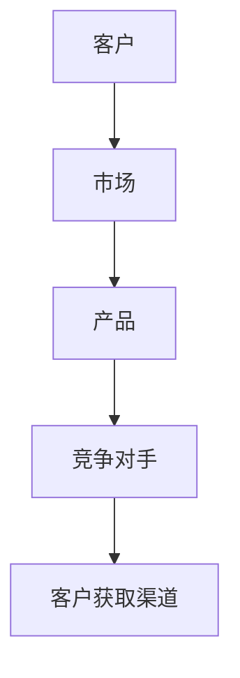
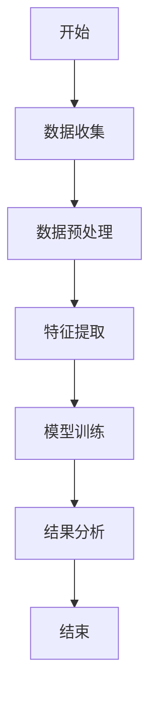
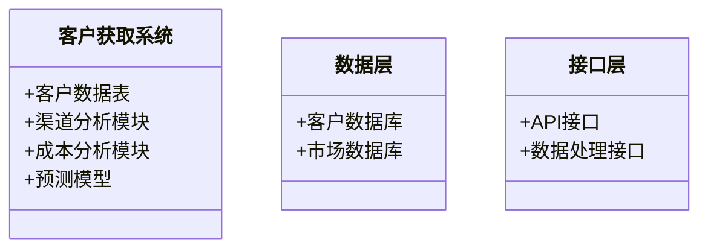
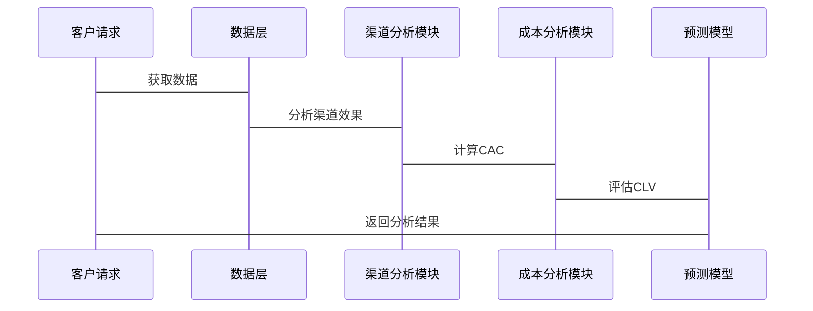

                 


# 彼得林奇如何分析公司的客户获取策略

**关键词**：彼得·林奇、客户获取策略、投资分析、数据分析、数学模型

**摘要**：本文详细探讨了彼得·林奇分析公司客户获取策略的方法，结合技术背景、核心概念、算法原理和数学模型，提供从理论到实践的全面指导。

---

## 第1章 引言

### 1.1 彼得·林奇及其投资方法

彼得·林奇是全球著名投资家，以其在共同基金领域的卓越表现闻名。他强调深入分析公司基本面，尤其是客户获取策略，认为这是评估公司长期价值的关键因素。本文将介绍林奇的分析方法，为投资者提供实用指导。

---

## 第2章 背景介绍

### 2.1 客户获取策略的定义与重要性

客户获取策略是企业吸引新客户的方法和渠道的选择。有效的策略能降低成本，提高客户忠诚度和生命周期价值。林奇认为，客户获取策略直接关系到公司的可持续增长和盈利能力。

### 2.2 客户获取策略的核心要素

客户获取策略涉及市场定位、渠道选择、成本控制和客户质量等关键要素。林奇注重分析这些要素如何协同作用，以确保客户获取的效率和效果。

---

## 第3章 核心概念与联系

### 3.1 实体关系图



该图展示了客户、市场、产品、竞争对手和客户获取渠道之间的关系，帮助我们理解客户获取策略的多维影响。

### 3.2 属性特征对比

| 特性         | 描述 |
|--------------|------|
| 渠道多样性   | 包括线上、线下等多种渠道 |
| 成本效率     | 通过优化流程降低成本 |
| 客户质量     | 提高客户忠诚度和生命周期价值 |

---

## 第4章 算法原理讲解

### 4.1 分析流程



### 4.2 Python代码实现

```python
import pandas as pd
from sklearn.tree import DecisionTreeClassifier

# 数据加载
data = pd.read_csv('customer_data.csv')

# 特征工程
X = data[['age', 'income', 'channel']]
y = data['conversion']

# 模型训练
model = DecisionTreeClassifier()
model.fit(X, y)

# 预测与评估
print(model.score(X, y))
```

---

## 第5章 数学模型与公式

### 5.1 客户获取成本（CAC）公式

$$

CAC = \frac{\text{营销总成本}}{\text{客户获取数量}}

$$

### 5.2 客户生命周期价值（CLV）公式

$$

CLV = \frac{\text{平均收入} \times \text{客户生命周期} \times \text{利润率}}{1 + \text{贴现率}}

$$

分析CAC与CLV的关系，确保CAC低于CLV，以保证客户获取策略的经济性。

---

## 第6章 系统分析与架构设计

### 6.1 系统功能设计



### 6.2 系统交互流程



---

## 第7章 项目实战

### 7.1 环境安装

安装必要的库：

```bash
pip install pandas scikit-learn
```

### 7.2 核心代码实现

```python
from sklearn.ensemble import RandomForestClassifier

# 数据加载
data = pd.read_csv('customer_data.csv')

# 特征工程
X = data[['age', 'income', 'channel']]
y = data['conversion']

# 模型训练
model = RandomForestClassifier()
model.fit(X, y)

# 预测与评估
print(model.score(X, y))
```

### 7.3 案例分析

通过实际案例分析，展示如何应用上述方法优化客户获取策略，降低成本，提高效率。

---

## 第8章 总结与展望

### 8.1 总结

本文系统介绍了彼得·林奇的客户获取策略分析方法，从背景、概念、算法到系统设计和实战，提供了全面的指导。通过理论与实践结合，帮助读者掌握有效的分析技巧。

### 8.2 展望

未来，随着技术的发展，客户获取策略的分析将更加智能化和数据驱动。投资者应持续学习新技术，优化分析方法，以应对市场变化。

### 8.3 注意事项

- 数据质量是分析的基础，需确保数据准确性和完整性。
- 模型选择需结合实际业务需求，避免过度复杂化。
- 定期评估和优化策略，以应对市场变化。

### 8.4 拓展阅读

推荐阅读《彼得·林奇的投资成功之路》和《数据分析实战》，深入学习投资分析和数据科学知识。

---

通过以上内容，读者将能够全面理解彼得·林奇的客户获取策略分析方法，并在实际投资中应用这些策略，提升分析效率和准确性。

