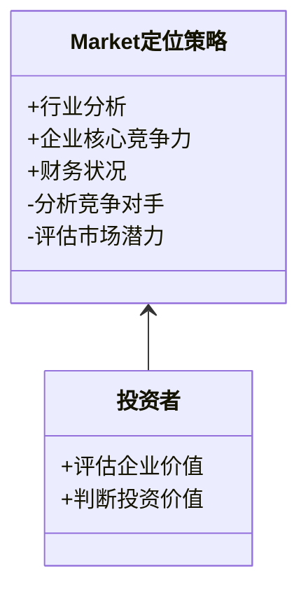
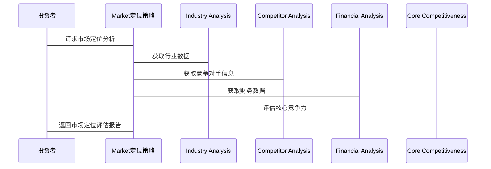

                 


```markdown
# 彼得林奇如何分析公司的市场定位策略

> 关键词：彼得林奇，市场定位策略，投资分析，企业核心竞争力，行业分析，财务状况

> 摘要：本文从彼得·林奇的投资哲学出发，详细探讨如何通过市场定位策略分析公司的竞争优势、行业地位和财务状况。通过案例分析和实战指导，帮助读者掌握市场定位策略的核心要素及其在投资决策中的应用。

---

## 第一部分: 彼得·林奇投资策略背景与基础

### 第1章: 彼得·林奇与市场定位策略概述

#### 1.1 彼得·林奇及其投资哲学
##### 1.1.1 彼得·林奇的生平简介
彼得·林奇（Peter Lynch）是美国著名的投资经理人，被誉为“共同基金之父”。他在富达投资管理公司管理麦哲伦基金期间，创造了年均29%的复合增长率，为投资者创造了巨额财富。

##### 1.1.2 彼得·林奇的投资理念与方法
彼得·林奇强调长期投资、价值发现和深入研究。他认为，成功的投资取决于对企业的深入了解，包括企业的商业模式、竞争优势和财务状况。

##### 1.1.3 市场定位策略在投资分析中的重要性
市场定位策略是彼得·林奇分析企业的重要工具。他通过分析企业的市场定位，判断其在行业中的地位和竞争优势，从而评估其投资价值。

#### 1.2 市场定位策略的核心概念
##### 1.2.1 市场定位的定义与内涵
市场定位是指企业在目标市场中的位置，是企业在消费者心中与其他竞争对手区别开来的形象。

##### 1.2.2 市场定位与企业竞争战略的关系
市场定位是企业竞争战略的核心部分，它决定了企业如何在市场中与竞争对手区分开，并吸引目标客户。

##### 1.2.3 彼得·林奇视角下的市场定位分析框架
彼得·林奇通过分析企业的市场定位，评估其竞争优势、行业地位和财务健康状况，从而判断其投资价值。

#### 1.3 彼得·林奇分析市场定位的三大原则
##### 1.3.1 企业核心竞争力的识别
彼得·林奇认为，企业的核心竞争力是其在市场中生存和发展的关键。他通过分析企业的商业模式、技术优势和成本结构，识别其核心竞争力。

##### 1.3.2 行业地位与市场结构的分析
彼得·林奇关注企业的行业地位和市场结构。他分析行业集中度、竞争对手的数量和市场份额，判断企业的市场地位。

##### 1.3.3 企业财务状况与成长潜力的结合
彼得·林奇将企业的财务状况与市场定位相结合，分析企业的盈利能力、成长潜力和财务健康状况，从而评估其投资价值。

---

## 第二部分: 市场定位策略的分析框架

### 第2章: 市场定位策略的多维度分析

#### 2.1 行业分析与市场定位
##### 2.1.1 行业生命周期分析
彼得·林奇通过分析行业的生命周期阶段（导入期、成长期、成熟期、衰退期），判断企业的市场定位是否合理。

##### 2.1.2 市场增长潜力评估
彼得·林奇关注行业的市场增长潜力，分析行业未来的需求增长和市场规模，判断企业的市场定位是否具备成长性。

##### 2.1.3 行业竞争格局分析
彼得·林奇分析行业的竞争格局，包括主要竞争对手的数量、市场份额和竞争策略，判断企业的市场定位是否具备竞争优势。

#### 2.2 企业核心竞争力的评估
##### 2.2.1 核心竞争力的定义与特征
核心竞争力是企业在市场中独有的竞争优势，包括技术、品牌、成本和商业模式等方面。

##### 2.2.2 彼得·林奇如何识别企业核心竞争力
彼得·林奇通过深入研究企业的商业模式、技术优势和成本结构，识别其核心竞争力。

##### 2.2.3 核心竞争力与市场定位的关系
企业的核心竞争力决定其市场定位。彼得·林奇认为，核心竞争力强的企业能够在市场中占据有利位置。

#### 2.3 企业财务状况与市场定位
##### 2.3.1 财务健康状况对市场定位的影响
企业的财务状况直接影响其市场定位。健康的财务状况能够支持企业的市场推广和品牌建设。

##### 2.3.2 市场定位与企业盈利能力的关系
彼得·林奇认为，企业的盈利能力是市场定位的重要指标。高盈利能力的企业能够维持其市场地位。

##### 2.3.3 市场定位与企业估值的关系
彼得·林奇通过分析企业的市场定位和财务状况，评估其合理的估值水平，判断其投资价值。

### 第3章: 彼得·林奇市场定位策略的实战案例

#### 3.1 案例一：苹果公司的市场定位分析
##### 3.1.1 苹果公司的核心竞争力
苹果公司以其创新的科技、强大的品牌影响力和独特的商业模式为核心竞争力。

##### 3.1.2 苹果的市场定位策略
苹果公司通过高端市场的定位，专注于创新产品的开发和高附加值的销售策略。

##### 3.1.3 彼得·林奇视角下的苹果投资价值
彼得·林奇认为，苹果公司的核心竞争力和市场定位使其具备长期的投资价值。

#### 3.2 案例二：谷歌的市场定位分析
##### 3.2.1 谷歌的核心竞争力
谷歌以其搜索引擎技术、大数据处理能力和开放的创新文化为核心竞争力。

##### 3.2.2 谷歌的市场定位策略
谷歌通过技术领先和多元化业务布局，占据了互联网搜索市场的主导地位。

##### 3.2.3 彼得·林奇视角下的谷歌投资价值
彼得·林奇认为，谷歌的核心竞争力和市场地位使其具备持续增长的潜力。

---

## 第三部分: 市场定位策略的系统分析与架构设计

### 第4章: 系统分析与架构设计方案

#### 4.1 问题场景介绍
市场定位策略的系统分析需要结合行业分析、企业核心竞争力评估和财务状况分析，构建一个完整的分析框架。

#### 4.2 项目介绍
通过构建市场定位分析系统，帮助企业或投资者快速评估企业的市场定位和投资价值。

#### 4.3 系统功能设计
##### 4.3.1 领域模型（mermaid 类图）


##### 4.3.2 系统架构设计（mermaid 架构图）


#### 4.4 系统接口设计
##### 4.4.1 输入接口
- 行业数据
- 企业财务数据
- 竞争对手信息

#### 4.5 系统交互（mermaid 序列图）


---

## 第四部分: 项目实战与总结

### 第5章: 项目实战

#### 5.1 环境安装
##### 5.1.1 安装Python环境
使用Anaconda安装Python 3.8及以上版本。

##### 5.1.2 安装依赖库
安装pandas、numpy、matplotlib等数据分析库。

#### 5.2 核心实现

##### 5.2.1 数据收集
收集目标企业的行业数据、财务数据和竞争对手信息。

##### 5.2.2 数据处理
使用pandas进行数据清洗和整理，提取关键指标。

##### 5.2.3 数据可视化
使用matplotlib绘制行业趋势图和财务状况图表。

##### 5.2.4 市场定位评估
根据分析框架，评估企业的市场定位和投资价值。

#### 5.3 代码实现

##### 5.3.1 数据处理代码
```python
import pandas as pd
import numpy as np

# 假设data是一个包含行业数据和财务数据的DataFrame
data = pd.read_csv('market_data.csv')

# 数据清洗
data.dropna(inplace=True)
data['增长率'] = (data['收入'] - data['上期收入']) / data['上期收入'] * 100
```

##### 5.3.2 可视化代码
```python
import matplotlib.pyplot as plt

plt.figure(figsize=(10, 6))
plt.plot(data['年份'], data['增长率'], 'b-', marker='o')
plt.title('行业增长率趋势')
plt.xlabel('年份')
plt.ylabel('增长率 (%)')
plt.grid(True)
plt.show()
```

#### 5.4 实际案例分析
以苹果公司为例，分析其市场定位和投资价值。

#### 5.5 项目小结
通过实战项目，读者可以掌握市场定位策略的分析方法，并能够实际应用到投资分析中。

---

## 第五部分: 总结与展望

### 第6章: 总结与展望

#### 6.1 最佳实践 tips
- 深入研究企业的商业模式和核心竞争力。
- 结合行业趋势和财务数据，全面评估企业的市场定位。
- 定期更新分析框架，适应市场变化。

#### 6.2 小结
本文从彼得·林奇的投资哲学出发，详细分析了市场定位策略的核心要素和实施步骤，通过案例分析和系统设计，帮助读者掌握市场定位策略的实战应用。

#### 6.3 注意事项
- 市场定位分析需要结合实际情况，避免过于理论化。
- 投资者应保持长期视角，避免短期波动的干扰。

#### 6.4 拓展阅读
- 彼得·林奇的《彼得·林奇的成功投资：选股很简单》
- 迈克尔·波特的《竞争优势》

---

## 附录: 常用工具与资源

### 附录A: 数据来源
- 行业数据：Statista、Baidu Index
- 财务数据：Yahoo Finance、公司年报

### 附录B: 工具推荐
- 数据分析工具：Python、R
- 图表工具：Excel、Tableau
- 代码编辑器：Jupyter Notebook、VS Code

### 附录C: 推荐书单
- 《股票作手回忆录》
- 《价值投资实战手册》
- 《投资学原理》

---

## 结语

通过本文的学习，读者可以掌握彼得·林奇的市场定位策略分析方法，并能够将其应用到实际的投资分析中。市场定位策略是企业成功的关键，也是投资者评估企业价值的重要工具。希望本文能够为读者提供有价值的参考和启发。
</think>

```markdown
# 彼得林奇如何分析公司的市场定位策略

> 关键词：彼得林奇，市场定位策略，投资分析，企业核心竞争力，行业分析，财务状况

> 摘要：本文从彼得·林奇的投资哲学出发，详细探讨如何通过市场定位策略分析公司的竞争优势、行业地位和财务状况。通过案例分析和实战指导，帮助读者掌握市场定位策略的核心要素及其在投资决策中的应用。

---

## 第一部分: 彼得·林奇投资策略背景与基础

### 第1章: 彼得·林奇与市场定位策略概述

#### 1.1 彼得·林奇及其投资哲学
##### 1.1.1 彼得·林奇的生平简介
彼得·林奇（Peter Lynch）是美国著名的投资经理人，被誉为“共同基金之父”。他在富达投资管理公司管理麦哲伦基金期间，创造了年均29%的复合增长率，为投资者创造了巨额财富。

##### 1.1.2 彼得·林奇的投资理念与方法
彼得·林奇强调长期投资、价值发现和深入研究。他认为，成功的投资取决于对企业的深入了解，包括企业的商业模式、竞争优势和财务状况。

##### 1.1.3 市场定位策略在投资分析中的重要性
市场定位策略是彼得·林奇分析企业的重要工具。他通过分析企业的市场定位，判断其在行业中的地位和竞争优势，从而评估其投资价值。

#### 1.2 市场定位策略的核心概念
##### 1.2.1 市场定位的定义与内涵
市场定位是指企业在目标市场中的位置，是企业在消费者心中与其他竞争对手区别开来的形象。

##### 1.2.2 市场定位与企业竞争战略的关系
市场定位是企业竞争战略的核心部分，它决定了企业如何在市场中与竞争对手区分开，并吸引目标客户。

##### 1.2.3 彼得·林奇视角下的市场定位分析框架
彼得·林奇通过分析企业的市场定位，评估其竞争优势、行业地位和财务健康状况，从而判断其投资价值。

#### 1.3 彼得·林奇分析市场定位的三大原则
##### 1.3.1 企业核心竞争力的识别
彼得·林奇认为，企业的核心竞争力是其在市场中生存和发展的关键。他通过分析企业的商业模式、技术优势和成本结构，识别其核心竞争力。

##### 1.3.2 行业地位与市场结构的分析
彼得·林奇关注企业的行业地位和市场结构。他分析行业集中度、竞争对手的数量和市场份额，判断企业的市场地位。

##### 1.3.3 企业财务状况与成长潜力的结合
彼得·林奇将企业的财务状况与市场定位相结合，分析企业的盈利能力、成长潜力和财务健康状况，从而评估其投资价值。

---

## 第二部分: 市场定位策略的分析框架

### 第2章: 市场定位策略的多维度分析

#### 2.1 行业分析与市场定位
##### 2.1.1 行业生命周期分析
彼得·林奇通过分析行业的生命周期阶段（导入期、成长期、成熟期、衰退期），判断企业的市场定位是否合理。

##### 2.1.2 市场增长潜力评估
彼得·林奇关注行业的市场增长潜力，分析行业未来的需求增长和市场规模，判断企业的市场定位是否具备成长性。

##### 2.1.3 行业竞争格局分析
彼得·林奇分析行业的竞争格局，包括主要竞争对手的数量、市场份额和竞争策略，判断企业的市场定位是否具备竞争优势。

#### 2.2 企业核心竞争力的评估
##### 2.2.1 核心竞争力的定义与特征
核心竞争力是企业在市场中独有的竞争优势，包括技术、品牌、成本和商业模式等方面。

##### 2.2.2 彼得·林奇如何识别企业核心竞争力
彼得·林奇通过深入研究企业的商业模式、技术优势和成本结构，识别其核心竞争力。

##### 2.2.3 核心竞争力与市场定位的关系
企业的核心竞争力决定其市场定位。彼得·林奇认为，核心竞争力强的企业能够在市场中占据有利位置。

#### 2.3 企业财务状况与市场定位
##### 2.3.1 财务健康状况对市场定位的影响
企业的财务状况直接影响其市场定位。健康的财务状况能够支持企业的市场推广和品牌建设。

##### 2.3.2 市场定位与企业盈利能力的关系
彼得·林奇认为，企业的盈利能力是市场定位的重要指标。高盈利能力的企业能够维持其市场地位。

##### 2.3.3 市场定位与企业估值的关系
彼得·林奇通过分析企业的市场定位和财务状况，评估其合理的估值水平，判断其投资价值。

### 第3章: 彼得·林奇市场定位策略的实战案例

#### 3.1 案例一：苹果公司的市场定位分析
##### 3.1.1 苹果公司的核心竞争力
苹果公司以其创新的科技、强大的品牌影响力和独特的商业模式为核心竞争力。

##### 3.1.2 苹果的市场定位策略
苹果公司通过高端市场的定位，专注于创新产品的开发和高附加值的销售策略。

##### 3.1.3 彼得·林奇视角下的苹果投资价值
彼得·林奇认为，苹果公司的核心竞争力和市场定位使其具备长期的投资价值。

#### 3.2 案例二：谷歌的市场定位分析
##### 3.2.1 谷歌的核心竞争力
谷歌以其搜索引擎技术、大数据处理能力和开放的创新文化为核心竞争力。

##### 3.2.2 谷歌的市场定位策略
谷歌通过技术领先和多元化业务布局，占据了互联网搜索市场的主导地位。

##### 3.2.3 彼得·林奇视角下的谷歌投资价值
彼得·林奇认为，谷歌的核心竞争力和市场地位使其具备持续增长的潜力。

---

## 第三部分: 市场定位策略的系统分析与架构设计

### 第4章: 系统分析与架构设计方案

#### 4.1 问题场景介绍
市场定位策略的系统分析需要结合行业分析、企业核心竞争力评估和财务状况分析，构建一个完整的分析框架。

#### 4.2 项目介绍
通过构建市场定位分析系统，帮助企业或投资者快速评估企业的市场定位和投资价值。

#### 4.3 系统功能设计
##### 4.3.1 领域模型（mermaid 类图）


##### 4.3.2 系统架构设计（mermaid 架构图）


#### 4.4 系统接口设计
##### 4.4.1 输入接口
- 行业数据
- 企业财务数据
- 竞争对手信息

#### 4.5 系统交互（mermaid 序列图）


---

## 第四部分: 项目实战与总结

### 第5章: 项目实战

#### 5.1 环境安装
##### 5.1.1 安装Python环境
使用Anaconda安装Python 3.8及以上版本。

##### 5.1.2 安装依赖库
安装pandas、numpy、matplotlib等数据分析库。

#### 5.2 核心实现

##### 5.2.1 数据收集
收集目标企业的行业数据、财务数据和竞争对手信息。

##### 5.2.2 数据处理
使用pandas进行数据清洗和整理，提取关键指标。

##### 5.2.3 数据可视化
使用matplotlib绘制行业趋势图和财务状况图表。

##### 5.2.4 市场定位评估
根据分析框架，评估企业的市场定位和投资价值。

#### 5.3 代码实现

##### 5.3.1 数据处理代码
```python
import pandas as pd
import numpy as np

# 假设data是一个包含行业数据和财务数据的DataFrame
data = pd.read_csv('market_data.csv')

# 数据清洗
data.dropna(inplace=True)
data['增长率'] = (data['收入'] - data['上期收入']) / data['上期收入'] * 100
```

##### 5.3.2 可视化代码
```python
import matplotlib.pyplot as plt

plt.figure(figsize=(10, 6))
plt.plot(data['年份'], data['增长率'], 'b-', marker='o')
plt.title('行业增长率趋势')
plt.xlabel('年份')
plt.ylabel('增长率 (%)')
plt.grid(True)
plt.show()
```

#### 5.4 实际案例分析
以苹果公司为例，分析其市场定位和投资价值。

#### 5.5 项目小结
通过实战项目，读者可以掌握市场定位策略的分析方法，并能够实际应用到投资分析中。

---

## 第五部分: 总结与展望

### 第6章: 总结与展望

#### 6.1 最佳实践 tips
- 深入研究企业的商业模式和核心竞争力。
- 结合行业趋势和财务数据，全面评估企业的市场定位。
- 定期更新分析框架，适应市场变化。

#### 6.2 小结
本文从彼得·林奇的投资哲学出发，详细分析了市场定位策略的核心要素和实施步骤，通过案例分析和系统设计，帮助读者掌握市场定位策略的实战应用。

#### 6.3 注意事项
- 市场定位分析需要结合实际情况，避免过于理论化。
- 投资者应保持长期视角，避免短期波动的干扰。

#### 6.4 拓展阅读
- 彼得·林奇的《彼得·林奇的成功投资：选股很简单》
- 迈克尔·波特的《竞争优势》

---

## 附录: 常用工具与资源

### 附录A: 数据来源
- 行业数据：Statista、Baidu Index
- 财务数据：Yahoo Finance、公司年报

### 附录B: 工具推荐
- 数据分析工具：Python、R
- 图表工具：Excel、Tableau
- 代码编辑器：Jupyter Notebook、VS Code

### 附录C: 推荐书单
- 《股票作手回忆录》
- 《价值投资实战手册》
- 《投资学原理》

---

## 结语

通过本文的学习，读者可以掌握彼得·林奇的市场定位策略分析方法，并能够将其应用到实际的投资分析中。市场定位策略是企业成功的关键，也是投资者评估企业价值的重要工具。希望本文能够为读者提供有价值的参考和启发。
```

