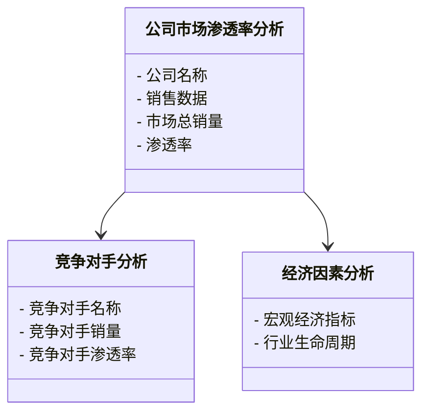
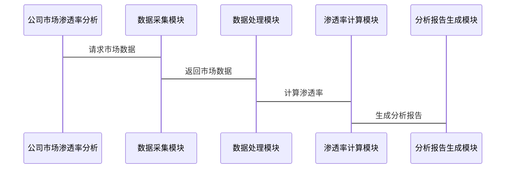

                 


# 彼得林奇如何分析公司的市场渗透率

---

## 关键词
彼得·林奇, 市场渗透率, 投资分析, 股票分析, 市场分析, 投资策略

---

## 摘要
本文将详细探讨彼得·林奇如何分析公司的市场渗透率，从基础概念到实际应用，结合理论与实践，帮助读者理解这一分析方法的核心思想和应用场景。文章涵盖市场渗透率的定义、计算方法、影响因素，以及如何将市场渗透率分析与公司基本面分析相结合，以做出明智的投资决策。

---

## 第一部分: 彼得·林奇的投资理念与市场渗透率基础

### 第1章: 彼得·林奇的投资哲学

#### 1.1 彼得·林奇的投资者画像
##### 1.1.1 彼得·林奇的生平简介
彼得·林奇（Peter Lynch）是美国著名的投资专家，曾任富达麦哲伦基金的经理，以卓越的投资业绩闻名。他强调长期投资和深入分析，认为市场渗透率是评估公司潜力的重要指标。

##### 1.1.2 他的投资理念与风格
林奇主张投资于自己理解的公司，注重基本面分析，尤其是市场份额和市场渗透率，认为这些指标能反映公司的市场地位和成长潜力。

##### 1.1.3 为什么他的方法值得学习
林奇的方法以深入分析和长期视角著称，他的策略和方法对投资者理解市场渗透率有重要启示。

#### 1.2 彼得·林奇的核心投资理念
##### 1.2.1 长期投资的重要性
林奇强调长期投资，认为短期波动不应影响投资决策。

##### 1.2.2 市场渗透率的核心作用
市场渗透率是评估公司市场地位的关键指标，反映了公司在目标市场中的份额。

### 第2章: 市场渗透率的核心概念

#### 2.1 市场渗透率的定义与公式
##### 2.1.1 市场渗透率的数学定义
$$ \text{市场渗透率} = \frac{\text{公司销量}}{\text{市场总销量}} \times 100\% $$

##### 2.1.2 彼得·林奇对市场渗透率的特殊理解
林奇认为市场渗透率不仅反映当前市场地位，还能预示未来的增长潜力。

#### 2.2 市场渗透率分析的背景
##### 2.2.1 问题背景与投资机会
市场渗透率是衡量公司竞争力的重要指标，高渗透率通常意味着较强的市场地位。

##### 2.2.2 渗透率与公司成长性的关系
高渗透率通常意味着公司已进入成熟期，而低渗透率可能意味着增长潜力。

### 第3章: 市场渗透率的行业对比分析

#### 3.1 不同行业的渗透率差异
##### 3.1.1 高科技行业的渗透率特点
高科技行业渗透率增长快，但竞争激烈。

##### 3.1.2 传统行业的渗透率特点
传统行业渗透率相对稳定，增长缓慢。

#### 3.2 渗透率与行业生命周期的关系
##### 3.2.1 行业生命周期的四个阶段
1. **导入期**：渗透率低，增长快。
2. **成长期**：渗透率上升，增长稳定。
3. **成熟期**：渗透率高，增长放缓。
4. **衰退期**：渗透率下降。

---

## 第二部分: 彼得·林奇市场渗透率分析方法

### 第4章: 市场渗透率的详细分析方法

#### 4.1 渗透率分析的核心步骤
##### 4.1.1 确定目标市场
明确公司的目标市场和竞争对手。

##### 4.1.2 收集行业数据
包括市场份额、销售数据等。

##### 4.1.3 计算渗透率指标
使用公式计算渗透率，并进行横向和纵向比较。

##### 4.1.4 分析渗透率变化趋势
观察渗透率的历史数据和未来预测。

#### 4.2 彼得·林奇的独特视角
##### 4.2.1 从消费者行为出发
关注消费者偏好和购买习惯的变化。

##### 4.2.2 关注竞争对手的渗透率
分析竞争对手的市场表现，寻找投资机会。

##### 4.2.3 结合宏观经济因素
考虑经济周期对市场渗透率的影响。

### 第5章: 渗透率的系统分析与架构设计

#### 5.1 问题场景介绍
分析公司市场渗透率，评估其投资价值。

#### 5.2 系统功能设计（领域模型）


#### 5.3 系统架构设计


#### 5.4 系统接口设计
接口：市场数据接口（获取市场总销量和公司销量）

#### 5.5 系统交互设计


### 第6章: 项目实战

#### 6.1 环境安装
安装必要的工具，如数据分析软件和图表生成工具。

#### 6.2 核心实现源代码
```python
import pandas as pd

def calculate_market_penetration(company_sales, market_sales):
    return (company_sales / market_sales) * 100

# 示例数据
company_sales = 1000
market_sales = 5000
penetration = calculate_market_penetration(company_sales, market_sales)
print(f"市场渗透率为: {penetration}%")
```

#### 6.3 案例分析
分析微软和苹果的市场渗透率，评估其投资价值。

### 第7章: 最佳实践与小结

#### 7.1 最佳实践
- 定期更新数据，保持分析的准确性。
- 结合其他指标，如利润率和增长潜力。

#### 7.2 小结
市场渗透率是评估公司投资价值的重要指标，林奇的方法提供了系统的分析框架，帮助投资者做出明智决策。

#### 7.3 注意事项
- 数据准确性至关重要。
- 分析需结合宏观环境和行业特点。

#### 7.4 拓展阅读
推荐阅读林奇的著作，深入理解其投资理念。

---

## 结语
通过本文，读者可以系统地学习彼得·林奇的市场渗透率分析方法，从理论到实践，逐步掌握这一关键的投资分析工具，为做出明智的投资决策提供有力支持。

