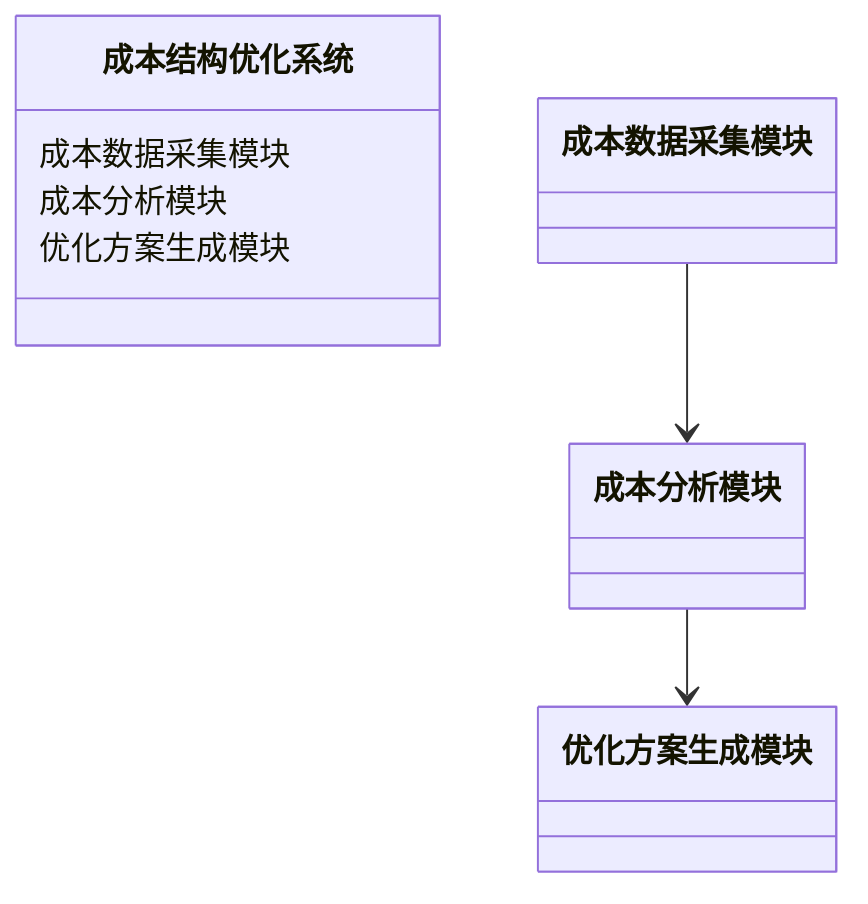

                 

# 彼得林奇如何分析公司的成本结构优化对长期竞争力的影响

> 关键词：彼得·林奇，成本结构优化，企业竞争力，投资分析，成本效益分析

> 摘要：本文详细探讨了彼得·林奇如何分析公司的成本结构优化对长期竞争力的影响。通过分析成本结构的核心概念、优化方法、系统设计、项目实战以及最佳实践，本文为读者提供了从理论到实践的全面指导，帮助企业在竞争激烈的市场中优化成本结构，提升长期竞争力。

---

## 第1章：引言

### 1.1 彼得·林奇与投资分析概述
彼得·林奇是全球著名的投资专家，以其对企业基本面分析和价值投资的理念闻名。他在分析企业时，特别关注成本结构的优化，认为这是企业长期竞争力的核心因素之一。

#### 1.1.1 彼得·林奇的背景与投资理念
彼得·林奇的职业生涯始于波士顿咨询公司，后加入富达投资集团，成为麦哲伦基金的经理。他的投资理念强调对企业基本面的深入分析，尤其是企业的成本结构、盈利能力和发展潜力。

#### 1.1.2 成本结构优化的定义与重要性
成本结构优化是指通过降低不必要的成本、提高资源利用效率和优化流程，从而在不影响产品质量的前提下降低成本，提升企业的竞争力。

#### 1.1.3 本书的目标与读者群体
本文的目标是通过彼得·林奇的分析方法，探讨成本结构优化对企业的长期竞争力的影响。适合的企业管理者、投资者以及对成本管理感兴趣的专业人士阅读。

### 1.2 问题背景与研究意义
企业成本结构的优化不仅是提高利润的手段，更是提升企业竞争力的关键因素。在当前全球经济环境下，企业需要通过优化成本结构来应对市场竞争的压力。

#### 1.2.1 企业成本结构优化的背景
随着市场竞争的加剧，企业需要通过优化成本结构来提高效率和降低成本。成本结构优化已成为企业生存和发展的关键。

#### 1.2.2 成本结构优化对竞争力的影响
成本结构优化能够提高企业的盈利能力，增强市场竞争力，同时还能提高企业的灵活性和应变能力。

#### 1.2.3 研究的现实意义与理论价值
从现实意义来看，优化成本结构可以帮助企业在竞争中占据优势；从理论价值来看，本文的研究为企业的成本管理提供了新的思路和方法。

### 1.3 本书结构与内容框架
本文分为七章，涵盖成本结构优化的核心概念、分析方法、系统设计、项目实战以及最佳实践等内容。

---

## 第2章：成本结构优化的核心概念

### 2.1 成本结构的定义与构成
成本结构是指企业在生产、运营和管理过程中所涉及的各种成本的构成和比例。优化成本结构是通过合理分配和降低各项成本，从而提高企业的盈利能力。

#### 2.1.1 成本结构的定义
成本结构是企业在生产和运营过程中所涉及的所有成本的总和，包括直接成本和间接成本。

#### 2.1.2 成本结构的构成要素
成本结构的构成要素包括原材料成本、人工成本、设备成本、运营成本等。

#### 2.1.3 成本结构的分类与特征
成本结构可以分为固定成本和变动成本。固定成本是企业在一定范围内不变的成本，如租金、 salaries；变动成本则是随着产量变化而变化的成本，如原材料成本。

### 2.2 成本结构优化的目标与原则
优化成本结构的目标是在不影响产品质量的前提下，降低总成本，提高企业的竞争力。优化的原则包括成本效益原则、系统性原则和动态优化原则。

#### 2.2.1 成本结构优化的目标
成本结构优化的目标是降低不必要的成本，提高资源利用效率，从而提高企业的盈利能力。

#### 2.2.2 成本结构优化的原则
成本结构优化的原则包括成本效益原则、系统性原则和动态优化原则。

#### 2.2.3 优化过程中的注意事项
在优化成本结构时，需要注意平衡成本降低和产品质量的关系，避免因降低成本而影响产品质量。

### 2.3 成本结构优化与企业竞争力的关系
优化成本结构能够提高企业的利润率，增强企业的市场竞争力，同时还能提高企业的灵活性和应变能力。

#### 2.3.1 成本结构优化对企业竞争力的影响
成本结构优化能够降低企业的生产成本，提高产品的竞争力，从而在市场中占据优势。

#### 2.3.2 优化成本结构的长期效益
优化成本结构的长期效益包括提高企业的利润率、增强企业的市场竞争力、提高企业的灵活性和应变能力。

#### 2.3.3 优化成本结构的短期挑战
优化成本结构的短期挑战包括可能需要投入大量的时间和资源，同时可能会影响产品的质量和企业的形象。

### 2.4 核心概念对比分析
通过对比分析成本结构与其他结构（如利润结构和收入结构）的关系，可以更好地理解成本结构优化的重要性。

#### 2.4.1 成本结构与利润结构的对比
成本结构与利润结构的关系是通过优化成本结构来提高利润。

#### 2.4.2 成本结构与收入结构的对比
成本结构与收入结构的关系是通过优化成本结构来提高收入。

#### 2.4.3 成本结构与资产结构的对比
成本结构与资产结构的关系是通过优化成本结构来提高资产的利用效率。

### 2.5 本章小结
本章主要介绍了成本结构优化的核心概念，包括成本结构的定义、构成要素、分类与特征，以及优化的目标与原则。通过对比分析，进一步理解了成本结构优化对企业竞争力的重要性。

---

## 第3章：彼得·林奇的成本结构分析方法

### 3.1 成本动因分析
成本动因是导致成本发生的原因，通过识别和分析成本动因，可以更好地优化成本结构。

#### 3.1.1 成本动因的定义与分类
成本动因是指导致成本发生的原因，可以分为固定成本动因和变动成本动因。

#### 3.1.2 成本动因的识别方法
识别成本动因的方法包括成本分析法、流程分析法和经验判断法。

#### 3.1.3 成本动因对成本结构的影响
成本动因分析可以帮助企业识别和优化成本结构中的关键因素，从而降低总体成本。

### 3.2 边际成本分析
边际成本是指每增加一单位产品所增加的成本，通过分析边际成本，可以优化生产规模和成本结构。

#### 3.2.1 边际成本的定义与计算公式
边际成本的定义是每增加一单位产品所增加的成本，计算公式为：
$$ \text{边际成本} = \frac{\Delta \text{总成本}}{\Delta \text{产量}} $$

#### 3.2.2 边际成本的分析方法
边际成本的分析方法包括比较分析法、趋势分析法和回归分析法。

#### 3.2.3 边际成本在成本结构优化中的应用
边际成本分析可以帮助企业确定最优生产规模，从而优化成本结构。

### 3.3 成本效益分析
成本效益分析是指通过比较不同成本方案的投入与产出，选择最优方案。

#### 3.3.1 成本效益分析的定义与步骤
成本效益分析的定义是通过比较不同成本方案的投入与产出，选择最优方案。步骤包括确定目标、收集数据、分析和选择最优方案。

#### 3.3.2 成本效益分析的数学模型
成本效益分析的数学模型为：
$$ \text{效益} = \text{收益} - \text{成本} $$

#### 3.3.3 成本效益分析在企业中的应用
成本效益分析可以帮助企业优化资源配置，提高效率，从而优化成本结构。

### 3.4 成本结构优化的工具与方法
通过使用各种工具和方法，可以更有效地优化成本结构。

#### 3.4.1 成本结构优化的工具
成本结构优化的工具包括成本分析软件、数据分析工具和优化算法。

#### 3.4.2 成本结构优化的方法
成本结构优化的方法包括流程优化、技术升级和管理改进。

### 3.5 本章小结
本章主要介绍了彼得·林奇的成本结构分析方法，包括成本动因分析、边际成本分析和成本效益分析，以及优化的工具与方法。

---

## 第4章：系统分析与架构设计

### 4.1 问题场景介绍
通过分析企业成本结构的现状，识别存在的问题，并制定优化方案。

#### 4.1.1 问题背景
企业成本结构中可能存在浪费、低效和不合理的情况，需要通过优化来提高效率。

#### 4.1.2 问题描述
企业成本结构中存在的问题包括高成本、低效率和不合理分配。

#### 4.1.3 问题解决
通过系统分析和优化设计，可以解决企业成本结构中的问题。

### 4.2 项目介绍
通过具体项目案例，展示成本结构优化的过程和效果。

#### 4.2.1 项目背景
某制造企业希望通过优化成本结构来提高利润率。

#### 4.2.2 项目目标
项目的目標是通过优化成本结构，降低生产成本，提高利润率。

#### 4.2.3 项目范围
项目范围包括生产成本、运营成本和管理成本的优化。

### 4.3 系统功能设计
通过系统功能设计，明确成本结构优化的具体措施。

#### 4.3.1 系统功能设计
系统功能设计包括成本数据采集、成本分析和优化方案生成。

#### 4.3.2 领域模型设计
领域模型设计包括成本动因分析、边际成本分析和成本效益分析。

#### 4.3.3 系统功能设计的Mermaid类图

### 4.4 系统架构设计
通过系统架构设计，实现成本结构优化的总体框架。

#### 4.4.1 系统架构设计
系统架构设计包括数据层、业务逻辑层和用户界面层。

#### 4.4.2 系统架构设计的Mermaid架构图

#### 4.4.3 系统接口设计
系统接口设计包括数据接口和用户接口。

#### 4.4.4 系统交互设计
系统交互设计包括用户与系统的交互流程。

### 4.5 本章小结
本章主要介绍了系统分析与架构设计，包括问题场景介绍、项目介绍、系统功能设计和系统架构设计。

---

## 第5章：项目实战

### 5.1 环境安装
通过具体案例，展示成本结构优化的过程和效果。

#### 5.1.1 环境要求
需要安装成本分析软件和数据分析工具。

#### 5.1.2 环境配置
配置开发环境，包括安装必要的软件和工具。

### 5.2 系统核心实现源代码
通过具体代码实现，展示成本结构优化的过程。

#### 5.2.1 核心代码实现
核心代码实现包括成本数据的采集、分析和优化方案的生成。

#### 5.2.2 代码实现的详细解读
通过代码解读，展示如何优化成本结构。

#### 5.2.3 代码应用解读与分析
通过代码应用解读，分析如何实现成本结构优化。

### 5.3 项目核心代码实现
通过具体代码实现，展示成本结构优化的过程。

#### 5.3.1 成本结构优化的代码实现
成本结构优化的代码实现包括成本数据的采集、分析和优化方案的生成。

#### 5.3.2 代码实现的详细解读
通过代码解读，展示如何优化成本结构。

#### 5.3.3 代码应用解读与分析
通过代码应用解读，分析如何实现成本结构优化。

### 5.4 项目小结
通过具体案例分析，展示成本结构优化的过程和效果。

#### 5.4.1 成本结构优化的过程
成本结构优化的过程包括数据采集、分析和优化方案的生成。

#### 5.4.2 成本结构优化的效果
成本结构优化的效果包括降低生产成本、提高利润率和增强市场竞争力。

### 5.5 本章小结
本章主要介绍了项目实战，包括环境安装、系统核心实现源代码、代码应用解读与分析以及项目小结。

---

## 第6章：最佳实践

### 6.1 核心知识点总结
总结成本结构优化的核心知识点。

#### 6.1.1 成本结构优化的核心概念
成本结构优化的核心概念包括成本结构的定义、构成要素、分类与特征，以及优化的目标与原则。

#### 6.1.2 成本结构优化的分析方法
成本结构优化的分析方法包括成本动因分析、边际成本分析和成本效益分析。

#### 6.1.3 成本结构优化的系统设计
成本结构优化的系统设计包括问题场景介绍、项目介绍、系统功能设计和系统架构设计。

### 6.2 小结
总结成本结构优化的实践经验和教训。

#### 6.2.1 成本结构优化的实践经验
成本结构优化的实践经验包括识别成本动因、分析边际成本和应用成本效益分析。

#### 6.2.2 成本结构优化的教训
成本结构优化的教训包括忽视产品质量、过度降低成本和忽略长期效益。

### 6.3 注意事项
在成本结构优化过程中，需要注意平衡成本降低和产品质量的关系。

#### 6.3.1 平衡成本降低与产品质量
在优化成本结构时，需要注意平衡成本降低和产品质量的关系，避免因降低成本而影响产品质量。

#### 6.3.2 优化过程中的动态调整
在优化成本结构时，需要根据市场变化和企业实际情况进行动态调整。

#### 6.3.3 长期与短期目标的平衡
在优化成本结构时，需要平衡长期与短期目标，避免因短期利益而忽视长期发展。

### 6.4 未来趋势与展望
展望成本结构优化的未来发展趋势。

#### 6.4.1 技术驱动的成本优化
随着技术的发展，成本结构优化将更加依赖于数据分析和人工智能技术。

#### 6.4.2 可持续发展与绿色成本结构
未来的成本结构优化将更加注重可持续发展，绿色成本结构将成为重要的优化方向。

#### 6.4.3 全球化与成本结构优化
在全球化背景下，成本结构优化将更加注重跨国公司的成本管理。

### 6.5 拓展阅读
推荐相关书籍和资源，供读者进一步学习。

#### 6.5.1 推荐书籍
推荐一些经典的成本管理书籍，供读者进一步学习。

#### 6.5.2 推荐资源
推荐一些在线资源和工具，供读者进一步学习。

### 6.6 本章小结
本章主要总结了成本结构优化的最佳实践，包括核心知识点总结、实践经验、注意事项和未来趋势展望。

---

## 第7章：附录

### 7.1 术语表
解释本文中涉及的专业术语。

#### 7.1.1 成本结构
成本结构是指企业在生产和运营过程中所涉及的所有成本的总和。

#### 7.1.2 成本动因
成本动因是导致成本发生的原因，可以分为固定成本动因和变动成本动因。

#### 7.1.3 边际成本
边际成本是指每增加一单位产品所增加的成本。

### 7.2 工具推荐
推荐一些成本结构优化的工具和资源。

#### 7.2.1 成本分析软件
推荐一些常用的成本分析软件，如Excel、ERP系统等。

#### 7.2.2 数据分析工具
推荐一些常用的

