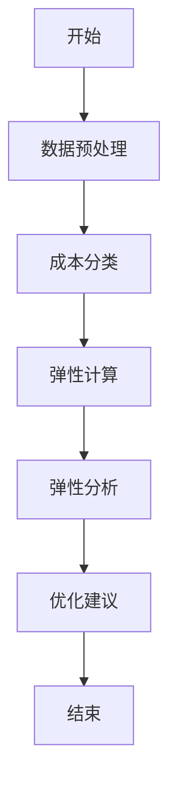
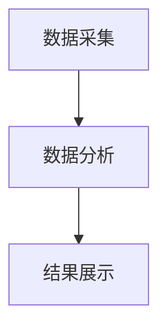

                 


# 彼得林奇如何分析公司的成本结构弹性

> 关键词：成本结构弹性，彼得林奇，企业成本分析，弹性系数，成本弹性模型

> 摘要：本文将详细探讨彼得·林奇如何分析公司的成本结构弹性。通过介绍成本结构弹性的定义、核心要素、数学模型、算法原理、系统架构设计以及项目实战，本文旨在帮助读者全面理解成本结构弹性的分析方法，并掌握如何在实际应用中进行成本结构弹性分析。

---

## 第1章: 成本结构弹性的定义与重要性

### 1.1 成本结构弹性的概念与背景

成本结构弹性是指企业在不同业务规模和市场环境下，成本随业务量变化的敏感程度。它是企业优化成本管理、提升竞争力的重要工具。成本结构弹性分析的核心在于理解成本如何随业务量变化，从而帮助企业制定灵活的成本策略。

- **问题背景**：企业在不同规模和市场条件下，成本的变化对企业利润的影响至关重要。如何量化和分析这种变化，是企业成本管理的关键。
- **问题描述**：成本结构弹性涉及固定成本、变动成本和混合成本的分析，帮助企业识别成本变化的趋势和敏感性。
- **问题解决**：通过分析成本结构弹性，企业可以优化资源配置，降低高弹性成本，提升整体盈利能力。

### 1.2 成本结构弹性与企业竞争力的关系

成本结构弹性直接影响企业的盈利能力和市场竞争力。弹性高的成本意味着成本随业务量变化较大，企业在业务扩张时成本上升较快，而在收缩时成本下降也较快。反之，弹性低的成本则相对稳定，适合业务波动较小的企业。

- **成本弹性与利润弹性**：成本弹性直接影响企业利润弹性。低成本弹性有助于企业在业务波动中保持稳定的利润。
- **成本弹性与企业战略**：企业可以通过调整成本结构弹性，制定灵活的市场进入策略和退出策略。

### 1.3 成本结构弹性分析的核心要素

成本结构弹性分析的核心要素包括：

- **固定成本**：企业在一定业务量范围内不变的成本。
- **变动成本**：随业务量变化的成本。
- **混合成本**：同时包含固定和变动成分的成本。
- **弹性系数**：量化成本变化的敏感程度。

---

## 第2章: 成本结构弹性分析的核心要素与分析框架

### 2.1 成本结构弹性的核心要素

- **固定成本**：如租金、工资等，不随业务量变化而变化。
- **变动成本**：如原材料、销售费用等，随业务量变化而变化。
- **混合成本**：如部分工资和原材料费用，既有固定部分也有变动部分。
- **弹性系数**：量化成本变化的敏感程度，公式为：弹性系数 = （Δ成本 / Δ业务量）。

### 2.2 成本结构弹性分析的框架

成本结构弹性分析的框架包括以下步骤：

1. **数据收集**：收集企业的成本和业务量数据。
2. **成本分类**：将成本分为固定、变动和混合三类。
3. **弹性计算**：计算各成本类型的弹性系数。
4. **弹性分析**：分析成本弹性对利润的影响。
5. **优化建议**：根据弹性分析结果，提出成本优化建议。

---

## 第3章: 成本结构弹性分析的数学模型与公式

### 3.1 成本结构弹性的数学定义

- **弹性系数公式**：
  $$ E = \frac{\Delta C}{\Delta Q} $$
  其中，E为弹性系数，ΔC为成本变化，ΔQ为业务量变化。

- **成本弹性分类**：
  - **完全弹性**：E = 1，成本变化与业务量变化完全同步。
  - **单位弹性**：E = 1，成本变化与业务量变化同步。
  - **无弹性**：E = 0，成本不随业务量变化。

### 3.2 成本结构弹性与利润弹性的关系公式

- **利润弹性公式**：
  $$ \text{利润弹性} = \text{收入弹性} - \text{成本弹性} $$

### 3.3 成本结构弹性分析的案例公式

- **案例分析**：假设某企业固定成本为100万元，变动成本为每件产品20元，业务量为1000件。
  - 总成本 = 100 + 20×1000 = 210万元。
  - 如果业务量增加到1200件，总成本 = 100 + 20×1200 = 250万元。
  - 弹性系数 = (250 - 210) / (1200 - 1000) = 40 / 200 = 0.2。

---

## 第4章: 成本结构弹性分析的算法原理与流程

### 4.1 成本结构弹性分析的算法原理

- **输入**：成本数据和业务量数据。
- **输出**：成本弹性系数和成本结构弹性分析报告。
- **步骤**：
  1. 数据预处理：清洗和整理数据。
  2. 成本分类：将成本分为固定、变动和混合三类。
  3. 弹性计算：计算各成本类型的弹性系数。
  4. 弹性分析：分析弹性系数对利润的影响。
  5. 优化建议：提出成本优化建议。

### 4.2 成本结构弹性分析的流程图



---

## 第5章: 成本结构弹性分析的系统架构与设计

### 5.1 系统架构设计

- **模块划分**：数据采集、数据分析、结果展示。
- **架构图**：


### 5.2 系统功能设计

- **数据采集模块**：负责收集企业的成本和业务量数据。
- **数据分析模块**：对数据进行预处理、分类和弹性计算。
- **结果展示模块**：展示弹性分析结果和优化建议。

### 5.3 系统交互设计

- **用户交互流程**：
  1. 用户输入数据。
  2. 系统进行数据处理。
  3. 系统输出分析结果。

---

## 第6章: 成本结构弹性分析的项目实战

### 6.1 项目背景与目标

- **项目背景**：帮助企业优化成本结构，提升盈利能力。
- **项目目标**：分析企业成本结构弹性，提出优化建议。

### 6.2 项目实施步骤

1. **数据收集**：收集企业的成本和业务量数据。
2. **数据预处理**：清洗和整理数据。
3. **成本分类**：将成本分为固定、变动和混合三类。
4. **弹性计算**：计算各成本类型的弹性系数。
5. **弹性分析**：分析弹性系数对利润的影响。
6. **优化建议**：提出成本优化建议。

### 6.3 项目代码实现

```python
import pandas as pd

# 数据加载
df = pd.read_csv('cost_data.csv')

# 数据预处理
df = df.dropna()

# 成本分类
fixed_cost = df['fixed_cost'].sum()
variable_cost = df['variable_cost'].sum()

# 弹性计算
delta_cost = variable_cost - fixed_cost
delta_quantity = df['quantity'].max() - df['quantity'].min()
elasticity = delta_cost / delta_quantity

print(f'弹性系数为：{elasticity}')
```

### 6.4 项目案例分析

- **案例背景**：某制造企业希望优化成本结构弹性。
- **数据分析过程**：通过数据分析，发现变动成本弹性较高，优化建议是减少变动成本。

---

## 第7章: 成本结构弹性分析的最佳实践与小结

### 7.1 最佳实践

- **数据质量**：确保数据准确性和完整性。
- **模型选择**：根据企业特点选择合适的弹性分析模型。
- **结果解读**：结合企业实际情况解读分析结果。

### 7.2 小结

成本结构弹性分析是企业优化成本管理的重要工具。通过本文的介绍，读者可以全面理解成本结构弹性分析的方法，并在实际应用中灵活运用。

### 7.3 注意事项

- **数据隐私**：注意保护企业数据隐私。
- **模型适用性**：根据企业实际情况选择合适的模型。

### 7.4 拓展阅读

- 推荐阅读彼得·林奇的《投资之道》。

---

通过以上分析，我们可以看到，成本结构弹性分析是企业优化成本管理的重要工具。希望本文能够帮助读者更好地理解和应用这一方法。

