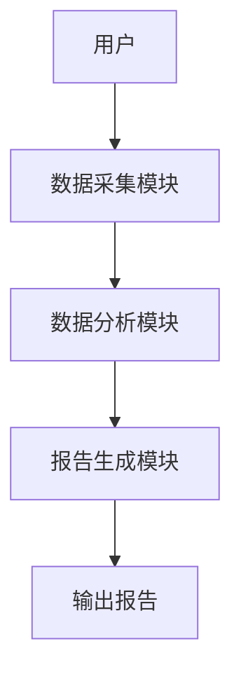
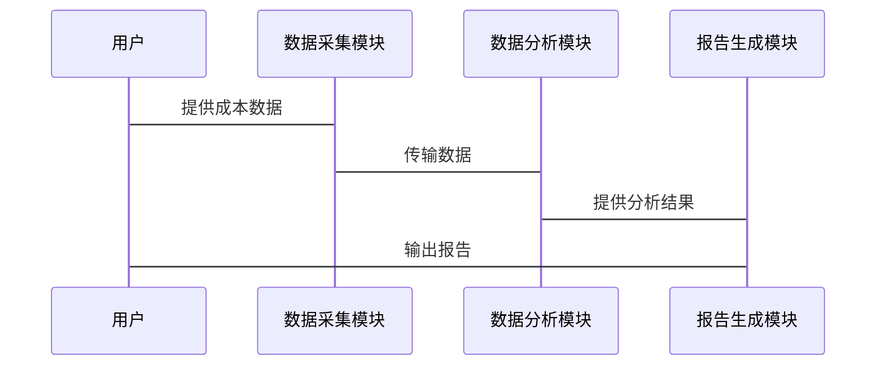

                 


# 彼得林奇如何分析公司的成本领导力

---

## 关键词：
- 彼得林奇
- 成本领导力
- 企业分析
- 投资策略
- 竞争优势

---

## 摘要：
彼得林奇是全球著名投资专家，以其独特的成本领导力分析方法闻名。本文系统地介绍彼得林奇的成本领导力分析框架，包括核心概念、分析工具、行业案例、数学模型及系统架构。通过详细讲解，帮助读者掌握如何通过成本分析识别企业竞争优势，制定有效投资策略。

---

# 第1章: 成本领导力的定义与重要性

## 1.1 成本领导力的定义

### 1.1.1 成本领导力的核心概念
成本领导力是指企业在行业中通过优化成本结构，以获得价格优势和竞争优势的能力。核心在于降低单位产品成本，同时保持或提升产品价值。

### 1.1.2 成本领导力在企业中的作用
- **成本优势**：降低生产成本，提高利润率。
- **价格竞争优势**：通过低成本定价策略，吸引客户。
- **可持续发展**：优化成本结构，增强企业长期竞争力。

## 1.2 彼得林奇的分析方法

### 1.2.1 彼得林奇的分析框架
彼得林奇的分析框架包括成本结构分析、效率优化和竞争优势评估，帮助投资者识别具备成本领导力的企业。

### 1.2.2 彼得林奇的分析工具
- **财务报表分析**：通过利润表、资产负债表识别成本结构。
- **成本驱动因素分析**：识别影响成本的关键因素，如原材料价格、人工成本。

## 1.3 成本领导力的背景与现状

### 1.3.1 当前企业成本管理的挑战
- 原材料价格上涨
- 人工成本增加
- 技术进步带来的成本变化

### 1.3.2 成本领导力在行业中的应用现状
- 制造业：通过自动化降低生产成本
- 零售业：优化供应链降低成本
- 科技业：通过规模效应降低成本

### 1.3.3 成本领导力的未来发展趋势
- 技术驱动成本优化
- 绿色生产降低成本
- 全球化供应链的成本管理

---

# 第2章: 成本领导力的核心要素

## 2.1 成本结构分析

### 2.1.1 固定成本与可变成本的区分
- **固定成本**：如厂房租金、设备折旧。
- **可变成本**：如原材料、人工成本。

### 2.1.2 成本驱动因素的识别
识别影响成本的关键因素，如供应商议价能力、技术进步等。

## 2.2 效率优化策略

### 2.2.1 生产效率的提升方法
- 技术升级：引入自动化设备提高生产效率。
- 工艺优化：改进生产工艺降低材料浪费。

### 2.2.2 运营效率的优化技巧
- 供应链管理：优化库存管理，减少库存成本。
- 流程优化：精简业务流程，降低管理成本。

## 2.3 竞争优势分析

### 2.3.1 成本优势的来源
- 低成本生产模式：如规模化生产。
- 高效管理：如先进的ERP系统。

### 2.3.2 竞争对手的成本分析
分析竞争对手的成本结构，识别其成本优势和劣势。

---

# 第3章: 彼得林奇的分析框架

## 3.1 投资策略的核心要素

### 3.1.1 投资目标的确定
确定投资目标，选择具备成本领导力的企业。

### 3.1.2 投资策略的制定
基于成本分析结果，制定投资组合策略。

## 3.2 分析工具与方法

### 3.2.1 财务报表分析
通过利润表分析企业成本结构，评估成本控制能力。

### 3.2.2 成本结构分析
识别企业的固定成本和可变成本，评估成本优势。

## 3.3 分析框架的实施步骤

### 3.3.1 数据收集与整理
收集企业的财务报表和行业数据，进行初步分析。

### 3.3.2 数据分析与评估
使用成本分析工具，评估企业的成本结构和竞争优势。

### 3.3.3 结果应用与优化
根据分析结果，优化投资策略，调整投资组合。

---

# 第4章: 行业案例分析

## 4.1 制造业的成本领导力分析

### 4.1.1 制造业的成本结构特点
- 高固定成本：如厂房和设备。
- 高可变成本：如原材料和人工成本。

### 4.1.2 制造业的成本优化案例
- 某公司通过自动化设备降低生产成本，提升效率。

## 4.2 零售业的成本领导力分析

### 4.2.1 零售业的成本结构特点
- 低固定成本：如租赁费用。
- 高可变成本：如商品采购成本。

### 4.2.2 零售业的成本优化案例
- 某公司通过优化供应链管理，降低采购成本。

## 4.3 科技业的成本领导力分析

### 4.3.1 科技业的成本结构特点
- 低固定成本：如研发和市场推广。
- 高可变成本：如研发投入和产品开发。

### 4.3.2 科技业的成本优化案例
- 某公司通过规模效应降低单位产品成本。

---

# 第5章: 成本领导力的数学模型和分析方法

## 5.1 成本函数分析

### 5.1.1 成本函数的定义
$$ C = a + bQ $$
其中，C是总成本，a是固定成本，b是单位可变成本，Q是产量。

### 5.1.2 边际成本分析
$$ MC = \frac{dC}{dQ} = b $$

## 5.2 成本优势评估

### 5.2.1 成本优势指数
$$ CSI = \frac{C_{\text{公司}}}{C_{\text{行业}}} $$
CSI小于1表示公司具有成本优势。

## 5.3 成本优化模型

### 5.3.1 总成本优化
$$ \text{总成本} = \text{固定成本} + \text{可变成本} \times Q $$

---

# 第6章: 成本领导力的系统架构和设计

## 6.1 系统架构设计

### 6.1.1 系统功能模块
- 数据采集模块：收集企业成本数据。
- 数据分析模块：分析成本结构，评估成本优势。
- 报告生成模块：生成分析报告，提供优化建议。

### 6.1.2 系统架构图


## 6.2 系统接口设计

### 6.2.1 数据接口
- 数据输入接口：接收企业成本数据。
- 数据输出接口：提供分析结果。

### 6.2.2 接口交互流程图


---

# 第7章: 项目实战

## 7.1 环境安装

### 7.1.1 系统需求
- 操作系统：Windows 10或更高版本。
- 开发工具：Python 3.8或更高版本，Jupyter Notebook。

## 7.2 核心代码实现

### 7.2.1 成本分析代码
```python
import pandas as pd

# 数据读取
data = pd.read_csv('cost_data.csv')

# 成本结构分析
fixed_cost = data['fixed_cost'].sum()
variable_cost = data['variable_cost'].sum()

# 成本优势指数计算
industry_cost = 10000  # 假设行业总成本为10000
company_cost = fixed_cost + variable_cost
csi = company_cost / industry_cost

print(f"固定成本: {fixed_cost}")
print(f"可变成本: {variable_cost}")
print(f"成本优势指数: {csi}")
```

## 7.3 案例分析

### 7.3.1 制造业成本优化案例
某制造公司通过引入自动化设备，将生产效率提升20%，单位产品成本降低15%。

### 7.3.2 零售业成本优化案例
某零售公司优化供应链管理，采购成本降低10%，库存周转率提升15%。

---

# 第8章: 最佳实践与小结

## 8.1 最佳实践

### 8.1.1 数据驱动决策
基于数据分析，制定成本优化策略。

### 8.1.2 持续优化
定期评估成本结构，及时调整优化策略。

## 8.2 小结

彼得林奇的成本领导力分析方法，通过识别企业的成本结构和竞争优势，帮助投资者制定有效的投资策略。在实际应用中，需要结合行业特点，灵活运用分析工具，持续优化成本结构，提升企业的竞争力。

---

# 第9章: 拓展阅读

## 9.1 推荐书籍

### 9.1.1 《彼得林奇的投资智慧》
深入解读彼得林奇的投资理念和分析方法。

### 9.1.2 《成本管理》
系统介绍成本管理的方法和技巧。

## 9.2 其他资源

### 9.2.1 彼得林奇的演讲视频
观看彼得林奇的演讲，了解他的最新观点。

### 9.2.2 成本管理在线课程
学习成本管理的在线课程，提升分析能力。

---

# 结语

通过本文的学习，读者可以掌握彼得林奇的成本领导力分析方法，识别企业的成本优势，制定有效的投资策略。希望本文对读者在成本分析和投资决策中有所帮助。

