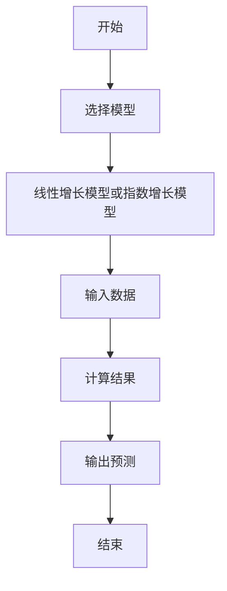
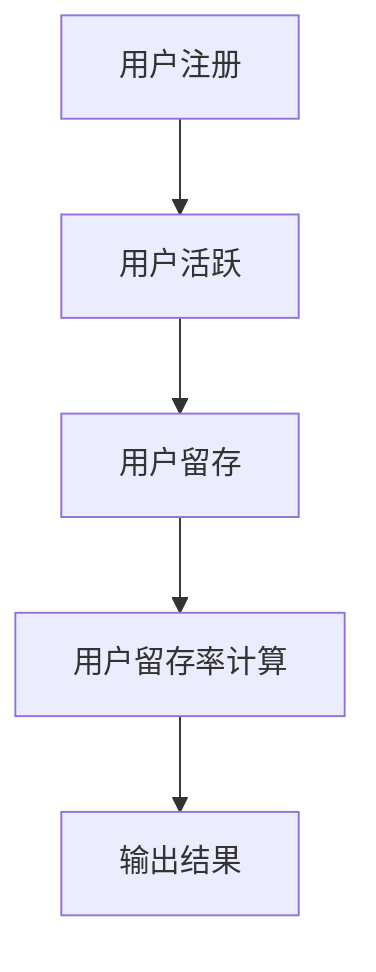
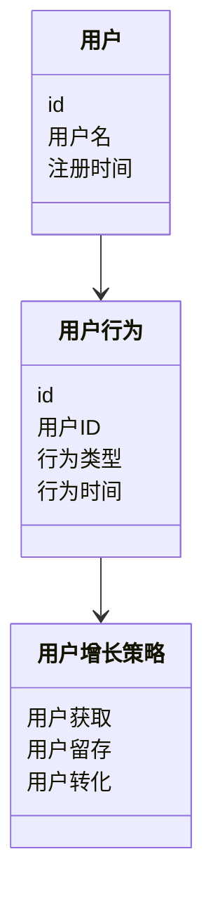
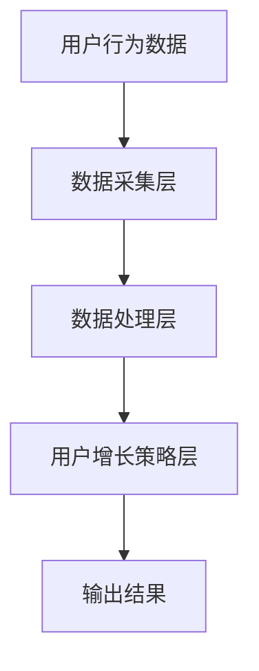

                 


# 彼得林奇如何分析公司的用户增长策略

---

## 关键词：
彼得林奇、用户增长、投资分析、增长模型、用户留存、用户转化

---

## 摘要：
本文从彼得·林奇的投资者视角出发，详细分析了公司用户增长策略的核心要素、数学模型、系统架构和实战案例。通过背景介绍、核心概念、算法原理、系统设计和项目实战等多维度的深入探讨，帮助读者理解用户增长策略在投资决策中的重要性，并提供实际操作的指导。

---

## 第一部分：用户增长策略的背景与核心概念

### 第1章：用户增长策略的定义与重要性

#### 1.1 用户增长策略的定义
用户增长策略是公司通过各种手段吸引新用户、提高用户留存率和转化率的过程。其核心目标是通过用户数量和质量的双重提升，实现公司业务的可持续增长。

**背景介绍**：
- **用户增长策略的重要性**：在数字经济时代，用户增长直接关系到公司的市场竞争力和盈利能力。
- **彼得·林奇的投资者视角**：彼得·林奇认为，用户增长是评估公司长期潜力的重要指标，尤其是在科技和互联网行业。

#### 1.2 彼得林奇的用户增长分析方法
彼得·林奇在分析公司时，重点关注用户增长的可持续性和经济性。他通过以下几个方面进行评估：
- **用户获取成本（CAC）**：用户获取成本是否合理，是否低于用户生命周期价值（CLTV）。
- **用户留存率**：用户的留存情况反映了产品和服务的吸引力。
- **用户转化率**：从潜在用户转化为付费用户的比例，体现了公司的销售能力。

#### 1.3 用户增长策略的背景与趋势
随着互联网和移动应用的普及，用户增长策略逐渐从单纯的广告投放转向精细化运营。彼得·林奇强调，用户增长不仅仅是数量的增加，更是质量的提升，尤其是在用户体验和产品创新方面。

---

### 第2章：用户增长策略的核心要素

#### 2.1 用户增长的三要素
用户增长策略可以分解为三个核心要素：用户获取、用户留存和用户转化。

**核心概念与联系**：
- **用户获取**：通过广告、SEO、社交媒体等方式吸引用户。
- **用户留存**：通过产品优化、个性化推荐等方式提高用户粘性。
- **用户转化**：通过销售漏斗将潜在用户转化为付费用户。

**ER实体关系图**：
```mermaid
erd
    entity 用户 {
        id
        用户名
        注册时间
        用户状态
    }
    entity 用户行为 {
        id
        用户ID
        行为类型（浏览、点击、注册、购买）
        行为时间
    }
    用户 --> 用户行为
```

---

## 第二部分：用户增长策略的数学模型与公式

### 第3章：用户增长预测模型

#### 3.1 用户增长预测模型
用户增长预测模型是通过数学公式预测未来用户数量的变化趋势。常见的模型包括线性增长模型和指数增长模型。

**算法原理**：
- **线性增长模型**：假设用户增长是线性的，公式为：
  $$ 用户增长 = a \times 时间 + b $$
- **指数增长模型**：假设用户增长是指数级的，公式为：
  $$ 用户增长 = a \times e^{bt} $$

**流程图**：


#### 3.2 用户留存率计算公式
用户留存率是衡量用户粘性的重要指标，公式为：
$$ 用户留存率 = \frac{留存用户数}{初始用户数} $$

**流程图**：


---

## 第三部分：用户增长策略的系统分析与架构设计

### 第4章：用户增长策略的系统架构

#### 4.1 系统功能设计
用户增长系统的功能模块包括用户获取、用户行为分析、用户留存优化和用户转化提升。

**领域模型**：


#### 4.2 系统架构设计
用户增长系统的架构包括数据采集层、数据处理层和用户增长策略层。

**系统架构图**：


---

## 第四部分：用户增长策略的项目实战

### 第5章：用户增长策略的实战分析

#### 5.1 环境安装与配置
在进行用户增长策略分析之前，需要安装必要的工具和环境，例如数据分析工具（Python、SQL）、可视化工具（Tableau）和机器学习框架（Scikit-learn）。

#### 5.2 核心代码实现
以下是一个用户增长预测的Python代码示例：
```python
import numpy as np
import matplotlib.pyplot as plt

# 线性增长模型
def linear_growth(time, a, b):
    return a * time + b

# 指数增长模型
def exponential_growth(time, a, b):
    return a * np.exp(b * time)

# 示例数据
time = np.array([1, 2, 3, 4, 5])
users_linear = linear_growth(time, 2, 10)
users_exponential = exponential_growth(time, 10, 0.5)

# 绘制图形
plt.figure(figsize=(10, 6))
plt.plot(time, users_linear, label='线性增长')
plt.plot(time, users_exponential, label='指数增长')
plt.xlabel('时间')
plt.ylabel('用户数量')
plt.legend()
plt.show()
```

---

## 第五部分：用户增长策略的投资与总结

### 第6章：用户增长策略的投资总结

#### 6.1 投资总结
用户增长策略是评估公司潜力的重要指标。彼得·林奇强调，投资者应关注用户的可持续增长和盈利能力的结合。

#### 6.2 最佳实践
- **关注用户留存率**：高留存率反映了产品的核心价值。
- **优化用户转化路径**：降低转化成本，提高转化效率。
- **持续关注用户增长模型**：通过数据驱动的决策优化增长策略。

#### 6.3 小结
用户增长策略不仅是公司的增长引擎，也是投资者评估公司价值的重要依据。通过系统的分析和优化，公司可以实现用户数量和质量的双重提升。

---

## 第六部分：附录与拓展阅读

### 附录A：用户增长相关工具与资源

#### 1. 数据分析工具
- Python（Pandas、NumPy）
- SQL
- Tableau

#### 2. 机器学习库
- Scikit-learn
- TensorFlow

#### 3. 在线资源
- 彼得·林奇的书籍推荐
- 用户增长策略的学术论文

---

通过以上分析，我们可以看到，用户增长策略是公司和投资者都不可忽视的重要因素。彼得·林奇的分析方法为我们提供了一个系统的框架，帮助我们更好地理解和应用用户增长策略。

