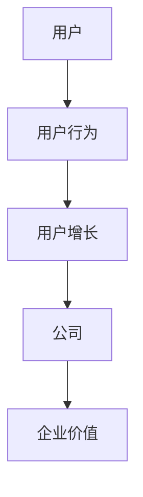
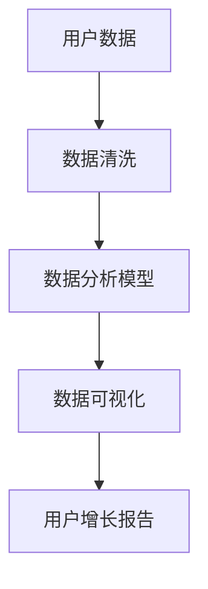

                 


# 彼得林奇如何分析公司的用户增长质量

## 关键词：
- 彼得林奇，用户增长，质量分析，投资价值，数据分析，企业估值

## 摘要：
本文将介绍彼得林奇的投资理念，特别是他如何通过分析公司的用户增长质量来评估企业的投资价值。文章将详细探讨用户增长质量的核心概念、关键指标、数据分析方法，并通过实际案例分析，展示如何运用这些方法来评估企业的长期发展潜力。

---

## 第一部分: 彼得林奇投资理念与用户增长质量分析背景

### 第1章: 彼得林奇投资理念概述

#### 1.1 彼得林奇投资哲学

- **1.1.1 价值投资的核心理念**
  彼得林奇是价值投资的代表人物，他强调通过深入分析企业的基本面，寻找被市场低估的投资机会。他认为，投资的本质是通过研究企业的财务状况、竞争优势和未来前景，找到那些能够持续创造价值的企业。

- **1.1.2 彼得林奇的投资策略**
  彼得林奇的投资策略以长期持有和分散投资为特点。他认为，短期市场波动不可预测，但企业的内在价值可以通过长期研究来确定。他特别关注企业的财务健康状况、盈利能力、成长潜力以及管理层的质量。

- **1.1.3 投资中的长期主义**
  彼得林奇反对短期投机，主张通过长期持有优质企业股票，分享企业成长的成果。他认为，真正的投资回报来自于企业的持续增长，而不是市场的短期波动。

#### 1.2 用户增长质量与企业价值

- **1.2.1 用户增长对企业价值的影响**
  在彼得林奇看来，用户增长是企业价值增长的重要驱动力。用户数量的增加通常意味着企业收入的增长，但更重要的是用户质量。高质量的用户更有可能持续使用产品或服务，为企业创造长期价值。

- **1.2.2 用户质量与企业可持续发展的关系**
  用户质量是用户增长质量的核心。高质量的用户通常具有更高的留存率、更高的活跃度和更强的付费意愿。彼得林奇认为，只有拥有高质量用户的公司，才能实现可持续的收入增长和利润提升。

- **1.2.3 用户增长质量的定义与衡量标准**
  用户增长质量是指用户数量的增长是否伴随着用户质量的提升。衡量标准包括用户活跃度、留存率、生命周期价值（LTV）和用户获取成本（CAC）等指标。

#### 1.3 本章小结

- **1.3.1 彼得林奇投资理念的核心要点**
  彼得林奇的投资理念强调价值投资、长期持有和分散投资。他认为，企业的内在价值是投资的核心，而用户增长质量是企业价值的重要组成部分。

- **1.3.2 用户增长质量对企业价值的关键作用**
  用户增长质量不仅影响企业的收入和利润，还影响企业的可持续发展能力。高质量的用户能够为企业带来长期价值，从而提升企业的整体估值。

---

## 第二部分: 用户增长质量分析的核心概念与联系

### 第2章: 用户增长质量的核心概念

#### 2.1 用户增长质量的定义与属性

- **2.1.1 用户增长质量的定义**
  用户增长质量是指用户数量的增长是否伴随着用户质量的提升。高质量的用户通常具有更高的活跃度、留存率和生命周期价值。

- **2.1.2 用户增长质量的关键属性对比表格**
  | 属性                | 定义                                                                 | 示例             |
  |---------------------|----------------------------------------------------------------------|------------------|
  | 用户活跃度          | 用户使用产品或服务的频率                                                 | 日活用户数（DAU） |
  | 用户留存率          | 用户持续使用产品或服务的比例                                             | 次日留存率、7日留存率 |
  | 用户生命周期        | 用户从初次使用到流失的阶段                                             | 新用户、活跃用户、沉睡用户、流失用户 |
  | 用户满意度          | 用户对产品或服务的满意程度                                             | NPS（净推荐值）   |

- **2.1.3 用户增长质量与企业价值的关系**
  用户增长质量不仅影响企业的收入和利润，还影响企业的可持续发展能力。高质量的用户能够为企业带来长期价值，从而提升企业的整体估值。

#### 2.2 用户增长质量与企业价值的关系

- **2.2.1 用户增长质量对企业估值的影响**
  用户增长质量是企业估值的重要因素。高质量的用户能够为企业带来稳定的收入和利润，从而提高企业的整体估值。

- **2.2.2 用户增长质量与企业可持续发展的关系**
  用户增长质量是企业可持续发展的关键。只有拥有高质量用户的公司，才能实现持续的收入增长和利润提升。

- **2.2.3 用户增长质量的外部环境影响**
  用户增长质量还受到市场环境、竞争格局和技术发展的外部因素影响。例如，市场需求的饱和、竞争对手的崛起或技术的进步都可能影响用户的增长质量。

#### 2.3 用户增长质量分析的ER实体关系图



---

## 第三部分: 用户增长质量分析的算法原理讲解

### 第3章: 用户增长质量分析的关键指标

#### 3.1 用户增长质量的关键指标

- **3.1.1 用户增长率**
  用户增长率是指用户数量的同比增长率或环比增长率。计算公式为：

  $$ 用户增长率 = \frac{当前用户数 - 上期用户数}{上期用户数} \times 100\% $$

- **3.1.2 用户留存率**
  用户留存率是指在一定时间内，用户持续使用产品或服务的比例。计算公式为：

  $$ 用户留存率 = \frac{留存用户数}{初始用户数} \times 100\% $$

- **3.1.3 用户活跃度**
  用户活跃度是指用户在一定时间内使用产品或服务的频率。通常可以用日活用户数（DAU）和月活用户数（MAU）的比率来衡量，即DAU/MAU比率。

- **3.1.4 用户生命周期价值（LTV）**
  用户生命周期价值是指用户在其生命周期内为企业带来的总收入减去获取和维护该用户的成本。计算公式为：

  $$ LTV = \frac{平均收入 per 用户 \times 用户生命周期长度}{用户获取成本（CAC）} $$

#### 3.2 用户增长质量分析的算法原理

- **3.2.1 用户生命周期模型**
  用户生命周期模型将用户分为新用户、活跃用户、沉睡用户和流失用户四个阶段。通过分析用户在不同阶段的行为，可以更好地理解用户增长的质量。

- **3.2.2 用户留存分析模型**
  用户留存分析模型通过分析用户在一定时间内的留存情况，评估用户的粘性和活跃度。例如，通过计算次日留存率、7日留存率和30日留存率，可以判断用户是否对产品或服务产生粘性。

- **3.2.3 用户增长预测模型**
  用户增长预测模型通过历史数据和趋势分析，预测未来的用户增长情况。常用的方法包括线性回归、ARIMA模型和指数平滑法。

#### 3.3 用户增长质量分析的Python代码实现

```python
import pandas as pd
import numpy as np
import matplotlib.pyplot as plt
from sklearn.linear_model import LinearRegression

# 示例数据：用户增长数据
data = {
    '日期': ['2023-01', '2023-02', '2023-03', '2023-04', '2023-05'],
    '用户数': [1000, 1200, 1300, 1400, 1500]
}
df = pd.DataFrame(data)

# 绘制用户增长趋势图
plt.plot(df['日期'], df['用户数'])
plt.title('用户增长趋势图')
plt.xlabel('日期')
plt.ylabel('用户数')
plt.show()

# 用户增长率计算
df['用户增长率'] = (df['用户数'] - df['用户数'].shift(1)) / df['用户数'].shift(1)
print('用户增长率:', df['用户增长率'])
```

---

## 第四部分: 用户增长质量分析的系统设计与实现

### 第4章: 用户增长质量分析系统设计

#### 4.1 系统功能设计

- **4.1.1 数据采集模块**
  数据采集模块负责从企业系统中获取用户数据，包括用户ID、注册时间、登录时间、行为数据等。

- **4.1.2 数据分析模块**
  数据分析模块负责对采集到的数据进行清洗、建模和分析，计算用户增长率、留存率、活跃度等关键指标。

- **4.1.3 数据可视化模块**
  数据可视化模块负责将分析结果以图表形式展示，便于用户理解和分析。

#### 4.2 系统架构设计



#### 4.3 系统接口设计

- **用户数据接口**
  REST API接口，用于获取用户数据，格式为JSON。

- **数据清洗接口**
  接口用于对用户数据进行清洗，包括处理缺失值、异常值等。

- **数据分析接口**
  接口用于执行数据分析任务，返回用户增长质量的关键指标。

#### 4.4 系统交互流程图

```mermaid
sequenceDiagram
    用户输入请求
    ->> 数据采集模块: 获取用户数据
    数据采集模块
    ->> 数据清洗模块: 请求数据清洗
    数据清洗模块
    ->> 数据分析模块: 请求数据分析
    数据分析模块
    ->> 数据可视化模块: 请求数据可视化
    数据可视化模块
    ->> 用户报告: 生成用户增长报告
```

---

## 第五部分: 用户增长质量分析的项目实战

### 第5章: 用户增长质量分析的实战案例

#### 5.1 项目背景介绍

- 某互联网公司希望评估其用户增长质量，以便更好地制定用户增长策略。

#### 5.2 项目实施步骤

- **数据采集**
  从数据库中提取过去一年的用户数据，包括用户ID、注册时间、登录时间、行为数据等。

- **数据清洗**
  清洗数据，处理缺失值和异常值，确保数据的准确性和完整性。

- **数据分析**
  使用Python和Pandas进行数据分析，计算用户增长率、留存率、活跃度等关键指标。

- **数据可视化**
  使用Matplotlib或Seaborn绘制用户增长趋势图、留存率分布图等。

- **案例分析**
  通过分析数据，发现用户增长质量存在问题，例如用户留存率较低或活跃度下降。

- **优化建议**
  根据分析结果，提出优化建议，例如优化用户体验、提高用户留存率等。

#### 5.3 项目小结

- **项目总结**
  通过本次项目，我们掌握了用户增长质量分析的关键指标和方法，能够帮助企业更好地评估用户增长质量，制定有效的用户增长策略。

- **注意事项**
  在分析用户增长质量时，需要注意数据的准确性和完整性，同时结合企业的实际情况制定合理的分析策略。

- **拓展阅读**
  推荐阅读《彼得林奇选股术》和《数据分析实战》等书籍，进一步提升用户增长质量分析的能力。

---

## 结语

通过本文的介绍，我们可以看到，用户增长质量是企业价值的重要组成部分。彼得林奇通过分析用户增长质量，帮助企业发现潜在问题，并制定有效的投资策略。希望本文能够为读者在用户增长质量分析方面提供有价值的参考和指导。

