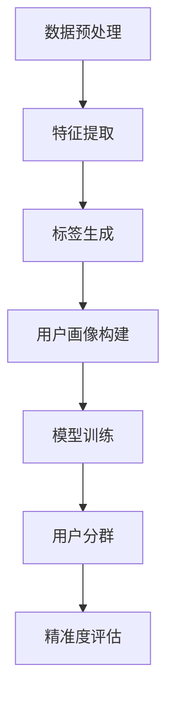
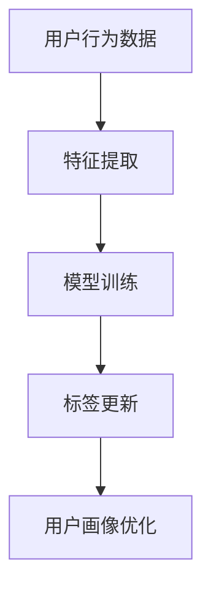

                 


# 彼得林奇如何分析公司的用户画像精准度

> 关键词：用户画像精准度、彼得林奇分析方法、用户分群、数据分析、投资哲学

> 摘要：本文深入探讨了彼得林奇的投资哲学在分析公司用户画像精准度中的应用，结合数据分析和算法原理，详细讲解了如何通过用户画像的构建、分析和优化，提升用户画像的精准度，从而为商业决策提供更准确的支持。

---

# 第一部分: 用户画像精准度分析的背景与核心概念

## 第1章: 用户画像精准度分析的背景与意义

### 1.1 用户画像的定义与重要性

#### 1.1.1 用户画像的定义
用户画像是基于用户行为数据、属性数据和偏好数据，构建的用户立体画像。它通过数据挖掘和分析技术，将用户特征转化为可分析的标签体系，帮助企业和产品更好地理解用户需求和行为。

#### 1.1.2 用户画像在商业中的重要性
用户画像是企业进行精准营销、个性化推荐和用户分群的重要基础。精准的用户画能够让企业在制定市场策略时更加有的放矢，提高营销效率和用户满意度。

#### 1.1.3 用户画像精准度的定义与衡量标准
用户画像的精准度是指用户画像标签与实际用户特征的匹配程度。其衡量标准包括标签的覆盖率、准确性、区分度和一致性。

### 1.2 彼得·林奇分析方法的核心思想

#### 1.2.1 彼得·林奇的投资哲学
彼得·林奇以其独特的投资哲学闻名，他注重对公司基本面的深入分析，尤其是对公司的财务状况、市场地位和管理团队的考察。他强调通过深入研究公司和行业，找到具有长期增长潜力的投资标的。

#### 1.2.2 从投资分析到用户画像精准度的借鉴
彼得·林奇的分析方法强调数据驱动的决策，注重对公司基本面的多维度考察。这种思维方式可以借鉴到用户画像精准度分析中，即通过多维度的数据分析，构建精准的用户画像，从而帮助企业更好地理解用户需求和市场趋势。

#### 1.2.3 用户画像精准度分析的商业价值
精准的用户画能够让企业在市场推广、产品设计和客户服务等方面做出更明智的决策，从而提升用户体验和企业效益。

---

## 第2章: 用户画像精准度分析的核心概念与联系

### 2.1 用户画像的构成要素

#### 2.1.1 人口统计特征
- 年龄
- 性别
- 地区
- 收入水平
- 职业

#### 2.1.2 行为特征
- 使用频率
- 使用时长
- 访问时间
- 用户路径
- 用户留存率

#### 2.1.3 偏好与需求特征
- 喜好类型
- 消费习惯
- 产品偏好
- 价格敏感度
- 品牌忠诚度

#### 2.1.4 用户画像的动态变化
用户画像并不是一成不变的，随着用户行为和市场环境的变化，用户画像需要不断更新和优化。

### 2.2 核心概念对比分析

#### 2.2.1 不同用户画像模型的对比
- 基于统计的用户画像模型
- 基于机器学习的用户画像模型
- 基于规则的用户画像模型

#### 2.2.2 用户画像与用户分群的对比
用户画像是对用户的全面描述，而用户分群则是根据用户特征将用户划分为不同的群体。两者相辅相成，共同服务于精准营销和个性化推荐。

#### 2.2.3 用户画像精准度与用户行为预测的关系
精准的用户画像是准确预测用户行为的基础。通过精准的用户画像，可以更准确地预测用户的购买行为、使用行为和流失风险。

### 2.3 用户画像精准度分析的ER实体关系图

```mermaid
er
    actor 用户
    actor 数据源
    actor 分析模型
    actor 应用场景
    database 用户画像数据库
    database 行为数据数据库
    database 用户属性数据库
    relationship 用户 -> 属于 -> 用户分群
    relationship 用户 -> 包含 -> 用户属性
    relationship 用户 -> 产生 -> 用户行为
    relationship 用户分群 -> 使用 -> 分析模型
    relationship 分析模型 -> 存储于 -> 用户画像数据库
```

---

## 第3章: 用户画像精准度分析的算法原理与数学模型

### 3.1 用户画像的构建与优化

#### 3.1.1 数据预处理
- 数据清洗：去除重复数据、缺失数据和异常数据。
- 数据标准化：将不同量纲的数据进行标准化处理，以便后续分析。

#### 3.1.2 用户画像的标签生成



#### 3.1.3 算法实现

```python
import pandas as pd
from sklearn.cluster import KMeans
from sklearn.metrics import silhouette_score

# 数据预处理
data = pd.read_csv('user_data.csv')
data = data.dropna()
data = (data - data.mean()) / data.std()

# 特征提取
features = data[['age', 'income', 'gender_code', 'region_code']]

# 聚类分析
model = KMeans(n_clusters=5, random_state=42)
model.fit(features)

# 评估模型
score = silhouette_score(features, model.labels_)
print(f'模型 silhouette 分数为: {score}')
```

#### 3.1.4 数学模型

用户画像的精准度可以通过以下公式进行评估：

$$
\text{精准度} = \frac{\text{正确预测的用户数}}{\text{总用户数}}
$$

### 3.2 用户画像的动态更新与优化

#### 3.2.1 动态更新机制
- 定期更新：根据最新数据，定期更新用户画像。
- 实时更新：根据用户的实时行为，动态更新用户画像。

#### 3.2.2 用户画像的优化算法



---

## 第4章: 用户画像精准度分析的系统架构与设计

### 4.1 系统功能设计

#### 4.1.1 领域模型设计


#### 4.1.2 系统架构设计


---

## 第5章: 用户画像精准度分析的项目实战

### 5.1 项目背景介绍

#### 5.1.1 项目目标
构建一个精准的用户画像系统，帮助公司进行精准营销和个性化推荐。

#### 5.1.2 项目范围
- 数据收集与清洗
- 特征提取与标签生成
- 用户分群与画像构建
- 精准度评估与优化

### 5.2 核心代码实现

#### 5.2.1 环境安装
```bash
pip install pandas scikit-learn matplotlib
```

#### 5.2.2 核心代码

```python
import pandas as pd
from sklearn.cluster import DBSCAN
from sklearn.preprocessing import StandardScaler

# 数据加载与预处理
data = pd.read_csv('user_data.csv')
data = data.dropna()
scaler = StandardScaler()
scaled_data = scaler.fit_transform(data[['age', 'income', 'gender_code', 'region_code']])

# 聚类分析
model = DBSCAN(eps=0.5, min_samples=5)
model.fit(scaled_data)

# 用户分群
clusters = pd.DataFrame({'cluster': model.labels_, 'user_id': data.index})
clusters = clusters.groupby('cluster').count().sort_values('user_id', ascending=False)
```

#### 5.2.3 代码解读与分析
通过DBSCAN算法进行用户分群，可以将用户划分为不同的群体，从而构建精准的用户画像。

### 5.3 实际案例分析

#### 5.3.1 案例背景
某电商平台希望通过用户画像精准度分析，提升其精准营销的效果。

#### 5.3.2 数据分析与优化
通过分析用户的购买行为和浏览行为，构建精准的用户画像，从而制定个性化的营销策略。

### 5.4 项目小结

---

## 第6章: 用户画像精准度分析的最佳实践

### 6.1 小结与总结

- 用户画像是企业进行精准营销和个性化推荐的重要工具。
- 彼得·林奇的投资哲学为用户画像精准度分析提供了重要的借鉴。

### 6.2 注意事项与建议

- 数据隐私与安全：在构建用户画像时，必须注意数据隐私和用户隐私保护。
- 数据更新与维护：定期更新用户画像，确保其准确性和及时性。

### 6.3 拓展阅读与学习资源

- 《彼得·林奇的投资哲学》
- 《用户画像：数据分析的艺术》
- 《机器学习实战》

---

# 结语

通过本文的分析，我们可以看到，彼得·林奇的投资哲学为用户画像精准度分析提供了重要的方法论支持。结合现代数据分析技术，我们可以构建出更精准、更有效的用户画像，从而为企业决策提供更有力的支持。

