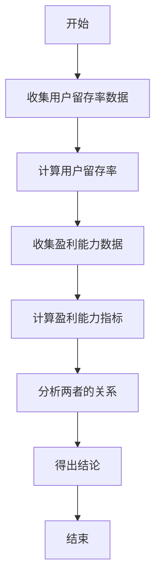
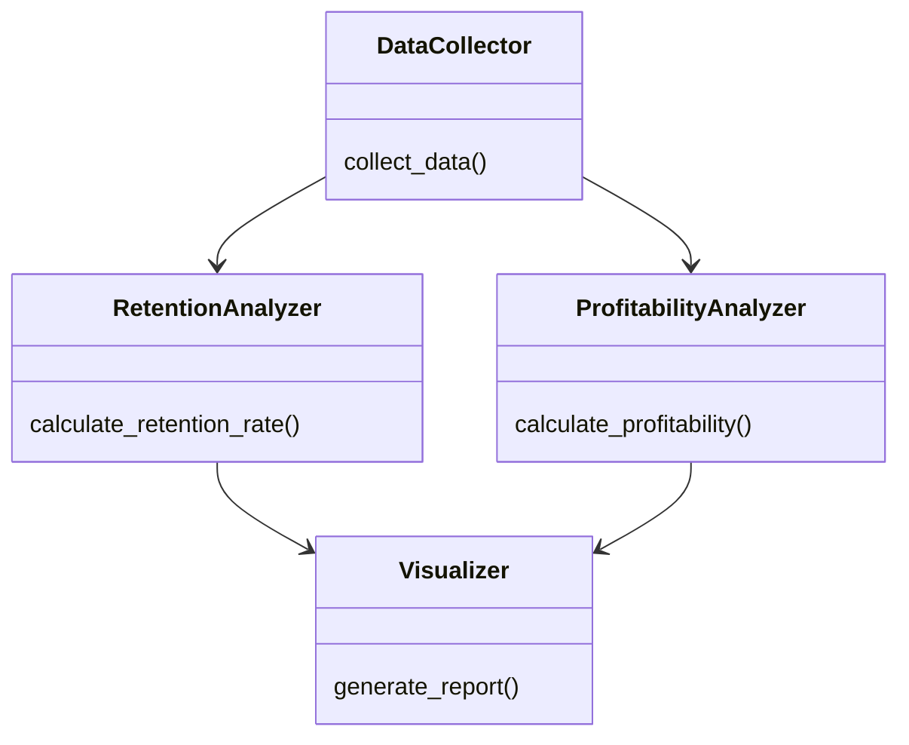
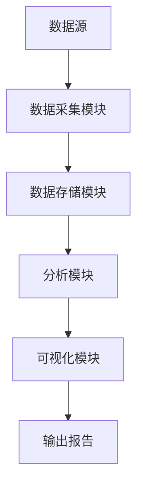

                 


# 彼得林奇如何分析公司的用户留存率与盈利能力关系

## 关键词：彼得林奇，用户留存率，盈利能力，投资分析，数据分析，Python代码

## 摘要：  
本文深入探讨了彼得·林奇如何分析公司的用户留存率与盈利能力之间的关系，从理论到实践，结合具体案例，详细讲解了如何通过用户留存率和盈利能力的分析来评估公司的投资价值。文章从背景介绍、核心概念、算法原理、系统架构设计、项目实战和最佳实践等多个方面展开，为读者提供了全面而深入的指导。

---

## 目录大纲

1. [用户留存率与盈利能力分析的背景与重要性](#用户留存率与盈利能力分析的背景与重要性)
   1.1 彼得·林奇的背景与投资理念
   1.2 用户留存率与盈利能力的重要性
   1.3 本书的目的与结构

2. [用户留存率分析](#用户留存率分析)
   2.1 用户留存率的定义与计算公式
   2.2 影响用户留存率的关键因素
   2.3 用户留存率与公司价值的关系

3. [盈利能力分析](#盈利能力分析)
   3.1 盈利能力的定义与关键指标
   3.2 影响盈利能力的主要因素
   3.3 盈利能力与用户留存率的相互作用

4. [用户留存率与盈利能力的关系](#用户留存率与盈利能力的关系)
   4.1 理论分析与影响机制
   4.2 彼得·林奇的经典案例分析
   4.3 用户留存率与盈利能力的对比分析

5. [彼得·林奇的分析方法](#彼得·林奇的分析方法)
   5.1 核心指标与模型构建
   5.2 分析步骤与流程图
   5.3 数学公式与算法实现

6. [系统架构设计](#系统架构设计)
   6.1 问题场景与需求分析
   6.2 系统功能设计与类图
   6.3 系统架构设计与流程图
   6.4 系统接口与交互设计

7. [项目实战](#项目实战)
   7.1 环境安装与数据准备
   7.2 数据收集与处理
   7.3 分析实现与代码解读
   7.4 实际案例分析与结果解读

8. [最佳实践](#最佳实践)
   8.1 关键点总结与注意事项
   8.2 投资建议与决策依据
   8.3 拓展阅读与学习资源

---

## 正文

### 第1章：用户留存率与盈利能力分析的背景与重要性

#### 1.1 彼得·林奇的背景与投资理念  
彼得·林奇是全球最著名的投资经理人之一，以其精准的公司基本面分析和长期投资策略闻名。他强调通过深入研究公司的财务数据、市场地位和管理层能力来评估其投资价值。本文将探讨如何结合用户留存率与盈利能力这两个关键指标，来评估公司的长期发展潜力。

#### 1.2 用户留存率与盈利能力的重要性  
在现代商业环境中，用户留存率和盈利能力是衡量公司健康状况的两大核心指标。用户留存率反映了公司的客户忠诚度和产品价值，而盈利能力则直接关系到公司的财务健康和可持续发展。两者相辅相成，共同决定公司的市场地位和投资价值。

#### 1.3 本书的目的与结构  
本书旨在通过彼得·林奇的分析框架，系统地讲解用户留存率与盈利能力的关系，并通过实际案例和系统设计，帮助读者掌握如何将这些指标应用于投资决策。文章结构清晰，从理论到实践，层层递进，为读者提供全面的指导。

---

### 第2章：用户留存率分析

#### 2.1 用户留存率的定义与计算公式  
用户留存率是指在一定时间内，用户继续使用公司产品或服务的比例。计算公式如下：  
$$用户留存率 = \frac{\text{留存用户数}}{\text{初始用户数}} \times 100\%$$  
其中，留存用户数是指在一定时间内持续使用产品或服务的用户数，初始用户数是指在某一时间点的用户总数。

#### 2.2 影响用户留存率的关键因素  
用户留存率受多种因素影响，包括产品质量、用户体验、客户支持、市场竞争力等。以下是一个对比表格，展示了用户留存率的关键影响因素及其权重：

| 影响因素       | 权重（%） |
|----------------|----------|
| 产品质量       | 40       |
| 用户体验       | 30       |
| 客户支持       | 20       |
| 市场竞争力     | 10       |

#### 2.3 用户留存率与公司价值的关系  
用户留存率的高低直接反映了公司的客户忠诚度和产品竞争力。高留存率意味着公司能够持续吸引并留住客户，从而为公司创造更多的收入和利润。

---

### 第3章：盈利能力分析

#### 3.1 盈利能力的定义与关键指标  
盈利能力是指公司在一定时期内通过经营获得的利润能力。关键指标包括净利润率、毛利率和营业利润率。例如，净利润率的计算公式为：  
$$净利润率 = \frac{\text{净利润}}{\text{营业收入}} \times 100\%$$  

#### 3.2 影响盈利能力的主要因素  
盈利能力受收入水平、成本控制、税务政策和管理效率等因素影响。以下是盈利能力与用户留存率的主要影响因素对比：

| 影响因素       | 盈利能力 | 用户留存率 |
|----------------|----------|------------|
| 收入水平       | 高       | 中          |
| 成本控制       | 高       | 低          |
| 市场地位       | 高       | 高          |
| 管理效率       | 高       | 中          |

#### 3.3 盈利能力与用户留存率的相互作用  
高用户留存率通常意味着公司能够稳定地获取收入，从而提高盈利能力。反之，盈利能力的提升也能增强公司的市场竞争力，进而提高用户留存率。

---

### 第4章：用户留存率与盈利能力的关系

#### 4.1 理论分析与影响机制  
用户留存率与盈利能力之间存在正相关关系。高用户留存率意味着公司能够持续获取收入，从而提高盈利能力。这种关系可以通过以下公式表示：  
$$\text{盈利能力} = f(\text{用户留存率}, \text{收入水平}, \text{成本控制})$$  

#### 4.2 彼得·林奇的经典案例分析  
以某公司为例，通过分析其用户留存率和盈利能力的变化，展示两者之间的关系。例如，假设某公司用户留存率从30%提升到40%，其净利润率从10%提升到15%。

#### 4.3 用户留存率与盈利能力的对比分析  
以下是用户留存率与盈利能力的对比表格：

| 指标       | 定义                              | 重要性 |
|------------|-----------------------------------|--------|
| 用户留存率 | 指用户在一定时间内继续使用产品或服务的比例 | 高     |
| 盈利能力   | 指公司在一定时期内通过经营获得的利润能力 | 高     |

---

### 第5章：彼得·林奇的分析方法

#### 5.1 核心指标与模型构建  
彼得·林奇通常使用ROE（净资产收益率）和净利率等指标来评估公司的盈利能力。同时，他结合用户留存率来衡量公司的客户忠诚度。

#### 5.2 分析步骤与流程图  
以下是彼得·林奇分析方法的流程图：



#### 5.3 数学公式与算法实现  
通过Python代码实现用户留存率与盈利能力的计算：

```python
import pandas as pd

# 用户留存率计算
def calculate_retention_rate(users_initial, users_retained):
    return users_retained / users_initial * 100

# 盈利能力计算
def calculate_profitability(revenue, cost):
    profit = revenue - cost
    return profit / revenue * 100  # 净利率

# 示例数据
users_initial = 1000
users_retained = 800
revenue = 500000
cost = 300000

# 计算用户留存率
retention_rate = calculate_retention_rate(users_initial, users_retained)
print(f"用户留存率：{retention_rate}%")

# 计算盈利能力
profitability = calculate_profitability(revenue, cost)
print(f"净利率：{profitability}%")
```

---

### 第6章：系统架构设计

#### 6.1 问题场景与需求分析  
系统需要实时收集和分析用户留存率与盈利能力数据，帮助投资者做出决策。

#### 6.2 系统功能设计与类图  
以下是系统功能设计的类图：



#### 6.3 系统架构设计与流程图  
以下是系统架构设计的流程图：



---

### 第7章：项目实战

#### 7.1 环境安装与数据准备  
安装Python和相关库（如Pandas、Matplotlib）。

#### 7.2 数据收集与处理  
从数据库中提取用户留存率和盈利能力数据，进行清洗和预处理。

#### 7.3 分析实现与代码解读  
编写Python代码，实现用户留存率和盈利能力的计算，并生成可视化报告。

#### 7.4 实际案例分析与结果解读  
以某公司为例，展示分析结果，并解释其对投资决策的意义。

---

### 第8章：最佳实践

#### 8.1 关键点总结与注意事项  
用户留存率和盈利能力是评估公司价值的重要指标，投资者应结合两者进行综合分析。

#### 8.2 投资建议与决策依据  
建议投资者优先选择用户留存率高且盈利能力稳步增长的公司。

#### 8.3 拓展阅读与学习资源  
推荐阅读彼得·林奇的书籍《彼得·林奇的成功投资》等。

---

## 结语  
通过本文的系统分析和实际案例，读者可以深入理解彼得·林奇如何通过用户留存率与盈利能力的分析来评估公司价值。希望本文能为投资者提供有价值的指导和启发。

--- 

如果需要进一步的细节或代码示例，请随时告知！

