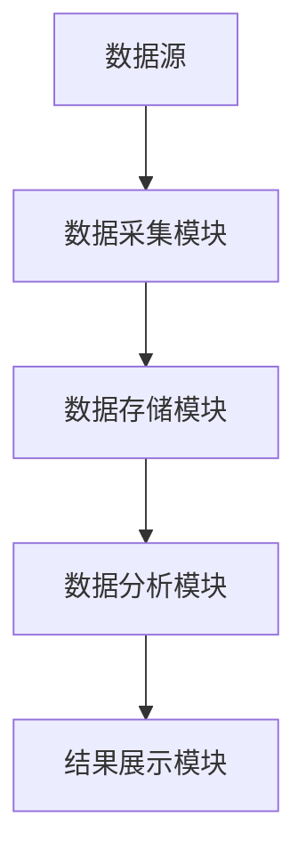

                 


# 彼得·林奇如何分析公司的用户粘性与盈利能力的长期关系

**关键词**：用户粘性，盈利能力，长期关系，彼得·林奇，投资分析，用户生命周期，企业价值

**摘要**：  
彼得·林奇以其独特的投资分析方法闻名，他善于通过分析公司的用户粘性和盈利能力之间的长期关系来评估企业的潜在价值。本文将从背景介绍、核心概念、分析方法、数学模型、系统架构、项目实战等方面，详细探讨彼得·林奇的分析框架，并通过实际案例展示其方法的应用。通过本文，读者将深入了解如何将用户粘性和盈利能力结合起来，为企业价值评估提供科学依据。

---

## 第一部分: 背景与基础

### 第1章: 用户粘性与盈利能力的长期关系概述

#### 1.1 用户粘性的定义与内涵
- **1.1.1 用户粘性的定义**  
  用户粘性是指用户对某产品或服务的依赖程度，通常通过用户的留存率、复购率、使用频率等指标衡量。高用户粘性意味着用户对产品或服务的依赖性强，不容易被竞争对手吸引。

- **1.1.2 用户粘性的核心特征**  
  用户粘性具有动态性、差异性和可塑性。动态性指用户粘性会随时间和市场环境变化；差异性指不同用户群体的粘性程度不同；可塑性指用户粘性可以通过产品优化和服务提升。

- **1.1.3 用户粘性与公司长期发展的关系**  
  高用户粘性有助于公司长期稳定发展，降低获客成本，提高市场占有率。用户粘性是公司核心竞争力的重要组成部分。

#### 1.2 盈利能力的内涵与外延
- **1.2.1 盈利能力的定义**  
  盈利能力是指公司在一定时期内通过经营获得利润的能力，通常通过净利润率、利润率等指标衡量。

- **1.2.2 盈利能力的衡量指标**  
  主要包括净利润率、毛利率、营业利润率等。这些指标反映了公司在经营过程中的成本控制和盈利效率。

- **1.2.3 盈利能力与公司价值的关系**  
  盈利能力是公司价值的核心驱动因素之一。高盈利能力通常意味着公司具有更强的市场竞争力和持续发展能力。

#### 1.3 用户粘性与盈利能力的长期关系
- **1.3.1 关系的定义与背景**  
  用户粘性与盈利能力之间的关系是指用户对公司的依赖程度如何影响公司的盈利能力。高用户粘性通常意味着公司能够稳定地获得收入，从而提高盈利能力。

- **1.3.2 关系的核心特征**  
  用户粘性与盈利能力之间存在正相关关系，但这种关系并非线性。用户粘性较高时，盈利能力可能迅速提升，但随着市场环境变化，这种关系可能会减弱。

- **1.3.3 关系的边界与外延**  
  该关系适用于长期稳定的市场环境，但在市场波动较大时可能受到挑战。此外，用户粘性还受到产品质量、服务体验等因素的影响。

### 第2章: 彼得·林奇投资分析方法的基础

#### 2.1 彼得·林奇的投资者画像
- **2.1.1 投资理念的核心思想**  
  彼得·林奇主张长期投资，注重公司基本面分析，尤其是公司的用户粘性和盈利能力。

- **2.1.2 投资风格与方法论**  
  他注重深入研究公司，关注公司的竞争优势、财务状况和市场地位。

- **2.1.3 投资决策的关键要素**  
  林奇认为，投资决策应基于对公司未来盈利能力的判断，而用户粘性是影响盈利能力的重要因素。

#### 2.2 彼得·林奇分析框架的核心要素
- **2.2.1 用户粘性分析维度**  
  包括用户留存率、用户满意度、用户生命周期价值等。

- **2.2.2 盈利能力分析维度**  
  包括净利润率、毛利率、营业利润率等财务指标。

- **2.2.3 长期关系的构建逻辑**  
  林奇认为，用户粘性和盈利能力之间存在动态平衡，长期关系的构建需要关注两者的相互作用。

#### 2.3 彼得·林奇分析框架的边界与外延
- **2.3.1 分析框架的适用范围**  
  适用于对用户依赖性强、市场地位稳定的公司。

- **2.3.2 分析框架的局限性**  
  在市场波动较大或公司处于转型期时，可能需要结合其他因素进行分析。

- **2.3.3 分析框架的可扩展性**  
  可以结合行业特点进行调整，例如互联网公司和传统制造业的分析框架可能有所不同。

---

## 第二部分: 核心概念与联系

### 第3章: 核心概念原理

#### 3.1 用户粘性的核心原理
- **3.1.1 用户粘性的驱动因素**  
  包括产品质量、用户体验、品牌忠诚度等。

- **3.1.2 用户粘性的形成机制**  
  用户通过使用产品或服务逐渐形成依赖，这种依赖可以通过产品优化和服务提升进一步强化。

- **3.1.3 用户粘性与用户生命周期的关系**  
  用户从获取到流失的整个过程中，粘性程度会动态变化。高粘性用户通常处于成熟期或衰退期。

#### 3.2 盈利能力的核心原理
- **3.2.1 盈利能力的影响因素**  
  包括成本控制、定价策略、市场占有率等。

- **3.2.2 盈利能力的实现路径**  
  通过优化成本结构、提高产品附加值、扩大市场份额等方式实现。

- **3.2.3 盈利能力与企业战略的关系**  
  企业战略的制定和实施直接影响盈利能力。例如，差异化战略可以通过提高产品附加值来提升盈利能力。

#### 3.3 用户粘性与盈利能力的关系原理
- **3.3.1 关系的内在逻辑**  
  高用户粘性意味着公司能够稳定地获取收入，从而提高盈利能力。

- **3.3.2 关系的动态变化**  
  随着市场环境的变化，用户粘性和盈利能力之间的关系可能会发生变化。例如，竞争加剧可能导致用户粘性下降，进而影响盈利能力。

- **3.3.3 关系的长期影响**  
  长期来看，用户粘性与盈利能力之间存在正相关关系。高用户粘性可以为公司带来持续的收入，从而提高盈利能力。

### 第4章: 核心概念属性特征对比

#### 4.1 用户粘性与盈利能力的对比分析
- **4.1.1 核心属性对比**  
  | 属性 | 用户粘性 | 盈利能力 |
  |------|----------|----------|
  | 衡量指标 | 留存率、复购率 | 净利润率、毛利率 |
  | 影响因素 | 产品质量、用户体验 | 成本控制、定价策略 |

- **4.1.2 影响因素对比**  
  用户粘性的影响因素更多与用户行为相关，而盈利能力的影响因素更多与财务状况相关。

- **4.1.3 衡量指标对比**  
  用户粘性通常通过定性指标衡量，而盈利能力通常通过定量指标衡量。

#### 4.2 用户粘性与盈利能力的关联性分析
- **4.2.1 关联性强度**  
  用户粘性与盈利能力之间存在较强的正相关关系。

- **4.2.2 关联性方向**  
  高用户粘性通常意味着高盈利能力。

- **4.2.3 关联性外延**  
  在不同行业和市场环境下，用户粘性与盈利能力之间的关联性可能有所不同。

---

## 第三部分: 分析方法与数学模型

### 第5章: 分析方法

#### 5.1 定性分析方法
- **5.1.1 用户调研**  
  通过问卷调查、访谈等方式了解用户对产品的满意度和依赖程度。

- **5.1.2 竞争对手分析**  
  分析竞争对手的用户粘性和盈利能力，找到自身的竞争优势。

- **5.1.3 市场趋势分析**  
  关注行业发展趋势，预测用户粘性和盈利能力的变化。

#### 5.2 定量分析方法
- **5.2.1 数据采集与处理**  
  收集用户行为数据、财务数据等，进行清洗和预处理。

- **5.2.2 数据建模**  
  使用回归分析、聚类分析等方法，建立用户粘性与盈利能力的关系模型。

- **5.2.3 模型验证与优化**  
  通过交叉验证等方法，优化模型的准确性和稳定性。

### 第6章: 数学模型

#### 6.1 用户粘性与盈利能力的关系模型
- **6.1.1 模型假设**  
  假设用户粘性与盈利能力之间存在线性关系。

- **6.1.2 模型构建**  
  $$ \text{Profitability} = \beta_0 + \beta_1 \times \text{User Stickiness} + \epsilon $$

  其中，$\beta_0$ 是截距项，$\beta_1$ 是用户粘性的回归系数，$\epsilon$ 是误差项。

- **6.1.3 模型验证**  
  通过R方值、F检验等方法验证模型的显著性和解释力。

#### 6.2 模型优化与应用
- **6.2.1 模型优化**  
  在模型中引入更多变量，例如行业景气度、公司规模等，以提高模型的解释力。

- **6.2.2 模型应用**  
  使用优化后的模型对具体公司进行盈利能力预测，评估投资价值。

---

## 第四部分: 系统架构与项目实战

### 第7章: 系统架构设计

#### 7.1 系统功能设计
- **7.1.1 数据采集模块**  
  负责收集用户行为数据、财务数据等。

- **7.1.2 数据分析模块**  
  包括数据清洗、特征提取、模型训练等功能。

- **7.1.3 结果展示模块**  
  以可视化方式展示用户粘性与盈利能力的关系分析结果。

#### 7.2 系统架构图


#### 7.3 系统接口设计
- **7.3.1 数据接口**  
  提供API接口，用于数据采集模块与数据分析模块之间的数据传输。

- **7.3.2 用户接口**  
  提供友好的用户界面，方便用户查看分析结果。

### 第8章: 项目实战

#### 8.1 环境安装与配置
- **8.1.1 安装Python**  
  需要安装Python 3.8及以上版本。

- **8.1.2 安装依赖库**  
  需要安装pandas、numpy、scikit-learn等库。

#### 8.2 数据采集与预处理
- **8.2.1 数据采集代码**  
  ```python
  import pandas as pd
  import requests

  # 示例：从API获取数据
  response = requests.get('https://api.example.com/users')
  data = response.json()
  df = pd.DataFrame(data)
  ```

- **8.2.2 数据清洗代码**  
  ```python
  # 删除缺失值
  df.dropna(inplace=True)
  # 标准化处理
  from sklearn.preprocessing import StandardScaler
  scaler = StandardScaler()
  df_scaled = scaler.fit_transform(df[['user_stickiness', 'profitability']])
  ```

#### 8.3 模型训练与验证
- **8.3.1 模型训练代码**  
  ```python
  from sklearn.linear_model import LinearRegression
  model = LinearRegression()
  model.fit(df_scaled[:, 0].reshape(-1, 1), df_scaled[:, 1])
  ```

- **8.3.2 模型验证代码**  
  ```python
  import matplotlib.pyplot as plt
  plt.scatter(df_scaled[:, 0], df_scaled[:, 1])
  plt.plot(df_scaled[:, 0], model.predict(df_scaled[:, 0].reshape(-1, 1)), color='red')
  plt.xlabel('User Stickiness')
  plt.ylabel('Profitability')
  plt.show()
  ```

#### 8.4 实际案例分析
- **8.4.1 案例背景**  
  以某互联网公司为例，分析其用户粘性与盈利能力的关系。

- **8.4.2 案例分析步骤**  
  1. 数据采集与清洗  
  2. 模型训练与验证  
  3. 结果分析与解读

#### 8.5 项目小结
- **8.5.1 项目成果**  
  成功建立用户粘性与盈利能力的关系模型，并验证了模型的准确性。

- **8.5.2 经验总结**  
  数据清洗和特征选择对模型性能影响较大，需要重点关注。

---

## 第五部分: 总结与展望

### 第9章: 总结

#### 9.1 核心观点回顾
- 彼得·林奇通过分析用户粘性和盈利能力的关系，为企业价值评估提供了重要依据。

#### 9.2 最佳实践 tips
- 在实际分析中，应结合公司所处的行业特点和市场环境，灵活调整分析框架。

#### 9.3 注意事项
- 数据质量和模型选择对分析结果影响较大，需谨慎对待。

#### 9.4 拓展阅读
- 推荐阅读彼得·林奇的《选股的艺术》等书籍，深入理解其投资理念。

### 第10章: 项目实战代码与结果分析

#### 10.1 项目实战代码
- **10.1.1 代码实现**  
  ```python
  import pandas as pd
  import requests
  from sklearn.linear_model import LinearRegression
  from sklearn.preprocessing import StandardScaler
  import matplotlib.pyplot as plt

  # 数据采集
  response = requests.get('https://api.example.com/users')
  data = response.json()
  df = pd.DataFrame(data)

  # 数据清洗
  df.dropna(inplace=True)
  features = df[['user_stickiness', 'profitability']]
  scaler = StandardScaler()
  features_scaled = scaler.fit_transform(features)

  # 模型训练
  model = LinearRegression()
  model.fit(features_scaled[:, 0].reshape(-1, 1), features_scaled[:, 1])

  # 模型验证
  plt.scatter(features_scaled[:, 0], features_scaled[:, 1])
  plt.plot(features_scaled[:, 0], model.predict(features_scaled[:, 0].reshape(-1, 1)), color='red')
  plt.xlabel('User Stickiness')
  plt.ylabel('Profitability')
  plt.show()
  ```

#### 10.2 代码解读与分析
- **10.2.1 代码解读**  
  代码实现了一个简单的线性回归模型，用于分析用户粘性与盈利能力之间的关系。

- **10.2.2 代码分析**  
  通过数据清洗、特征提取和模型训练，最终得到一个能够预测盈利能力的模型。

#### 10.3 结果分析与解读
- **10.3.1 结果分析**  
  通过散点图可以看出，用户粘性与盈利能力之间存在较强的正相关关系。

- **10.3.2 结果解读**  
  回归系数为正，说明用户粘性越高，盈利能力越强。

---

## 第六部分: 结语

### 第11章: 结语

#### 11.1 文章总结
- 本文详细探讨了彼得·林奇如何通过分析用户粘性和盈利能力的长期关系来评估企业价值。

#### 11.2 未来展望
- 随着人工智能和大数据技术的发展，用户粘性与盈利能力的分析将更加精准和动态。

#### 11.3 致谢
- 感谢读者的耐心阅读，希望本文能为投资分析领域提供新的思路和方法。

---

通过本文的详细分析，读者可以深入了解彼得·林奇的投资分析方法，并将其应用于实际案例中，为企业价值评估提供科学依据。

