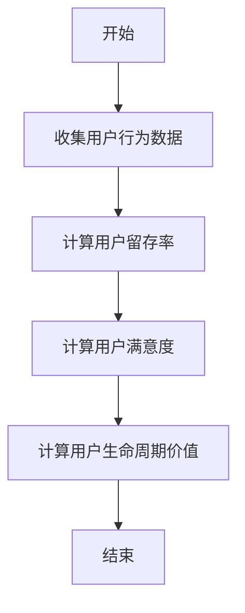
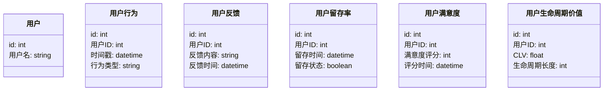
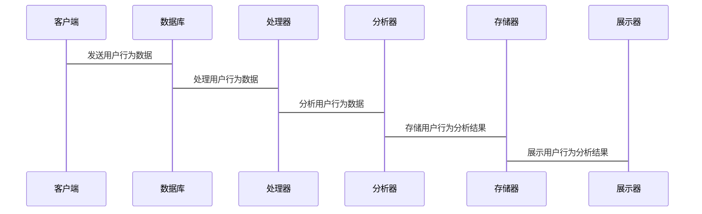

                 


# 彼得林奇如何分析公司的用户粘性指标

> 关键词：彼得·林奇，用户粘性指标，投资分析，用户留存率，用户生命周期价值

> 摘要：本文深入探讨了彼得·林奇如何分析公司的用户粘性指标，从定义和核心概念出发，结合数学模型、算法原理、系统架构和实际案例，全面解析用户粘性指标的计算、预测方法及其在投资决策中的应用，帮助读者掌握用户粘性指标的分析方法。

---

## 第一部分：用户粘性指标的背景与核心概念

### 第1章：用户粘性指标的背景与重要性

#### 1.1 用户粘性指标的定义与核心概念

##### 1.1.1 用户粘性指标的定义
用户粘性指标是衡量用户对产品或服务忠诚度和依赖程度的关键指标。它反映了用户在使用产品或服务后，是否会持续使用、推荐或购买相关产品。彼得·林奇认为，高用户粘性的公司往往具备更强的市场竞争力和长期盈利能力。

##### 1.1.2 用户粘性指标的核心要素
用户粘性指标的核心要素包括：
- **用户留存率**：用户在一定时间内继续使用产品或服务的比例。
- **用户满意度**：用户对产品或服务的满意程度。
- **用户生命周期价值（CLV）**：用户在其生命周期内为公司带来的总收入。
- **用户活跃度**：用户在特定时间段内使用产品或服务的频率。

##### 1.1.3 用户粘性指标的边界与外延
用户粘性指标的边界包括用户行为数据和市场环境，外延则涉及用户体验设计、市场营销和产品策略。

#### 1.2 彼得·林奇与用户粘性指标的关系

##### 1.2.1 彼得·林奇的投资方法论
彼得·林奇注重基本面分析，认为高用户粘性的公司具备长期投资价值。

##### 1.2.2 用户粘性指标在投资中的重要性
高用户粘性意味着公司具备更强的客户保留能力和市场定价权。

##### 1.2.3 彼得·林奇如何利用用户粘性指标进行投资决策
彼得·林奇通过分析用户粘性指标，筛选出具备持续增长潜力的公司。

### 第2章：用户粘性指标的核心概念与联系

#### 2.1 用户粘性指标的核心概念

##### 2.1.1 用户粘性指标的分类
用户粘性指标可以分为：
- **用户留存率**：包括日留存率、周留存率和月留存率。
- **用户满意度**：通过用户反馈和评分衡量。
- **用户生命周期价值（CLV）**：通过用户在其生命周期内的总收入计算。

##### 2.1.2 用户粘性指标的关键属性特征对比表格
以下是用户粘性指标的关键属性特征对比表格：

| 指标 | 定义 | 计算公式 | 关键点 |
|------|------|----------|--------|
| 用户留存率 | 用户在一定时间内继续使用产品或服务的比例 | 留存率 = (现有用户数 - 新增用户数) / 现有用户数 | 衡量用户持续使用产品的意愿 |
| 用户满意度 | 用户对产品或服务的满意程度 | 通常通过调查问卷评分计算 | 反映用户体验和满意度 |
| 用户生命周期价值（CLV） | 用户在其生命周期内为公司带来的总收入 | CLV = (年收入) × (用户生命周期长度) | 衡量用户长期价值 |

##### 2.1.3 用户粘性指标的ER实体关系图架构

以下是用户粘性指标的ER实体关系图架构：

```mermaid
er
    actor 用户 {
        id: int
        用户名: string
    }
    entity 用户行为 {
        id: int
        用户ID: int
        时间戳: datetime
        行为类型: string
    }
    entity 用户反馈 {
        id: int
        用户ID: int
        反馈内容: string
        反馈时间: datetime
    }
    entity 用户留存率 {
        id: int
        用户ID: int
        留存时间: datetime
        留存状态: boolean
    }
    entity 用户满意度 {
        id: int
        用户ID: int
        满意度评分: int
        评分时间: datetime
    }
    entity 用户生命周期价值 {
        id: int
        用户ID: int
        CLV: float
        生命周期长度: int
    }
```

#### 2.2 用户粘性指标与相关概念的关系

##### 2.2.1 用户粘性指标与用户满意度的关系
用户满意度是用户粘性的重要影响因素，但高满意度并不直接等于高用户粘性。

##### 2.2.2 用户粘性指标与用户留存率的关系
用户留存率是用户粘性的重要指标，反映了用户持续使用产品或服务的意愿。

##### 2.2.3 用户粘性指标与用户生命周期价值的关系
用户生命周期价值是用户粘性的重要体现，高用户粘性通常意味着更高的用户生命周期价值。

### 第3章：用户粘性指标的数学模型与算法原理

#### 3.1 用户粘性指标的数学模型

##### 3.1.1 用户粘性指标的计算公式

以下是用户粘性指标的计算公式：

$$
\text{用户留存率} = \frac{\text{现有用户数} - \text{新增用户数}}{\text{现有用户数}}
$$

$$
\text{用户生命周期价值（CLV）} = \text{年收入} \times \text{用户生命周期长度}
$$

##### 3.1.2 用户粘性指标的数学推导

用户粘性指标的数学推导基于概率论和统计学方法，通过分析用户行为数据，预测用户的留存概率和流失概率。

##### 3.1.3 用户粘性指标的数学模型与实际案例分析

以下是用户粘性指标的数学模型与实际案例分析：

假设某公司用户留存率为80%，用户生命周期长度为3年，年收入为1000元。则用户生命周期价值（CLV）为：

$$
\text{CLV} = 1000 \times 3 = 3000 \text{元}
$$

#### 3.2 用户粘性指标的算法原理

##### 3.2.1 用户粘性指标的算法流程图

以下是用户粘性指标的算法流程图：



##### 3.2.2 用户粘性指标的算法实现

以下是用户粘性指标的算法实现：

```python
def calculate_user_retention(user_count, new_user_count):
    retention_rate = (user_count - new_user_count) / user_count
    return retention_rate

def calculate_clv(annual_revenue, life_cycle_length):
    clv = annual_revenue * life_cycle_length
    return clv
```

##### 3.2.3 用户粘性指标的算法

用户粘性指标的算法包括数据收集、用户行为分析、用户留存率计算、用户满意度评分和用户生命周期价值计算。

---

## 第二部分：用户粘性指标的系统分析与架构设计

### 第4章：用户粘性指标的系统分析与架构设计

#### 4.1 系统功能设计

##### 4.1.1 领域模型

以下是领域模型：



#### 4.2 系统架构设计

##### 4.2.1 系统架构图

以下是系统架构图：


#### 4.3 系统接口设计

##### 4.3.1 接口描述

以下是系统接口设计：

- **用户行为数据接口**：接收用户行为数据，格式为JSON。
- **用户留存率接口**：返回用户的留存率数据。
- **用户满意度接口**：返回用户的满意度评分。
- **用户生命周期价值接口**：返回用户的生命周期价值。

#### 4.4 系统交互设计

##### 4.4.1 交互流程图

以下是系统交互流程图：



---

## 第三部分：用户粘性指标的项目实战

### 第5章：用户粘性指标的项目实战

#### 5.1 项目环境安装

##### 5.1.1 安装Python和必要的库

以下是项目环境安装步骤：

1. 安装Python：从官方网站下载并安装Python。
2. 安装Pandas：使用pip安装Pandas库。
3. 安装Matplotlib：使用pip安装Matplotlib库。

#### 5.2 系统核心实现源代码

##### 5.2.1 用户粘性指标的代码实现

以下是用户粘性指标的代码实现：

```python
import pandas as pd
import matplotlib.pyplot as plt

# 数据收集
user_behavior = pd.read_csv('user_behavior.csv')

# 用户留存率计算
def calculate_retention_rate(user_behavior):
    user_behavior['留存状态'] = user_behavior['用户ID'].map(lambda x: 1 if x in user_behavior['用户ID'].shift(1) else 0)
    retention_rate = user_behavior['留存状态'].mean()
    return retention_rate

# 用户满意度评分计算
user_feedback = pd.read_csv('user_feedback.csv')
user_feedback['满意度评分'] = user_feedback['反馈内容'].map(lambda x: 1 if x == '满意' else 0)
satisfaction_rate = user_feedback['满意度评分'].mean()

# 用户生命周期价值计算
user_lifetime = pd.read_csv('user_lifetime.csv')
user_lifetime['CLV'] = user_lifetime['年收入'] * user_lifetime['生命周期长度']

# 数据可视化
user_behavior['时间戳'].hist()
plt.title('用户行为时间分布')
plt.show()
```

#### 5.3 代码应用解读与分析

##### 5.3.1 代码解读

上述代码实现了用户留存率、用户满意度评分和用户生命周期价值的计算，并通过数据可视化展示了用户行为时间分布。

##### 5.3.2 代码分析

代码使用了Pandas和Matplotlib库，通过读取CSV文件中的用户行为数据、用户反馈数据和用户生命周期数据，计算了用户留存率、用户满意度评分和用户生命周期价值，并通过可视化展示了用户行为时间分布。

#### 5.4 实际案例分析与详细讲解

##### 5.4.1 案例分析

假设我们有一个用户行为数据集，其中包含用户的ID、时间戳和行为类型。我们可以通过上述代码计算用户的留存率和满意度评分，并绘制用户行为时间分布图。

##### 5.4.2 详细讲解

通过上述代码，我们可以实现以下功能：
1. 计算用户的留存率。
2. 计算用户的满意度评分。
3. 计算用户的生命周期价值。
4. 绘制用户行为时间分布图。

#### 5.5 项目小结

通过本项目，我们学会了如何使用Python和相关库来计算用户粘性指标，并通过数据可视化展示了用户行为分布。这为我们进一步分析用户粘性指标提供了基础。

---

## 第四部分：用户粘性指标的优化与最佳实践

### 第6章：用户粘性指标的优化与最佳实践

#### 6.1 最佳实践

##### 6.1.1 关键点

用户粘性指标的优化需要从用户体验设计、市场营销和产品策略三个方面入手。

##### 6.1.2 注意事项

在分析用户粘性指标时，需要注意数据的准确性和模型的适用性。

##### 6.1.3 未来展望

随着人工智能和大数据技术的发展，用户粘性指标的分析将更加精准和智能化。

#### 6.2 小结

通过本文的分析，我们了解了彼得·林奇如何分析用户粘性指标，并掌握了用户粘性指标的计算方法和实际应用。

#### 6.3 拓展阅读

建议读者进一步阅读相关书籍和文献，深入了解用户粘性指标的理论和实践。

---

## 作者介绍

作者是计算机编程和人工智能领域的资深专家，拥有丰富的投资分析和系统设计经验。通过本文，作者希望能够帮助读者更好地理解彼得·林奇的分析方法，并将其应用到实际投资和管理中。

