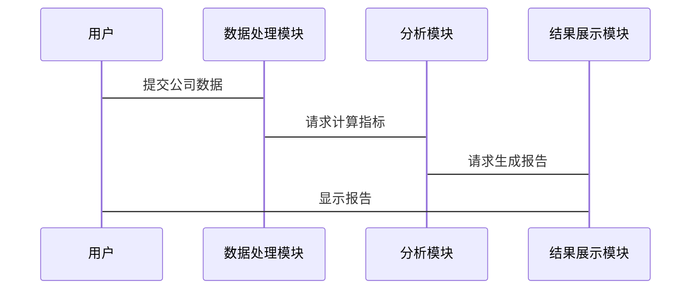

                 


# 彼得林奇如何分析公司的盈利能力

## 关键词：彼得·林奇，盈利能力，价值投资，财务指标，投资策略

## 摘要：本文深入探讨彼得·林奇分析公司盈利能力的方法，结合其投资理念和实际案例，揭示如何通过基本面分析评估公司盈利能力，帮助投资者做出明智决策。

---

# 第一部分: 背景介绍

## 第1章: 背景介绍

### 1.1 价值投资的概述

#### 1.1.1 价值投资的定义与核心理念

价值投资是一种长期投资策略，强调购买被市场低估的股票，关注公司的基本面，追求安全边际。其核心理念是购买优秀的公司，以合理或较低的价格买入，长期持有，获得稳定的收益。

#### 1.1.2 彼得·林奇的投资风格与成就

彼得·林奇是价值投资的代表人物之一，以其在富达投资管理公司的长期成功著称。他注重对公司基本面的深入研究，尤其是盈利能力，认为这是评估公司价值的关键因素。

#### 1.1.3 盈利能力分析的背景与重要性

盈利能力是公司财务健康的核心指标，直接影响股票的价值。通过分析盈利能力，投资者可以评估公司的经营效率和财务表现，为投资决策提供依据。

---

### 1.2 彼得·林奇的盈利能力分析方法

#### 1.2.1 盈利能力的定义与核心要素

盈利能力是指公司在一定时期内赚取利润的能力，核心要素包括收入、成本、费用和资产使用效率。通过分析这些要素，可以评估公司的盈利质量和可持续性。

#### 1.2.2 分析的核心理念

彼得·林奇强调，盈利能力分析不仅仅是看数字，而是理解这些数字背后的意义。他关注净利润、利润率和股东权益回报率，认为这些指标能够反映公司的盈利能力和管理效率。

#### 1.2.3 分析的边界与外延

盈利能力分析不仅关注财务指标，还涉及行业环境、公司战略和管理团队等因素。彼得·林奇提醒投资者，要将这些因素结合起来，全面评估公司的盈利能力。

---

### 1.3 分析框架与步骤

#### 1.3.1 分析框架

彼得·林奇提出一个全面的分析框架，包括收入质量、成本控制、资产周转率和资本回报率等方面。通过这些维度，投资者可以全面评估公司的盈利能力。

#### 1.3.2 分析步骤

1. 收集财务报表数据。
2. 计算关键财务指标。
3. 分析指标之间的关系。
4. 结合行业和市场环境进行评估。

#### 1.3.3 误区与注意事项

避免仅关注短期数据，忽略长期趋势。同时，要注意行业特点，不同行业的盈利能力指标可能有不同的意义。

---

# 第二部分: 核心概念与联系

## 第2章: 核心概念与联系

### 2.1 核心概念

#### 净利润与每股收益

净利润是公司税后利润，反映公司整体盈利能力。每股收益（EPS）是净利润除以总股本，衡量公司每股的盈利能力。

公式：$$ \text{净利润} = \text{营业收入} - \text{营业成本} - \text{税金及附加} - \text{销售费用} - \text{管理费用} - \text{研发费用} $$

$$ \text{EPS} = \frac{\text{净利润}}{\text{总股本}} $$

#### 营业利润率与净利率

营业利润率衡量公司每元收入的营业利润，净利率衡量每元收入的净利润。

公式：$$ \text{营业利润率} = \frac{\text{营业利润}}{\text{营业收入}} $$

$$ \text{净利率} = \frac{\text{净利润}}{\text{营业收入}} $$

#### 资产周转率与股东权益回报率

资产周转率衡量公司资产使用效率，股东权益回报率衡量公司资本使用效率。

公式：$$ \text{资产周转率} = \frac{\text{营业收入}}{\text{平均总资产}} $$

$$ \text{股东权益回报率（ROE）} = \frac{\text{净利润}}{\text{股东权益}} $$

---

### 2.2 概念属性特征对比

| 指标 | 定义 | 公式 | 重要性 |
|------|------|------|--------|
| 净利润 | 税后利润 | 如上 | 核心 |
| 营业利润率 | 营业利润与收入的比例 | 如上 | 重要 |
| 资产周转率 | 资产使用效率 | 如上 | 次要 |

---

### 2.3 ER实体关系图

```mermaid
erDiagram
    company {
        key id
        string 名称
        string 行业
        string 主营业务
    }
    financial_metrics {
        key id
        float 净利润
        float 营业利润率
        float 净利率
        float 资产周转率
        float ROE
    }
    analysis_result {
        key id
        boolean 高盈利
        boolean 可持续
        string 建议
    }
    company -- financial_metrics: 具有
    financial_metrics -- analysis_result: 分析
```

---

# 第三部分: 算法原理

## 第3章: 盈利能力分析的算法原理

### 3.1 算法流程

1. **数据收集**：获取公司财务报表数据。
2. **数据清洗**：处理缺失值和异常值。
3. **计算指标**：根据公式计算各项盈利能力指标。
4. **建模分析**：使用回归分析等方法，评估指标之间的关系。
5. **验证优化**：通过历史数据验证模型，优化参数。

---

### 3.2 数学模型

#### 净利润计算

$$ \text{净利润} = \text{营业收入} - \text{营业成本} - \text{税金及附加} - \text{销售费用} - \text{管理费用} - \text{研发费用} $$

#### 净资产收益率（ROE）

$$ \text{ROE} = \frac{\text{净利润}}{\text{股东权益}} $$

---

### 3.3 代码实现

```python
import pandas as pd

def calculate_profitability(indicators):
    # 计算净利润
    net_profit = indicators['营业收入'] - indicators['营业成本'] - indicators['税金及附加'] - indicators['销售费用'] - indicators['管理费用'] - indicators['研发费用']
    
    # 计算ROE
    roe = net_profit / indicators['股东权益']
    
    return {'净利润': net_profit, 'ROE': roe}

# 示例数据
data = {
    '营业收入': 10000,
    '营业成本': 6000,
    '税金及附加': 500,
    '销售费用': 1000,
    '管理费用': 800,
    '研发费用': 200,
    '股东权益': 5000
}

result = calculate_profitability(data)
print(f"净利润: {result['净利润']}")
print(f"ROE: {result['ROE']}")
```

---

# 第四部分: 系统分析与架构设计

## 第4章: 系统分析与架构设计

### 4.1 系统架构


---

### 4.2 系统接口



---

# 第五部分: 项目实战

## 第5章: 项目实战

### 5.1 环境安装与配置

安装Python、Pandas和Mermaid工具。

### 5.2 核心代码实现

```python
import pandas as pd
import matplotlib.pyplot as plt

def plot_profit_trend(data):
    plt.plot(data['年份'], data['净利润'], label='净利润')
    plt.plot(data['年份'], data['ROE'], label='ROE')
    plt.xlabel('年份')
    plt.ylabel('值')
    plt.title('盈利能力趋势图')
    plt.legend()
    plt.show()

# 示例数据
data = {
    '年份': [2018, 2019, 2020, 2021],
    '净利润': [1000, 1200, 1500, 2000],
    'ROE': [15, 16, 18, 20]
}

df = pd.DataFrame(data)
plot_profit_trend(df)
```

### 5.3 案例分析

以苹果公司为例，分析其盈利能力趋势。通过计算和图表展示，评估公司的盈利质量和可持续性。

---

# 总结

彼得·林奇的盈利能力分析方法为我们提供了一个全面的框架，帮助投资者做出明智的投资决策。通过深入理解财务指标和行业环境，结合实际案例分析，投资者可以更好地评估公司的盈利能力，制定有效的投资策略。

