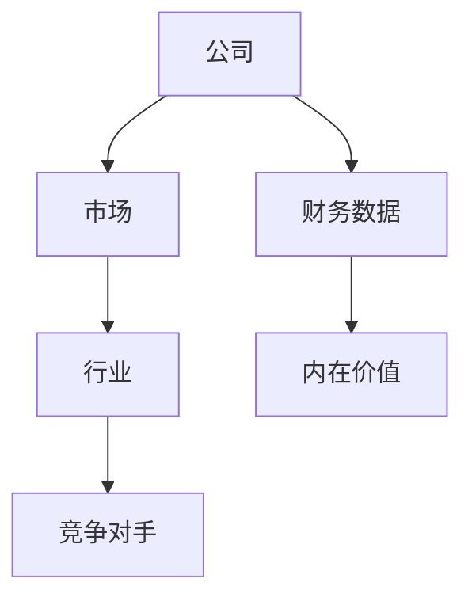
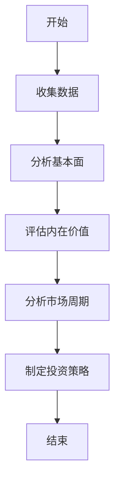

                 


# 彼得林奇如何分析公司的长期战略

## 关键词：
彼得林奇，长期战略分析，公司价值评估，投资哲学，市场周期，风险管理，投资组合优化

## 摘要：
本文详细探讨了彼得林奇如何进行公司长期战略分析，从投资理念、核心框架到实际应用，结合实例和数学模型，系统地剖析了他的分析方法和策略。

---

## 第一部分：背景介绍

### 第1章：彼得林奇的投资理念与长期战略分析

#### 1.1 彼得林奇的投资理念
- **投资的定义与核心要素**  
  投资是通过购买资产，以期在未来获得收益的行为。核心要素包括公司基本面、市场周期、财务数据等。

- **彼得林奇的投资哲学**  
  彼得林奇强调长期投资，注重公司基本面分析，避免短期市场波动干扰。他主张通过深入研究公司，寻找具有持续增长潜力的企业。

- **长期战略分析的背景与意义**  
  在经济周期波动中，公司长期战略分析帮助投资者识别具备持续竞争优势的企业，避免短期市场波动带来的损失。

#### 1.2 长期战略分析的背景
- **经济周期与投资策略**  
  经济周期波动影响市场和公司表现，长期战略分析帮助投资者在不同周期中调整投资策略。

- **公司长期战略的核心要素**  
  包括市场定位、竞争优势、财务健康、管理团队和增长潜力等方面。

- **长期战略分析的边界与外延**  
  分析边界在于公司基本面和市场环境，外延则涉及行业趋势和宏观经济因素。

#### 1.3 彼得林奇投资哲学的核心要素
- **投资的三要素：公司、价格、时间**  
  公司基本面决定长期价值，价格影响短期收益，时间是价值实现的过程。

- **长期投资与价值创造**  
  通过长期持有优质资产，实现价值增长，避免频繁交易带来的成本和风险。

- **风险管理与投资组合优化**  
  分散投资降低风险，优化资产配置提高收益稳定性。

---

## 第二部分：核心概念与联系

### 第2章：长期战略分析的核心框架

#### 2.1 核心概念原理
- **长期战略分析的原理**  
  通过分析公司基本面和市场环境，评估其长期价值，制定投资策略。

- **公司价值评估的核心公式**  
  内在价值公式：$$\text{内在价值} = \frac{\text{现金流}}{\text{折现率}}$$  
  该公式用于评估公司未来现金流的现值，帮助判断其是否被低估。

- **市场周期与公司战略的关系**  
  市场周期影响公司战略调整，公司需根据周期变化优化运营策略。

#### 2.2 核心概念属性特征对比
- **公司基本面与市场情绪的对比**  
  公司基本面关注财务数据和经营状况，市场情绪反映投资者情绪，两者共同影响股价。

- **内在价值与市场价值的对比**  
  内在价值是公司的真实价值，市场价值是市场交易形成的，两者差异决定投资机会。

- **长期战略与短期战术的对比**  
  长期战略注重价值创造，短期战术关注市场波动，两者结合实现投资目标。

#### 2.3 ER实体关系图架构

该图展示公司与其所处市场、行业、竞争对手的关系，以及财务数据如何影响内在价值评估。

---

## 第三部分：算法原理讲解

### 第3章：彼得林奇长期战略分析算法

#### 3.1 算法原理
- **基于基本面的公司价值评估**  
  使用现金流折现模型（DCF）评估公司内在价值，$$\text{DCF} = \sum_{t=1}^{n} \frac{\text{CF}_t}{(1 + r)^t} + \frac{\text{TV}}{(1 + r)^n}$$  
  其中，CF_t为第t年的现金流，r为折现率，TV为终值。

- **市场周期分析与投资决策**  
  分析市场周期，判断市场高低点，调整投资策略。例如，在市场低点增加投资，在市场高点减少投资。

- **风险管理与投资组合优化**  
  通过分散投资和资产配置优化风险，$$\text{风险调整后收益} = \text{收益} - \text{风险溢价}$$

#### 3.2 算法流程图

该图展示从数据收集到制定投资策略的完整流程。

---

## 第四部分：系统分析与架构设计方案

### 第4章：系统架构设计

#### 4.1 问题场景介绍
- **目标**：构建一个长期战略分析系统，帮助投资者评估公司价值。
- **范围**：包括数据收集、分析、决策支持等功能。

#### 4.2 系统功能设计
- **领域模型**  
  ```mermaid
  classDiagram
      class 公司 {
          名称
          行业
          财务数据
      }
      class 市场 {
          指数
          情绪
      }
      class 竞争对手 {
          财务数据
          竞争优势
      }
      公司 --> 市场
      公司 --> 竞争对手
  ```

- **系统架构设计**  
  ```mermaid
  graph TD
      A[数据层] --> B[业务逻辑层]
      B --> C[表现层]
      A --> D[数据源]
  ```

- **系统接口设计**  
  - 数据接口：从数据库获取公司和市场数据。
  - 分析接口：调用DCF模型计算内在价值。
  - 报告接口：生成分析报告。

- **系统交互设计**  
  ```mermaid
  graph LR
      User --> API[接口]
      API --> Service[服务]
      Service --> Database[数据库]
      Database --> Response[响应]
      Response --> User
  ```

---

## 第五部分：项目实战

### 第5章：长期战略分析项目实战

#### 5.1 项目环境安装
- **工具**：Python（3.8+）、Jupyter Notebook、Mermaid工具。
- **库**：pandas、numpy、matplotlib。

#### 5.2 核心代码实现
```python
import pandas as pd
import numpy as np

def calculate_intrinsic_value(FCFF, WACC, TV):
    """
    计算公司内在价值
    """
    n = 5  # 假设永续增长期为5年
    PV = 0
    for t in range(1, n+1):
        PV += FCFF[t] / (1 + WACC)**t
    PV += TV / (1 + WACC)**n
    return PV

# 示例数据
FCFF = pd.Series([100, 120, 130, 140, 150], index=range(1,6))
WACC = 0.10
TV = 200

IV = calculate_intrinsic_value(FCFF, WACC, TV)
print(f"内在价值为：{IV}")
```

#### 5.3 案例分析：微软公司
- **数据收集**：收集微软的财务数据和市场数据。
- **分析步骤**：
  1. 计算FCFF（自由现金流）。
  2. 估计WACC（加权平均资本成本）。
  3. 评估内在价值。
  4. 对比市场价值，判断投资价值。

#### 5.4 代码解读与分析
```python
# 计算WACC示例
def calculate_WACC(revenue, net_income, debt, equity, cost_of_debt, cost_of_equity):
    """
    计算WACC
    """
    WACC = (debt * cost_of_debt * (1 - tax_rate) + equity * cost_of_equity) / (debt + equity)
    return WACC

# 示例数据
revenue = 1000000
net_income = 200000
debt = 500000
equity = 500000
cost_of_debt = 0.05
cost_of_equity = 0.10
tax_rate = 0.3

WACC = calculate_WACC(revenue, net_income, debt, equity, cost_of_debt, cost_of_equity)
print(f"WACC为：{WACC}")
```

#### 5.5 项目小结
通过实际案例分析，展示了如何应用DCF模型进行公司价值评估，帮助投资者制定长期战略。

---

## 第六部分：最佳实践

### 第6章：长期战略分析的最佳实践

#### 6.1 小结
- **核心观点**  
  彼得林奇的长期战略分析方法注重基本面分析和风险管理，帮助投资者在长期投资中实现价值增长。

#### 6.2 注意事项
- **长期投资需要耐心和纪律**  
  避免短期市场波动的干扰，坚持长期价值投资。
- **数据质量至关重要**  
  确保财务数据和市场数据的准确性和完整性。
- **持续学习与更新**  
  随着市场变化，不断更新分析模型和策略。

#### 6.3 拓展阅读
- **推荐书籍**  
  - 《彼得·林奇的投资艺术》
  - 《投资学》（教材）

---

通过以上内容，我们详细介绍了彼得林奇如何分析公司的长期战略，从理论到实践，结合实例和数学模型，帮助投资者掌握长期价值投资的方法。

