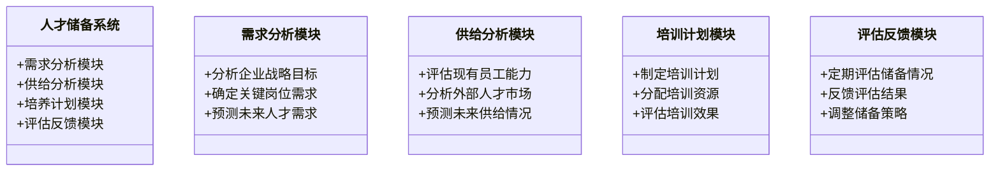

                 


# 彼得·林奇如何看待公司的人才储备策略

## 关键词：彼得·林奇, 人才储备, 公司策略, 投资者视角, 人才管理

## 摘要：本文从彼得·林奇的投资者视角出发，探讨公司人才储备策略的重要性、核心要素和实施方法。通过分析彼得·林奇的人才储备观，结合实际案例，提出系统化的解决方案，为公司制定科学合理的人才储备策略提供参考。

---

# 第一部分: 人才储备策略的背景与重要性

## 第1章: 人才储备策略的背景介绍

### 1.1 人才储备的核心概念

#### 1.1.1 人才储备的定义与内涵

人才储备是指企业为了实现长期发展目标，提前储备和培养具备特定能力的人才，以满足未来业务发展的需求。它不仅仅关注当前的人才供给，更注重未来潜在的需求，是一种前瞻性的管理策略。

#### 1.1.2 人才储备的重要性与必要性

在竞争激烈的市场环境中，企业的发展离不开高素质的人才。人才储备是企业持续发展的基础，能够确保企业在面对市场变化和挑战时具备足够的应对能力。同时，人才储备还能降低企业在关键岗位上的风险，避免因人才短缺而导致的业务中断。

#### 1.1.3 人才储备的边界与外延

人才储备的边界主要在于企业的战略目标和业务需求。它不仅包括对现有员工的培养，还包括对外部人才的吸引和储备。外延则涉及人才的分类、评估、培养和使用等多个方面。

### 1.2 人才储备与企业发展的关系

#### 1.2.1 人才储备对企业长期发展的意义

人才储备是企业实现可持续发展的重要保障。通过储备高素质的人才，企业能够确保在关键岗位上有合适的人选担任，从而推动企业的长期发展。

#### 1.2.2 人才储备在企业战略中的地位

人才储备是企业战略管理的重要组成部分。它不仅影响企业的运营效率，还关系到企业的创新能力和市场竞争力。有效的 talent储备策略能够提升企业的核心竞争力，为企业创造更大的价值。

#### 1.2.3 人才储备与企业竞争力的提升

在现代商业环境中，人才储备直接关系到企业的竞争力。具备充足且高素质的人才储备，企业能够更快地适应市场变化，抓住发展机遇，从而在竞争中占据优势。

---

## 第2章: 彼得·林奇对人才储备的看法

### 2.1 彼得·林奇的投资者视角

#### 2.1.1 彼得·林奇的投资者背景与理念

彼得·林奇是美国著名的投资家，以其在富达投资的长期成功而闻名。他强调长期投资和基本面分析，认为企业的核心竞争力是其价值的决定因素。这种投资理念为他的人才储备观奠定了基础。

#### 2.1.2 彼得·林奇对人才储备的重视

在彼得·林奇看来，人才储备是企业成功的关键。他将人才视为企业的核心资产，认为只有具备高素质的人才，企业才能实现长期的稳定发展。

#### 2.1.3 彼得·林奇人才储备观的核心观点

彼得·林奇认为，人才储备不仅仅是人力资源部门的职责，而是企业整体战略的一部分。他强调，企业应根据自身的发展需求，制定相应的人才储备策略，确保在关键岗位上有合适的人选担任。

---

## 第3章: 人才储备策略的核心要素

### 3.1 人才储备的系统性分析

#### 3.1.1 人才储备的系统构成

人才储备系统包括需求分析、供给分析、培养计划和评估反馈四大模块。每个模块都相互关联，共同构成了人才储备的整体框架。

#### 3.1.2 人才储备的关键要素

- **需求分析**：明确企业当前和未来的人才需求。
- **供给分析**：评估企业内部和外部的人才供给情况。
- **培养计划**：制定针对不同岗位的人才培养方案。
- **评估反馈**：定期评估人才储备的效果，并根据评估结果进行调整。

#### 3.1.3 人才储备的动态调整机制

企业应根据市场环境的变化和企业发展战略的调整，动态优化人才储备策略。这包括定期评估人才储备的效果，并根据评估结果进行必要的调整。

### 3.2 人才储备的数学模型与公式

#### 3.2.1 人才储备的数学模型

$$
\text{人才储备} = f(\text{需求分析}, \text{供给能力}, \text{培养机制})
$$

这个模型表明，人才储备的结果取决于需求分析的准确性、供给能力的强弱以及培养机制的有效性。

#### 3.2.2 人才储备的评估公式

$$
\text{人才储备指数} = \frac{\text{实际储备能力}}{\text{需求能力}} \times 100\%
$$

通过这个公式，企业可以量化评估自身的人才储备情况，从而为制定和调整人才储备策略提供依据。

---

## 第4章: 人才储备策略的系统架构设计

### 4.1 系统分析与设计

#### 4.1.1 问题场景介绍

企业需要在不同业务部门和岗位上储备人才，以应对未来可能出现的人才短缺问题。然而，由于市场环境的不确定性和企业战略的动态变化，人才储备策略的制定和实施面临诸多挑战。

#### 4.1.2 领域模型设计（Mermaid 类图）



这个类图展示了人才储备系统的四个主要模块及其功能。

---

## 第5章: 人才储备策略的项目实战

### 5.1 项目环境安装与配置

#### 5.1.1 环境要求

- 操作系统：Windows 10 或更高版本，或 macOS 10.15 或更高版本。
- 开发工具：IntelliJ IDEA 或 Eclipse。
- 语言：Java 8 或更高版本。
- 依赖库：Spring Boot、MyBatis、Redis 等。

#### 5.1.2 配置步骤

1. **安装 JDK**：下载并安装 JDK 8 或更高版本，并配置环境变量。
2. **安装 IDE**：选择合适的 IDE（如 IntelliJ IDEA）并安装。
3. **安装依赖库**：通过 Maven 或其他依赖管理工具安装所需的库。
4. **创建项目**：使用 Spring Boot 初始化器创建一个新的 Spring Boot 项目。

---

### 5.2 系统核心实现源代码

#### 5.2.1 人才储备系统核心代码

```java
@SpringBootApplication
public class TalentReservationSystem {
    public static void main(String[] args) {
        SpringApplication.run(TalentReservationSystem.class, args);
    }
}
```

#### 5.2.2 需求分析模块代码

```java
@Repository
public interface TalentRepository extends JpaRepository<Talent, Long> {
    List<Talent> findByDepartment(String department);
}
```

#### 5.2.3 供给分析模块代码

```java
@Service
public class TalentService {
    @Autowired
    private TalentRepository talentRepository;

    public List<Talent> getTalentsByDepartment(String department) {
        return talentRepository.findByDepartment(department);
    }
}
```

---

## 第6章: 总结与最佳实践

### 6.1 总结

彼得·林奇从投资者的视角，为我们提供了独特的人才储备策略见解。通过系统的分析和实际的案例，我们可以看到，人才储备是企业成功的关键因素之一。企业应根据自身的需求，制定科学合理的人才储备策略，并通过系统的实施和动态的调整，确保人才储备的有效性。

### 6.2 最佳实践

- **制定明确的人才储备目标**：企业应根据自身的发展战略，明确人才储备的目标和方向。
- **建立科学的评估体系**：通过数学模型和评估公式，量化评估人才储备的效果。
- **动态调整储备策略**：根据市场环境和企业需求的变化，及时调整人才储备策略。

### 6.3 注意事项

- 人才储备策略的制定和实施需要企业高层的重视和参与。
- 在实施过程中，应注重对员工的培训和培养，提升员工的能力和素质。
- 企业应建立良好的激励机制，吸引和留住高素质的人才。

### 6.4 拓展阅读

- 《彼得·林奇的投资哲学》
- 《人才管理的创新实践》
- 《企业战略管理》

---

通过以上分析和实践，我们可以看到，彼得·林奇的人才储备观为我们提供了一个全新的视角，帮助我们更好地理解人才储备的重要性，并为我们制定和实施人才储备策略提供了宝贵的指导和启示。

