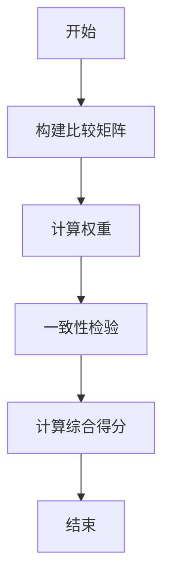
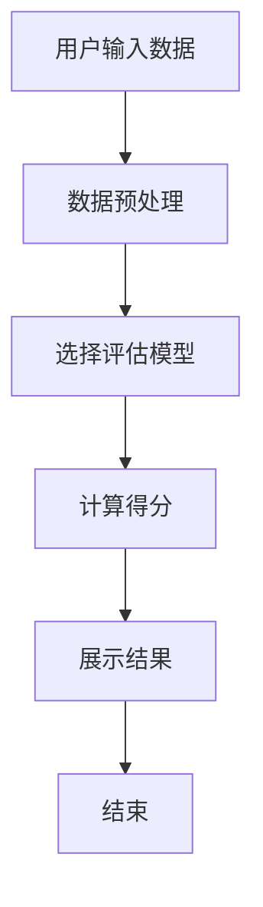
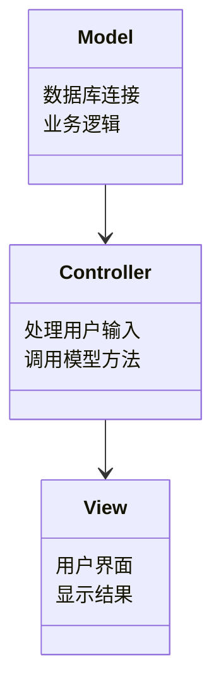

                 


# 彼得林奇如何看待公司的创新能力

## 关键词：彼得林奇，创新能力，企业价值，创新评估，投资分析

## 摘要：本篇文章从彼得林奇的投资视角出发，分析了公司的创新能力对企业价值的影响。通过详细阐述创新的定义、类型及其与企业战略的关系，结合层次分析法（AHP）构建创新评估模型，并通过实际案例分析展示了如何应用这些方法来评估公司的创新能力。文章最后提供了系统设计和项目实战，帮助读者更好地理解和应用创新能力评估。

---

## 第1章 创新能力的背景与重要性

### 1.1 创新能力的定义与内涵

#### 1.1.1 创新能力的定义
创新能力是指企业通过引入新技术、新产品、新流程或新商业模式，以实现竞争优势和增长的能力。它不仅包括技术层面的创新，还包括管理、市场和商业模式的创新。

#### 1.1.2 创新能力的核心要素
- 技术创新：开发新产品或改进现有产品。
- 管理创新：优化组织结构和流程。
- 市场创新：开拓新市场或客户群体。
- 商业模式创新：改变收入来源或盈利模式。

#### 1.1.3 创新能力的分类与层次
创新可以分为以下层次：
1. **产品创新**：开发新产品或改进现有产品。
2. **技术创新**：采用新技术或改进技术应用。
3. **管理创新**：优化企业管理和运营流程。
4. **市场创新**：开拓新市场或客户群体。
5. **商业模式创新**：改变盈利模式或收入来源。

### 1.2 创新能力与企业价值的关系

#### 1.2.1 创新能力对企业价值的影响
创新能力是企业长期竞争优势的核心。通过创新，企业可以降低成本、提高效率、满足客户需求，从而提升市场地位和盈利能力。

#### 1.2.2 创新能力与企业竞争优势
创新能力直接影响企业的市场地位。具备创新能力的企业能够更快响应市场变化，抓住机遇，抵御竞争压力。

#### 1.2.3 创新能力与企业可持续发展
创新是企业持续发展的关键。通过不断改进和创新，企业可以在变化的市场环境中保持活力，实现可持续发展。

### 1.3 彼得林奇的视角与方法

#### 1.3.1 彼得林奇的投资理念
彼得林奇认为，投资成功的关键在于选择具有持续创新能力的企业。他强调，企业必须不断创新以保持竞争优势。

#### 1.3.2 彼得林奇对创新能力的重视
彼得林奇在评估企业时，特别关注企业的创新能力。他认为，创新能力是企业长期增长的核心驱动力。

#### 1.3.3 彼得林奇分析创新能力的框架
彼得林奇使用以下框架分析创新能力：
1. **技术创新能力**：评估企业技术开发和应用能力。
2. **市场创新能力**：评估企业在市场拓展和客户获取方面的创新能力。
3. **管理创新能力**：评估企业内部管理和运营流程的优化能力。

---

## 第2章 创新能力的核心概念与联系

### 2.1 创新能力的核心概念

#### 2.1.1 创新能力的构成要素
创新能力由以下几个要素构成：
- 技术能力：包括研发能力和技术储备。
- 管理能力：包括组织结构和运营流程。
- 市场能力：包括市场分析和客户关系管理。
- 财务能力：包括资金投入和成本控制。

#### 2.1.2 创新能力的属性特征对比表

| 特性       | 创新性   | 可持续性 | 可扩展性 | 风险性   |
|------------|----------|----------|----------|----------|
| 描述       | 是否有新的技术或产品 | 是否能够长期维持 | 是否可以扩展到更大市场 | 创新带来的风险程度 |

#### 2.1.3 创新能力的ER实体关系图

```mermaid
erDiagram
    customer[客户] {
        id : integer
        name : string
        purchaseHistory : string
    }
    product[产品] {
        id : integer
        name : string
        version : string
    }
    innovation[创新能力] {
        id : integer
        type : string
        strength : integer
    }
    customer --> innovation : 评估创新能力
    product --> innovation : 创新产品的体现
```

### 2.2 创新能力与企业战略的关系

#### 2.2.1 创新能力在企业战略中的作用
创新能力是企业战略的核心。通过创新，企业可以实现差异化竞争，提高市场份额和盈利能力。

#### 2.2.2 创新能力与企业目标的关系
创新能力直接影响企业目标的实现。例如，技术创新可以帮助企业实现产品差异化，从而提高市场占有率。

#### 2.2.3 创新能力与企业资源分配
创新能力要求企业合理分配资源，确保技术创新和市场创新的顺利进行。例如，企业需要投入足够的资金用于研发和技术升级。

---

## 第3章 创新能力评估的算法原理

### 3.1 创新能力评估的数学模型

#### 3.1.1 创新能力评估的指标体系
创新能力评估的指标体系包括以下指标：
- 技术创新指标：研发投入占比、专利数量。
- 管理创新指标：管理效率、组织结构优化。
- 市场创新指标：市场份额增长率、客户满意度。
- 商业模式创新指标：收入增长、利润率。

#### 3.1.2 创新能力评估的权重分配
使用层次分析法（AHP）进行权重分配，步骤如下：
1. 构建指标层次结构。
2. 构建比较矩阵。
3. 计算权重。

#### 3.1.3 创新能力评估的综合得分公式
综合得分公式如下：
$$
\text{综合得分} = \sum (\text{指标得分} \times \text{权重})
$$

### 3.2 创新能力评估的算法实现

#### 3.2.1 层次分析法（AHP）的应用
层次分析法步骤如下：
1. 确定目标、准则层和方案层。
2. 构建比较矩阵。
3. 计算权重。
4. 计算一致性检验。
5. 计算综合得分。

#### 3.2.2 创新能力评估的Python代码实现
```python
import numpy as np

def ahp_weights(criteria_matrix):
    # 计算权重向量
    eigvals, eigvecs = np.linalg.eigh(criteria_matrix)
    weights = eigvecs[:, -1] / sum(eigvecs[:, -1])
    return weights

# 示例比较矩阵
criteria_matrix = np.array([
    [1, 3, 2],
    [1/3, 1, 2/3],
    [1/2, 3/2, 1]
])

weights = ahp_weights(criteria_matrix)
print("权重向量为：", weights)
```

#### 3.2.3 创新能力评估的算法流程图



---

## 第4章 系统分析与架构设计方案

### 4.1 创新能力评估系统的功能设计

#### 4.1.1 系统功能模块划分
系统功能模块包括：
- 数据输入模块：输入企业创新数据。
- 评估计算模块：计算创新能力得分。
- 结果展示模块：展示评估结果。

#### 4.1.2 系统功能流程图



### 4.2 创新能力评估系统的架构设计

#### 4.2.1 系统架构的总体设计
采用MVC架构，分为模型、视图和控制层。

#### 4.2.2 系统架构的详细设计


### 4.3 创新能力评估系统的接口设计

#### 4.3.1 系统接口的定义与规范
系统接口包括：
- 数据输入接口：接收企业创新数据。
- 评估结果接口：返回创新能力得分。

#### 4.3.2 系统接口的实现方式
使用RESTful API实现接口，例如：
- POST请求接收数据。
- GET请求获取结果。

#### 4.3.3 系统接口的测试与验证
通过单元测试和集成测试验证接口的正确性。

---

## 第5章 项目实战与案例分析

### 5.1 项目环境与工具安装

#### 5.1.1 系统运行环境要求
- 操作系统：Windows、Linux、macOS。
- Python版本：3.6以上。
- 额外工具：Jupyter Notebook、Matplotlib。

### 5.2 项目核心实现

#### 5.2.1 创新能力评估系统的实现
实现步骤：
1. 数据输入：读取企业创新数据。
2. 模型计算：使用层次分析法计算创新能力得分。
3. 结果展示：生成可视化报告。

#### 5.2.2 苹果公司的创新分析
以苹果公司为例，分析其创新能力：
- 技术创新：持续推出新产品如iPhone、iPad。
- 商业模式创新：App Store模式的成功。
- 市场创新：全球市场的拓展。

### 5.3 项目小结

#### 5.3.1 项目总结
通过项目实战，展示了如何使用层次分析法评估创新能力，并通过实际案例分析验证了模型的有效性。

#### 5.3.2 项目经验
- 创新能力评估需要结合企业的实际情况。
- 模型的选择和参数设置直接影响评估结果。

---

## 第6章 最佳实践与注意事项

### 6.1 小结
创新能力是企业长期发展的核心驱动力。通过合理评估创新能力，投资者可以更好地识别具有潜力的企业。

### 6.2 注意事项
- 确保数据的准确性和完整性。
- 合理选择评估模型和参数。
- 结合企业实际情况进行分析。

### 6.3 拓展阅读
- 《彼得林奇选股法则》
- 《创新者的窘境》
- 《商业模式创新》

---

通过以上章节的详细分析，我们全面探讨了彼得林奇如何看待公司的创新能力，从理论到实践，从分析到设计，为读者提供了系统化的知识和实用的工具。

