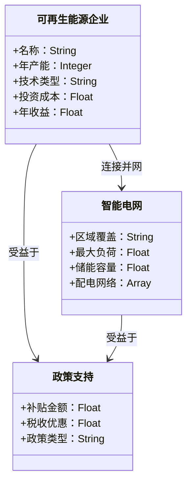
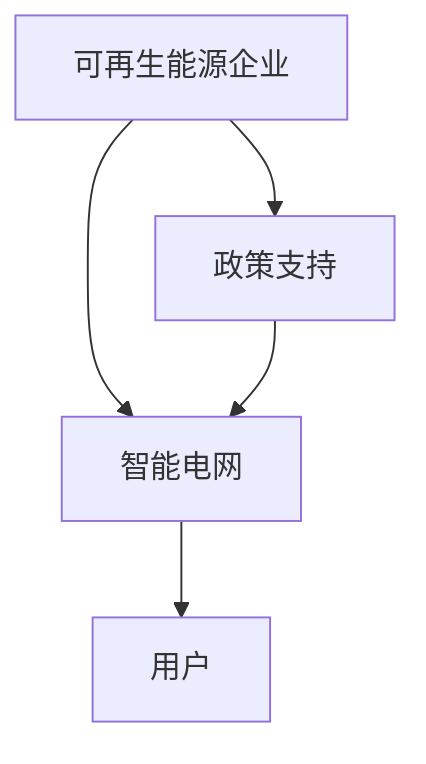
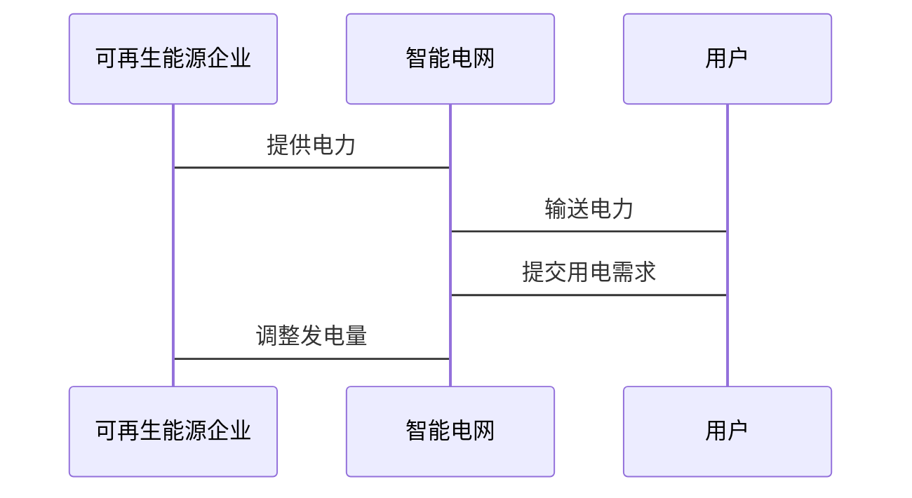

                 


---

# 彼得·林奇如何看待公司的可再生能源转型策略

## 关键词：彼得·林奇、可再生能源转型、投资策略、能源行业、气候变化

## 摘要：  
彼得·林奇作为一位世界级的投资大师，其独特的投资理念为公司可再生能源转型提供了深刻的见解。本文从可再生能源转型的背景、核心概念、投资策略、技术实现、系统架构以及项目实战等多维度展开分析，详细探讨彼得·林奇如何审视这一战略，并为读者提供切实可行的建议。

---

# 第一部分：可再生能源转型的背景与挑战

## 第1章：可再生能源转型的背景介绍

### 1.1 问题背景与驱动因素  
#### 1.1.1 当前全球能源结构的现状  
- 化石能源主导的能源结构带来的环境问题与资源枯竭风险。  
- 气候变化的加剧推动全球能源结构向清洁化、低碳化转型。  

#### 1.1.2 气候变化与能源危机的推动作用  
- 全球变暖的科学证据与能源消耗之间的关系。  
- 可再生能源在应对气候变化中的关键作用。  

#### 1.1.3 政策与市场驱动的双轮效应  
- 各国政府的政策支持与法规推动。  
- 市场需求的快速增长与技术进步的双重驱动。  

### 1.2 问题描述与核心概念  
#### 1.2.1 可再生能源转型的定义  
- 可再生能源转型是指将传统的化石能源为主的能源结构转变为以风能、太阳能等可再生能源为主的能源结构的过程。  

#### 1.2.2 转型的核心目标与关键指标  
- 核心目标：实现能源结构的清洁化、低碳化，减少对化石能源的依赖。  
- 关键指标：碳排放强度、可再生能源占比、能源效率提升等。  

#### 1.2.3 转型的边界与外延  
- 范围：涵盖电力、交通、工业等多个领域。  
- 外延：包括技术创新、政策支持、市场机制等多个方面。  

### 1.3 问题解决与路径分析  
#### 1.3.1 可再生能源转型的主要路径  
- 技术创新：推动可再生能源技术的进步与成本下降。  
- 政策支持：通过法规、补贴等方式推动可再生能源的发展。  
- 市场机制：利用碳交易、绿色金融等市场机制促进转型。  

#### 1.3.2 技术创新与成本下降的双重作用  
- 技术进步如何降低可再生能源的成本。  
- 成本下降对可再生能源竞争力的提升作用。  

#### 1.3.3 政策支持与市场机制的协同效应  
- 政策如何为可再生能源转型提供保障。  
- 市场机制如何推动可再生能源的广泛应用。  

### 1.4 本章小结  
- 本章从背景、概念、路径等多个方面介绍了可再生能源转型，为后续分析奠定了基础。

---

## 第2章：彼得·林奇的核心投资理念与可再生能源转型

### 2.1 彼得·林奇的投资哲学  
#### 2.1.1 长期投资与价值发现的核心理念  
- 林奇的长期投资策略：寻找具有持续增长潜力的企业。  
- 价值发现：挖掘被市场低估的投资机会。  

#### 2.1.2 风险控制与安全边际的重要性  
- 林奇的风险控制理念：避免过度杠杆与高风险投资。  
- 安全边际：确保投资的稳健性。  

#### 2.1.3 行业趋势与公司基本面的结合  
- 林奇强调行业趋势的重要性：选择符合未来发展趋势的行业。  
- 公司基本面分析：关注企业的财务健康与管理团队。  

### 2.2 可再生能源转型的驱动力分析  
#### 2.2.1 技术进步与产业变革  
- 可再生能源技术的快速发展：如太阳能电池效率提升、风能技术革新。  
- 产业变革：传统能源企业向可再生能源转型的必要性。  

#### 2.2.2 市场需求与消费者行为的变化  
- 消费者对绿色能源的需求增长：如绿色电力的普及。  
- 市场对可再生能源企业估值的变化：投资者对绿色企业的青睐。  

#### 2.2.3 政策支持与行业规范的完善  
- 各国政府的政策支持：如可再生能源补贴、税收优惠。  
- 行业规范的完善：如碳排放标准的严格化。  

### 2.3 彼得·林奇视角下的转型策略  
#### 2.3.1 转型公司的投资价值分析  
- 林奇如何评估可再生能源企业的投资价值：关注企业的技术优势、成本控制能力、市场前景。  
- 具体案例：分析某可再生能源企业的财务状况与市场表现。  

#### 2.3.2 投资组合的调整与优化  
- 林奇的投资组合调整策略：逐步增加可再生能源企业的比重。  
- 风险分散：通过多元化投资降低风险。  

#### 2.3.3 对转型公司的长期展望  
- 可再生能源行业的长期增长潜力：技术进步与市场需求的双重驱动。  
- 林奇对可再生能源企业的长期投资观点：选择具有持续创新能力与良好管理团队的企业。  

### 2.4 本章小结  
- 本章从彼得·林奇的投资哲学出发，分析了可再生能源转型的驱动力，并提出了林奇视角下的转型策略。

---

## 第3章：可再生能源转型的核心概念与技术实现

### 3.1 可再生能源转型的核心概念  
#### 3.1.1 可再生能源技术的分类与特点  
- 分类：太阳能、风能、生物质能、地热能等。  
- 特点：清洁、可再生、分布广泛但不稳定。  

#### 3.1.2 能源互联网的概念与作用  
- 能源互联网的定义：智能电网与可再生能源的结合。  
- 作用：实现可再生能源的高效调配与利用。  

#### 3.1.3 数字化与智能化在转型中的应用  
- 数字化：通过大数据分析优化能源管理。  
- 智能化：利用人工智能技术实现能源系统的智能调控。  

### 3.2 技术实现的详细分析  
#### 3.2.1 可再生能源发电技术的创新  
- 太阳能电池效率提升的技术路径。  
- 风力发电技术的优化与成本降低。  

#### 3.2.2 能源储存技术的发展  
- 锂离子电池的技术进步与成本下降。  
- 其他储能技术：如氢储能、飞轮储能。  

#### 3.2.3 智能电网的实现方案  
- 智能电网的架构设计：包括发电、输电、配电、用电四个环节。  
- 关键技术：如智能计量、需求响应、能量管理。  

### 3.3 技术实现的数学模型与公式  
#### 3.3.1 可再生能源发电效率的计算  
- 公式：$$\text{发电效率} = \frac{\text{输出功率}}{\text{输入能量}}$$  

#### 3.3.2 能源储存系统的能量守恒分析  
- 公式：$$\text{储存能量} = \text{输入能量} - \text{损耗能量}$$  

#### 3.3.3 智能电网的能量平衡模型  
- 公式：$$\text{能量平衡} = \text{发电量} + \text{输入电量} - \text{用电量} - \text{输出电量}$$  

### 3.4 本章小结  
- 本章详细分析了可再生能源转型的核心技术与实现方案，并通过数学模型对技术实现进行了量化分析。

---

## 第4章：可再生能源转型的系统分析与架构设计

### 4.1 问题场景介绍  
- 当前能源系统存在的问题：如化石能源占比高、能源浪费严重、能源供应不稳定等。  

### 4.2 系统功能设计  
#### 4.2.1 领域模型设计  
- 使用Mermaid绘制领域模型类图，展示系统中的关键实体及其关系。  



#### 4.2.2 系统架构设计  
- 使用Mermaid绘制系统架构图，展示系统的主要组件及其交互关系。  



#### 4.2.3 接口设计与交互流程  
- 使用Mermaid绘制序列图，展示系统中的接口调用与交互流程。  



### 4.3 本章小结  
- 本章通过系统分析与架构设计，展示了可再生能源转型的整体框架与实现路径。

---

## 第5章：可再生能源转型的项目实战

### 5.1 环境安装与配置  
- 系统环境：选择适合的开发环境与工具，如Python、Jupyter Notebook、Git等。  
- 数据获取：收集可再生能源相关数据，如发电量、电价、用户需求等。  

### 5.2 核心代码实现  
#### 5.2.1 可再生能源发电模拟  
- 使用Python编写可再生能源发电量模拟代码，如下所示：  

```python
import numpy as np
import matplotlib.pyplot as plt

# 模拟太阳能发电量
def simulate_solar_power(days=365):
    power = np.random.normal(1.5, 0.2, days)
    plt.plot(power)
    plt.title('Simulated Solar Power Generation')
    plt.xlabel('Days')
    plt.ylabel('Power (kW)')
    plt.show()

simulate_solar_power()
```

#### 5.2.2 智能电网能量管理  
- 使用Python编写智能电网能量管理代码，如下所示：  

```python
import pandas as pd
from sklearn import linear_model

# 数据预处理
data = pd.read_csv('energy_data.csv')
X = data[['time', 'temperature', 'wind_speed']]
y = data['power_consumption']

# 线性回归模型
model = linear_model.LinearRegression()
model.fit(X, y)

# 预测未来24小时的能源消耗
future_data = pd.DataFrame({'time': range(1, 25), 'temperature': 20, 'wind_speed': 5})
predicted_consumption = model.predict(future_data)
print(predicted_consumption)
```

### 5.3 代码解读与分析  
- 解读上述代码的功能与实现逻辑，分析其在可再生能源转型中的应用价值。  

### 5.4 案例分析与结果解读  
- 选择一个具体的可再生能源转型项目，分析其实施过程、结果与影响。  

### 5.5 本章小结  
- 本章通过实际项目的环境配置、代码实现与案例分析，展示了可再生能源转型的具体实施过程。

---

## 第6章：可再生能源转型中的最佳实践与投资策略

### 6.1 小结  
- 总结全文的核心观点与主要结论。  

### 6.2 注意事项  
- 投资可再生能源转型项目时需注意的风险与挑战。  
- 如技术风险、政策变化、市场竞争等。  

### 6.3 拓展阅读  
- 推荐相关书籍、论文与研究报告，供读者进一步学习与研究。  

---

## 参考文献  
- 林奇，P. (2014). 《彼得·林奇的成功投资策略》. 北京：机械工业出版社.  
- 全球能源互联网发展合作组织. (2020). 《全球能源互联网白皮书》. 北京：中国电力出版社.  
- 国际可再生能源机构. (2021). 《全球可再生能源现状与展望》. 伦敦：剑桥大学出版社.  

---

通过以上目录结构，我们可以全面、系统地分析彼得·林奇如何看待公司的可再生能源转型策略，从理论到实践，从背景到技术，为读者提供深刻的见解与实用的指导。

