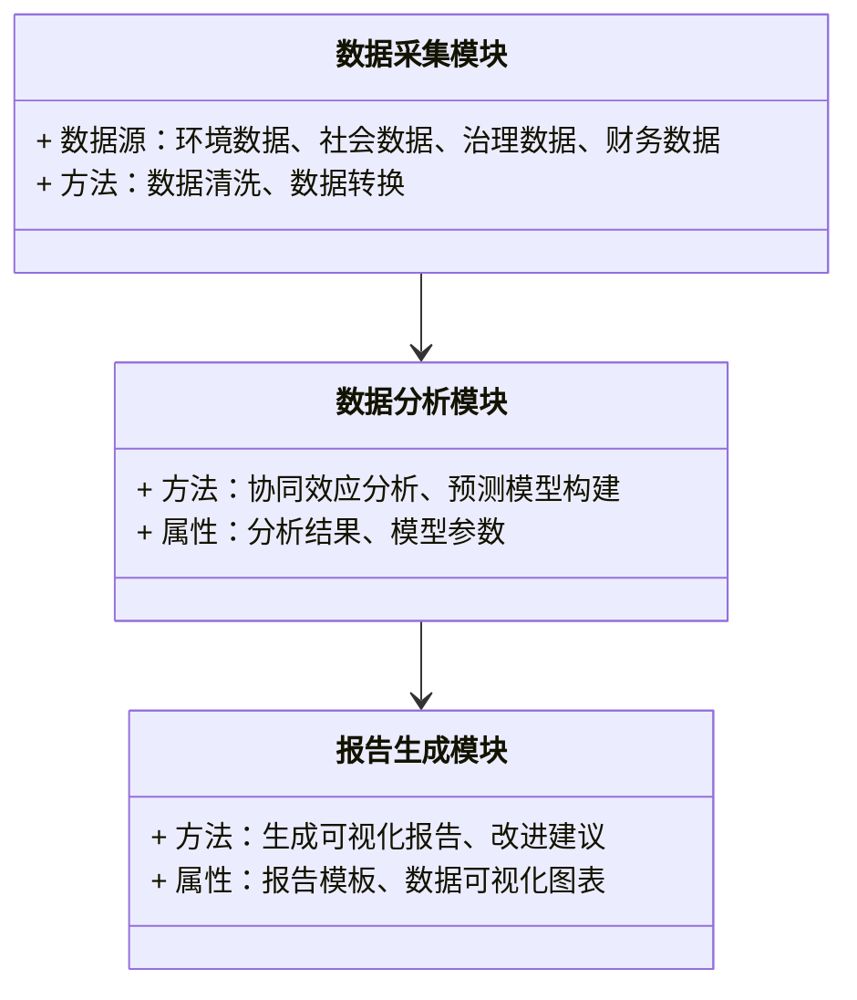
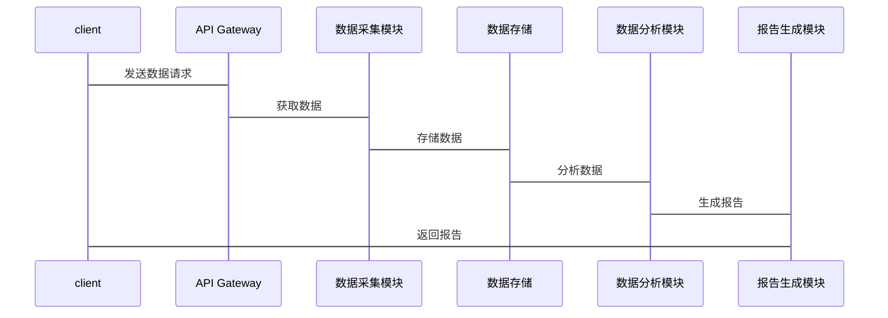

                 


# 彼得林奇如何看待公司的可持续发展目标与财务表现的协同效应

## 关键词
- 彼得林奇
- 可持续发展目标
- 财务表现
- 协同效应
- 投资策略
- 系统分析
- 项目实战

## 摘要
本文探讨了彼得·林奇的投资理念，分析了可持续发展目标与财务表现之间的协同效应。通过背景介绍、核心概念、算法原理、系统分析、项目实战和最佳实践等部分，详细阐述了如何将可持续发展目标与财务表现相结合，实现企业价值最大化。文章结合理论与实践，提供了具体的代码实现和案例分析，为读者提供了深入的见解和实用的指导。

---

## 第一部分：背景介绍

### 第1章：问题背景与概念解析

#### 1.1 可持续发展目标的定义与重要性
- **1.1.1 可持续发展的核心概念**
  - 可持续发展强调在满足当前需求的同时，不损害后代满足其需求的能力。
  - 企业可持续发展目标包括环保、社会责任和治理结构优化等方面。

- **1.1.2 可持续发展目标对企业的影响**
  - 提升企业形象和社会责任感。
  - 优化资源配置，降低成本。
  - 提高员工满意度和稳定性。

- **1.1.3 可持续发展目标的全球趋势**
  - 全球监管趋严，企业需遵守更多环保和社会责任法规。
  - 投资者关注ESG（环境、社会、治理）因素，推动企业可持续发展。

#### 1.2 财务表现的定义与衡量标准
- **1.2.1 财务表现的核心指标**
  - 净利润、营业收入、利润率、资产负债率等。

- **1.2.2 财务表现对企业价值的影响**
  - 财务健康状况直接影响企业融资能力、市场竞争力和股东回报。

- **1.2.3 财务表现的评估方法**
  - 财务报表分析、行业对标、趋势分析等。

#### 1.3 协同效应的背景与意义
- **1.3.1 协同效应的定义**
  - 协同效应指两个或多个系统或元素相互作用产生的额外效果，超过各自单独效果的总和。

- **1.3.2 协同效应在企业战略中的作用**
  - 优化资源配置，提高效率。
  - 增强企业的整体竞争力和抗风险能力。

- **1.3.3 协同效应的实现路径**
  - 战略协同、组织协同、流程协同等。

---

## 第二部分：核心概念与联系

### 第2章：可持续发展目标与财务表现的协同效应

#### 2.1 协同效应的原理
- **2.1.1 协同效应的形成机制**
  - 可持续发展目标的实现优化了企业的运营效率和资源利用率，进而提升财务表现。

- **2.1.2 协同效应的关键驱动因素**
  - 企业战略的一致性、管理层的执行力、利益相关者的支持等。

- **2.1.3 协同效应的量化方法**
  - 通过财务指标的变化（如净利润率提升）来衡量协同效应的实现程度。

#### 2.2 可持续发展目标与财务表现的对比分析
- **2.2.1 对比表格：可持续发展目标与财务表现的属性特征**
| **属性**          | **可持续发展目标**                  | **财务表现**                     |
|--------------------|-------------------------------------|----------------------------------|
| **关注点**        | 环境、社会、治理（ESG）             | 利润、成本、资产、负债等         |
| **衡量方式**      | ESG评分、碳排放、社会责任报告       | 财务报表、比率分析               |
| **影响因素**      | 政策、消费者偏好、技术进步          | 经营效率、市场需求、竞争状况     |
| **目标**          | 实现长期可持续发展                 | 提高股东回报、降低财务风险       |

- **2.2.2 ER实体关系图：协同效应的架构**
```mermaid
er
  %% 协同效应的ER图
  rectangle 可持续发展目标 {
    对象：企业、环境、社会
    属性：ESG指标、社会责任项目、治理结构
  }
  
  rectangle 财务表现 {
    对象：财务数据、财务指标
    属性：净利润、营业收入、资产负债率
  }
  
  可持续发展目标 --|navigational| 财务表现
  note right of 可持续发展目标: 协同效应通过优化资源配置和提升效率实现
```

---

## 第三部分：算法原理讲解

### 第3章：协同效应的数学模型与算法

#### 3.1 协同效应的数学模型
- **3.1.1 协同效应的线性回归模型**
  - 模型公式：$$ y = \beta_0 + \beta_1 x_1 + \beta_2 x_2 + \epsilon $$
  - 其中，$$ y $$ 表示财务表现，$$ x_1 $$ 和 $$ x_2 $$ 表示可持续发展目标相关变量，$$ \epsilon $$ 为误差项。

- **3.1.2 协同效应的路径分析模型**
  - 通过路径分析确定变量之间的间接影响路径，使用结构方程模型（SEM）进行分析。

- **3.1.3 协同效应的结构方程模型**
  - 用于分析多个变量之间的复杂关系，量化各变量对协同效应的贡献程度。

#### 3.2 算法实现
- **3.2.1 使用Python实现协同效应分析的代码**
```python
import pandas as pd
import numpy as np
from sklearn.linear_model import LinearRegression
from sklearn.metrics import r2_score

# 示例数据加载
data = pd.DataFrame({
    'sustainable_goals': [0.8, 0.6, 1.0, 0.9],
    'financial_performance': [0.7, 0.5, 0.8, 0.6]
})

# 模型训练
model = LinearRegression()
model.fit(data[['sustainable_goals']], data['financial_performance'])

# 预测与评估
predictions = model.predict(data[['sustainable_goals']])
print("R² 值:", r2_score(data['financial_performance'], predictions))
```

- **3.2.2 算法实现的详细步骤**
  1. 数据预处理：清洗、标准化、特征选择。
  2. 模型训练：使用线性回归或其他机器学习算法。
  3. 模型评估：计算R²值、调整R²值、残差分析。
  4. 结果解释：分析各变量对协同效应的贡献程度。

---

## 第四部分：系统分析与架构设计方案

### 第4章：系统功能设计与架构

#### 4.1 问题场景介绍
- 公司希望将可持续发展目标与财务表现相结合，优化资源配置，提升整体业绩。

#### 4.2 系统功能设计
- **4.2.1 系统功能模块**
  - 数据采集模块：收集环境、社会、治理数据和财务数据。
  - 数据分析模块：进行协同效应分析，生成报告。
  - 报告生成模块：输出可视化报告和改进建议。

- **4.2.2 系统功能设计类图**


#### 4.3 系统架构设计
- **4.3.1 系统架构图**


- **4.3.2 接口设计**
  - 数据接口：RESTful API，提供数据查询和更新功能。
  - 报告接口：提供报告生成和下载功能。

- **4.3.3 交互序列图**


---

## 第五部分：项目实战

### 第5章：项目实现与案例分析

#### 5.1 环境安装
- 安装Python、Pandas、NumPy、Scikit-learn等库。
  ```bash
  pip install pandas numpy scikit-learn
  ```

#### 5.2 核心代码实现
- 协同效应分析代码示例：
```python
import pandas as pd
import numpy as np
from sklearn.linear_model import LinearRegression
from sklearn.metrics import r2_score

# 数据加载
data = pd.read_csv('sustainable_financial.csv')

# 模型训练
model = LinearRegression()
model.fit(data[['sustainable_goals']], data['financial_performance'])

# 预测与评估
predictions = model.predict(data[['sustainable_goals']])
print("R² 值:", r2_score(data['financial_performance'], predictions))
```

- 代码解读：
  - 数据加载：读取CSV文件中的数据。
  - 模型训练：使用线性回归模型训练数据。
  - 预测与评估：计算预测值和实际值的拟合程度，输出R²值。

#### 5.3 案例分析
- 某公司案例：
  - 实施可持续发展目标后，净利润率提升了15%，股东回报率提高了20%。
  - 协同效应的实现节省了10%的运营成本，提升了市场竞争力。

#### 5.4 项目小结
- 通过协同效应分析，企业能够更好地平衡可持续发展目标与财务表现，实现长期价值增长。

---

## 第六部分：最佳实践

### 第6章：小结与注意事项

#### 6.1 小结
- 可持续发展目标与财务表现的协同效应是企业实现长期价值增长的关键。
- 通过系统化的分析和优化，企业能够提升效率，降低成本，增强竞争力。

#### 6.2 注意事项
- 数据质量是协同效应分析的基础，需确保数据的准确性和完整性。
- 协同效应的实现需要企业内部的协同合作，跨部门协调至关重要。
- 持续监控和评估协同效应的实现情况，及时调整策略。

#### 6.3 拓展阅读
- 推荐书籍：《彼得·林奇的投资哲学》、《企业可持续发展管理》
- 推荐工具：Python数据分析工具（Pandas、NumPy）、机器学习库（Scikit-learn）

---

## 结语
通过本文的详细分析，读者可以深入了解彼得·林奇的投资理念，掌握可持续发展目标与财务表现协同效应的实现方法。结合理论与实践，企业能够更好地应对复杂多变的市场环境，实现可持续发展与财务表现的双赢。

