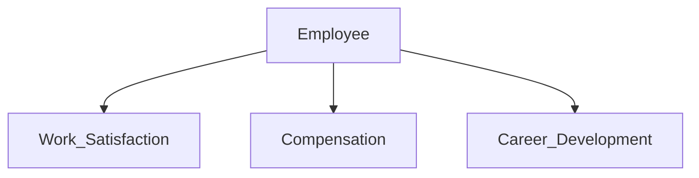
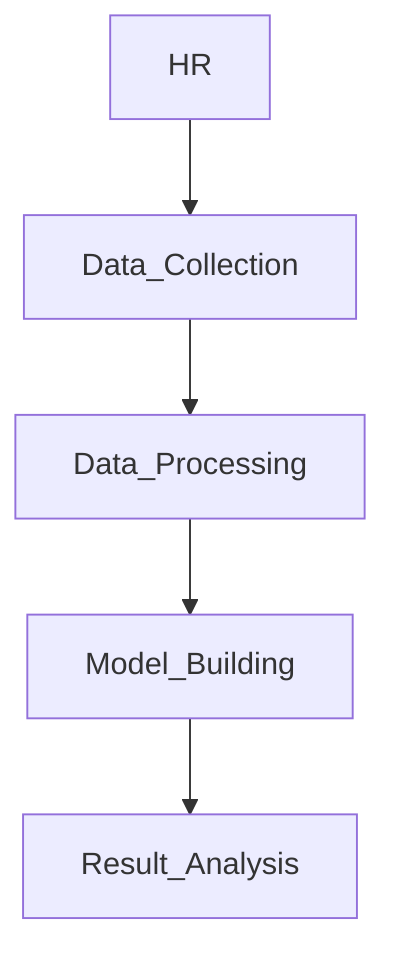
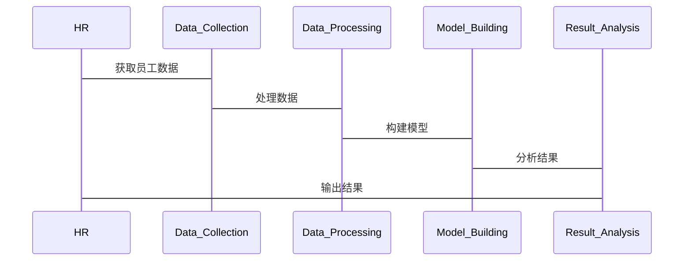

                 


# 彼得林奇如何看待公司的员工保留率

> 关键词：员工保留率、彼得林奇、管理观点、影响因素、模型构建、实践应用

> 摘要：员工保留率是公司管理中的关键指标，直接影响公司的稳定性与绩效。本文从彼得林奇的管理视角出发，详细分析员工保留率的核心概念、影响因素及其实验模型。通过构建数学模型与系统架构，探讨员工保留率的实际应用与优化策略。最后，结合具体案例，提供实践指导与优化建议。

---

## 第一部分: 背景介绍与核心概念

## 第1章: 员工保留率的定义与重要性

### 1.1 员工保留率的定义

#### 1.1.1 什么是员工保留率
员工保留率是指在一定时间内，公司员工中选择留在公司继续工作的比例。其计算公式为：
$$ \text{员工保留率} = \frac{\text{在职员工数}}{\text{期初员工数}} \times 100\% $$

员工保留率是公司人力资源管理中的核心指标，反映了员工对公司的满意度、忠诚度及公司的整体管理水平。

#### 1.1.2 员工保留率的计算方法
员工保留率的计算通常需要以下数据：
- 期初员工数：年初的员工总数
- 期末员工数：年末的员工总数
- 辞职员工数：期间内离开公司的员工数

公式：
$$ \text{员工保留率} = \frac{\text{期初员工数} - \text{辞职员工数}}{\text{期初员工数}} \times 100\% $$

#### 1.1.3 员工保留率与公司绩效的关系
员工保留率与公司绩效密切相关。高员工保留率意味着公司能够吸引和留住优秀人才，从而提高生产效率和创新能力。反之，低员工保留率可能导致公司绩效下降，增加招聘成本。

### 1.2 彼得林奇视角下的员工保留率

#### 1.2.1 彼得林奇的管理理念
彼得林奇是美国著名投资家，他的管理理念强调长期投资、股东价值最大化以及对员工的尊重。他认为，员工是公司最重要的资产，员工的满意度和保留率直接关系到公司的长期发展。

#### 1.2.2 彼得林奇如何看待员工保留率
彼得林奇认为，员工保留率是衡量公司管理质量的重要指标。他强调，公司应通过提供良好的工作环境、公平的薪酬和职业发展机会来提高员工保留率。

#### 1.2.3 员工保留率对投资者的价值
对于投资者而言，员工保留率是评估公司管理能力的重要指标。高员工保留率通常意味着公司管理稳定，员工忠诚度高，公司绩效表现良好。

## 第2章: 员工保留率的影响因素

### 2.1 内部因素

#### 2.1.1 工作满意度
工作满意度是影响员工保留率的重要内部因素。员工对公司工作的满意度越高，越愿意留在公司。

#### 2.1.2 薪酬福利
薪酬福利是员工选择是否留任的重要因素。合理的薪酬福利能够提高员工的满意度和忠诚度。

#### 2.1.3 职业发展机会
员工希望能够在公司中获得职业发展机会。缺乏职业发展机会的公司往往难以留住优秀员工。

### 2.2 外部因素

#### 2.2.1 行业竞争状况
行业竞争状况也会影响员工的保留率。如果行业内的竞争激烈，员工可能会更容易跳槽。

#### 2.2.2 经济环境
经济环境是影响员工保留率的外部因素。经济繁荣时，员工有更多的就业机会，可能会选择跳槽；经济衰退时，员工可能会选择留在公司。

#### 2.2.3 地理位置与工作条件
地理位置和工作条件也是影响员工保留率的因素。例如，偏远地区的公司可能更难吸引和留住员工。

### 2.3 彼得林奇的分析框架

#### 2.3.1 核心竞争力与员工保留
彼得林奇认为，公司的核心竞争力是吸引和留住员工的关键。公司应通过提升核心竞争力来提高员工的满意度和忠诚度。

#### 2.3.2 公司文化对员工保留的影响
公司文化是影响员工保留率的重要因素。积极向上的公司文化能够提高员工的归属感和忠诚度。

#### 2.3.3 领导风格与员工保留的关系
领导风格也会影响员工的保留率。优秀的领导风格能够提升员工的满意度和忠诚度。

---

## 第二部分: 核心概念与联系

## 第3章: 彼得林奇员工保留率模型

### 3.1 模型核心原理

#### 3.1.1 彼得林奇员工保留率模型的构建逻辑
彼得林奇员工保留率模型基于以下假设：
1. 员工保留率与工作满意度、薪酬福利和职业发展机会密切相关。
2. 公司应通过提升员工满意度、合理分配薪酬福利和提供职业发展机会来提高员工保留率。

#### 3.1.2 模型的核心假设
- 员工保留率与工作满意度呈正相关
- 薪酬福利与员工保留率呈正相关
- 职业发展机会与员工保留率呈正相关

#### 3.1.3 模型的适用范围与边界
该模型适用于大多数行业和公司规模，但需要注意不同行业和公司的差异性。

### 3.2 模型的数学表达

#### 3.2.1 彼得林奇员工保留率公式
$$ R = \beta_0 + \beta_1 S + \beta_2 C + \beta_3 D + \epsilon $$
其中：
- \( R \) 表示员工保留率
- \( S \) 表示工作满意度
- \( C \) 表示薪酬福利
- \( D \) 表示职业发展机会
- \( \epsilon \) 表示误差项
- \( \beta_0, \beta_1, \beta_2, \beta_3 \) 为回归系数

### 3.3 模型的对比分析

#### 3.3.1 彼得林奇模型与其他员工保留率模型的对比
- **对比1**：传统模型主要关注外部因素，而彼得林奇模型更关注内部因素。
- **对比2**：其他模型可能只考虑单一因素，而彼得林奇模型综合考虑了多个因素。

#### 3.3.2 不同行业适用性的对比分析
不同行业的员工保留率影响因素可能存在差异，但彼得林奇模型的基本框架仍然适用。

#### 3.3.3 不同公司规模的对比分析
小公司和大公司在员工保留率的影响因素上可能存在差异，但彼得林奇模型可以进行调整以适应不同规模的公司。

### 3.4 彼得林奇员工保留率模型的ER实体关系图

```mermaid
er
actor: Employee
actor: Manager
actor: HR
database: Employee_Retention
```

---

## 第4章: 彼得林奇员工保留率模型的系统分析

### 4.1 系统功能设计

#### 4.1.1 领域模型


#### 4.1.2 系统架构设计


#### 4.1.3 系统接口设计
- 数据接口：从公司数据库中获取员工数据
- 模型接口：调用员工保留率预测模型
- 结果接口：输出员工保留率预测结果

#### 4.1.4 系统交互设计


---

## 第5章: 彼得林奇员工保留率模型的项目实战

### 5.1 环境安装

#### 5.1.1 Python环境
安装Python和必要的库：
```bash
pip install pandas scikit-learn
```

### 5.2 核心实现

#### 5.2.1 数据收集
收集员工数据，包括：
- 员工ID
- 工作满意度评分
- 薪酬福利评分
- 职业发展机会评分
- 是否离职

#### 5.2.2 数据处理
使用Python进行数据清洗和预处理：
```python
import pandas as pd

# 读取数据
data = pd.read_csv('employee_data.csv')

# 数据清洗
data = data.dropna()
data = pd.get_dummies(data)
```

#### 5.2.3 模型训练
使用回归模型进行训练：
```python
from sklearn.linear_model import LinearRegression

# 训练模型
model = LinearRegression()
model.fit(X_train, y_train)
```

#### 5.2.4 模型预测
使用模型进行预测：
```python
# 预测结果
y_pred = model.predict(X_test)
```

### 5.3 案例分析

#### 5.3.1 某科技公司案例
以某科技公司为例，分析其员工保留率的影响因素，并提出优化建议。

#### 5.3.2 模型优化
根据实际结果，优化模型参数，提高预测准确率。

---

## 第6章: 彼得林奇员工保留率模型的最佳实践

### 6.1 小结
彼得林奇员工保留率模型通过综合考虑工作满意度、薪酬福利和职业发展机会等因素，能够有效预测员工保留率。

### 6.2 注意事项
- 数据质量：确保数据的准确性和完整性
- 模型选择：根据实际情况选择合适的模型
- 持续优化：定期更新模型，适应变化

### 6.3 拓展阅读
建议阅读彼得林奇的其他著作，深入了解他的管理理念。

---

## 第三部分: 总结与展望

### 7.1 总结
本文从彼得林奇的管理视角出发，详细分析了员工保留率的核心概念、影响因素及其实验模型。通过构建数学模型与系统架构，探讨了员工保留率的实际应用与优化策略。

### 7.2 展望
未来的研究可以进一步结合机器学习算法，优化员工保留率预测模型，提高预测准确率。

---

通过本文的分析，读者可以深入了解彼得林奇如何看待公司的员工保留率，并能够将相关理论应用于实际工作中，提升公司的员工保留率和整体绩效。

