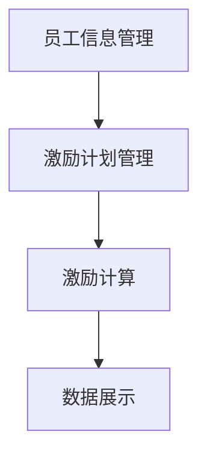

                 

<think>
好的，我将按照您的要求，逐步分析并撰写关于彼得·林奇如何看待公司员工股权激励的详细文章。我们从文章标题开始，然后是关键词和摘要，接着是正文部分的各个章节。我会一步步地进行思考和撰写，确保内容清晰、逻辑严谨。

---

# 彼得林奇如何看待公司的员工股权激励

> 关键词：员工股权激励、彼得·林奇、投资策略、公司治理、股东价值

> 摘要：彼得·林奇作为投资大师，对员工股权激励持有独特见解。本文将从背景、核心概念、算法原理、系统架构、项目实战和最佳实践等方面，详细分析彼得·林奇的观点，探讨员工股权激励在现代公司治理中的作用及实施策略。

---

## 第一章：员工股权激励的背景与重要性

### 1.1 股权激励的基本概念

员工股权激励是一种通过给予员工一定形式的股权，以激励员工为公司创造更多价值的机制。这种激励方式将员工的个人利益与公司的长期发展紧密相连，是现代公司治理中的重要组成部分。

#### 1.1.1 股权激励的定义
股权激励是指公司通过给予员工股票、股票期权或其他形式的股权，使员工能够分享公司发展的收益，从而激发员工的工作积极性和创造力。

#### 1.1.2 股权激励的目标
股权激励的主要目标包括：
- 提高员工的工作积极性和责任感。
- 吸引和留住优秀人才。
- 激发员工的创新意识和团队协作精神。
- 实现员工与公司的共同成长。

#### 1.1.3 股权激励的实施范围
股权激励通常适用于公司核心员工、高层管理者以及对公司发展有重要影响的关键岗位员工。

### 1.2 彼得·林奇与员工股权激励的关系

作为投资大师，彼得·林奇非常关注公司治理结构和股东价值的创造。他认为，员工股权激励是实现公司与员工双赢的重要手段。

#### 1.2.1 林奇对股权激励的积极评价
彼得·林奇认为，股权激励能够增强员工的主人翁意识，使员工更加关注公司的长期发展，从而为股东创造更大的价值。

#### 1.2.2 林奇对股权激励的审慎态度
尽管林奇认可股权激励的作用，但他也强调，激励计划的设计必须合理，避免过度激励导致的资源浪费和管理混乱。

---

## 第二章：股权激励的核心机制与实施策略

### 2.1 股权激励的核心机制

股权激励的核心机制包括以下几个方面：
- **激励与绩效挂钩**：员工的股权收益与公司的业绩表现直接相关，确保激励的有效性。
- **长期激励与短期激励结合**：通过设定合理的激励周期，平衡员工的短期目标与公司的长期发展。
- **灵活的激励形式**：根据公司实际情况，选择股票期权、限制性股票等多种激励形式。

#### 2.1.1 激励与绩效挂钩
股权激励的设计应与员工的绩效考核挂钩，确保激励措施的有效性。例如，员工的股权收益与公司的净利润增长率挂钩，从而激励员工关注公司业绩的提升。

#### 2.1.2 长期激励与短期激励结合
短期激励可以快速激发员工的积极性，而长期激励则有助于员工与公司共同实现可持续发展。例如，公司可以将股权激励分为一次性奖励和分期兑现两种形式。

### 2.2 股权激励的实施策略

#### 2.2.1 确定激励对象
公司应根据员工的岗位职责、绩效表现和对公司的重要程度，确定股权激励的对象。

#### 2.2.2 设计激励方案
激励方案的设计需要综合考虑公司的财务状况、发展目标和员工的期望。例如，公司可以采用股票期权的形式，给予员工在未来以固定价格购买公司股票的权利。

#### 2.2.3 监督与调整
股权激励的实施过程中，公司需要定期监督激励计划的执行效果，并根据实际情况进行调整。例如，如果公司业绩表现不佳，可以适当调整激励计划的兑现条件。

---

## 第三章：股权激励的数学模型与算法

### 3.1 股权激励的定价模型

股权激励的定价是激励计划设计中的重要环节。常用的方法包括Black-Scholes模型和二叉树模型。

#### 3.1.1 Black-Scholes模型
Black-Scholes模型用于计算股票期权的理论价格，公式如下：
$$
C = S_0 \Phi(d_1) - K e^{-rT} \Phi(d_2)
$$
其中：
- $S_0$ 是股票当前价格
- $K$ 是期权的执行价格
- $r$ 是无风险利率
- $T$ 是期权到期时间
- $\sigma$ 是股票价格的波动率
- $\Phi$ 是标准正态分布的累积分布函数
- $d_1 = \frac{\ln(S_0/K) + (r + \sigma^2/2)T}{\sigma \sqrt{T}}$
- $d_2 = d_1 - \sigma \sqrt{T}$

#### 3.1.2 二叉树模型
二叉树模型通过模拟股票价格的上下波动，计算期权的期望价值。其基本步骤包括：
1. 确定股票价格的上行和下行概率。
2. 计算每种情况下的期权价值。
3. 根据概率加权平均，得到期权的理论价格。

### 3.2 股权激励的实现流程

#### 3.2.1 确定激励对象
- **数据输入**：输入员工信息，包括职位、绩效评分等。
- **筛选规则**：根据绩效评分和职位等级，筛选出符合激励条件的员工。

#### 3.2.2 设计激励方案
- **方案选择**：根据公司实际情况，选择合适的股权激励形式（如股票期权、限制性股票）。
- **参数设置**：设置激励方案的参数，包括期权的执行价格、股票数量等。

#### 3.2.3 计算激励价值
- **数学计算**：使用Black-Scholes模型或其他模型，计算激励的价值。
- **结果输出**：输出激励计划的具体实施方案。

---

## 第四章：股权激励的系统架构与实现

### 4.1 系统架构设计

#### 4.1.1 系统功能模块
- **员工信息管理模块**：管理员工的基本信息和绩效数据。
- **激励计划管理模块**：设计和管理股权激励计划。
- **激励计算模块**：根据数学模型计算激励的价值。
- **数据展示模块**：展示激励计划的执行情况和效果。

#### 4.1.2 系统架构图


### 4.2 系统实现细节

#### 4.2.1 数据接口设计
- **员工信息接口**：提供员工的基本信息和绩效数据。
- **激励计划接口**：提供激励计划的设计参数和执行规则。
- **激励计算接口**：根据数学模型计算激励的价值。

#### 4.2.2 系统实现代码
以下是一个简单的激励计算模块的Python代码示例：
```python
def calculate_incentive(S, K, T, r, sigma):
    d1 = (np.log(S/K) + (r + 0.5*sigma**2)*T) / (sigma*np.sqrt(T))
    d2 = d1 - sigma*np.sqrt(T)
    C = S * norm.cdf(d1) - K * np.exp(-r*T) * norm.cdf(d2)
    return C

# 示例计算
S = 100
K = 105
T = 1
r = 0.05
sigma = 0.2
print(calculate_incentive(S, K, T, r, sigma))
```

---

## 第五章：彼得·林奇的股权激励实践与总结

### 5.1 彼得·林奇的股权激励理念

彼得·林奇认为，股权激励是实现公司与员工共同发展的有效手段。他强调：
1. 激励计划的设计必须合理，避免过度激励。
2. 激励计划应与公司的长期发展目标相结合。
3. 应根据员工的绩效表现，灵活调整激励措施。

### 5.2 股权激励的实施策略总结

- **激励对象的选择**：优先考虑核心员工和管理层。
- **激励形式的多样化**：结合公司实际情况，选择合适的激励形式。
- **激励机制的动态调整**：根据公司业绩和员工表现，及时调整激励计划。

---

## 第六章：最佳实践与注意事项

### 6.1 最佳实践

- **合理设计激励方案**：确保激励计划与公司战略目标一致。
- **加强激励效果评估**：定期评估激励计划的实施效果。
- **注重激励的公平性**：避免激励措施引发内部矛盾。

### 6.2 注意事项

- **避免过度激励**：过度激励可能导致员工追求短期利益，忽视公司的长期发展。
- **确保激励计划的合规性**：遵守相关法律法规，避免法律风险。
- **加强激励计划的沟通**：向员工清晰传达激励计划的设计理念和实施细节。

---

## 第七章：案例分析与总结

### 7.1 案例分析

以某科技公司为例，该公司通过实施股票期权激励计划，成功吸引了大量优秀人才，并显著提升了员工的工作积极性。案例分析表明，合理的股权激励计划能够有效促进公司的发展。

### 7.2 总结

彼得·林奇的股权激励理念为我们提供了宝贵的启示。通过合理设计和实施股权激励计划，公司能够实现员工与公司的共同成长，创造更大的股东价值。

---

## 结语

股权激励是现代公司治理中的重要组成部分。彼得·林奇的投资理念为我们提供了独特的视角，帮助我们更好地理解股权激励的作用和实施策略。未来，随着公司治理结构的不断完善，股权激励将在公司发展中发挥越来越重要的作用。

--- 

如果需要进一步补充或调整，请随时告知！

