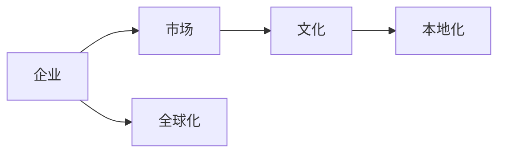
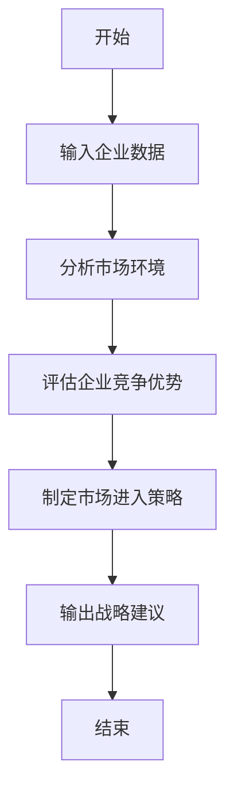
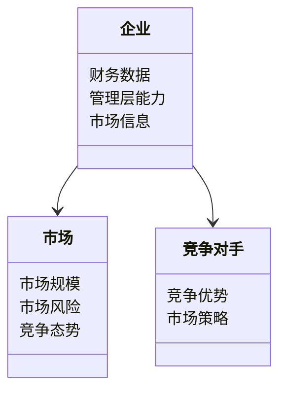
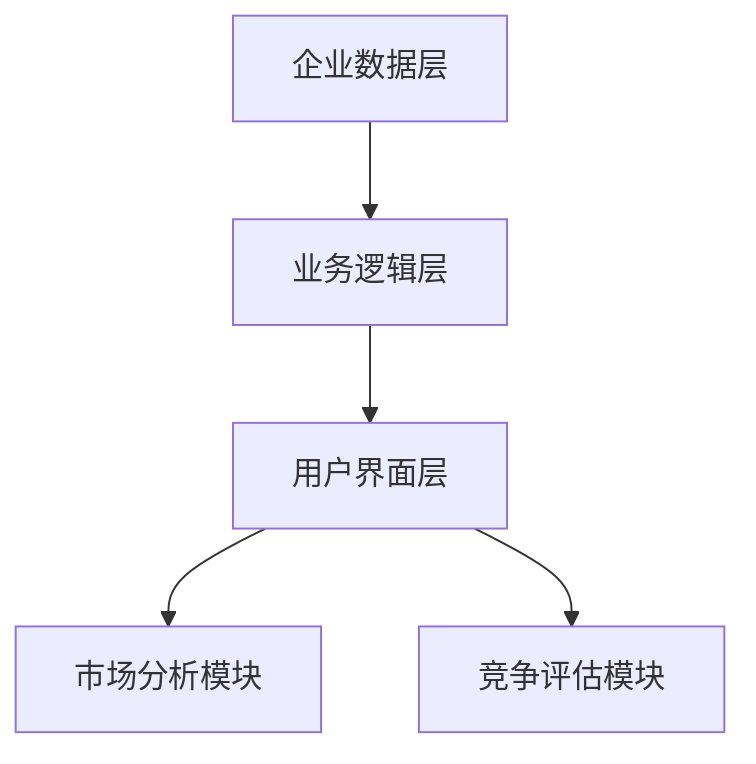
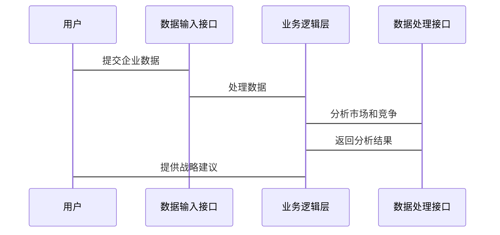

                 


# 彼得林奇如何看待公司的国际化战略

## 关键词：彼得·林奇，国际化战略，投资理念，市场分析，企业竞争力

## 摘要：本文从彼得·林奇的投资视角出发，分析了公司国际化战略的重要性、核心概念以及实施策略。通过深入探讨其投资理念，结合实际案例，为读者提供了如何评估和制定国际化战略的实用指导。

---

# 第一部分: 国际化战略的背景与重要性

## 第1章: 国际化战略的定义与核心要素

### 1.1 国际化战略的定义
#### 1.1.1 国际化战略的定义与内涵
国际化战略是指企业在扩展国内市场的基础上，进入国际市场的系统性规划和行动。它包括市场进入策略、跨文化管理和全球化与本地化的平衡。

#### 1.1.2 国际化战略的核心要素
- 市场分析：研究目标市场的规模、增长率、竞争状况。
- 资源配置：确定企业在国际市场中的资源分配。
- 风险评估：识别并评估政治、经济和文化风险。

#### 1.1.3 国际化战略的边界与外延
国际化战略不仅限于市场扩展，还包括企业文化和管理模式的调整。

### 1.2 国际化战略的重要性
#### 1.2.1 全球化经济背景下的企业机遇
国际化战略帮助企业利用全球资源和市场，提升竞争力。

#### 1.2.2 国际化战略对企业竞争力的影响
通过国际化，企业可以进入高增长市场，获取新的利润来源。

#### 1.2.3 国际化战略与企业长期发展的关系
国际化战略是企业实现可持续增长的关键，帮助企业在全球范围内优化资源配置。

### 1.3 彼得·林奇与国际化战略的关系
#### 1.3.1 彼得·林奇的投资理念概述
彼得·林奇强调基本面分析和管理层能力，认为企业的核心竞争力是其长期价值的基础。

#### 1.3.2 彼得·林奇对国际化战略的关注点
- 企业的全球市场份额。
- 管理层的国际化视野和能力。

#### 1.3.3 彼得·林奇视角下的国际化战略价值
国际化战略能够帮助企业扩大规模，增强市场影响力。

### 1.4 本章小结
本章介绍了国际化战略的定义、核心要素及其重要性，并从彼得·林奇的投资视角探讨了其对国际化战略的关注点和价值。

---

## 第2章: 国际化战略的核心概念与联系

### 2.1 国际化战略的核心概念
#### 2.1.1 市场进入策略
- 直接投资：建立子公司或分公司。
- 间接进入：通过合资企业或特许经营。

#### 2.1.2 跨文化管理
- 理解并适应目标市场的文化差异。
- 构建多元化的管理团队。

#### 2.1.3 全球化与本地化平衡
- 全球化：统一的品牌和战略。
- 本地化：适应当地市场的需求。

### 2.2 核心概念的联系
#### 2.2.1 市场进入策略与企业资源分配
选择合适的市场进入策略需要考虑企业的资源和能力。

#### 2.2.2 跨文化管理与团队协作
成功的国际化战略需要有效的跨文化沟通和协作。

#### 2.2.3 全球化与本地化对企业发展的影响
全球化有助于提升企业竞争力，本地化则能更好地适应市场。

### 2.3 核心概念对比表格
| 战略类型 | 优点 | 缺点 |
|----------|------|------|
| 直接投资 | 控制力强 | 资金需求高 |
| 间接进入 | 风险低 | 控制力弱 |

### 2.4 ER实体关系图


### 2.5 本章小结
本章分析了国际化战略的核心概念，探讨了市场进入策略、跨文化管理和全球化与本地化的平衡，并通过表格和ER图展示了这些概念之间的联系。

---

## 第3章: 国际化战略的算法原理

### 3.1 算法原理概述
#### 3.1.1 基于彼得·林奇投资理念的分析框架
彼得·林奇通过分析企业的财务状况、管理层能力和市场地位来评估其国际化战略的可行性。

#### 3.1.2 算法的输入与输出
- 输入：企业的财务数据、市场信息、管理层能力。
- 输出：国际化战略的评估结果和建议。

#### 3.1.3 算法的核心步骤
1. 数据收集与处理。
2. 市场分析。
3. 企业竞争力评估。
4. 制定市场进入策略。

### 3.2 算法流程图


### 3.3 算法实现代码
```python
def peter_lynch_analysis(enterprise_data):
    market_environment = analyze_market(enterprise_data['market'])
    competitive_advantage = assess_competition(enterprise_data['competitor'])
    strategic_recommendations = formulate_strategy(market_environment, competitive_advantage)
    return strategic_recommendations

def analyze_market(market):
    # 分析市场环境，返回市场风险和机会
    pass

def assess_competition(competitor):
    # 评估竞争对手，返回竞争态势
    pass

def formulate_strategy(market, competition):
    # 根据市场和竞争情况制定策略
    pass
```

### 3.4 本章小结
本章通过彼得·林奇的投资理念，构建了一个用于评估国际化战略的算法框架，并通过流程图和代码示例展示了如何实施这一算法。

---

## 第4章: 国际化战略的系统分析与架构设计

### 4.1 系统分析
#### 4.1.1 问题场景介绍
假设一家企业计划进入新兴市场，需要评估其国际化战略的可行性。

#### 4.1.2 项目介绍
通过系统分析，帮助企业制定有效的国际化战略。

### 4.2 系统功能设计
#### 4.2.1 领域模型mermaid类图


#### 4.2.2 系统架构设计mermaid架构图


### 4.3 系统接口设计
- 数据输入接口：接收企业的财务数据和市场信息。
- 数据处理接口：分析市场环境和竞争对手。
- 输出接口：提供战略建议。

### 4.4 系统交互mermaid序列图


### 4.5 本章小结
本章通过系统分析，构建了一个用于评估国际化战略的系统架构，并展示了如何通过模块化设计实现这一目标。

---

## 第5章: 国际化战略的项目实战

### 5.1 环境安装
- 安装Python和必要的库，如Pandas和Matplotlib。

### 5.2 核心实现源代码
```python
import pandas as pd
import matplotlib.pyplot as plt

def analyze_market(data):
    # 分析市场数据并返回结果
    pass

def visualize_data(data):
    plt.plot(data)
    plt.show()

# 示例数据
data = {'市场': [100, 200, 150, 300], '竞争': [50, 40, 60, 70]}
df = pd.DataFrame(data)
visualize_data(df)
```

### 5.3 实际案例分析
分析一家公司进入新兴市场的可行性，包括环境分析、数据收集与处理、关键指标评估。

### 5.4 详细解读与分析
- 数据收集：市场增长率、竞争对手分析。
- 关键指标：市场份额、利润率、品牌影响力。

### 5.5 项目小结
本章通过实际案例展示了如何应用前面的理论和方法，帮助企业在实际操作中制定有效的国际化战略。

---

## 第6章: 国际化战略的最佳实践

### 6.1 彼得·林奇经验总结
- 选择具有强大竞争优势的企业。
- 关注管理层的国际化视野和能力。

### 6.2 实际操作中的注意事项
- 风险评估和管理。
- 资源配置的合理性。

### 6.3 拓展阅读
推荐相关书籍和文献，供读者深入学习。

### 6.4 小结
本章总结了彼得·林奇的经验，并提出了实际操作中的建议，帮助企业在国际化战略中取得成功。

---

# 附录

## 附录A: 相关术语解释
- 国际化战略：企业在国际市场中的系统性规划和行动。

## 附录B: 参考文献
- 彼得·林奇的著作。
- 相关学术文献。

## 附录C: 工具与资源
- 数据分析工具推荐。
- 开发环境配置指南。

---

通过以上步骤，我们可以系统地分析彼得·林奇如何看待公司的国际化战略，并为企业提供实用的指导和建议。

