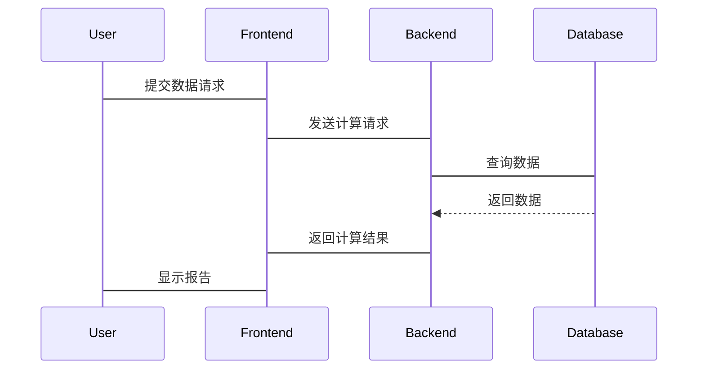

                 


# 彼得·林奇如何看待公司的客户粘性

## 关键词：
客户粘性，彼得·林奇，投资哲学，客户满意度，转换成本，企业价值

## 摘要：
客户粘性是衡量客户对公司产品或服务依赖程度的重要指标，直接影响公司的市场价值和长期发展。本文从客户粘性的定义、核心要素、分类、与企业价值的关系等方面展开分析，并结合彼得·林奇的投资哲学，探讨客户粘性在企业评估中的重要性。通过数学模型、系统架构设计和项目实战，帮助读者全面理解客户粘性的重要性及其应用。

---

## 第一部分：客户粘性概述

### 第1章：客户粘性的定义与重要性

#### 1.1 客户粘性的定义与重要性

客户粘性（Customer Stickiness）是指客户对某一产品或服务的依赖程度。高客户粘性意味着客户更难被竞争对手吸引，对公司具有更强的忠诚度。客户粘性不仅影响企业的收入和利润，还决定了公司在市场中的竞争优势。

#### 1.2 客户粘性的核心要素

- **产品依赖度**：客户对产品的依赖程度越高，粘性越强。
- **客户满意度**：满意的客户更有可能持续使用产品。
- **转换成本**：高转换成本使得客户难以轻易更换产品或服务。

#### 1.3 客户粘性的分类

- **强依赖型客户**：对产品高度依赖，几乎无法替代。
- **弱依赖型客户**：有一定的依赖性，但可能在价格或服务下降时转向竞争对手。
- **无依赖型客户**：没有特别依赖，容易被吸引或转移。

#### 1.4 客户粘性与公司价值的关系

- **高客户粘性**：带来稳定的收入和更高的利润率，降低营销成本。
- **低客户粘性**：公司容易失去客户，市场地位不稳，影响长期发展。

---

## 第二部分：彼得·林奇的投资哲学

### 第2章：彼得·林奇的投资理念

#### 2.1 彼得·林奇的投资风格

彼得·林奇是价值投资的代表人物，强调长期投资和基本面分析。他注重选择具有强大护城河、高客户粘性和可持续竞争优势的公司。

#### 2.2 彼得·林奇与客户粘性

彼得·林奇在评估公司时，特别关注客户粘性。他认为，高客户粘性的公司具有更强的市场地位和抗风险能力，能够为股东创造长期价值。

---

## 第三部分：客户粘性分析的核心概念

### 第3章：客户粘性指数模型

#### 3.1 客户粘性指数的定义

客户粘性指数（Customer Stickiness Index, CSI）是量化客户对产品或服务依赖程度的指标，公式如下：

$$
CSI = \frac{\text{客户保留率} \times \text{客户满意度}}{\text{转换成本}}
$$

其中，客户保留率、客户满意度和转换成本均以标准化形式表示。

#### 3.2 粘性指数的计算方法

- **数据收集与处理**：收集客户保留率、满意度和转换成本数据。
- **公式推导**：通过上述公式计算CSI。
- **示例计算**：假设某公司客户保留率为90%，满意度为85%，转换成本为$100。计算CSI：

$$
CSI = \frac{90 \times 85}{100} = 76.5
$$

CSI值越高，表示客户粘性越强。

#### 3.3 粘性指数与企业价值的关系

- **高CSI值**：公司具有强竞争力，客户忠诚度高。
- **低CSI值**：公司面临客户流失风险，竞争优势弱。

---

## 第四部分：客户粘性分析的系统架构

### 第4章：客户粘性分析系统设计

#### 4.1 系统功能设计

- **数据收集模块**：收集客户保留率、满意度和转换成本数据。
- **计算模块**：计算CSI值并生成报告。
- **展示模块**：以可视化形式展示分析结果。

#### 4.2 系统架构设计

- **前端**：用户界面，展示分析结果。
- **后端**：处理数据计算和接口调用。
- **数据库**：存储客户数据和分析结果。

#### 4.3 系统交互设计

通过Mermaid序列图展示系统交互流程：



---

## 第五部分：项目实战

### 第5章：环境安装与数据收集

#### 5.1 环境安装

- **安装Python**：确保安装了Python 3.x。
- **安装库**：使用pip安装`mermaid`和相关数据处理库。

#### 5.2 粘性指数计算的Python实现

```python
import pandas as pd

def calculate_csi( retention_rate, satisfaction, switching_cost):
    csi = (retention_rate * satisfaction) / switching_cost
    return csi

# 示例数据
data = {
    '客户ID': [1, 2, 3],
    '保留率': [0.9, 0.8, 0.7],
    '满意度': [0.85, 0.9, 0.75],
    '转换成本': [100, 120, 90]
}

df = pd.DataFrame(data)

# 计算CSI
df['CSI'] = df.apply(lambda x: calculate_csi(x['保留率'], x['满意度'], x['转换成本']), axis=1)

print(df)
```

#### 5.3 案例分析与结果解读

以某公司为例，计算其CSI值并分析结果。通过结果解读，说明如何利用CSI值评估公司价值。

---

## 第六部分：最佳实践与小结

### 第6章：投资建议

高客户粘性公司具有长期投资价值，建议投资者关注这些公司的基本面和市场地位。

### 第7章：注意事项

- 数据隐私和合规性：确保数据收集和处理符合相关法规。
- 模型局限性：CSI模型仅供参考，需结合其他因素综合分析。

### 第8章：未来研究方向

- 引入更多数据源：如客户行为数据和市场趋势。
- 机器学习算法：利用机器学习提高客户粘性预测的准确性。

---

通过以上分析，我们可以看到，客户粘性是评估公司价值的重要指标，而彼得·林奇的投资哲学为我们提供了独特的视角。结合数学模型和系统设计，我们可以更好地理解和应用客户粘性分析，为投资决策提供科学依据。

