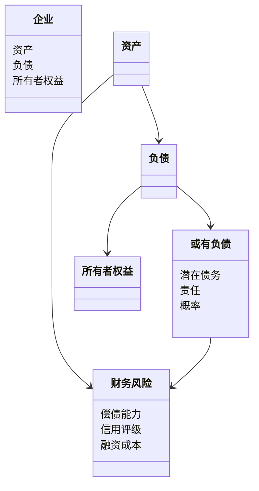
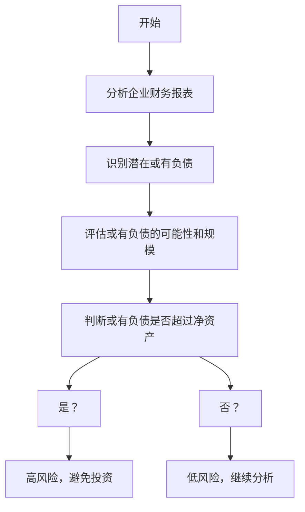

                 


# 彼得·林奇如何看待公司的或有负债风险

**关键词**：彼得·林奇，或有负债，财务风险，投资分析，风险管理，企业财务

**摘要**：本文从彼得·林奇的投资理念出发，深入探讨他对公司或有负债风险的看法。通过分析或有负债的定义、特征及其对公司财务健康的影响，结合具体的数学模型和实际案例，详细阐述彼得·林奇如何评估和管理或有负债风险，为投资者提供实用的分析框架和方法。

---

# 第一部分：背景介绍

## 第1章：或有负债风险概述

### 1.1 或有负债的定义与特征

#### 1.1.1 什么是或有负债
- 或有负债是指企业在未来可能需要承担的潜在债务或责任，通常源于合同、法律纠纷、担保或其他承诺。
- 或有负债的具体形式包括未决诉讼、担保责任、产品质量赔偿等。

#### 1.1.2 或有负债的核心特征
- 或有负债的不确定性：是否最终需要承担债务取决于未来事件的发展。
- 或有负债的潜在性：可能不会实际发生，但可能对企业财务状况造成重大影响。
- 或有负债的隐蔽性：通常未在企业财务报表中明确反映，需仔细挖掘。

#### 1.1.3 或有负债与公司财务健康的关系
- 或有负债可能隐藏在财务报表之外，影响企业的实际偿债能力。
- 高水平的或有负债可能引发信用危机，导致企业融资成本上升或难以获得资金。

### 1.2 彼得·林奇与或有负债风险

#### 1.2.1 彼得·林奇的投资理念
- 彼得·林奇是全球著名的价值投资者，强调深入研究企业基本面，寻找被市场低估的投资机会。
- 他注重企业的财务健康状况，认为财务稳健是企业长期发展的基础。

#### 1.2.2 彼得·林奇对或有负债风险的关注点
- 林奇认为，或有负债是衡量企业财务风险的重要指标，尤其是在企业面临潜在诉讼、担保责任或其他潜在债务时。
- 他关注或有负债的规模、可能性以及企业应对潜在负债的能力。

#### 1.2.3 彼得·林奇分析或有负债风险的方法论
- 林奇通过分析企业的财务报表、法律纠纷、担保情况等，评估或有负债对企业财务状况的影响。
- 他强调，或有负债可能成为企业财务危机的导火索，投资者需警惕那些或有负债规模远超企业净资产的企业。

---

## 第2章：或有负债风险的背景与问题背景

### 2.1 企业或有负债的形成原因

#### 2.1.1 企业或有负债的主要来源
- **合同承诺**：企业可能因合同承诺而产生或有负债，例如未履行的合同或违约责任。
- **担保责任**：企业为其他企业或个人提供担保，可能因被担保方违约而承担连带责任。
- **法律纠纷**：企业因未决诉讼或仲裁可能需要承担赔偿责任。
- **产品质量问题**：企业因产品缺陷可能面临赔偿责任。

#### 2.1.2 或有负债与企业经营的关系
- 或有负债可能源于企业的经营行为，例如过度担保或激进的业务拓展。
- 一些企业为了短期利益，可能忽视潜在的或有负债风险。

#### 2.1.3 或有负债对企业财务状况的影响
- 或有负债可能增加企业的潜在债务负担，影响其偿债能力。
- 大额的或有负债可能导致企业的信用评级下降，进而影响融资成本。

### 2.2 或有负债风险的现状与挑战

#### 2.2.1 当前企业或有负债风险的主要表现形式
- 企业间的互保现象普遍，导致或有负债规模迅速扩大。
- 部分企业通过复杂的关联交易转移或有负债，掩盖真实财务状况。

#### 2.2.2 或有负债风险对企业价值的影响
- 或有负债可能降低企业的市场价值，尤其是在市场对风险敏感的情况下。
- 高水平的或有负债可能导致企业难以获得新的融资，限制其业务发展。

#### 2.2.3 或有负债风险管理中的常见问题
- 企业对或有负债的风险认识不足，缺乏系统的风险管理机制。
- 企业倾向于低估或有负债的潜在影响，导致财务报表无法真实反映企业状况。

---

# 第二部分：核心概念与联系

## 第3章：或有负债风险的核心概念与原理

### 3.1 或有负债风险的核心要素

#### 3.1.1 或有负债的法律依据
- 或有负债的形成通常基于法律合同或法律规定。
- 企业需根据相关法律评估其潜在责任。

#### 3.1.2 或有负债的会计处理方法
- 根据会计准则，或有负债通常不在资产负债表中确认，除非满足特定条件（如很可能发生且金额可计量）。
- 企业需在财务报表附注中披露或有负债的相关信息。

#### 3.1.3 或有负债的经济影响
- 或有负债可能影响企业的信用评级，进而影响融资成本。
- 高水平的或有负债可能导致企业面临诉讼或违约风险，影响其正常经营。

### 3.2 彼得·林奇分析或有负债风险的框架

#### 3.2.1 构建企业或有负债风险的分析框架
- **第一步**：分析企业的财务报表，重点关注或有负债的潜在来源。
- **第二步**：评估或有负债的可能性及规模，判断其对企业的财务影响。
- **第三步**：分析企业的应对能力，包括其净资产规模、现金流状况等。

#### 3.2.2 或有负债风险与企业财务健康度的关系
- 企业财务健康度是衡量其偿债能力的重要指标，或有负债是影响财务健康度的关键因素之一。
- 林奇认为，健康的财务状况应具备低或有负债、稳定的现金流和较强的净资产支持。

#### 3.2.3 彼得·林奇对企业或有负债风险的评估标准
- 他关注或有负债是否可能转化为实际负债，以及转化的可能性有多大。
- 林奇倾向于投资那些或有负债规模较小、应对能力较强的企业。

---

## 第4章：或有负债风险的系统分析与架构

### 4.1 或有负债风险的系统分析

#### 4.1.1 问题场景介绍
- 企业可能面临多种或有负债风险，例如诉讼、担保和产品质量问题。
- 林奇通过系统分析，识别这些风险的来源、规模和潜在影响。

#### 4.1.2 系统功能设计（领域模型 Mermaid 类图）


#### 4.1.3 系统架构设计（Mermaid 架构图）


### 4.2 或有负债风险的接口与交互设计

#### 4.2.1 系统接口设计
- 输入：企业财务数据、法律纠纷信息。
- 输出：或有负债风险评估报告。

#### 4.2.2 系统交互流程（Mermaid 序列图）
```mermaid
sequenceDiagram
    participant 投资者
    participant 企业财务系统
    participant 第三方评估机构
    投资者 -> 企业财务系统：请求或有负债风险评估
    企业财务系统 -> 第三方评估机构：提供财务数据
    第三方评估机构 -> 企业财务系统：评估报告
    企业财务系统 -> 投资者：返回评估结果
```

---

# 第三部分：算法原理与数学模型

## 第5章：或有负债风险评估的算法原理

### 5.1 或有负债风险评估的数学模型

#### 5.1.1 风险评估的数学公式
$$ R = \frac{L}{E} $$
其中，R 表示风险程度，L 表示或有负债金额，E 表示企业净资产。

#### 5.1.2 风险系数的计算
- 如果 $R > 1$，表示或有负债规模超过企业净资产，风险较高。
- 如果 $R < 0.5$，表示或有负债风险较低，企业应对能力较强。

### 5.2 彼得·林奇分析框架的算法流程

#### 5.2.1 算法流程图（Mermaid 流程图）


#### 5.2.2 算法实现代码示例
```python
def calculate_or_liability_risk(or_liability, net_assets):
    risk = or_liability / net_assets
    if risk > 1:
        return "高风险"
    elif risk < 0.5:
        return "低风险"
    else:
        return "中等风险"

# 示例数据
or_liability = 500  # 单位：万元
net_assets = 1000
result = calculate_or_liability_risk(or_liability, net_assets)
print("或有负债风险等级：", result)
```

### 5.3 风险评估的实际案例分析

#### 5.3.1 案例背景
- 某制造企业或有负债为500万元，净资产为1000万元。
- 根据公式 $R = 500/1000 = 0.5$，风险等级为“中等风险”。

#### 5.3.2 分析与结论
- 林奇会进一步分析或有负债的具体来源和应对措施。
- 如果企业有充足的现金流和净资产支持，可能仍值得投资。

---

# 第四部分：项目实战与最佳实践

## 第6章：项目实战

### 6.1 环境安装与配置
- **工具安装**：安装Python、Mermaid图生成工具、数据分析库（如Pandas）。
- **数据准备**：收集企业的财务报表、法律纠纷信息等。

### 6.2 系统核心实现

#### 6.2.1 数据处理代码
```python
import pandas as pd

# 假设财务数据存储在 Excel 文件中
df = pd.read_excel('financial_data.xlsx')
or_liability = df['or_liability'].sum()
net_assets = df['net_assets'].sum()

# 计算风险等级
risk = calculate_or_liability_risk(or_liability, net_assets)
print("风险等级：", risk)
```

#### 6.2.2 数据可视化
```python
import matplotlib.pyplot as plt

plt.figure(figsize=(8, 6))
plt.bar(['或有负债', '净资产'], [or_liability, net_assets])
plt.title('或有负债与净资产对比')
plt.show()
```

### 6.3 案例分析与详细解读

#### 6.3.1 案例背景
- 某制造企业或有负债为500万元，净资产为1000万元。
- 根据公式计算，风险等级为“中等风险”。

#### 6.3.2 数据分析与解读
- 或有负债占净资产的比例为50%，属于中等风险。
- 林奇会进一步分析或有负债的具体来源，例如是否为产品质量赔偿或法律纠纷。

### 6.4 项目小结

#### 6.4.1 项目总结
- 通过数据分析，我们识别了企业的或有负债风险，并评估其对财务健康的影响。
- 林奇的投资理念强调对企业的深入研究，尤其是在潜在风险方面。

#### 6.4.2 实践中的注意事项
- 投资者需结合企业的具体情况，综合分析或有负债的风险。
- 或有负债只是企业财务健康的一部分，需与其他因素结合考虑。

---

# 第五部分：最佳实践与小结

## 第7章：最佳实践与小结

### 7.1 最佳实践 tips

#### 7.1.1 评估或有负债风险的步骤
1. 分析企业的财务报表，识别潜在的或有负债。
2. 评估或有负债的可能性和规模。
3. 判断或有负债是否超过企业净资产。
4. 结合企业的应对能力和财务状况，综合评估风险。

#### 7.1.2 林奇的或有负债风险管理策略
- 避免投资那些或有负债规模远超净资产的企业。
- 选择那些财务稳健、应对能力强的企业。

### 7.2 小结

#### 7.2.1 或有负债风险的核心要点
- 或有负债是企业财务健康的重要指标。
- 投资者需关注或有负债的规模、可能性及其对企业财务状况的影响。

#### 7.2.2 对未来投资的启示
- 在投资决策中，深入分析企业的或有负债风险，是降低投资风险的重要手段。
- 林奇的投资理念提醒我们，财务稳健是企业长期发展的基石。

---

**摘要**：通过本文的分析，我们深入了解了彼得·林奇如何看待公司的或有负债风险。他通过系统的财务分析和风险评估，识别潜在的财务危机，并做出明智的投资决策。本文结合理论与实践，为投资者提供了实用的分析框架和方法，帮助其更好地管理或有负债风险，做出更明智的投资决策。

