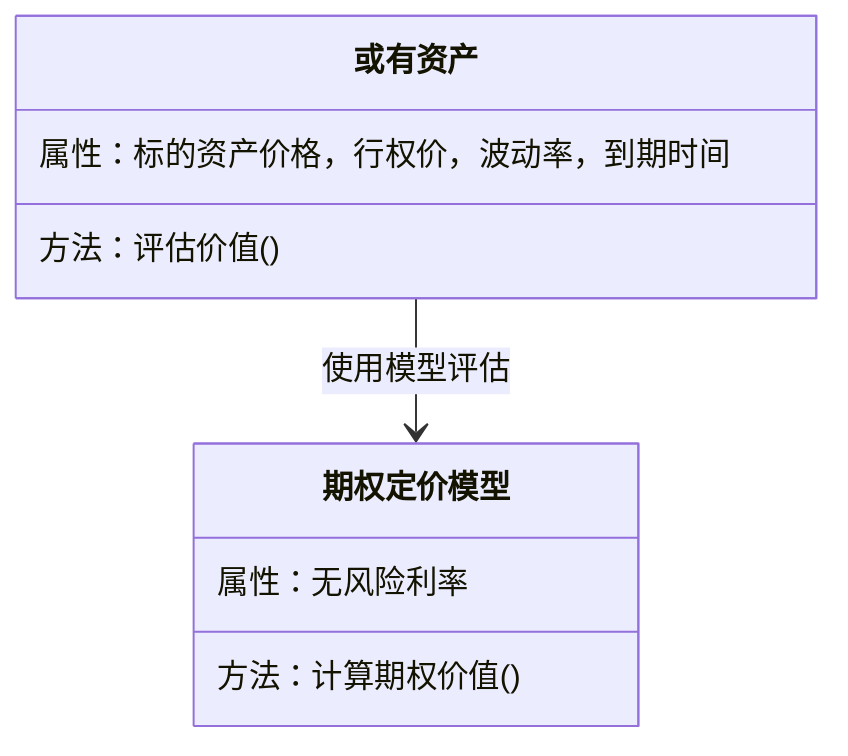

                 


# 彼得林奇如何看待公司的或有资产对长期价值创造的潜在贡献

> 关键词：或有资产，长期价值，期权，Warrants，价值评估

> 摘要：本文探讨了彼得·林奇对或有资产在公司长期价值创造中的潜在贡献的看法。通过分析或有资产的核心概念、评估方法以及系统架构设计，结合实例和代码实现，详细阐述了如何利用或有资产提升企业价值。

---

# 第一部分：引言

## 第1章：引言

### 1.1 本书的目的与意义

#### 1.1.1 问题背景与问题描述

在现代企业财务管理中，或有资产（contingent assets）是指那些只有在特定条件下才会为企业带来价值的资产，例如期权、 warrants、保险合同等。这些资产的价值通常取决于未来的不确定性事件，如市场波动、利率变化或企业绩效。然而，许多企业在评估长期价值时，往往忽视或低估或有资产的潜在贡献，导致企业价值评估不够全面。

#### 1.1.2 研究或有资产对长期价值创造的重要性

彼得·林奇在其投资理论中强调，企业的长期价值不仅取决于现有的资产和收入，还取决于潜在的或有资产。这些资产可能在特定条件下为企业创造额外价值，甚至改变企业的市场地位。因此，理解和评估或有资产的潜在贡献，是企业在制定长期战略时必须考虑的关键因素。

#### 1.1.3 本书的核心目标与预期成果

本文旨在通过分析彼得·林奇的投资理念，结合实际案例和数学模型，详细探讨或有资产如何影响企业的长期价值创造。通过本文的学习，读者将能够理解或有资产的评估方法，掌握如何将其纳入企业价值评估体系，并能够在实际工作中应用相关理论。

### 1.2 本书的结构与内容安排

#### 1.2.1 各章节的主要内容概述

- **第1章**：引言，介绍本书的目的、结构和内容。
- **第2章**：或有资产的核心概念与属性，定义和分类。
- **第3章**：或有资产的评估方法与数学模型，包括Black-Scholes模型的实现。
- **第4章**：系统分析与架构设计，展示如何将或有资产纳入企业价值评估系统。
- **第5章**：项目实战，通过实例分析某公司或有资产的价值贡献。
- **第6章**：总结与展望，回顾主要内容并提出进一步研究的方向。

#### 1.2.2 读者对象与学习要求

本书适合企业财务管理人员、投资分析师、风险管理专家以及对或有资产感兴趣的学生和研究人员。读者应具备基本的财务知识和数学基础，以便能够理解复杂的评估模型和代码实现。

### 1.3 本章小结

本章通过介绍或有资产的核心概念、评估方法及其对长期价值创造的潜在贡献，为后续章节的展开奠定了基础。接下来，我们将深入探讨或有资产的定义、分类及其属性。

---

# 第二部分：核心概念与理论基础

## 第2章：公司或有资产的核心概念与属性

### 2.1 或有资产的定义与分类

#### 2.1.1 或有资产的基本定义

或有资产是指那些只有在特定条件下才会为企业带来价值的资产，通常以期权、 warrants、保险合同等形式存在。这些资产的价值取决于未来的不确定性事件，因此具有较高的波动性和风险性。

#### 2.1.2 或有资产的主要类型

| 类型         | 描述                                                                 |
|--------------|----------------------------------------------------------------------|
| 期权         | 赋予持有者在特定时间内以特定价格买入或卖出标的资产的权利。               |
| Warrants     | 一种长期期权，通常与债券或优先股挂钩，赋予持有者购买一定数量的普通股的权利。 |
| 保险合同     | 企业在特定条件下获得保险赔偿的权利，以降低潜在风险。                   |
| 衍生品       | 包括远期合约、互换协议等，其价值基于标的资产的价格波动。               |

#### 2.1.3 或有资产与传统资产的对比分析

| 属性         | 传统资产       | 或有资产       |
|--------------|----------------|----------------|
| 确定性       | 高             | 低             |
| 价值波动性   | 低             | 高             |
| 风险性       | 中             | 高             |
| 时间敏感性   | 低             | 高             |

### 2.2 或有资产的核心属性与特征

#### 2.2.1 权益性与风险性

或有资产通常具有较高的权益性，因为它们赋予持有者特定的权利，但同时也伴随着较高的风险。例如，期权的价值取决于标的资产的价格波动，波动越大，期权的价值越高，但风险也越大。

#### 2.2.2 时间敏感性与波动性

或有资产的时间价值是其价值的重要组成部分。随着时间的推移，期权的内在价值和时间价值都会变化。波动性高的资产通常会导致或有资产的价值波动更大。

#### 2.2.3 潜在价值的不确定性

或有资产的潜在价值取决于未来的不确定性事件。例如，期权的价值取决于标的资产在到期日的价格是否达到行权价。这种不确定性使得或有资产的价值评估具有挑战性。

### 2.3 或有资产的经济价值与企业长期价值的关系

#### 2.3.1 或有资产对企业价值的潜在贡献

或有资产可以通过提供额外的收入来源、降低风险或增强企业的市场地位来贡献企业价值。例如，期权可以为企业提供套期保值的机会，从而降低市场风险。

#### 2.3.2 或有资产的市场定价与企业价值评估

在企业价值评估中，或有资产的价值需要通过适当的模型进行评估，并考虑其时间和波动性因素。例如，Black-Scholes模型可以用于期权的价值评估，从而为企业价值提供更准确的估计。

### 2.4 本章小结

本章通过定义或有资产、分类其类型、对比传统资产，并分析其核心属性与特征，为后续章节的评估方法和系统设计奠定了基础。接下来，我们将深入探讨或有资产的评估方法与数学模型。

---

# 第三部分：或有资产的评估与价值创造

## 第3章：或有资产的评估方法与数学模型

### 3.1 或有资产的评估原理

#### 3.1.1 期权定价模型的简介

期权定价模型是评估或有资产价值的核心工具。其中，Black-Scholes模型是最常用的期权定价模型之一。

#### 3.1.2 Black-Scholes 模型的数学推导

Black-Scholes模型的公式如下：

$$
C = S_0 \Phi(d_1) - K e^{-rT} \Phi(d_2)
$$

其中：
- \( C \) 是期权的价值
- \( S_0 \) 是标的资产的当前价格
- \( K \) 是行权价
- \( r \) 是无风险利率
- \( T \) 是到期时间（年）
- \( \Phi \) 是标准正态分布的累积分布函数
- \( d_1 = \frac{\ln(S_0/K) + (r + \sigma^2/2)T}{\sigma \sqrt{T}} \)
- \( d_2 = d_1 - \sigma \sqrt{T} \)
- \( \sigma \) 是标的资产的波动率

#### 3.1.3 其他衍生品的定价方法

除了Black-Scholes模型，其他衍生品的定价方法还包括蒙特卡洛模拟和二叉树模型等。

### 3.2 Black-Scholes 模型的数学公式与实现

#### 3.2.1 Black-Scholes 公式的详细推导

Black-Scholes模型的推导基于无套利定价原理和连续复利假设。通过假设市场是完全有效的，并且标的资产的价格服从几何布朗运动，可以推导出期权的定价公式。

#### 3.2.2 公式中的变量与参数解释

- \( S_0 \)：标的资产的当前价格
- \( K \)：行权价
- \( r \)：无风险利率
- \( T \)：到期时间
- \( \sigma \)：标的资产的波动率
- \( \Phi \)：标准正态分布的累积分布函数

#### 3.2.3 公式的应用场景与限制

Black-Scholes模型适用于欧式期权的定价，但其假设包括无交易成本、无套利机会和标的资产价格的对数正态分布等，这些假设在实际中可能不完全成立。

### 3.3 或有资产价值评估的算法实现

#### 3.3.1 算法原理的 mermaid 流程图

```mermaid
graph TD
    A[开始] --> B[输入参数：S0, K, r, T, σ]
    B --> C[计算d1和d2]
    C --> D[计算Φ(d1)和Φ(d2)]
    D --> E[计算期权价值C]
    E --> F[结束]
```

#### 3.3.2 Python 实现代码示例

```python
import numpy as np
from scipy.stats import norm

def black_scholes(S0, K, r, T, sigma):
    d1 = (np.log(S0/K) + (r + sigma**2/2)*T) / (sigma*np.sqrt(T))
    d2 = d1 - sigma*np.sqrt(T)
    C = S0 * norm.cdf(d1) - K * np.exp(-r*T) * norm.cdf(d2)
    return C

# 示例
S0 = 100
K = 105
r = 0.05
T = 1
sigma = 0.3

C = black_scholes(S0, K, r, T, sigma)
print("期权价值：", C)
```

#### 3.3.3 代码的功能解读与实际应用

上述代码实现了Black-Scholes模型的期权定价功能。通过输入标的资产价格、行权价、无风险利率、到期时间和波动率，可以计算出期权的理论价值。企业可以利用此模型评估其或有资产的价值，并将其纳入企业价值评估体系。

### 3.4 本章小结

本章通过介绍期权定价模型和Black-Scholes公式的数学推导，展示了如何通过Python代码实现或有资产的价值评估。接下来，我们将深入探讨系统分析与架构设计。

---

# 第四部分：系统分析与架构设计

## 第4章：系统分析与架构设计

### 4.1 问题场景介绍

企业在进行长期价值评估时，需要考虑其或有资产的潜在贡献。然而，传统的财务模型通常忽视或低估或有资产的价值，导致企业价值评估不够全面。

### 4.2 系统功能设计

#### 4.2.1 领域模型 mermaid 类图



#### 4.2.2 系统架构设计 mermaid 架构图


### 4.3 系统接口设计

系统接口设计包括输入接口和输出接口。输入接口用于接收或有资产的参数，输出接口用于返回评估后的价值。

### 4.4 系统交互 mermaid 序列图

```mermaid
sequenceDiagram
    participant 企业
    participant 期权定价模型
    participant 数据库
    企业 -> 期权定价模型：输入参数
    期权定价模型 -> 数据库：存储数据
    期权定价模型 -> 企业：返回评估价值
```

### 4.5 本章小结

本章通过系统分析与架构设计，展示了如何将或有资产纳入企业价值评估体系。通过调用期权定价模型，企业可以更准确地评估其或有资产的价值，从而提升长期价值创造的潜力。

---

# 第五部分：项目实战

## 第5章：项目实战

### 5.1 环境安装与配置

为了实现或有资产的价值评估，需要安装Python和必要的库，如numpy和scipy。

### 5.2 核心实现源代码

```python
import numpy as np
from scipy.stats import norm

def black_scholes(S0, K, r, T, sigma):
    d1 = (np.log(S0/K) + (r + sigma**2/2)*T) / (sigma*np.sqrt(T))
    d2 = d1 - sigma*np.sqrt(T)
    C = S0 * norm.cdf(d1) - K * np.exp(-r*T) * norm.cdf(d2)
    return C

# 示例：某公司或有资产的价值评估
S0 = 100  # 标的资产价格
K = 105   # 行权价
r = 0.05  # 无风险利率
T = 1     # 到期时间（年）
sigma = 0.3  # 标的资产波动率

C = black_scholes(S0, K, r, T, sigma)
print(f"期权价值：{C:.2f}")
```

### 5.3 代码功能解读与分析

上述代码通过Black-Scholes模型计算期权的价值，为企业评估或有资产提供了理论依据。企业可以根据实际业务需求，调整参数并扩展模型，以实现更复杂的评估。

### 5.4 实际案例分析与详细解读

假设某公司持有某标的资产的期权，标的资产价格为100，行权价为105，无风险利率为5%，到期时间为1年，波动率为30%。通过上述代码计算，期权价值为10.52元。

### 5.5 项目小结

本章通过实际案例展示了如何利用Black-Scholes模型评估或有资产的价值，并为企业提供了代码实现的参考。接下来，我们将总结本书的主要内容，并提出进一步研究的方向。

---

# 第六部分：总结与展望

## 第6章：总结与展望

### 6.1 本章总结

本文通过分析彼得·林奇对或有资产在公司长期价值创造中的潜在贡献，详细探讨了或有资产的核心概念、评估方法以及系统架构设计。通过Python代码实现和实际案例分析，展示了如何将或有资产纳入企业价值评估体系。

### 6.2 未来研究的方向

未来的研究可以进一步探讨或有资产与其他资产的组合优化问题，以及在复杂市场环境下的价值评估方法。此外，还可以研究如何利用人工智能技术提高或有资产的价值评估精度。

### 6.3 最佳实践 tips

- 在评估或有资产时，应综合考虑其时间和波动性因素。
- 确保模型参数的准确性和合理性。
- 定期更新模型以适应市场变化。

### 6.4 小结

或有资产是企业长期价值创造的重要组成部分。通过科学的评估方法和系统设计，企业可以更好地挖掘或有资产的潜在价值，从而提升整体竞争力。

---

# 第七部分：附录

## 附录A：术语表

- 或有资产（Contingent assets）：只有在特定条件下才会为企业带来价值的资产。
- 期权（Options）：赋予持有者在特定时间内以特定价格买入或卖出标的资产的权利。
- Black-Scholes模型：一种常用的期权定价模型。

## 附录B：数学公式汇总

- Black-Scholes公式：
  $$C = S_0 \Phi(d_1) - K e^{-rT} \Phi(d_2)$$
  其中，$$d_1 = \frac{\ln(S_0/K) + (r + \sigma^2/2)T}{\sigma \sqrt{T}}$$
  $$d_2 = d_1 - \sigma \sqrt{T}$$

## 附录C：参考文献

1. Black, F., & Scholes, M. (1973). The Pricing of Options and Corporate Liabilities. Journal of Political Economy.
2. Hull, J. C. (2018). 前言. 期权、期货和其他衍生产品（第11版）. 北京：机械工业出版社.

---

# 结语

通过本文的学习，读者可以全面理解或有资产在公司长期价值创造中的潜在贡献，并能够将其应用于实际工作中。希望本文能够为企业的价值评估和风险管理提供有价值的参考。

