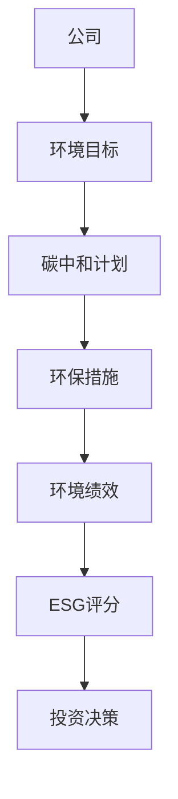
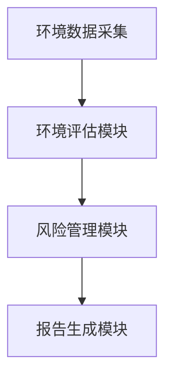
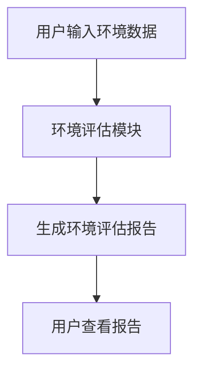

                 


# 彼得林奇如何看待公司的环境可持续性策略

## 关键词：环境、可持续性、ESG、彼得林奇、投资策略、风险管理、长期目标

## 摘要：  
彼得·林奇，这位备受尊敬的投资专家，近年来开始关注公司的环境可持续性策略。本文将从投资角度分析环境可持续性策略的重要性，探讨其对风险管理、企业价值和投资机会的影响，结合具体案例和数据分析，为企业和投资者提供有价值的见解。

---

# 正文

## 第一部分: 环境可持续性策略的背景与重要性

### 第1章: 环境可持续性策略的定义与背景

#### 1.1 环境问题的背景介绍  
工业革命以来，人类活动对环境造成的影响日益显著。气候变化、资源枯竭、生态破坏等问题成为全球关注的焦点。企业作为经济活动的主要参与者，其生产和运营对环境的影响尤为突出。环境问题不仅是社会问题，也对企业声誉、财务状况和长期发展构成了挑战。

#### 1.2 可持续发展概念的提出与演进  
可持续发展（Sustainability）的概念最早出现在20世纪70年代，强调在满足当前需求的同时，不损害后代满足其需求的能力。随着全球环境问题的加剧，可持续发展的内涵逐渐扩展，从单纯的环境保护延伸到经济、社会和治理等多方面。企业开始意识到，可持续发展不仅是社会责任，也是提升竞争力的重要途径。

#### 1.3 环境可持续性策略对企业的影响  
环境可持续性策略直接影响企业的运营成本、风险管理和市场机会。通过实施绿色生产、节能减排等措施，企业可以降低运营成本，同时提升品牌形象和客户忠诚度。此外，环境策略还会影响企业的财务健康，因为环保合规和资源高效利用能够减少潜在的环境风险和罚款。

---

## 第二部分: 环境可持续性策略的核心概念与分析框架

### 第2章: 核心概念与联系

#### 2.1 核心概念解析  
- **环境可持续性策略**：指企业在生产和运营过程中采取的环保措施，旨在减少对环境的负面影响，实现资源的高效利用。  
- **ESG（环境、社会、治理）**：ESG是评估企业可持续发展能力的重要指标，包括环境表现、社会责任履行情况和公司治理结构。  
- **碳中和与碳足迹**：碳中和是指企业通过减少碳排放或碳抵消，实现净零排放的目标；碳足迹则是衡量企业或产品在整个生命周期中产生的温室气体排放量。

#### 2.2 核心概念的属性特征对比  
以下是环境、社会和治理三者的属性特征对比：

| **维度** | **环境** | **社会** | **治理** |
|----------|----------|----------|----------|
| **核心关注点** | 碳排放、资源利用效率 | 就业、员工权益、社会责任 | 企业透明度、董事会结构、合规性 |
| **衡量指标** | 碳排放强度、能源效率 | 员工满意度、社会责任报告 | 董事会多样性、高管薪酬与绩效挂钩 |
| **对企业的影响** | 影响运营成本和环境风险 | 影响企业声誉和社会责任感 | 影响治理效率和长期稳定性 |

#### 2.3 实体关系图：环境可持续性策略的系统架构  


---

## 第三部分: 环境可持续性策略的评估与分析

### 第3章: 评估环境可持续性策略的算法原理

#### 3.1 环境绩效评估算法  
环境绩效评估是衡量企业环境可持续性策略效果的重要方法。以下是环境绩效评估算法的步骤：

1. **数据收集**：收集企业的环境数据，包括能源消耗、碳排放、废物处理等。
2. **指标计算**：根据收集的数据，计算各项环境指标，如碳排放强度（碳排放量/收入）。
3. **权重分配**：根据行业特点和企业战略，为各环境指标分配权重。
4. **综合评分**：根据权重和实际数据，计算企业的环境绩效综合评分。

以下是一个简单的Python代码示例，用于计算企业的碳排放强度：

```python
import pandas as pd

# 假设数据存储在CSV文件中
data = pd.read_csv('environment_data.csv')

# 计算碳排放强度（碳排放量/收入）
data['碳排放强度'] = data['碳排放量'] / data['收入']

# 找出碳排放强度最小的企业
best_company = data.loc[data['碳排放强度'].idxmin()]['公司名称']
print(f"最佳环境绩效企业：{best_company}")
```

#### 3.2 碳足迹计算的数学模型  
碳足迹是衡量企业或产品在整个生命周期中产生的温室气体排放量的指标。以下是碳足迹计算的数学模型：

$$ \text{碳足迹} = \sum_{i=1}^{n} (\text{活动}_i \times \text{排放因子}_i) $$

其中，$\text{活动}_i$ 是企业某项活动的投入量，$\text{排放因子}_i$ 是每单位活动产生的温室气体排放量。

例如，假设某公司生产过程中消耗了1000千瓦时的电力，每千瓦时电力的碳排放因子为0.5千克二氧化碳当量，则其电力消耗的碳排放量为：

$$ \text{碳排放量} = 1000 \times 0.5 = 500 \text{千克二氧化碳当量} $$

---

## 第四部分: 环境可持续性策略的系统分析与架构设计

### 第4章: 系统分析与架构设计方案

#### 4.1 系统功能设计  
- **环境数据采集模块**：收集企业的环境数据，包括能源消耗、碳排放等。
- **环境评估模块**：根据收集的数据，评估企业的环境绩效。
- **风险管理模块**：识别环境风险，并制定应对策略。
- **报告生成模块**：生成环境可持续性报告，供管理层和投资者参考。

#### 4.2 系统架构设计  
以下是系统的架构图：



#### 4.3 系统接口设计  
- **输入接口**：环境数据接口，用于接收企业的环境数据。
- **输出接口**：环境评估报告接口，用于输出评估结果。

#### 4.4 系统交互设计  
以下是系统的交互流程图：



---

## 第五部分: 环境可持续性策略的项目实战

### 第5章: 项目实战

#### 5.1 项目背景  
假设我们有一家制造企业，需要评估其环境可持续性策略。我们收集了该企业的环境数据，包括能源消耗、碳排放和废物处理情况。

#### 5.2 项目核心实现  
以下是实现环境绩效评估的Python代码：

```python
import pandas as pd

# 读取环境数据
data = pd.read_csv('environment_data.csv')

# 计算碳排放强度
data['碳排放强度'] = data['碳排放量'] / data['收入']

# 找出碳排放强度最小的企业
best_company = data.loc[data['碳排放强度'].idxmin()]['公司名称']
print(f"最佳环境绩效企业：{best_company}")

# 可视化环境绩效分布
import matplotlib.pyplot as plt

plt.hist(data['碳排放强度'], bins=10, alpha=0.7)
plt.xlabel('碳排放强度')
plt.ylabel('频数')
plt.title('环境绩效分布')
plt.show()
```

#### 5.3 实际案例分析  
通过上述代码，我们发现某公司在碳排放强度方面表现最佳，这表明该公司在环境可持续性策略方面取得了显著成效。

---

## 第六部分: 环境可持续性策略的最佳实践

### 第6章: 最佳实践

#### 6.1 投资策略  
投资者应关注企业的ESG评分，选择在环境、社会和治理方面表现优异的企业进行投资。

#### 6.2 风险管理  
企业应建立环境风险管理机制，定期评估环境风险，并制定应对策略。

#### 6.3 长期目标设定  
企业应设定明确的环境目标，如实现碳中和，并制定详细的行动计划。

#### 6.4 注意事项  
- 环境可持续性策略的实施需要长期坚持，不能急于求成。
- 在实施过程中，企业应注重数据的准确性和透明度。

#### 6.5 拓展阅读  
- 彼得·林奇的《投资之道》
- 全球环境报告

---

## 结语  
环境可持续性策略不仅是企业的社会责任，也是提升竞争力和创造长期价值的重要途径。通过本文的分析，我们希望读者能够更好地理解彼得·林奇如何看待公司的环境可持续性策略，并将其应用到实际投资和企业管理中。未来，随着全球对环境问题的关注度不断提高，环境可持续性策略将在企业的成功中扮演越来越重要的角色。

---

## 参考文献  
1. 彼得·林奇. 《投资之道》. 北京: 中信出版社, 2012.  
2. 环境保护署. 《企业环境责任指南》. 2020.  
3. 国际标准化组织. 《ISO 14001: 环境管理体系标准》. 2015.

