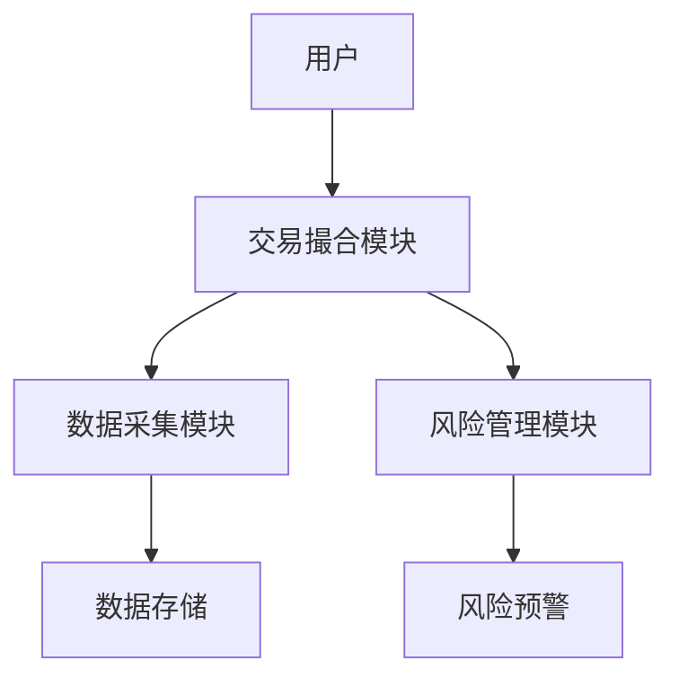
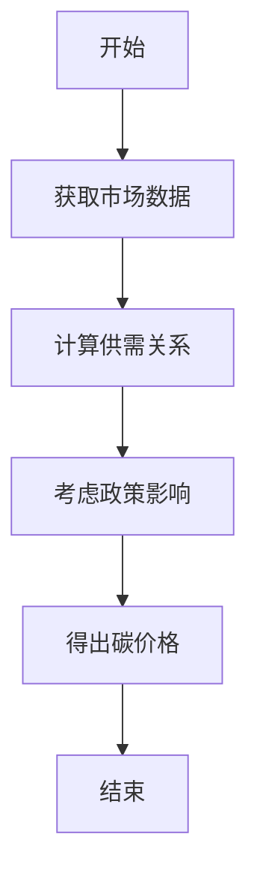

                 


# 彼得·林奇如何看待公司的碳交易策略

## 关键词：碳交易、碳市场、气候变化、企业战略、投资策略、风险管理

## 摘要：  
本文深入探讨了碳交易的背景、机制、经济与环境效益，以及如何将彼得·林奇的投资策略应用于碳交易中。通过分析碳配额、碳信用、碳定价等核心概念，结合算法模型和系统架构设计，本文为技术人员和企业提供了碳交易策略的全面解析。文章还通过实际案例展示了如何构建碳交易模拟系统，并提供了最佳实践和注意事项，帮助企业在碳交易中实现可持续发展。

---

# 第一部分：碳交易背景与基础

## 第1章：碳交易的背景与概念

### 1.1 碳排放与气候变化

#### 1.1.1 碳排放的定义与来源  
碳排放主要来源于化石燃料的燃烧、工业生产过程和森林砍伐等人类活动。主要的温室气体包括二氧化碳（CO2）、甲烷（CH4）和一氧化二氮（N2O）等。  

#### 1.1.2 气候变化的现状与挑战  
气候变化导致全球温度上升、极端天气频发、海平面上升等问题。根据联合国政府间气候变化专门委员会（IPCC）的报告，全球气温上升速度远超自然变化范围。  

#### 1.1.3 碳交易的全球背景  
碳交易是《京都议定书》的重要机制，允许企业在全球范围内买卖碳配额，以实现碳排放的总量控制。目前，全球碳市场分为欧盟碳市场、北美碳市场和亚洲碳市场等区域。

---

### 1.2 碳市场的起源与发展

#### 1.2.1 《京都议定书》的签订与影响  
1997年《京都议定书》的签订标志着碳交易的合法化。该议定书要求发达国家在2012年之前将温室气体排放量减少到1990年水平的90%。

#### 1.2.2 碳市场的类型与运作模式  
碳市场分为合规市场和自愿市场。合规市场主要由政府监管，企业必须在特定区域内减少碳排放。自愿市场则由企业和个人自愿参与，用于展示环保承诺。

#### 1.2.3 碳交易与企业战略  
企业参与碳交易可以降低合规成本、提升品牌形象，并通过碳信用交易实现额外收益。此外，碳交易还推动企业向低碳转型，符合全球可持续发展趋势。

---

## 第2章：碳交易的核心机制

### 2.1 碳配额与碳信用

#### 2.1.1 碳配额的分配方式  
碳配额通常通过免费分配或拍卖的方式发放给企业。企业可以根据自身需求购买或出售多余的配额。

#### 2.1.2 碳信用的生成与交易  
碳信用（如核证减排量，CER）由减排项目产生，企业可以通过购买碳信用抵消自身的碳排放。碳信用的交易主要通过交易所或场外市场完成。

#### 2.1.3 碳配额与碳信用的区别与联系  
| **维度**         | **碳配额**       | **碳信用**         |
|------------------|------------------|---------------------|
| 定义             | 政府分配的排放权   | 通过减排项目产生的信用 |
| 使用场景         | 合规市场           | 合规与自愿市场       |
| 交易方式         | 交易所或拍卖       | 交易所或场外交易     |

---

### 2.2 碳定价与市场机制

#### 2.2.1 碳定价的定义与作用  
碳定价通过经济手段将碳排放的外部成本内部化，激励企业减少碳排放。常见的碳定价方式包括碳税和碳配额交易。

#### 2.2.2 碳市场的供需关系  
碳价格由市场供需决定。供过于求时，碳价格下降；供不应求时，碳价格上涨。

#### 2.2.3 碳价格的波动与预测  
碳价格受政策、经济和市场需求的影响较大。企业可以通过建立数学模型预测碳价格走势，优化交易策略。

---

### 2.3 碳交易的参与者与流程

#### 2.3.1 参与者的角色与责任  
主要参与者包括政府、企业、金融机构和碳交易所。政府负责配额分配和监管，企业参与交易，金融机构提供融资支持。

#### 2.3.2 碳交易的基本流程  
1. **注册与配额分配**：企业向监管机构注册并获得配额。  
2. **交易撮合**：企业通过交易所或场外市场买卖碳配额或信用。  
3. **结算与交割**：完成交易后，配额或信用完成转移。  
4. **监管与合规**：企业需定期报告碳排放和交易情况，确保合规。

#### 2.3.3 碳交易的监管与合规  
碳交易需遵循严格的监管规则，包括信息披露、交易报告和合规检查。企业需确保交易活动符合当地法规。

---

## 第3章：碳交易的经济与环境效益

### 3.1 碳交易的经济影响

#### 3.1.1 企业成本的优化  
企业可以通过碳交易降低合规成本，避免超额排放的罚款。

#### 3.1.2 碳交易的收入来源  
企业可以出售多余的碳配额或信用，获得额外收入。

#### 3.1.3 碳市场的经济效益分析  
碳市场的规模和流动性直接影响其经济效益。高流动性的市场可以降低交易成本，提高价格发现效率。

---

### 3.2 碳交易的环境效益

#### 3.2.1 减少碳排放的效果  
碳交易通过市场机制激励企业减少碳排放，实现减排目标。

#### 3.2.2 推动可再生能源的发展  
企业可以通过投资可再生能源项目获得碳信用，推动清洁能源的广泛应用。

#### 3.2.3 促进企业绿色转型  
碳交易推动企业采用低碳技术，优化生产流程，实现可持续发展。

---

## 第4章：碳交易的风险与挑战

### 4.1 碳交易的主要风险

#### 4.1.1 市场波动风险  
碳价格受政策和市场供需影响，存在较大波动风险。

#### 4.1.2 政策不确定性  
政策变化可能影响碳配额的分配和交易规则，增加企业的不确定性。

#### 4.1.3 信用风险  
碳信用的质量和真实性可能存在问题，导致交易纠纷。

---

### 4.2 碳交易的挑战

#### 4.2.1 市场流动性问题  
部分碳市场的流动性较低，影响交易效率和价格发现。

#### 4.2.2 监管框架的完善  
不同地区的监管规则差异较大，增加了企业的合规难度。

#### 4.2.3 技术与信息的透明度  
碳交易需要准确的数据支持，技术手段和信息透明度直接影响交易的公平性和效率。

---

## 第5章：彼得·林奇的投资策略与碳交易

### 5.1 彼得·林奇的投资哲学

#### 5.1.1 长期投资与价值投资  
林奇强调长期投资，关注企业的基本面和管理层能力。

#### 5.1.2 风险控制与投资组合管理  
林奇注重分散投资，避免过度集中风险。

---

### 5.2 碳交易中的投资机会

#### 5.2.1 可再生能源领域的投资  
投资于太阳能、风能等可再生能源项目，可以产生大量的碳信用。

#### 5.2.2 碳配额交易的市场潜力  
随着碳市场的扩大，碳配额的交易需求将不断增加。

#### 5.2.3 绿色金融与碳市场的结合  
绿色金融产品（如绿色债券）与碳市场结合，为企业提供更多的融资渠道。

---

### 5.3 碳交易中的风险管理

#### 5.3.1 价格波动风险管理  
通过套期保值和分散投资降低碳价格波动带来的风险。

#### 5.3.2 政策风险应对  
密切关注政策变化，及时调整投资策略。

#### 5.3.3 信用风险管理  
选择高质量的碳信用项目，确保其真实性和可验证性。

---

## 第6章：系统架构与算法实现

### 6.1 碳交易系统的架构设计

#### 6.1.1 系统功能模块  
- 数据采集与处理：采集碳排放数据和市场信息。  
- 交易撮合：匹配买方和卖方，完成交易。  
- 风险管理：评估交易风险，提供预警。  

#### 6.1.2 系统架构图  


### 6.2 碳定价算法实现

#### 6.2.1 碳定价模型  
碳价格 = α × 市场供需 + β × 政策影响 + γ × 经济指标  

#### 6.2.2 算法流程图  


---

## 第7章：项目实战与案例分析

### 7.1 碳交易模拟系统实现

#### 7.1.1 环境安装  
- 安装Python和相关库（如Pandas、Matplotlib）。  

#### 7.1.2 核心代码实现  
```python
import pandas as pd
import matplotlib.pyplot as plt

# 模拟碳价格数据
data = {'日期': ['2023-01', '2023-02', '2023-03', '2023-04'],
        '碳价格': [20, 25, 22, 28]}
df = pd.DataFrame(data)

# 绘制碳价格变化图
plt.plot(df['日期'], df['碳价格'])
plt.title('碳价格变化趋势')
plt.xlabel('日期')
plt.ylabel('碳价格')
plt.show()
```

#### 7.1.3 案例分析  
假设某企业获得1000个碳配额，实际排放900个，可以出售100个配额，收入100 × 20 = 2000元。

---

## 第8章：最佳实践与总结

### 8.1 最佳实践 tips

1. **关注政策变化**：及时了解碳市场相关政策，调整交易策略。  
2. **选择高质量碳信用**：确保碳信用的真实性和可验证性。  
3. **分散投资风险**：通过多元化投资降低市场波动风险。  

### 8.2 小结  
碳交易是企业应对气候变化的重要工具，通过合理配置资源和优化策略，企业可以在实现减排目标的同时创造经济价值。

### 8.3 注意事项  
- 确保数据的准确性和透明度。  
- 合规操作，避免法律风险。  
- 定期评估和优化交易策略。

### 8.4 拓展阅读  
- 推荐阅读《碳交易：驱动全球经济的革命》和《可持续投资：绿色金融的未来》。

--- 

以上是《彼得·林奇如何看待公司的碳交易策略》的完整目录大纲和详细内容。

