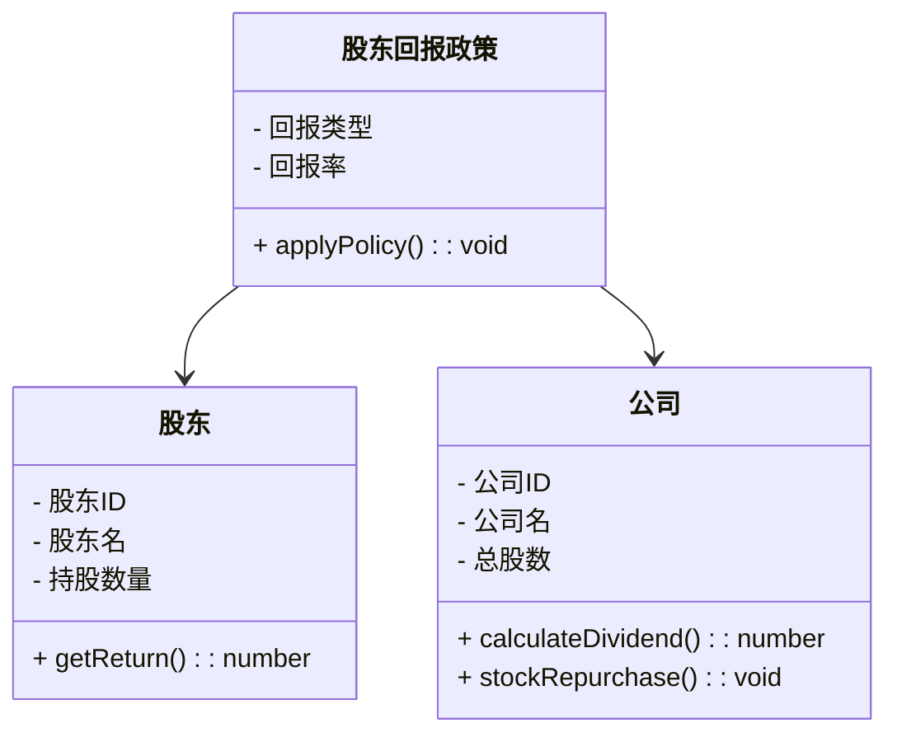
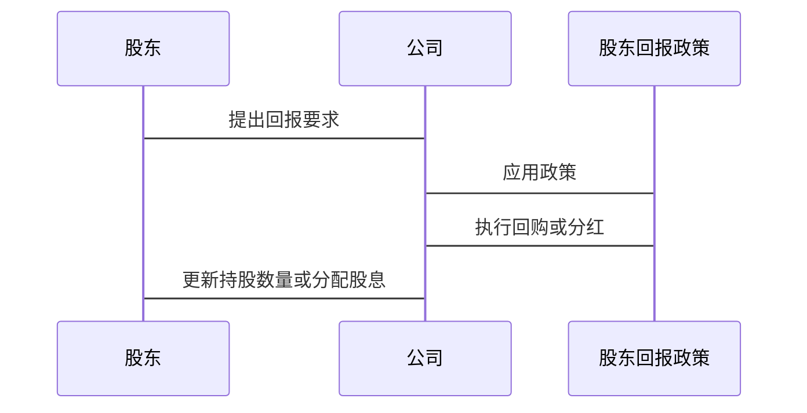

                 


# 彼得·林奇如何看待公司的股东回报政策演变

## 关键词：彼得·林奇，股东回报，股息，股票回购，公司治理，投资策略

## 摘要：本文探讨了彼得·林奇对股东回报政策演变的看法，分析了股东回报的核心概念、演变历程、驱动因素及影响。通过案例分析和数学模型，揭示了股东回报政策对投资决策的重要性，并提出了优化建议。

---

## 第一部分：股东回报政策的背景与概念

### 第1章：股东回报政策的概述

#### 1.1 股东回报的基本概念

股东回报是公司对其股东的收益分配，主要包括股息支付和股票回购。这些政策影响公司价值和股东利益。

#### 1.2 股东回报政策的演变历史

股东回报政策经历了从传统股息支付到多元化策略的演变。20世纪70年代，彼得·林奇开始关注股票回购，认为其能提升股东价值。

#### 1.3 股东回报政策的影响因素

公司生命周期、市场环境和治理结构影响回报政策。例如，成熟公司更倾向于回购股票，而成长期公司可能选择股息支付。

---

## 第二部分：股东回报政策的核心概念与联系

### 第2章：股东回报政策的核心要素

#### 2.1 股息支付

股息支付率=（净利润-保留盈余）/普通股股数。例如，净利润1000万元，保留盈余200万元，股数1000万股，支付率为8%。

#### 2.2 股票回购

股票回购减少流通股，提升每股收益。例如，回购10%的股票，每股收益可能增加10%-20%。

#### 2.3 股票分红

股票分红将利润以股票形式分配，避免现金流出，维护公司运营。

---

## 第三部分：股东回报政策的演变分析

### 第3章：股东回报政策的演变历程

#### 3.1 股东回报政策的历史演变

从股息支付为主到多元化策略，股票回购成为重要工具。例如，微软通过回购稳定股价。

#### 3.2 股东回报政策的驱动因素

公司生命周期、市场环境和治理结构影响政策选择。例如，苹果在科技行业，通过回购和分红平衡股东利益。

---

## 第四部分：股东回报政策的影响因素

### 第4章：公司生命周期与股东回报

#### 4.1 不同生命周期阶段的回报策略

初创期公司可能不分红，成长期公司支付少量股息，成熟期公司大量回购和分红。

#### 4.2 市场环境对回报策略的影响

牛市中公司可能减少回购，熊市中通过回购提升股价。

### 第5章：市场环境与股东回报

#### 5.1 利率与股东回报

低利率环境鼓励股票回购，提升股东价值。

#### 5.2 行业竞争与股东回报

行业龙头公司更倾向于回购和分红，巩固市场地位。

### 第6章：公司治理与股东回报

#### 6.1 治理结构对回报策略的影响

有效的治理结构能优化股东回报，例如，微软的回购计划提升股东价值。

---

## 第五部分：股东回报政策的案例分析

### 第7章：典型公司案例分析

#### 7.1 苹果公司的股东回报策略

苹果通过回购和分红平衡股东利益，股息率4%，回购计划稳定股价。

#### 7.2 微软公司的回购策略

微软回购股票减少流通股，提升每股收益，巩固市场地位。

---

## 第六部分：股东回报政策的系统分析与架构设计

### 第8章：系统分析与架构设计

#### 8.1 领域模型类图



#### 8.2 系统架构图


#### 8.3 交互图



---

## 第七部分：股东回报政策的项目实战

### 第9章：项目实战

#### 9.1 环境安装

安装Python和Pandas库，用于数据分析。

#### 9.2 核心实现代码

```python
import pandas as pd

# 示例数据：公司A的财务数据
data = {
    '净利润': [1000],
    '保留盈余': [200],
    '普通股股数': [1000],
    '回购股数': [100],
    '回购价格': [50]
}

df = pd.DataFrame(data)

# 计算股息支付率
dividend_yield = (df['净利润'][0] - df['保留盈余'][0]) / df['普通股股数'][0]
print(f"股息支付率: {dividend_yield:.2f}%")

# 计算回购影响
new_shares = df['普通股股数'][0] - df['回购股数'][0]
share_price = (df['净利润'][0] / new_shares) * 1.2  # 假设增长20%
print(f"回购后股价: ${share_price:.2f}")
```

#### 9.3 案例分析

以公司A为例，计算股息支付率和回购影响，分析对股东价值的影响。

---

## 第八部分：股东回报政策的优化与建议

### 第10章：优化策略与建议

#### 10.1 优化股东回报政策

根据公司生命周期和市场环境调整股息和回购比例。

#### 10.2 投资者策略

投资者应关注公司治理和财务健康，选择合适的股票。

### 第11章：未来展望与挑战

随着ESG投资兴起，股东回报政策需考虑社会责任。

---

## 结语

通过系统分析和案例，本文探讨了股东回报政策的演变及其对投资的影响。未来，需结合技术进步和市场变化，优化政策，平衡股东利益。

--- 

## 参考文献

1. 彼得·林奇著，《彼得·林奇的成功投资》
2. 股票回购与公司治理研究文献
3. 《公司财务与股东回报策略》

