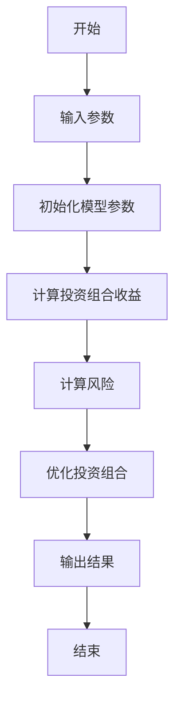
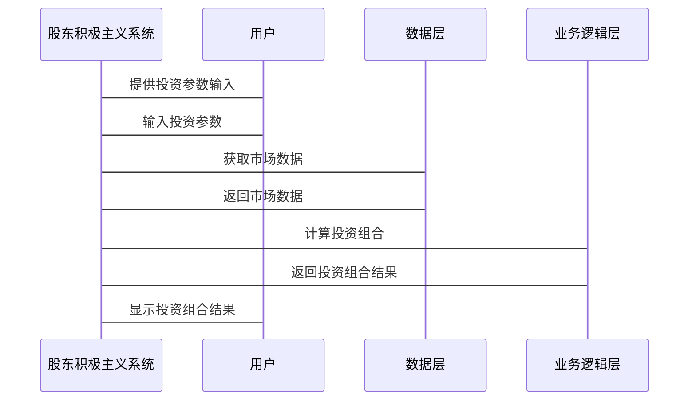

                 


# 彼得林奇如何看待公司的股东积极主义

## 关键词：股东积极主义，彼得林奇，投资策略，企业治理，股东权利

## 摘要：  
本文从彼得林奇的投资理念出发，分析他如何看待公司股东的积极主义行为。通过定义股东积极主义、探讨其核心概念、算法原理、系统架构设计以及实战案例，结合数学模型和流程图，深入剖析股东积极主义在现代企业治理中的作用和影响。

---

# 第一部分: 股东积极主义的背景与核心概念

## 第1章: 股东积极主义的定义与背景

### 1.1 股东积极主义的定义

#### 1.1.1 股东积极主义的核心概念  
股东积极主义是指股东通过行使权利（如投票、提出议案等），积极参与公司治理，以实现自身利益最大化的行为。其核心在于通过主动参与影响公司决策，而非被动接受公司经营结果。

#### 1.1.2 股东积极主义的历史演变  
股东积极主义并非新兴概念，但其在近年来随着企业治理问题的加剧而备受关注。早期的股东角色更多是财务投资者，而随着环境、社会和治理（ESG）因素的兴起，股东开始更加关注公司的长期价值和社会责任。

#### 1.1.3 股东积极主义的现代发展  
现代股东积极主义强调股东在公司治理中的角色，尤其是在提升公司治理透明度、推动可持续发展和社会责任方面。投资者不再仅关注财务回报，而是更注重公司治理的健康性和长期价值的实现。

---

### 1.2 股东积极主义的背景

#### 1.2.1 全球化与企业治理的新趋势  
全球化背景下，企业面临的环境更加复杂，股东积极主义成为推动企业治理透明化和责任化的有效手段。

#### 1.2.2 股东权利意识的觉醒  
随着投资者教育的普及，股东开始意识到自己的权利，并积极行使这些权利以影响公司决策。

#### 1.2.3 股东积极主义的驱动因素  
- **环境问题**：气候变化、可持续发展等议题促使股东关注公司的环保表现。  
- **社会问题**：员工权益、公平薪酬、多元化等社会议题成为股东关注的重点。  
- **治理问题**：公司治理结构不合理、管理层过度激励等问题引发股东的不满和参与。

---

### 1.3 股东积极主义的核心要素

#### 1.3.1 股东的权力与责任  
股东的权力包括投票权、知情权、参与权等，但同时也需承担相应的责任，避免滥用权力干预公司日常经营。

#### 1.3.2 股东积极主义的目标与手段  
目标是通过积极参与公司治理，提升公司价值、优化治理结构、推动可持续发展。手段包括提交股东提案、行使投票权、公开披露信息等。

#### 1.3.3 股东积极主义的边界与外延  
股东积极主义应以不影响公司正常经营为前提，避免过度干预管理层决策。其外延包括股东维权、治理透明化、可持续投资等。

---

### 1.4 股东积极主义与利益相关者的关系

#### 1.4.1 股东与利益相关者的互动  
股东与利益相关者（如员工、客户、环境等）的关系需要平衡，股东的积极参与应以实现多方利益的共赢为目标。

#### 1.4.2 股东积极主义对利益相关者的影响  
股东积极主义通过推动公司治理优化、提升透明度和责任感，间接促进利益相关者权益的保护。

#### 1.4.3 股东积极主义的外部环境分析  
包括政策法规、市场环境、社会舆论等外部因素对股东积极主义的影响。

---

## 第2章: 股东积极主义的核心概念与联系

### 2.1 股东积极主义的核心原理

#### 2.1.1 股东积极主义的理论基础  
基于公司治理理论和利益相关者理论，股东积极主义强调股东在公司治理中的主动角色。

#### 2.1.2 股东积极主义的实践基础  
通过实际案例分析，总结股东积极主义在实践中的表现和效果。

#### 2.1.3 股东积极主义的逻辑框架  
构建一个包含股东行为、公司治理、外部环境的逻辑框架，分析股东积极主义的运作机制。

---

### 2.2 核心概念对比分析

#### 2.2.1 股东积极主义与股东消极主义的对比  
| **对比维度** | **股东积极主义** | **股东消极主义** |
|---------------|--------------------|-------------------|
| 行为方式       | 主动参与公司治理   | 被动接受公司决策   |
| 目标           | 优化公司治理结构   | 追求短期财务回报   |
| 风险           | 较高               | 较低               |

#### 2.2.2 股东积极主义与公司治理的关系  
- 股东积极主义是公司治理的重要组成部分。  
- 良好的公司治理是股东积极主义的基础。

#### 2.2.3 股东积极主义与其他投资策略的对比  
- 与价值投资策略：股东积极主义注重长期价值的实现，与价值投资理念一致。  
- 与短期投机策略：股东积极主义更注重长期影响，与短期投机策略目标不同。

---

### 2.3 股东积极主义的ER实体关系图

```mermaid
er
actor: 股东
actor: 公司
actor: 监管机构
actor: 利益相关者
```

---

### 2.4 本章小结  
本章通过定义和背景分析，明确了股东积极主义的核心概念，并通过对比分析和ER图展示了其与相关概念的关系。

---

# 第二部分: 股东积极主义的算法原理

## 第3章: 股东积极主义的算法原理

### 3.1 股东积极主义的决策模型

#### 3.1.1 投资决策模型的构建  
基于股东积极主义理念，构建一个投资决策模型，用于评估公司的长期价值。

#### 3.1.2 股东积极主义的优化算法  
通过优化算法（如线性规划、遗传算法等）对投资组合进行优化，以实现股东利益的最大化。

#### 3.1.3 股东积极主义的风险评估模型  
结合风险评估方法，分析股东积极主义可能带来的风险，并提出应对策略。

---

### 3.2 算法原理的数学模型

#### 3.2.1 投资组合优化模型  
$$ \text{Maximize } \sum_{i=1}^{n} w_i r_i - \lambda \sum_{i=1}^{n} \sum_{j=1}^{n} w_i w_j \sigma_{ij} $$  
其中：  
- \( w_i \) 表示第i个资产的权重  
- \( r_i \) 表示第i个资产的预期收益  
- \( \sigma_{ij} \) 表示第i和第j个资产之间的协方差  
- \( \lambda \) 表示风险惩罚系数  

#### 3.2.2 风险调整的资本资产定价模型（CAPM）  
$$ E(r_i) = r_f + \beta_i (E(r_m) - r_f) $$  
其中：  
- \( E(r_i) \) 表示第i个资产的预期收益  
- \( r_f \) 表示无风险利率  
- \( \beta_i \) 表示第i个资产的贝塔系数  
- \( E(r_m) \) 表示市场预期收益  

---

### 3.3 算法流程图



---

## 第4章: 股东积极主义的系统架构设计

### 4.1 系统功能设计

#### 4.1.1 领域模型（Mermaid类图）


---

### 4.2 系统架构设计（Mermaid架构图）


---

### 4.3 系统接口设计

#### 4.3.1 输入接口  
- 用户输入投资参数（如资金规模、风险偏好等）  
- 系统输入市场数据（如股票价格、财务报表等）  

#### 4.3.2 输出接口  
- 投资组合优化结果  
- 风险评估报告  

---

### 4.4 系统交互流程图（Mermaid序列图）



---

## 第5章: 股东积极主义的项目实战

### 5.1 环境安装

#### 5.1.1 安装Python环境  
- 使用Anaconda或Pyenv安装Python 3.8及以上版本。  

#### 5.1.2 安装依赖库  
- 安装numpy、pandas、scipy等库：  
  ```bash
  pip install numpy pandas scipy
  ```

---

### 5.2 系统核心实现源代码

#### 5.2.1 投资组合优化代码

```python
import numpy as np
import pandas as pd
from scipy.optimize import minimize

def portfolio_optimization(returns, cov_matrix, risk_aversion):
    n = len(returns)
    # 定义优化目标函数
    def objective(weights):
        return (weights.T @ returns) - risk_aversion * (weights.T @ cov_matrix @ weights)
    # 定义约束条件
    constraints = [
        {'type': 'eq', 'fun': lambda w: np.sum(w) - 1}
    ]
    # 初始化权重
    initial_guess = np.array([1.0/n]*n)
    # 进行优化
    result = minimize(objective, initial_guess, constraints=constraints)
    return result.x

# 示例数据
returns = np.array([0.1, 0.12, 0.08])
cov_matrix = np.array([
    [0.02, 0.01, 0.01],
    [0.01, 0.03, 0.02],
    [0.01, 0.02, 0.03]
])
risk_aversion = 0.5

weights = portfolio_optimization(returns, cov_matrix, risk_aversion)
print("最优权重:", weights)
```

---

#### 5.2.2 风险评估代码

```python
import numpy as np
import pandas as pd

def calculate_value_at_risk(returns, alpha=0.05):
    # 计算VaR
    returns_sorted = np.sort(returns)
    percentile = int(alpha * len(returns))
    var = returns_sorted[percentile]
    return var

# 示例数据
returns = np.array([0.05, 0.02, -0.03, 0.01, -0.01])
var = calculate_value_at_risk(returns)
print("VaR at 5% confidence level:", var)
```

---

### 5.3 代码应用解读与分析

#### 5.3.1 投资组合优化代码解读  
上述代码实现了一个简单的投资组合优化模型，通过优化算法计算出最优的资产配置权重。

#### 5.3.2 风险评估代码解读  
通过计算VaR（在险价值），评估投资组合在极端情况下的潜在损失。

---

### 5.4 实际案例分析

#### 5.4.1 案例背景  
假设我们有三个投资标的，其预期收益和风险数据如下：  

| 资产 | 预期收益 | 方差 |
|------|----------|------|
| A    | 0.1      | 0.02 |
| B    | 0.12     | 0.03 |
| C    | 0.08     | 0.01 |

#### 5.4.2 案例分析  
使用上述代码计算投资组合的最优权重，并评估风险。

---

### 5.5 项目小结  
通过代码实现和案例分析，展示了如何将股东积极主义的理念应用于实际投资决策中。

---

## 第6章: 股东积极主义的最佳实践与总结

### 6.1 最佳实践 tips  
- **长期视角**：关注公司长期价值和社会责任。  
- **平衡参与**：避免过度干预公司日常经营。  
- **透明与沟通**：加强与公司管理层和利益相关者的沟通。  

### 6.2 小结  
本文从彼得林奇的投资理念出发，分析了股东积极主义的核心概念、算法原理、系统架构设计和实战案例，为投资者提供了理论和实践指导。

### 6.3 注意事项  
- 投资者需结合自身目标和风险承受能力进行投资决策。  
- 避免滥用股东权利，影响公司正常经营。  

### 6.4 拓展阅读  
- 推荐阅读彼得林奇的《投资之道》。  
- 关注公司治理领域的最新研究和实践。  

---

# 结语  
通过本文的分析，读者可以更好地理解彼得林奇如何看待公司的股东积极主义，并将其应用于实际投资和企业治理中。

