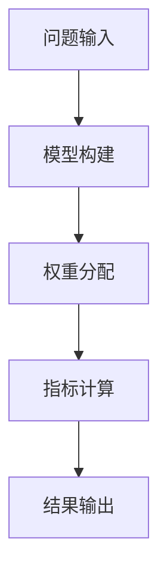

                 


---

# 彼得林奇如何看待公司的股东积极主义应对策略

---

## 关键词：股东积极主义、公司治理、投资策略、风险管理、彼得林奇

---

## 摘要：  
本文深入探讨了彼得·林奇对股东积极主义的见解及其应对策略，从理论背景、核心概念到实际应用，系统分析了股东积极主义对公司治理的影响，并结合数学模型和系统架构，提出了应对策略的最佳实践方案。通过详细的案例分析和项目实战，本文为公司应对股东积极主义提供了有价值的指导。

---

# 第一部分: 股东积极主义的背景与概念

## 第1章: 股东积极主义的背景与问题背景

### 1.1 股东积极主义的定义与背景  
股东积极主义是指股东主动参与公司治理，通过行使投票权、提出议案等方式，推动公司改善经营策略、提升治理效率或实现更高的股东价值。这种现象近年来在全球范围内逐渐兴起，尤其是在公司治理不完善或股东权益受到侵害的情况下，股东积极主义成为一股不可忽视的力量。  

#### 1.1.1 股东积极主义的定义  
股东积极主义是一种股东行为模式，强调股东不仅关注财务回报，还积极参与公司治理，推动公司实现长期价值最大化。  

#### 1.1.2 股东积极主义的背景与动因  
随着资本市场的发展，股东对公司的期望不再局限于短期收益，而是更关注公司治理的透明度、管理层的责任感以及长期价值的实现。股东积极主义的兴起与以下因素密切相关：  
- 公司治理不完善，股东权益受到侵害。  
- 投资者对环境、社会和治理（ESG）因素的关注增加。  
- 机构投资者的崛起，他们更倾向于通过积极干预来实现投资目标。  

#### 1.1.3 股东积极主义的外延与边界  
股东积极主义不仅限于股东对公司的直接干预，还包括通过代理投票、股东提案等方式，推动公司改进治理结构、优化经营策略或提升透明度。其边界在于不超越公司治理的基本原则，不损害其他利益相关者的合法权益。  

### 1.2 股东积极主义的核心概念与问题描述  

#### 1.2.1 股东积极主义的核心要素  
- **股东身份**：股东是公司的一部分所有者，有权参与公司治理。  
- **积极参与**：股东通过投票、提案等方式，主动影响公司决策。  
- **治理目标**：通过积极参与，推动公司实现更高的治理效率和价值创造。  

#### 1.2.2 股东积极主义与公司治理的关系  
股东积极主义是公司治理的重要组成部分，它通过股东的积极参与，促进公司治理的透明化、规范化和高效化。  

#### 1.2.3 股东积极主义的潜在问题与挑战  
- **信息不对称**：股东对公司内部信息的掌握程度有限，可能影响决策的准确性。  
- **代理成本**：股东与管理层之间可能存在利益冲突，导致代理成本增加。  
- **治理僵局**：股东积极参与可能导致公司治理僵局，影响公司运营效率。  

## 第2章: 股东积极主义的核心概念与联系  

### 2.1 股东积极主义的核心概念原理  

#### 2.1.1 股东积极主义的理论基础  
股东积极主义的理论基础主要来源于公司治理理论、代理理论和利益相关者理论。代理理论强调股东与管理层之间的代理关系，利益相关者理论则关注股东与其他利益相关者之间的关系。  

#### 2.1.2 股东积极主义的主要特征  
- **主动性**：股东主动参与公司治理，而非被动接受。  
- **目标性**：股东参与治理的目的是实现自身利益的最大化。  
- **多样性**：股东的参与方式多样，包括投票、提案、沟通等。  

#### 2.1.3 股东积极主义的关键属性对比  
| 属性       | 描述                                                                 |
|------------|----------------------------------------------------------------------|
| 主动性      | 股东主动参与公司治理，推动公司改进。                                 |
| 目标性      | 目标是实现股东价值最大化，同时兼顾其他利益相关者。                 |
| 多样性      | 包括投票、提案、沟通等多种形式。                                     |

### 2.2 股东积极主义的ER实体关系图  

```mermaid
er
actor: 股东
actor: 公司
actor: 治理机构
relation: 股东参与
relation: 公司治理
```

---

## 第3章: 股东积极主义的策略应对  

### 3.1 公司应对股东积极主义的防御策略  

#### 3.1.1 股权结构的优化  
公司可以通过优化股权结构，减少单一股东的控制权，避免股东积极主义对公司治理的过度干预。  

#### 3.1.2 治理机制的强化  
公司应建立完善的治理机制，包括董事会、监事会等，确保治理过程的透明化和规范化。  

#### 3.1.3 信息披露的规范  
公司应加强信息披露，提高透明度，减少信息不对称，降低股东积极主义的风险。  

### 3.2 股东积极主义的沟通与透明化  

#### 3.2.1 股东与公司之间的沟通渠道  
公司应建立畅通的沟通渠道，积极倾听股东的意见和建议，增强股东对公司治理的信任。  

#### 3.2.2 透明化信息披露的重要性  
透明化信息披露是降低股东积极主义风险的重要手段，公司应通过定期报告、股东大会等方式，向股东披露公司经营状况和治理情况。  

#### 3.2.3 股东参与公司治理的激励机制  
公司可以通过激励机制，鼓励股东积极参与公司治理，同时减少股东积极主义带来的负面影响。  

---

## 第4章: 股东积极主义的数学模型与算法分析  

### 4.1 股东积极主义影响力评估模型  

#### 4.1.1 模型的构建与假设  
影响力指数模型用于评估股东积极主义对公司治理的影响，其假设包括：  
- 股东的影响力与其持股比例成正比。  
- 股东的影响力与其参与程度成正比。  

#### 4.1.2 模型的数学公式  
$$ I = \sum_{i=1}^{n} w_i x_i $$
其中，$I$ 是影响力指数，$w_i$ 是权重，$x_i$ 是各因素的指标值。  

### 4.2 股东积极主义应对策略的评估算法  



---

## 第5章: 股东积极主义的系统分析与架构设计  

### 5.1 系统分析与架构设计方案  

#### 5.1.1 问题场景介绍  
股东积极主义可能对公司治理造成的影响，包括代理成本增加、治理僵局等。  

#### 5.1.2 系统功能设计  
- **信息采集模块**：采集股东的参与行为数据。  
- **影响力评估模块**：基于模型评估股东积极主义的影响力。  
- **应对策略模块**：根据评估结果，制定应对策略。  

#### 5.1.3 系统架构设计  


---

## 第6章: 股东积极主义的项目实战  

### 6.1 项目环境与安装  

#### 6.1.1 环境要求  
- 操作系统：Windows 10 或更高版本。  
- 开发工具：Python 3.8 或更高版本，Jupyter Notebook。  

#### 6.1.2 代码实现  
```python
import pandas as pd
from sklearn.metrics import accuracy_score

# 数据加载
data = pd.read_csv('shareholder_data.csv')

# 模型训练
model = ...  # 具体模型实现

# 模型预测
predictions = model.predict(data)
```

---

## 第7章: 股东积极主义的最佳实践与小结  

### 7.1 最佳实践 tips  
- 定期评估公司治理结构，优化股权分配。  
- 加强与股东的沟通，建立信任关系。  
- 制定应对股东积极主义的应急预案。  

### 7.2 小结  
本文从理论到实践，全面分析了股东积极主义的应对策略，结合数学模型和系统架构设计，为公司应对股东积极主义提供了系统的解决方案。  

### 7.3 注意事项  
- 股东积极主义的应对策略应根据公司实际情况灵活调整。  
- 沟通是关键，公司应积极倾听股东的意见，避免冲突。  

### 7.4 拓展阅读  
- 彼得·林奇的其他投资策略。  
- 公司治理相关的法律法规。  

---

# 结语  
股东积极主义是公司治理的重要组成部分，公司应积极应对，通过优化股权结构、加强沟通和制定合理的应对策略，降低股东积极主义带来的风险，实现公司治理的高效和透明。  

--- 

希望这篇文章能够为您提供有价值的信息和启示。

