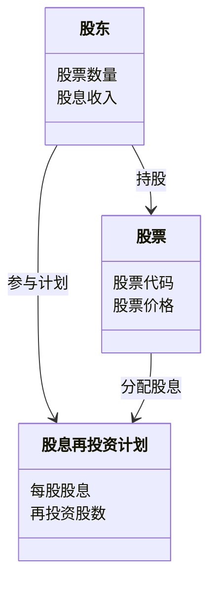
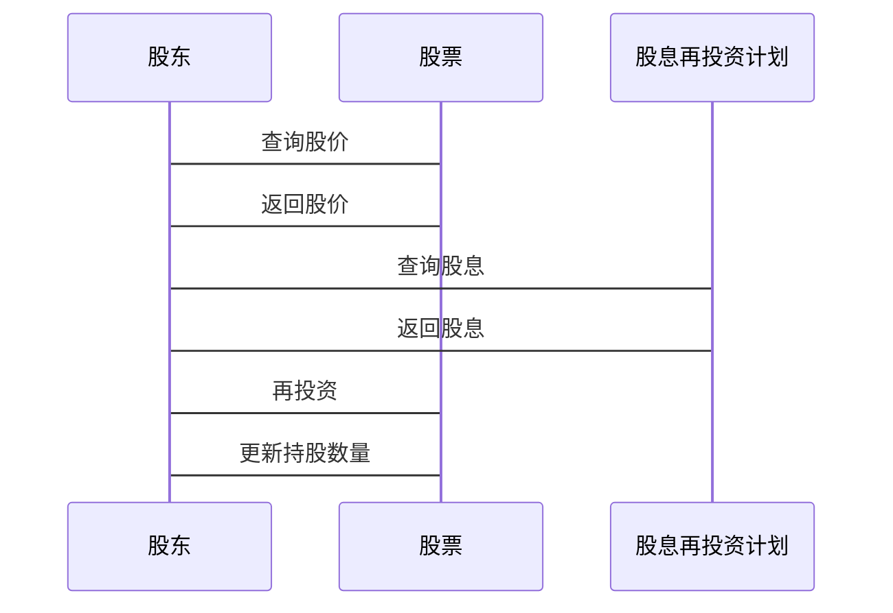

                 


# 彼得林奇如何看待公司的股息再投资计划

> 关键词：股息再投资计划、彼得林奇、股息收益率、股息增长模型、投资策略

> 摘要：本文深入分析了彼得林奇对股息再投资计划的看法，探讨了股息再投资计划的定义、核心概念、数学模型、系统架构以及实际应用。通过详细讲解股息再投资的策略、风险和最佳实践，为投资者提供了深刻的见解和实用的指导。

---

## 第一部分: 股息再投资计划的背景与概念

### 第1章: 股息再投资计划的定义与背景

#### 1.1 股息再投资计划的定义

股息再投资计划（Dividend Reinvestment Plan，简称DRIPs）是一种允许投资者将获得的股息自动用于购买更多公司股票的投资机制。通过这种方式，投资者可以在不支付额外佣金的情况下逐步积累更多股份，从而实现资本的长期增值。

**背景介绍：**  
股息再投资计划起源于20世纪，随着现代金融市场的不断发展，这种投资方式逐渐受到更多投资者的关注。尤其是在彼得林奇等投资大师的倡导下，股息再投资计划因其稳健性和长期收益潜力，成为一种备受推崇的投资策略。

#### 1.2 股息再投资计划的核心要素

- **股息分配机制：** 公司定期将利润以股息形式分配给股东。
- **股东权益再投资：** 股东选择将股息用于购买更多公司股票。
- **财务结构与风险：** 再投资涉及市场风险和公司财务状况变化带来的不确定性。

#### 1.3 股息再投资计划的边界与外延

- **适用场景：** 适用于股息稳定增长的公司，特别适合长期投资者。
- **限制条件：** 需要公司持续派发股息，且市场环境稳定。
- **与其他策略对比：** 与定期定额投资相比，股息再投资利用了复利效应，更注重长期收益。

---

### 第2章: 彼得林奇的股息再投资策略

#### 2.1 彼得林奇投资理念的核心

- **长期投资与价值发现：** 彼得林奇主张通过深入研究公司基本面，寻找具有长期增长潜力的股票。
- **股息收益率的重要性：** 他认为高股息收益率的股票具有较高的投资价值，尤其是那些能够持续增长股息的公司。
- **股息再投资的长期收益：** 再投资不仅能增加股份数量，还能通过复利效应实现财富的快速增长。

#### 2.2 彼得林奇对股息再投资计划的评价

- **股息再投资的优势：**  
  - 简化了投资流程，避免了手动操作的麻烦。
  - 通过复利效应，长期收益显著。
  - 降低了交易成本，增加了投资效率。
  
- **股息再投资的潜在风险：**  
  - 市场波动可能影响股息的价值。
  - 公司财务状况变化可能导致股息削减或停止。
  - 需要选择合适的公司，避免投资低质量股票。

- **股息再投资与公司治理的关系：**  
  - 公司派发股息的能力反映了其盈利能力和财务健康状况。
  - 股东通过再投资间接支持了公司的持续发展。

---

### 第3章: 股息再投资计划的数学模型与公式

#### 3.1 股息收益率的计算公式

股息收益率是衡量股票投资回报的重要指标，其计算公式如下：

$$
\text{股息收益率} = \frac{\text{每股股息}}{\text{股价}}
$$

**示例：**  
假设某公司每股股息为$2，股价为$50，则股息收益率为$2/50 = 4\%$。

#### 3.2 股息增长模型的数学表达

股息增长模型假设股息将按固定增长率持续增长，其数学表达如下：

$$
P = \frac{D_1}{r - g}
$$

其中：
- $D_1$ 是第一期股息。
- $r$ 是折现率（即期望的回报率）。
- $g$ 是股息增长率。

**示例：**  
假设$D_1 = \$2$，$r = 10\%$，$g = 5\%$，则股票的理论价值为：

$$
P = \frac{2}{0.10 - 0.05} = \$40
$$

#### 3.3 股息再投资的收益计算

股息再投资的收益可以通过复利计算公式来衡量：

$$
A = P(1 + r)^n
$$

其中：
- $A$ 是最终的收益。
- $P$ 是初始投资金额。
- $r$ 是年收益率。
- $n$ 是投资年数。

**示例：**  
假设初始投资$P = \$1000$，年收益率$r = 8\%$，投资年数$n = 10$年，则最终收益为：

$$
A = 1000(1 + 0.08)^{10} \approx \$2158.93
$$

---

### 第4章: 股息再投资计划的系统分析与架构设计

#### 4.1 系统分析

股息再投资计划涉及多个系统模块，包括股息分配、再投资决策和收益计算。通过系统化的分析，可以更好地理解其运行机制。

#### 4.2 领域模型的Mermaid类图



#### 4.3 系统交互的Mermaid序列图



---

## 第五部分: 股息再投资计划的项目实战

### 5.1 环境安装

为了实现股息再投资计划的模拟，我们需要安装以下工具和库：

- Python 3.x
- pandas
- numpy
- matplotlib

### 5.2 核心实现源代码

```python
import pandas as pd
import numpy as np
import matplotlib.pyplot as plt

# 模拟股息再投资计划
def dividend_reinvestment_simulator(initial_investment, dividend_yield, years):
    # 初始投资
    investment = initial_investment
    # 年股息收益率
    r = dividend_yield
    # 投资年数
    n = years
    # 计算每年的股息再投资收益
    returns = []
    for i in range(n):
        investment *= (1 + r)
        returns.append(investment)
    return returns

# 示例：初始投资1000美元，股息收益率5%，投资10年
initial_investment = 1000
dividend_yield = 0.05
years = 10

returns = dividend_reinvestment_simulator(initial_investment, dividend_yield, years)
print("每年的累计收益为：", returns)
```

### 5.3 实际案例分析

以苹果公司为例，假设其股息收益率为0.8%，投资者选择将股息再投资。通过上述代码可以模拟股息再投资的累计收益，并绘制收益曲线图。

```python
import matplotlib.pyplot as plt

years = list(range(1, 11))
plt.plot(years, returns)
plt.title('股息再投资计划累计收益')
plt.xlabel('年数')
plt.ylabel('累计收益（美元）')
plt.show()
```

---

## 第六部分: 股息再投资计划的总结与展望

### 6.1 总结

彼得林奇对股息再投资计划的高度重视体现了其长期投资理念的核心。通过股息再投资，投资者可以利用复利效应，逐步积累财富。然而，投资者在实施该计划时，需要谨慎选择公司，关注市场波动，并定期评估投资组合。

### 6.2 展望

未来，随着金融市场的进一步发展，股息再投资计划将更加智能化和便捷化。投资者可以通过自动化工具和大数据分析，更好地优化投资策略，实现财富的可持续增长。

---

### 小结与注意事项

- **小结：** 股息再投资计划是一种有效的长期投资工具，但需要结合公司的财务状况和市场环境进行综合评估。
- **注意事项：** 投资者应避免盲目跟风，定期审视投资组合，并根据市场变化调整策略。

---

### 最佳实践 Tips

- **选择优质公司：** 优先考虑那些股息稳定增长、公司基本面良好的企业。
- **分散投资：** 通过分散投资降低风险，避免过度依赖单一股票。
- **定期评估：** 定期检查投资组合的表现，及时调整策略。

---

通过本文的详细分析，读者可以全面了解彼得林奇对股息再投资计划的看法，并掌握如何在实际投资中运用这些策略。股息再投资计划不仅是一种投资工具，更是一种长期财富积累的智慧。希望本文能为投资者提供有价值的参考和启发。

