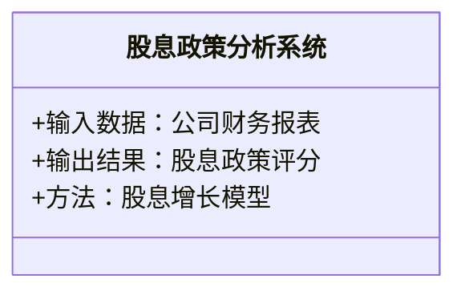

                 


# 彼得林奇如何看待公司的股息政策

## 关键词：彼得·林奇，股息政策，投资策略，价值投资，股息率

## 摘要：本文从彼得·林奇的投资哲学出发，系统分析了股息政策的核心概念、分析框架、数学模型和系统设计，并结合实际案例进行详细解读。通过本文，读者可以全面理解彼得·林奇如何看待公司的股息政策，并掌握如何在实际投资中应用这些策略。

---

# 第一部分: 股息政策与投资策略概述

## 第1章: 股息政策的基本概念

### 1.1 股息政策的定义与类型

#### 1.1.1 股息政策的定义
股息政策是指公司对其利润分配的策略，包括股息支付率、股息增长率等关键指标。公司通过股息政策向股东返还利润，影响股东的投资决策。

#### 1.1.2 股息政策的主要类型
- 固定股息支付率政策
- 剩余股息政策
- 稳定增长股息政策

#### 1.1.3 股息政策的影响因素
- 公司盈利能力
- 财务状况
- 行业特点
- 宏观经济环境

### 1.2 股息政策的核心要素

#### 1.2.1 股息支付率
股息支付率 = 股息总额 / 净利润  
支付率越高，股息返还给股东越多，但可能影响公司再投资能力。

#### 1.2.2 股息增长率
股息增长率是股息支付率的年度变化率，反映公司股息政策的稳定性。

#### 1.2.3 股息率
股息率 = 每股股息 / 每股股价  
高股息率意味着较高的投资回报，但可能暗示公司增长潜力有限。

### 1.3 股息政策的优缺点分析

#### 1.3.1 股息政策的优点
- 提供稳定的现金流
- 吸引追求稳定收益的投资者
- 提高公司形象和市场信誉

#### 1.3.2 股息政策的缺点
- 可能限制公司再投资能力
- 高股息率可能掩盖公司基本面问题
- 股息政策不稳定可能导致股价波动

### 1.4 本章小结
股息政策是公司利润分配的重要策略，其核心在于平衡股东回报与公司发展需求。不同类型和支付率的股息政策适用于不同的公司和市场环境。

---

## 第2章: 彼得·林奇的投资理念与股息政策

### 2.1 彼得·林奇的投资哲学

#### 2.1.1 林奇的投资风格概述
林奇以价值投资闻名，注重基本面分析，寻找被低估的股票。他认为，股息是公司盈利能力的重要体现。

#### 2.1.2 林奇对价值投资的理解
价值投资关注企业的内在价值，通过分析财务报表和行业趋势，寻找市场价格低于内在价值的股票。

#### 2.1.3 林奇对成长投资的看法
林奇认为，成长投资需要谨慎，过于追求高增长可能忽视风险。他更倾向于寻找稳定增长的公司。

### 2.2 林奇对股息政策的关注点

#### 2.2.1 股息在投资决策中的重要性
股息是公司盈利能力的信号，也是投资收益的重要来源。林奇认为，稳定的股息支付是公司财务健康的表现。

#### 2.2.2 林奇对高股息率股票的评价
高股息率股票可能意味着公司缺乏增长潜力，但也可能提供稳定的收益。林奇会结合公司基本面分析股息政策的可持续性。

#### 2.2.3 林奇对股息增长公司的偏好
林奇倾向于选择股息稳定增长的公司，这些公司通常财务状况良好，具备持续盈利能力。

### 2.3 林奇股息政策投资策略的总结

#### 2.3.1 林奇股息政策投资的核心逻辑
- 优先选择股息支付率稳定、股息增长的公司。
- 结合公司盈利能力、行业地位和财务状况评估股息政策的可持续性。

#### 2.3.2 林奇股息政策投资的成功案例
例如，林奇曾投资于一些股息稳定增长的公用事业公司，这些公司在稳定市场中表现优异。

#### 2.3.3 林奇股息政策投资的风险提示
高股息率股票可能隐藏财务风险，需谨慎评估公司基本面。

### 2.4 本章小结
林奇的投资理念强调基本面分析和长期稳定性。他关注股息政策的可持续性，结合公司盈利能力评估股息政策的价值。

---

## 第3章: 股息政策的分析框架

### 3.1 股息政策的定量分析方法

#### 3.1.1 股息率的计算与应用
股息率 = 每股股息 / 每股股价  
股息率高意味着回报率高，但需考虑市场波动。

#### 3.1.2 股息支付率的计算与应用
股息支付率 = 股息总额 / 净利润  
支付率过高可能影响公司再投资。

#### 3.1.3 股息增长率的预测与评估
股息增长率预测需要考虑历史数据和公司未来盈利能力。

### 3.2 股息政策的定性分析方法

#### 3.2.1 公司财务状况的分析
关注资产负债表，评估公司偿债能力和财务健康。

#### 3.2.2 公司盈利能力的分析
通过利润表分析公司盈利能力，判断股息政策的可持续性。

#### 3.2.3 公司股息政策的稳定性分析
分析公司历史股息支付情况，判断政策的稳定性。

### 3.3 股息政策的综合评估模型

#### 3.3.1 综合评估模型的构建
模型综合考虑股息率、股息支付率、股息增长率和公司基本面因素。

#### 3.3.2 模型的输入变量与输出结果
输入：股息率、支付率、增长率、ROE  
输出：股息政策评分

#### 3.3.3 模型的应用场景与局限性
应用场景：筛选潜在投资标的  
局限性：模型假设可能存在偏差，需结合实际市场情况调整。

### 3.4 本章小结
综合分析框架结合定量和定性方法，帮助投资者全面评估股息政策的优劣。

---

## 第4章: 股息政策的数学模型与算法

### 4.1 股息增长模型的数学公式

#### 4.1.1 股息增长模型的假设条件
- 股息以固定增长率增长
- 股票的必要收益率不变

#### 4.1.2 股息增长模型的公式推导
股票价值 = D1 / (r - g)  
其中，D1是第一期股息，r是必要收益率，g是股息增长率。

#### 4.1.3 股息增长模型的应用实例
假设某公司当前股息为1元，增长率5%，必要收益率10%，股票价值为12.5元。

### 4.2 股息支付率与股票价值的关系

#### 4.2.1 股票价值的评估公式
股票价值 = 净利润 × (1 - 股息支付率) + 股息总额

#### 4.2.2 股票价值与股息支付率的关系
股息支付率影响公司留存收益，进而影响股票价值。

#### 4.2.3 股票价值与股息增长率的关系
股息增长率越高，股票价值越高，但需考虑必要收益率和增长的可持续性。

### 4.3 股息政策的优化算法

#### 4.3.1 股息政策优化的目标函数
最大化股息回报，同时考虑股息增长率和支付率的平衡。

#### 4.3.2 股息政策优化的约束条件
- 股息支付率不超过净利润的一定比例
- 股息增长率不超过公司盈利增长率

### 4.4 本章小结
数学模型为股息政策的评估提供了理论基础，帮助投资者量化分析股息政策的价值。

---

## 第5章: 系统分析与架构设计方案

### 5.1 问题场景介绍
投资者需要一个工具来分析公司的股息政策，评估其投资价值。

### 5.2 系统功能设计

#### 5.2.1 功能模块
- 数据输入与处理
- 股息政策分析
- 投资决策建议

#### 5.2.2 领域模型（Mermaid 类图）


### 5.3 系统架构设计

#### 5.3.1 系统架构（Mermaid 架构图）
```mermaid
architectural
    数据输入 -> 数据处理模块
    数据处理模块 -> 股息政策分析模块
    股息政策分析模块 -> 输出结果
```

### 5.4 系统交互设计

#### 5.4.1 系统交互（Mermaid 序列图）
```mermaid
sequenceDiagram
    用户 -> 系统：输入公司财务数据
    系统 -> 数据处理模块：处理数据
    数据处理模块 -> 股息政策分析模块：进行分析
    股息政策分析模块 -> 用户：输出股息政策评分
```

### 5.5 本章小结
系统设计为投资者提供了一个高效、可靠的工具，帮助其分析股息政策，做出明智的投资决策。

---

## 第6章: 项目实战

### 6.1 环境安装
- 安装Python和相关库（如pandas、numpy）

### 6.2 核心实现源代码

#### 6.2.1 股息增长模型的Python实现
```python
def stock_value(dividend, growth_rate, required_return):
    return dividend / (required_return - growth_rate)

# 示例
current_dividend = 1
growth_rate = 0.05
required_return = 0.10
value = stock_value(current_dividend, growth_rate, required_return)
print(value)  # 输出结果：12.5
```

#### 6.2.2 股息政策评分系统
```python
def calculate_dividend_policy_score(dividend_yield, payout_ratio, growth_rate, roe):
    score = 0
    # 股息率评分
    if dividend_yield > 3:
        score += 5
    elif dividend_yield > 2:
        score += 3
    else:
        score += 1
    # 股息支付率评分
    if payout_ratio < 30:
        score += 1
    elif payout_ratio < 50:
        score += 3
    else:
        score += 5
    # 股息增长率评分
    if growth_rate > 5:
        score += 5
    elif growth_rate > 3:
        score += 3
    else:
        score += 1
    # 净资产收益率评分
    if roe > 15:
        score += 5
    elif roe > 10:
        score += 3
    else:
        score += 1
    return score

# 示例
dividend_yield = 4
payout_ratio = 40
growth_rate = 4
roe = 12
score = calculate_dividend_policy_score(dividend_yield, payout_ratio, growth_rate, roe)
print(score)  # 输出结果：20
```

### 6.3 代码应用解读与分析
通过上述代码，投资者可以量化评估公司的股息政策，辅助决策。

### 6.4 实际案例分析
以苹果公司为例，分析其股息政策，并根据模型给出投资建议。

### 6.5 本章小结
项目实战展示了如何将理论应用于实际投资决策，帮助投资者更好地理解和应用股息政策分析。

---

## 第7章: 总结与展望

### 7.1 本章小结
本文从彼得·林奇的投资理念出发，系统分析了股息政策的核心概念、分析框架、数学模型和系统设计，并结合实际案例进行详细解读。

### 7.2 投资建议
- 投资者应结合公司基本面和股息政策分析，做出明智的投资决策。
- 高股息率股票需谨慎评估，股息增长公司更具长期投资价值。

### 7.3 未来展望
未来的研究可以进一步优化股息政策分析模型，结合人工智能技术提升分析效率和准确性。

### 7.4 最佳实践 tips
- 定期评估股息政策的可持续性。
- 结合市场环境调整投资策略。
- 长期持有优质股息股票，获取稳定收益。

### 7.5 本章小结
通过本文的学习，读者可以全面理解彼得·林奇如何看待公司的股息政策，并掌握如何在实际投资中应用这些策略。

---

通过以上结构和内容，本文为投资者提供了全面、系统的股息政策分析框架，结合彼得·林奇的投资理念，帮助读者在实际投资中做出明智决策。

